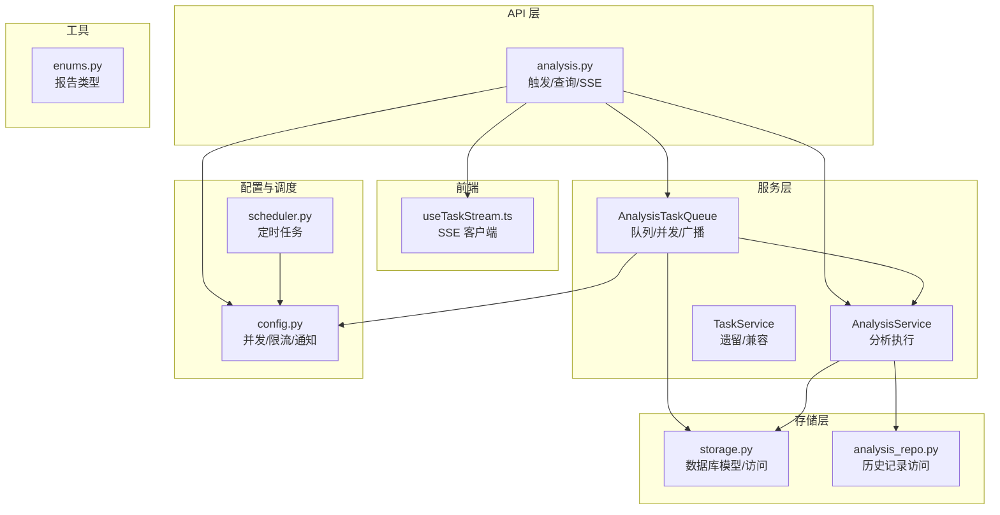
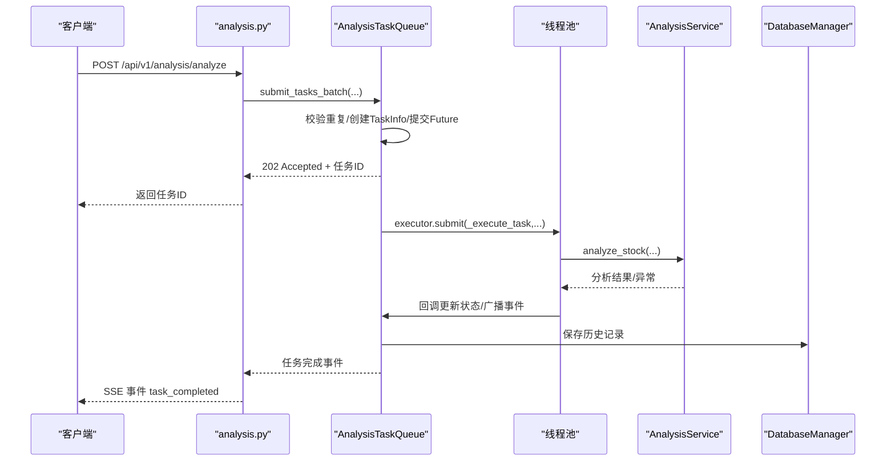
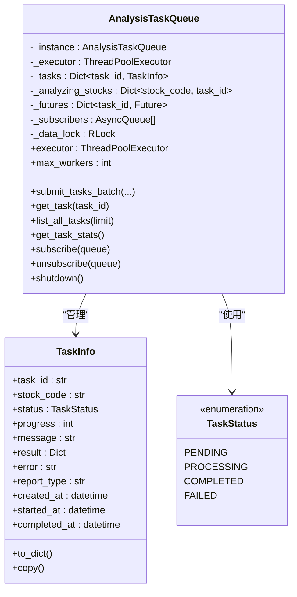
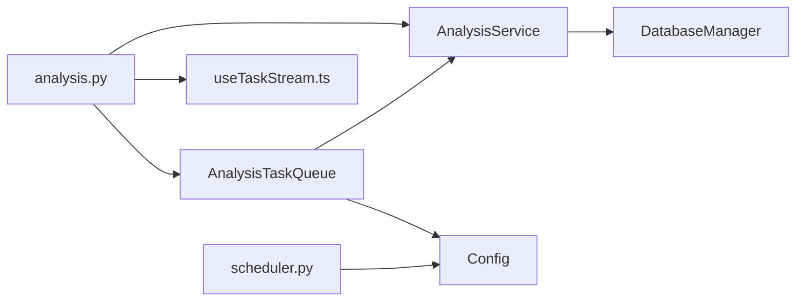
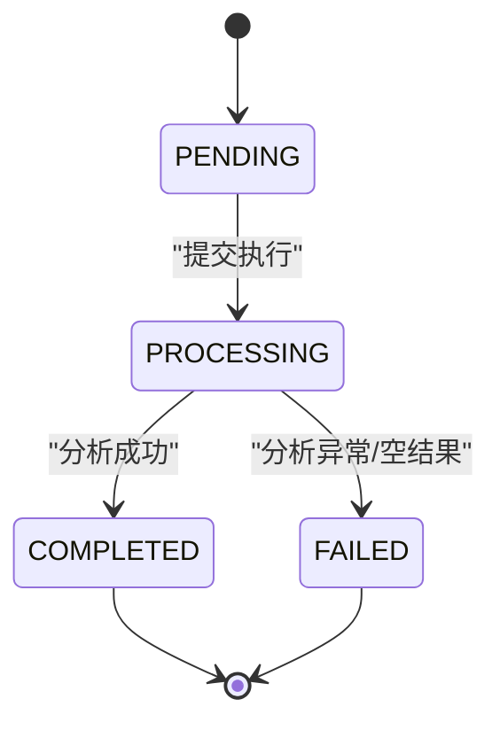

# 异步任务队列

<cite>
**本文档引用的文件**
- [task_queue.py](file://src/services/task_queue.py)
- [analysis.py](file://api/v1/endpoints/analysis.py)
- [router.py](file://api/v1/router.py)
- [useTaskStream.ts](file://apps/dsa-web/src/hooks/useTaskStream.ts)
- [analysis_service.py](file://src/services/analysis_service.py)
- [storage.py](file://src/storage.py)
- [analysis_repo.py](file://src/repositories/analysis_repo.py)
- [enums.py](file://src/enums.py)
- [scheduler.py](file://src/scheduler.py)
- [config.py](file://src/config.py)
</cite>

## 目录
1. [简介](#简介)
2. [项目结构](#项目结构)
3. [核心组件](#核心组件)
4. [架构总览](#架构总览)
5. [详细组件分析](#详细组件分析)
6. [依赖关系分析](#依赖关系分析)
7. [性能考量](#性能考量)
8. [故障排查指南](#故障排查指南)
9. [结论](#结论)
10. [附录](#附录)

## 简介
本文件面向异步任务队列系统，重点解析 TaskService 与 AnalysisTaskQueue 的设计与实现，涵盖任务生命周期管理、状态跟踪与进度监控、并发控制与资源分配、重复提交防护、SSE 实时通知、持久化与历史查询、以及扩展性与性能优化策略。文档同时提供可视化图示与实践建议，帮助开发者快速理解与维护该系统。

## 项目结构
围绕异步任务队列的关键模块如下：
- 服务层：AnalysisTaskQueue（核心队列）、AnalysisService（分析执行）、TaskService（遗留/兼容）。
- API 层：analysis.py（触发分析、任务状态查询、SSE 流）。
- 前端：useTaskStream.ts（SSE 客户端 Hook）。
- 存储层：storage.py（数据库模型与访问）、analysis_repo.py（历史记录访问）。
- 配置与调度：config.py（并发与限流配置）、scheduler.py（定时任务）。
- 枚举：enums.py（报告类型等）。

图表来源
- [analysis.py:1-694](file://api/v1/endpoints/analysis.py#L1-L694)
- [task_queue.py:1-666](file://src/services/task_queue.py#L1-L666)
- [analysis_service.py:1-171](file://src/services/analysis_service.py#L1-L171)
- [storage.py:1-2000](file://src/storage.py#L1-L2000)
- [analysis_repo.py:1-131](file://src/repositories/analysis_repo.py#L1-L131)
- [useTaskStream.ts:1-255](file://apps/dsa-web/src/hooks/useTaskStream.ts#L1-L255)
- [config.py:1-580](file://src/config.py#L1-L580)
- [scheduler.py:1-185](file://src/scheduler.py#L1-L185)
- [enums.py:1-51](file://src/enums.py#L1-L51)

章节来源
- [analysis.py:1-694](file://api/v1/endpoints/analysis.py#L1-L694)
- [task_queue.py:1-666](file://src/services/task_queue.py#L1-L666)
- [analysis_service.py:1-171](file://src/services/analysis_service.py#L1-L171)
- [storage.py:1-2000](file://src/storage.py#L1-L2000)
- [analysis_repo.py:1-131](file://src/repositories/analysis_repo.py#L1-L131)
- [useTaskStream.ts:1-255](file://apps/dsa-web/src/hooks/useTaskStream.ts#L1-L255)
- [config.py:1-580](file://src/config.py#L1-L580)
- [scheduler.py:1-185](file://src/scheduler.py#L1-L185)
- [enums.py:1-51](file://src/enums.py#L1-L51)

## 核心组件
- AnalysisTaskQueue：单例队列，负责任务提交、并发控制、状态广播、重复提交防护、历史清理与持久化集成。
- AnalysisService：封装分析流程，调用流水线执行并构建报告。
- API 层 endpoints：提供触发分析、查询状态、SSE 实时流等接口。
- 前端 Hook：useTaskStream.ts，消费 SSE 事件并驱动 UI。
- 存储层：AnalysisHistory 模型与数据库访问，支持历史查询与回放。
- 配置与调度：max_workers 控制并发；定时任务保障周期性分析。

章节来源
- [task_queue.py:108-666](file://src/services/task_queue.py#L108-L666)
- [analysis_service.py:29-171](file://src/services/analysis_service.py#L29-L171)
- [analysis.py:68-571](file://api/v1/endpoints/analysis.py#L68-L571)
- [useTaskStream.ts:1-255](file://apps/dsa-web/src/hooks/useTaskStream.ts#L1-L255)
- [storage.py:208-270](file://src/storage.py#L208-L270)
- [config.py:393-394](file://src/config.py#L393-L394)

## 架构总览
异步任务队列采用“API -> 队列 -> 分析服务 -> 数据库”的链路，配合 SSE 将任务状态实时推送到前端。队列内置线程池并发执行，通过 RLock 保证线程安全，并提供重复提交防护与历史清理策略。

图表来源
- [analysis.py:161-232](file://api/v1/endpoints/analysis.py#L161-L232)
- [task_queue.py:296-361](file://src/services/task_queue.py#L296-L361)
- [task_queue.py:440-532](file://src/services/task_queue.py#L440-L532)
- [analysis_service.py:40-104](file://src/services/analysis_service.py#L40-L104)
- [storage.py:1098-1107](file://src/storage.py#L1098-L1107)

## 详细组件分析

### AnalysisTaskQueue（核心队列）
- 单例模式与懒加载线程池：通过私有构造与锁确保单例，executor 按需创建。
- 任务生命周期：
  - 提交：submit_tasks_batch 校验重复、创建 TaskInfo、提交 Future、广播 task_created。
  - 执行：_execute_task 设置 processing/started_at/progress，调用 AnalysisService.analyze_stock。
  - 完成/失败：更新状态、完成时间、错误信息，广播 task_completed/task_failed。
  - 清理：_cleanup_old_tasks 保留最近 N 个已完成/失败任务。
- 并发控制与资源分配：
  - max_workers 通过 sync_max_workers 动态调整（空闲时即时应用，繁忙时延迟应用）。
  - 线程池使用 RLock 保护共享状态，避免竞态。
- 重复提交防护：_analyzing_stocks 映射 stock_code -> task_id，提交前检查。
- SSE 广播：subscribe/unsubscribe 维护订阅者列表，call_soon_threadsafe 跨线程安全投递事件。
- 历史持久化：任务完成后写入 AnalysisHistory，供历史查询与回放。

图表来源
- [task_queue.py:108-666](file://src/services/task_queue.py#L108-L666)
- [task_queue.py:42-94](file://src/services/task_queue.py#L42-L94)
- [task_queue.py:34-40](file://src/services/task_queue.py#L34-L40)

章节来源
- [task_queue.py:108-666](file://src/services/task_queue.py#L108-L666)

### AnalysisService（分析执行）
- 负责调用 StockAnalysisPipeline 执行单只股票分析，构建标准化报告结构。
- 支持 report_type（simple/detailed/full/brief）映射与本地化。
- 返回结构包含 meta、summary、strategy、details 等字段，便于前端展示与历史回放。

章节来源
- [analysis_service.py:29-171](file://src/services/analysis_service.py#L29-L171)

### API 层 endpoints（触发/查询/SSE）
- POST /analyze：校验参数、异步模式下批量提交任务，返回 202 + 任务ID；同步模式直接返回结果。
- GET /tasks：列出任务并统计状态，支持按状态过滤与数量限制。
- GET /tasks/stream：SSE 实时流，事件类型包括 connected、task_created、task_started、task_completed、task_failed、heartbeat。
- GET /status/{task_id}：优先从队列查询，不存在则从数据库历史回放。

章节来源
- [analysis.py:68-571](file://api/v1/endpoints/analysis.py#L68-L571)

### 前端 Hook（SSE 客户端）
- useTaskStream.ts：封装 EventSource，监听 connected/task_* 事件，支持自动重连、断开与手动重连。
- 将 snake_case 事件数据转换为 camelCase 的 TaskInfo，驱动 UI 更新。

章节来源
- [useTaskStream.ts:1-255](file://apps/dsa-web/src/hooks/useTaskStream.ts#L1-L255)

### 存储层（持久化与历史）
- AnalysisHistory 模型：保存分析结果、报告类型、狙击点位、上下文快照等。
- DatabaseManager：单例数据库管理，提供 save_analysis_history、get_analysis_history 等接口。
- AnalysisRepository：封装历史记录的查询与统计。

章节来源
- [storage.py:208-270](file://src/storage.py#L208-L270)
- [storage.py:1098-1221](file://src/storage.py#L1098-L1221)
- [analysis_repo.py:1-131](file://src/repositories/analysis_repo.py#L1-L131)

### 配置与调度
- config.py：max_workers 控制并发；gemini/openai 等 AI 请求重试与限流；通知渠道配置。
- scheduler.py：基于 schedule 库的定时任务，支持优雅退出与心跳日志。

章节来源
- [config.py:393-394](file://src/config.py#L393-L394)
- [config.py:61-62](file://src/config.py#L61-L62)
- [scheduler.py:56-185](file://src/scheduler.py#L56-L185)

## 依赖关系分析

图表来源
- [analysis.py:52-56](file://api/v1/endpoints/analysis.py#L52-L56)
- [task_queue.py:1-666](file://src/services/task_queue.py#L1-L666)
- [analysis_service.py:1-171](file://src/services/analysis_service.py#L1-L171)
- [storage.py:623-746](file://src/storage.py#L623-L746)
- [useTaskStream.ts:1-255](file://apps/dsa-web/src/hooks/useTaskStream.ts#L1-L255)
- [config.py:1-580](file://src/config.py#L1-L580)
- [scheduler.py:1-185](file://src/scheduler.py#L1-L185)

章节来源
- [analysis.py:1-694](file://api/v1/endpoints/analysis.py#L1-L694)
- [task_queue.py:1-666](file://src/services/task_queue.py#L1-L666)
- [analysis_service.py:1-171](file://src/services/analysis_service.py#L1-L171)
- [storage.py:1-2000](file://src/storage.py#L1-L2000)
- [useTaskStream.ts:1-255](file://apps/dsa-web/src/hooks/useTaskStream.ts#L1-L255)
- [config.py:1-580](file://src/config.py#L1-L580)
- [scheduler.py:1-185](file://src/scheduler.py#L1-L185)

## 性能考量
- 并发控制
  - max_workers 通过 sync_max_workers 动态调整，空闲时即时应用，繁忙时延迟应用，避免替换线程池导致任务中断。
  - 线程池使用 RLock 保护共享状态，减少锁竞争。
- 任务清理
  - _cleanup_old_tasks 限制内存中历史任务数量，避免 OOM。
- SSE 广播
  - call_soon_threadsafe 跨线程安全投递事件，避免阻塞事件循环。
- 数据库写入
  - 任务完成后写入 AnalysisHistory，支持后续查询与回测。
- 重试与限流
  - 配置层提供 AI 请求重试与限流参数，避免外部服务限流导致失败。

章节来源
- [task_queue.py:184-231](file://src/services/task_queue.py#L184-L231)
- [task_queue.py:534-566](file://src/services/task_queue.py#L534-L566)
- [task_queue.py:602-635](file://src/services/task_queue.py#L602-L635)
- [storage.py:1098-1107](file://src/storage.py#L1098-L1107)
- [config.py:61-62](file://src/config.py#L61-L62)

## 故障排查指南
- 重复提交
  - 现象：返回 409，提示股票正在分析中。
  - 处理：等待当前任务完成，或查询 /status/{task_id} 获取任务状态。
- 任务未找到
  - 现象：/status/{task_id} 返回 404。
  - 处理：确认 task_id 是否正确；若任务已过期，可在数据库中查询历史记录。
- SSE 连接问题
  - 现象：前端无法接收事件或频繁断开。
  - 处理：检查 Nginx 缓冲设置（X-Accel-Buffering: no），确认 EventSource 地址与 withCredentials。
- 并发过高
  - 现象：任务堆积、CPU 占用高。
  - 处理：降低 max_workers，或在空闲时段调整并发。
- 数据库异常
  - 现象：保存历史失败。
  - 处理：检查数据库连接 URL 与权限，确认表结构存在。

章节来源
- [analysis.py:197-232](file://api/v1/endpoints/analysis.py#L197-L232)
- [analysis.py:460-571](file://api/v1/endpoints/analysis.py#L460-L571)
- [analysis.py:376-458](file://api/v1/endpoints/analysis.py#L376-L458)
- [task_queue.py:184-231](file://src/services/task_queue.py#L184-L231)
- [storage.py:623-746](file://src/storage.py#L623-L746)

## 结论
该异步任务队列系统以 AnalysisTaskQueue 为核心，结合 AnalysisService、API 层与前端 SSE Hook，实现了从任务提交、并发执行、状态跟踪到持久化与历史回放的完整闭环。通过重复提交防护、动态并发调整、SSE 实时通知与历史清理策略，系统在可扩展性与用户体验方面具备良好表现。建议在生产环境中结合配置参数与监控手段，持续优化并发与资源分配策略。

## 附录

### 任务生命周期与状态流转

图表来源
- [task_queue.py:34-40](file://src/services/task_queue.py#L34-L40)
- [task_queue.py:440-532](file://src/services/task_queue.py#L440-L532)

### 任务状态查询与历史回放
- 队列内：get_task(task_id) 返回进行中任务详情。
- 队列外：get_analysis_status(task_id) 优先从队列查询，不存在则从数据库历史回放。

章节来源
- [task_queue.py:374-386](file://src/services/task_queue.py#L374-L386)
- [analysis.py:470-571](file://api/v1/endpoints/analysis.py#L470-L571)
- [storage.py:1108-1202](file://src/storage.py#L1108-L1202)