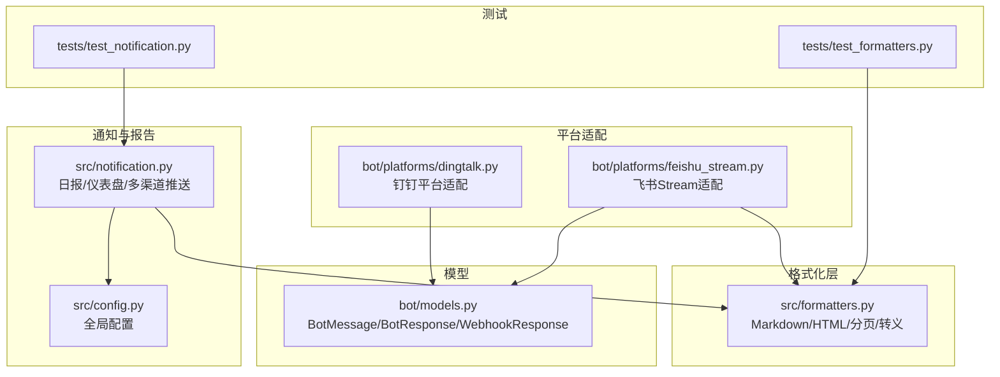
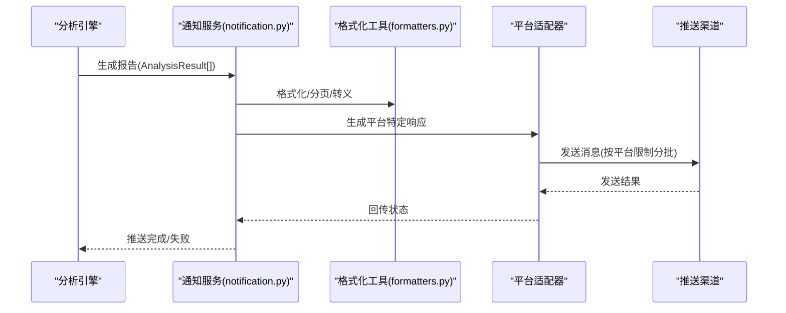
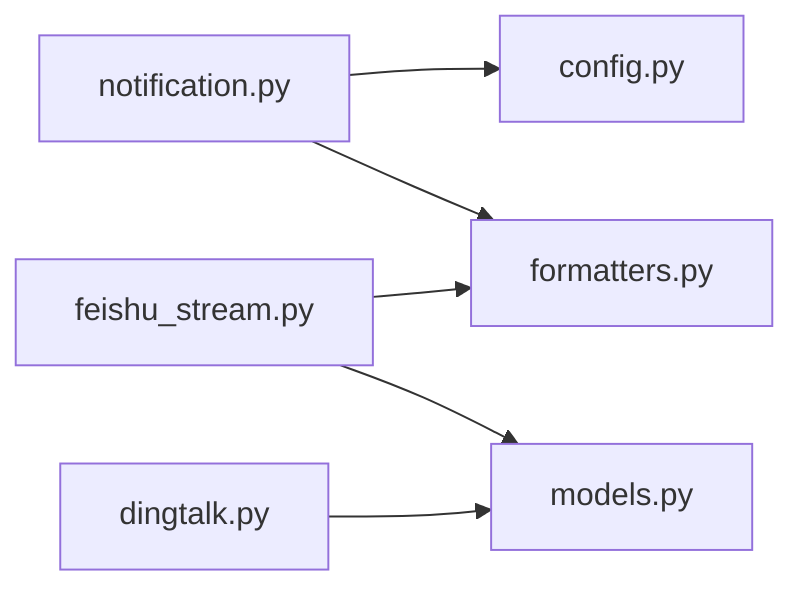

# 消息格式化系统

<cite>
**本文档引用的文件**
- [formatters.py](file://src/formatters.py)
- [notification.py](file://src/notification.py)
- [config.py](file://src/config.py)
- [models.py](file://bot/models.py)
- [dingtalk.py](file://bot/platforms/dingtalk.py)
- [feishu_stream.py](file://bot/platforms/feishu_stream.py)
- [test_notification.py](file://tests/test_notification.py)
- [test_formatters.py](file://tests/test_formatters.py)
</cite>

## 目录
1. [简介](#简介)
2. [项目结构](#项目结构)
3. [核心组件](#核心组件)
4. [架构总览](#架构总览)
5. [详细组件分析](#详细组件分析)
6. [依赖分析](#依赖分析)
7. [性能考虑](#性能考虑)
8. [故障排查指南](#故障排查指南)
9. [结论](#结论)
10. [附录](#附录)

## 简介
本文件面向“消息格式化系统”的技术文档，重点围绕以下目标展开：
- 深入解析 Markdown 格式生成器的设计与实现，涵盖 generate_daily_report 与 generate_dashboard_report 两大核心方法
- 详述消息模板系统、字段映射规则与数据转换逻辑
- 总结不同类型消息的格式化策略：日报格式、仪表盘格式、简要通知格式等
- 规范消息长度限制处理、字符转义机制与特殊符号处理
- 提供消息格式自定义、样式美化与响应式设计的最佳实践
- 记录消息格式化性能优化与内存管理策略

## 项目结构
消息格式化系统主要分布在如下模块：
- 格式化工具：src/formatters.py
- 通知服务与报告生成：src/notification.py
- 配置管理：src/config.py
- 平台适配器（钉钉、飞书 Stream）：bot/platforms/*
- 消息模型：bot/models.py
- 单元测试：tests/*

图表来源
- [formatters.py:1-668](file://src/formatters.py#L1-L668)
- [notification.py:1-3255](file://src/notification.py#L1-L3255)
- [config.py:1-580](file://src/config.py#L1-L580)
- [dingtalk.py:1-315](file://bot/platforms/dingtalk.py#L1-L315)
- [feishu_stream.py:1-640](file://bot/platforms/feishu_stream.py#L1-L640)
- [models.py:1-185](file://bot/models.py#L1-L185)
- [test_notification.py:1-200](file://tests/test_notification.py#L1-L200)
- [test_formatters.py:1-120](file://tests/test_formatters.py#L1-L120)

章节来源
- [formatters.py:1-668](file://src/formatters.py#L1-L668)
- [notification.py:1-3255](file://src/notification.py#L1-L3255)
- [config.py:1-580](file://src/config.py#L1-L580)
- [dingtalk.py:1-315](file://bot/platforms/dingtalk.py#L1-L315)
- [feishu_stream.py:1-640](file://bot/platforms/feishu_stream.py#L1-L640)
- [models.py:1-185](file://bot/models.py#L1-L185)
- [test_notification.py:1-200](file://tests/test_notification.py#L1-L200)
- [test_formatters.py:1-120](file://tests/test_formatters.py#L1-L120)

## 核心组件
- 格式化工具模块（src/formatters.py）
  - 提供 Markdown 到 HTML 文档转换、纯文本转换、飞书 Markdown 转换、按字节/字数智能分页、UTF-8 边界安全截断、特殊字符计数与长度计算等能力
- 通知服务（src/notification.py）
  - 负责生成多种格式的日报与仪表盘报告；按平台限制自动分批发送；支持多渠道推送（企业微信、飞书、Telegram、邮件、Pushover、Discord、自定义 Webhook 等）
- 配置管理（src/config.py）
  - 提供全局配置单例，集中管理各平台消息长度限制、渠道开关、代理与实时行情等配置
- 平台适配器（bot/platforms/*）
  - 钉钉平台适配：解析消息、签名验证、格式化响应
  - 飞书 Stream 适配：WebSocket 长连接、交互卡片回复、分页发送
- 消息模型（bot/models.py）
  - 统一消息与响应模型，屏蔽平台差异

章节来源
- [formatters.py:1-668](file://src/formatters.py#L1-L668)
- [notification.py:1-3255](file://src/notification.py#L1-L3255)
- [config.py:1-580](file://src/config.py#L1-L580)
- [dingtalk.py:1-315](file://bot/platforms/dingtalk.py#L1-L315)
- [feishu_stream.py:1-640](file://bot/platforms/feishu_stream.py#L1-L640)
- [models.py:1-185](file://bot/models.py#L1-L185)

## 架构总览
消息格式化系统的核心流程：
- 输入：分析结果（AnalysisResult）集合
- 输出：Markdown 报告（日报/仪表盘/简要）
- 分发：按平台限制自动分页，通过各渠道发送
- 平台适配：钉钉/飞书 Stream 等平台解析与响应

图表来源
- [notification.py:345-891](file://src/notification.py#L345-L891)
- [formatters.py:291-374](file://src/formatters.py#L291-L374)
- [dingtalk.py:195-241](file://bot/platforms/dingtalk.py#L195-L241)
- [feishu_stream.py:176-232](file://bot/platforms/feishu_stream.py#L176-L232)

## 详细组件分析

### Markdown 格式生成器与核心方法
- generate_daily_report
  - 功能：生成“详细版”日报，包含操作建议汇总、个股详细分析、技术面/基本面/消息面/情绪面等多维度内容
  - 关键特性：
    - 按综合评分排序
    - 统计买入/持有/卖出数量与平均评分
    - 逐条生成个股分析段落，包含要点、理由、趋势、展望、技术面、基本面、消息面、综合分析、风险提示等
    - 数据来源与异常信息标注
  - 输出：Markdown 字符串
- generate_dashboard_report
  - 功能：生成“决策仪表盘”格式的日报，强调“核心结论 + 数据透视 + 作战计划”
  - 关键特性：
    - 顶部“分析结果摘要”，按评分排序列出每只股票的信号等级、建议、趋势
    - 逐条生成“重要信息速览（舆情/基本面）+ 核心结论 + 数据透视 + 作战计划”
    - 传统格式回退：若无 dashboard 字段，回退到传统格式
  - 输出：Markdown 字符串

章节来源
- [notification.py:345-538](file://src/notification.py#L345-L538)
- [notification.py:607-891](file://src/notification.py#L607-L891)

### 模板系统与字段映射规则
- 字段映射与数据转换
  - 操作建议与信号等级映射：优先使用 operation_advice，其次按分数区间映射
  - 名称转义：对包含星号等特殊字符的股票名称进行转义，避免 Markdown 解析冲突
  - 仪表盘字段：intelligence（舆情/基本面）、core_conclusion（核心结论）、data_perspective（数据透视）、battle_plan（作战计划）
  - 传统字段：ma_analysis、volume_analysis、news_summary、risk_warning、analysis_summary 等
- 模板片段组织
  - 使用列表拼接的方式构建报告段落，保证结构清晰、易于扩展
  - 分隔线与标题层级严格遵循 Markdown 规范，便于平台渲染

章节来源
- [notification.py:540-606](file://src/notification.py#L540-L606)
- [notification.py:642-891](file://src/notification.py#L642-L891)

### 数据转换与格式化策略
- Markdown 到 HTML 文档
  - 使用 markdown2 渲染，附加内联 CSS，优化表格、代码块、引用块等排版
- Markdown 到纯文本
  - 移除标题、加粗、斜体、引用、列表、分隔线、表格语法，保留可读性
- 飞书 Markdown 转换
  - 飞书不支持标题、引用块、表格，转换为加粗标题、表情前缀引用、条目列表等
- 长度限制与分页策略
  - 按平台限制（如飞书 20KB、企业微信 4KB/2KB）自动分批
  - 智能分割：优先按“---”或“###”标题分割，其次按“**”或换行分割
  - 强制截断：无法智能分割时，按字节安全截断，避免 UTF-8 中途截断

章节来源
- [formatters.py:98-224](file://src/formatters.py#L98-L224)
- [formatters.py:227-260](file://src/formatters.py#L227-L260)
- [formatters.py:401-493](file://src/formatters.py#L401-L493)
- [formatters.py:267-374](file://src/formatters.py#L267-L374)
- [formatters.py:541-667](file://src/formatters.py#L541-L667)

### 消息长度限制处理与字符转义
- 长度限制
  - 飞书：默认 20000 字节，可通过配置调整
  - 企业微信：默认 4000 字节，text 类型默认 2000 字节，可通过配置调整
  - Telegram：默认 4096 字符
  - Pushover：默认 1024 字符
- 字符转义与安全截断
  - slice_at_max_bytes/slice_at_max_bytes_safe：确保 UTF-8 边界安全
  - _truncate_to_bytes：按字节截断，避免多字节字符被截断
  - 特殊字符处理：_is_special_char/_count_special_chars/_effective_len 支持对特殊字符长度的补偿计算
- 分页标记
  - 添加“📄 (i/n)”分页标记，便于用户定位
  - 截断后追加“…(本段内容过长已截断)”提示

章节来源
- [config.py:129-132](file://src/config.py#L129-L132)
- [formatters.py:15-21](file://src/formatters.py#L15-L21)
- [formatters.py:377-398](file://src/formatters.py#L377-L398)
- [formatters.py:1409-1432](file://src/formatters.py#L1409-L1432)
- [notification.py:1234-1244](file://src/notification.py#L1234-L1244)
- [notification.py:1499-1509](file://src/notification.py#L1499-L1509)

### 平台适配与响应策略
- 钉钉平台适配
  - 解析文本消息、提取命令、@机器人处理、签名验证、格式化响应（text/markdown）
  - 支持 sessionWebhook 异步发送
- 飞书 Stream 适配
  - 使用 lark-oapi SDK，WebSocket 长连接
  - 交互卡片（lark_md）优先，回退为普通文本
  - 分页发送，支持 @ 用户

章节来源
- [dingtalk.py:53-97](file://bot/platforms/dingtalk.py#L53-L97)
- [dingtalk.py:103-181](file://bot/platforms/dingtalk.py#L103-L181)
- [dingtalk.py:195-241](file://bot/platforms/dingtalk.py#L195-L241)
- [dingtalk.py:243-314](file://bot/platforms/dingtalk.py#L243-L314)
- [feishu_stream.py:56-198](file://bot/platforms/feishu_stream.py#L56-L198)
- [feishu_stream.py:257-332](file://bot/platforms/feishu_stream.py#L257-L332)
- [feishu_stream.py:455-640](file://bot/platforms/feishu_stream.py#L455-L640)

### 多渠道推送与最佳实践
- 通知渠道检测与并发推送
  - 自动检测已配置渠道（企业微信、飞书、Telegram、邮件、Pushover、Discord、自定义 Webhook、AstrBot）
  - 按平台限制自动分批发送，避免超限
- 风格美化与响应式设计
  - 邮件：Markdown 转 HTML，内联 CSS，紧凑排版，表格横向滚动
  - 飞书：交互卡片 + lark_md，标题用加粗替代，表格转条目列表
  - 企业微信：支持 text/markdown，按字节限制自动分批
  - Telegram：Markdown 转换，避免不支持的格式
  - Pushover：纯文本，按 1024 字符限制分批
- 自定义与扩展
  - 自定义 Webhook：统一 JSON 结构，兼容钉钉/Slack/Discord 等
  - Bearer Token 认证支持
  - 通过配置调整各平台最大字节数

章节来源
- [notification.py:113-206](file://src/notification.py#L113-L206)
- [notification.py:1197-1250](file://src/notification.py#L1197-L1250)
- [notification.py:1473-1515](file://src/notification.py#L1473-L1515)
- [notification.py:1942-2070](file://src/notification.py#L1942-L2070)
- [notification.py:2095-2303](file://src/notification.py#L2095-L2303)
- [notification.py:2305-2380](file://src/notification.py#L2305-L2380)

## 依赖分析
- 组件耦合
  - notification.py 依赖 formatters.py（分页、转义、飞书 Markdown 转换）
  - 平台适配器依赖 models.py（统一消息模型）
  - 配置通过 config.py 单例注入，避免硬编码
- 外部依赖
  - markdown2：Markdown 渲染与 HTML 转换
  - requests：HTTP 推送
  - lark-oapi：飞书 SDK（可选）

图表来源
- [notification.py:1-3255](file://src/notification.py#L1-L3255)
- [formatters.py:1-668](file://src/formatters.py#L1-L668)
- [config.py:1-580](file://src/config.py#L1-L580)
- [dingtalk.py:1-315](file://bot/platforms/dingtalk.py#L1-L315)
- [feishu_stream.py:1-640](file://bot/platforms/feishu_stream.py#L1-L640)
- [models.py:1-185](file://bot/models.py#L1-L185)

## 性能考虑
- 分页与截断
  - 智能分割优先，减少强制截断带来的信息丢失
  - 安全截断避免 UTF-8 编码错误
- 内存管理
  - 分批发送，避免一次性构造超长字符串
  - 按行拼接与分隔符计算，降低中间字符串开销
- 并发与限流
  - 各平台请求间隔与重试策略，避免触发限流
  - 钉钉/飞书/Telegram/企业微信/Pushover 等均有独立的批次间隔与最大长度控制

章节来源
- [formatters.py:267-374](file://src/formatters.py#L267-L374)
- [formatters.py:541-667](file://src/formatters.py#L541-L667)
- [notification.py:1234-1244](file://src/notification.py#L1234-L1244)
- [notification.py:1499-1509](file://src/notification.py#L1499-L1509)
- [notification.py:1972-1980](file://src/notification.py#L1972-L1980)
- [notification.py:2136-2147](file://src/notification.py#L2136-L2147)

## 故障排查指南
- 飞书交互卡片失败
  - 优先使用交互卡片，失败时回退为普通文本
  - 检查 app_id/app_secret、URL、网络与权限
- 企业微信超长
  - 自动按“---”或“###”分割；若仍超长，按字节强制截断
  - 检查 WECHAT_MAX_BYTES 与 WECHAT_MSG_TYPE 配置
- 钉钉签名验证失败
  - 检查 DINGTALK_APP_KEY/APP_SECRET、时间戳有效性
- Telegram Markdown 解析失败
  - 自动回退为纯文本发送
- Pushover 超长
  - 自动按段落分批，标题追加分页标记
- 邮件发送失败
  - 检查 SMTP 自动识别与认证配置

章节来源
- [feishu_stream.py:1663-1729](file://bot/platforms/feishu_stream.py#L1663-L1729)
- [notification.py:1234-1244](file://src/notification.py#L1234-L1244)
- [dingtalk.py:53-97](file://bot/platforms/dingtalk.py#L53-L97)
- [notification.py:1988-2031](file://src/notification.py#L1988-L2031)
- [notification.py:2149-2182](file://src/notification.py#L2149-L2182)
- [notification.py:1731-1811](file://src/notification.py#L1731-L1811)

## 结论
消息格式化系统通过统一的格式化工具与灵活的通知服务，实现了跨平台、多格式、可扩展的消息生成与分发。其核心优势在于：
- 严谨的长度限制与安全截断策略
- 智能分页与平台适配
- 可定制的样式与响应式设计
- 完善的错误回退与日志记录

建议在生产环境中：
- 明确各平台最大字节数并结合业务内容进行调优
- 优先使用智能分页，减少强制截断
- 为关键渠道配置合理的批次间隔与重试策略
- 通过配置中心集中管理渠道开关与样式偏好

## 附录
- 关键 API 路径
  - generate_daily_report：[notification.py:345-538](file://src/notification.py#L345-L538)
  - generate_dashboard_report：[notification.py:607-891](file://src/notification.py#L607-L891)
  - format_feishu_markdown：[formatters.py:401-493](file://src/formatters.py#L401-L493)
  - chunk_content_by_max_bytes：[formatters.py:291-374](file://src/formatters.py#L291-L374)
  - slice_at_max_bytes：[formatters.py:377-398](file://src/formatters.py#L377-L398)
  - _truncate_to_bytes：[notification.py:1409-1432](file://src/notification.py#L1409-L1432)
  - 钉钉格式化响应：[dingtalk.py:195-241](file://bot/platforms/dingtalk.py#L195-L241)
  - 飞书交互卡片回复：[feishu_stream.py:176-232](file://bot/platforms/feishu_stream.py#L176-L232)