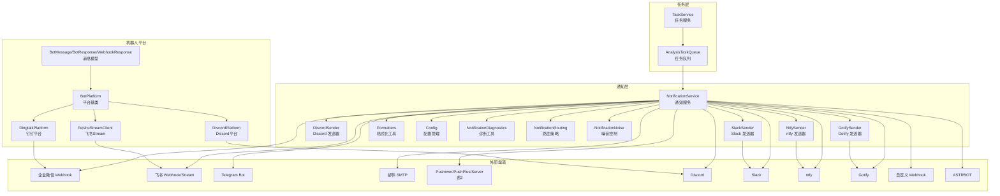
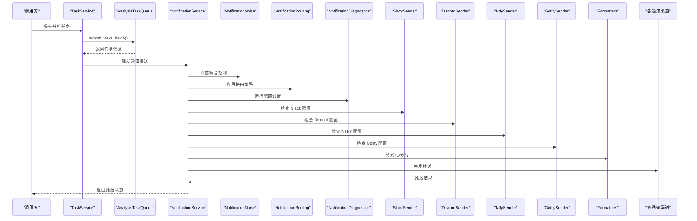
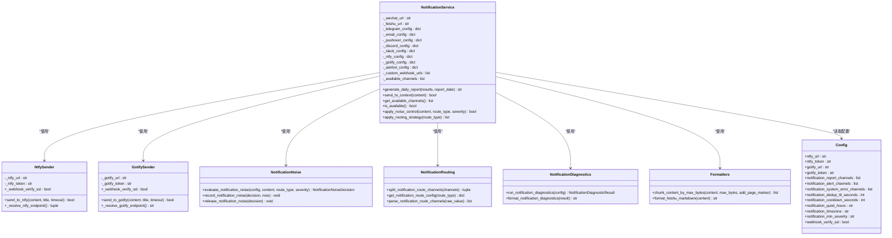
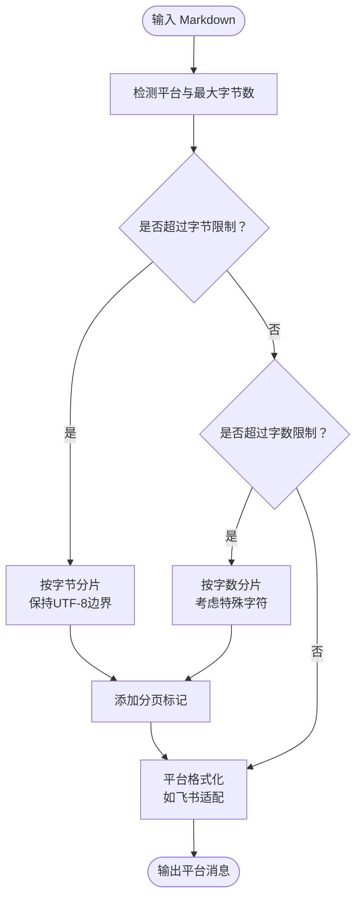
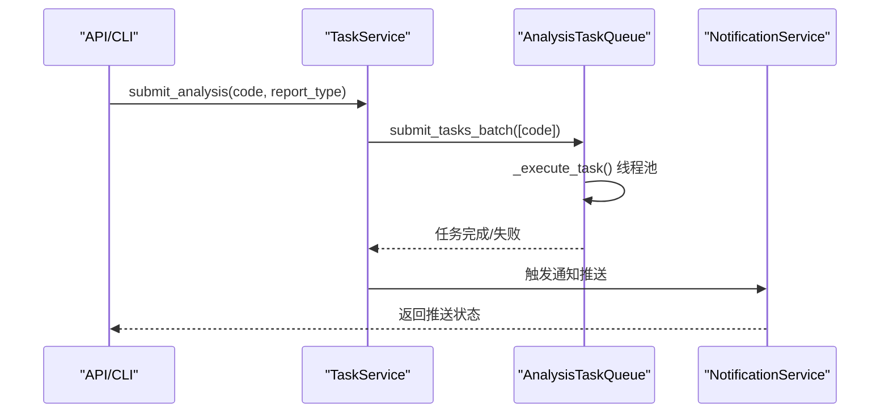
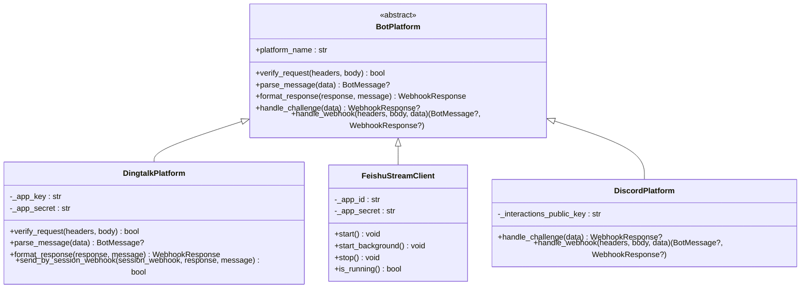

# 通知推送系统

<cite>
**本文档引用的文件**
- [src/notification.py](file://src/notification.py)
- [src/formatters.py](file://src/formatters.py)
- [src/config.py](file://src/config.py)
- [src/services/task_queue.py](file://src/services/task_queue.py)
- [src/services/task_service.py](file://src/services/task_service.py)
- [src/notification_sender/slack_sender.py](file://src/notification_sender/slack_sender.py)
- [src/notification_sender/discord_sender.py](file://src/notification_sender/discord_sender.py)
- [src/notification_sender/ntfy_sender.py](file://src/notification_sender/ntfy_sender.py)
- [src/notification_sender/gotify_sender.py](file://src/notification_sender/gotify_sender.py)
- [src/notification_noise.py](file://src/notification_noise.py)
- [src/notification_routing.py](file://src/notification_routing.py)
- [src/services/notification_diagnostics.py](file://src/services/notification_diagnostics.py)
- [bot/platforms/base.py](file://bot/platforms/base.py)
- [bot/platforms/dingtalk.py](file://bot/platforms/dingtalk.py)
- [bot/platforms/feishu_stream.py](file://bot/platforms/feishu_stream.py)
- [bot/platforms/discord.py](file://bot/platforms/discord.py)
- [bot/models.py](file://bot/models.py)
- [requirements.txt](file://requirements.txt)
- [docs/bot/feishu-bot-config.md](file://docs/bot/feishu-bot-config.md)
- [docs/full-guide.md](file://docs/full-guide.md)
- [docs/full-guide_EN.md](file://docs/full-guide_EN.md)
</cite>

## 更新摘要
**所做更改**
- 新增 NTFY 和 Gotify 通知渠道的完整集成，支持现代推送协议
- 添加通知噪音控制机制，包括去重、冷却、静默时段等功能
- 实现通知路由策略，支持按类型路由到不同渠道组合
- 新增通知诊断功能，提供配置健康检查和问题排查
- 扩展通知渠道总数至10+种，增强系统灵活性
- 更新通知服务架构以支持新增的噪音控制和路由功能

## 目录
1. [简介](#简介)
2. [项目结构](#项目结构)
3. [核心组件](#核心组件)
4. [架构总览](#架构总览)
5. [详细组件分析](#详细组件分析)
6. [依赖关系分析](#依赖关系分析)
7. [性能考虑](#性能考虑)
8. [故障排除指南](#故障排除指南)
9. [结论](#结论)
10. [附录](#附录)

## 简介
本通知推送系统为多渠道通知中心，负责将分析结果以 Markdown 格式推送到企业微信、飞书、Telegram、邮件、Pushover、PushPlus、Server酱3、Discord、Slack、自定义 Webhook、ntfy、Gotify 等多种渠道。系统支持：
- 通知渠道自动检测与并发推送
- 消息格式化与长度分片（按字节/字数）
- 通知策略配置与上下文渠道（如钉钉会话、飞书会话）
- 异步任务队列与 SSE 事件广播
- 通知模板系统与个性化定制
- 批量推送与单股推送模式
- 通知成功率统计与监控告警建议
- 扩展新通知渠道与自定义推送逻辑的指导
- **新增功能**：通知噪音控制、路由策略、诊断功能

**更新** 新增 NTFY 和 Gotify 通知渠道支持，引入通知噪音控制机制，实现通知路由策略管理，提供完整的配置诊断功能。

## 项目结构
通知系统主要分布在以下模块：
- 通知服务与渠道：src/notification.py、src/notification_sender/slack_sender.py、src/notification_sender/discord_sender.py、src/notification_sender/ntfy_sender.py、src/notification_sender/gotify_sender.py
- 噪音控制与路由：src/notification_noise.py、src/notification_routing.py
- 诊断工具：src/services/notification_diagnostics.py
- 格式化工具：src/formatters.py
- 配置管理：src/config.py
- 任务队列与服务：src/services/task_queue.py、src/services/task_service.py
- 机器人平台适配：bot/platforms/*、bot/models.py
- 依赖声明：requirements.txt
- 飞书机器人配置文档：docs/bot/feishu-bot-config.md
- Slack 配置指南：docs/full-guide.md、docs/full-guide_EN.md

**图表来源**
- [src/notification.py:119-200](file://src/notification.py#L119-L200)
- [src/notification_sender/slack_sender.py:24-77](file://src/notification_sender/slack_sender.py#L24-L77)
- [src/notification_sender/discord_sender.py:18-69](file://src/notification_sender/discord_sender.py#L18-L69)
- [src/notification_sender/ntfy_sender.py:50-126](file://src/notification_sender/ntfy_sender.py#L50-L126)
- [src/notification_sender/gotify_sender.py:46-122](file://src/notification_sender/gotify_sender.py#L46-L122)
- [src/notification_noise.py:1-407](file://src/notification_noise.py#L1-L407)
- [src/notification_routing.py:1-91](file://src/notification_routing.py#L1-L91)
- [src/services/notification_diagnostics.py:1-592](file://src/services/notification_diagnostics.py#L1-L592)
- [src/formatters.py:291-374](file://src/formatters.py#L291-L374)
- [src/config.py:760-804](file://src/config.py#L760-L804)
- [src/services/task_queue.py:108-158](file://src/services/task_queue.py#L108-L158)
- [src/services/task_service.py:30-67](file://src/services/task_service.py#L30-L67)
- [bot/platforms/base.py:16-102](file://bot/platforms/base.py#L16-L102)
- [bot/platforms/dingtalk.py:28-48](file://bot/platforms/dingtalk.py#L28-L48)
- [bot/platforms/feishu_stream.py:455-500](file://bot/platforms/feishu_stream.py#L455-L500)
- [bot/platforms/discord.py:298-342](file://bot/platforms/discord.py#L298-L342)
- [bot/models.py:32-153](file://bot/models.py#L32-L153)

**章节来源**
- [src/notification.py:119-200](file://src/notification.py#L119-L200)
- [src/notification_sender/slack_sender.py:24-77](file://src/notification_sender/slack_sender.py#L24-L77)
- [src/notification_sender/discord_sender.py:18-69](file://src/notification_sender/discord_sender.py#L18-L69)
- [src/notification_sender/ntfy_sender.py:50-126](file://src/notification_sender/ntfy_sender.py#L50-L126)
- [src/notification_sender/gotify_sender.py:46-122](file://src/notification_sender/gotify_sender.py#L46-L122)
- [src/notification_noise.py:1-407](file://src/notification_noise.py#L1-L407)
- [src/notification_routing.py:1-91](file://src/notification_routing.py#L1-L91)
- [src/services/notification_diagnostics.py:1-592](file://src/services/notification_diagnostics.py#L1-L592)
- [src/formatters.py:291-374](file://src/formatters.py#L291-L374)
- [src/config.py:760-804](file://src/config.py#L760-L804)
- [src/services/task_queue.py:108-158](file://src/services/task_queue.py#L108-L158)
- [src/services/task_service.py:30-67](file://src/services/task_service.py#L30-L67)
- [bot/platforms/base.py:16-102](file://bot/platforms/base.py#L16-L102)
- [bot/platforms/dingtalk.py:28-48](file://bot/platforms/dingtalk.py#L28-L48)
- [bot/platforms/feishu_stream.py:455-500](file://bot/platforms/feishu_stream.py#L455-L500)
- [bot/platforms/discord.py:298-342](file://bot/platforms/discord.py#L298-L342)
- [bot/models.py:32-153](file://bot/models.py#L32-L153)

## 核心组件
- 通知服务（NotificationService）
  - 负责生成 Markdown 格式日报、检测并推送至所有已配置渠道、支持本地保存、上下文渠道（钉钉会话、飞书会话）。
  - 关键能力：渠道检测、消息生成、上下文回复、长度限制与分片。
  - **新增**：支持噪音控制决策、路由策略应用、诊断工具集成。
- Slack 发送器（SlackSender）
  - 支持 Slack Webhook 和 Bot API 两种模式，自动优先使用 Bot API 确保文本和图片发送到同一频道。
  - 提供图片上传支持，使用 Slack 新版文件上传 API。
- Discord 发送器（DiscordSender）
  - 支持 Discord Webhook 和 Bot API，提供交互式验证和公钥配置功能。
  - 支持 Markdown 格式消息和长度限制。
- **新增** NTFY 发送器（NtfySender）
  - 支持现代推送协议，使用 JSON API 发送通知。
  - 支持主题路径解析、Bearer Token 认证、SSL 证书验证。
- **新增** Gotify 发送器（GotifySender）
  - 支持 Gotify 推送服务，使用消息 API 发送通知。
  - 支持服务端点解析、头部认证、Markdown 内容支持。
- **新增** 通知噪音控制（NotificationNoise）
  - 提供去重、冷却、静默时段等噪音控制功能。
  - 支持严重级别过滤、飞行状态管理、状态持久化。
- **新增** 通知路由（NotificationRouting）
  - 支持按类型路由到不同渠道组合（报告、警告、系统错误）。
  - 提供渠道解析、有效性验证、路由配置管理。
- **新增** 通知诊断（NotificationDiagnostics）
  - 提供配置健康检查、问题诊断、最佳实践建议。
  - 支持渠道基线检查、路由配置验证、噪音控制设置评估。
- 格式化工具（Formatters）
  - 提供 Markdown 到 HTML、纯文本转换；按字节/字数智能分片；飞书 Markdown 适配；分页标记与截断。
- 配置管理（Config）
  - 单例模式，从 .env 加载通知相关配置（企业微信、飞书、Telegram、邮件、Pushover、Discord、Slack、自定义 Webhook、ntfy、Gotify 等），并提供默认值与校验。
  - **新增**：通知路由配置、噪音控制配置、SSL 验证配置。
- 任务队列（AnalysisTaskQueue）
  - 异步分析任务管理，防止重复提交，线程池执行，SSE 事件广播，任务完成后持久化。
- 任务服务（TaskService）
  - 提交异步分析任务，执行单只股票分析并触发通知推送。
- 机器人平台适配（BotPlatform/DingtalkPlatform/FeishuStreamClient/DiscordPlatform）
  - 平台抽象与具体实现，支持签名验证、消息解析、响应格式化、Stream 模式长连接、交互式验证。

**更新** 新增 NTFY 和 Gotify 发送器，引入通知噪音控制、路由策略和诊断功能，显著增强通知系统的智能化水平。

**章节来源**
- [src/notification.py:119-200](file://src/notification.py#L119-L200)
- [src/notification_sender/slack_sender.py:24-77](file://src/notification_sender/slack_sender.py#L24-L77)
- [src/notification_sender/discord_sender.py:18-69](file://src/notification_sender/discord_sender.py#L18-L69)
- [src/notification_sender/ntfy_sender.py:50-126](file://src/notification_sender/ntfy_sender.py#L50-L126)
- [src/notification_sender/gotify_sender.py:46-122](file://src/notification_sender/gotify_sender.py#L46-L122)
- [src/notification_noise.py:1-407](file://src/notification_noise.py#L1-L407)
- [src/notification_routing.py:1-91](file://src/notification_routing.py#L1-L91)
- [src/services/notification_diagnostics.py:1-592](file://src/services/notification_diagnostics.py#L1-L592)
- [src/formatters.py:291-374](file://src/formatters.py#L291-L374)
- [src/config.py:760-804](file://src/config.py#L760-L804)
- [src/services/task_queue.py:108-158](file://src/services/task_queue.py#L108-L158)
- [src/services/task_service.py:30-67](file://src/services/task_service.py#L30-L67)
- [bot/platforms/base.py:16-102](file://bot/platforms/base.py#L16-L102)
- [bot/platforms/dingtalk.py:28-48](file://bot/platforms/dingtalk.py#L28-L48)
- [bot/platforms/feishu_stream.py:455-500](file://bot/platforms/feishu_stream.py#L455-L500)
- [bot/platforms/discord.py:298-342](file://bot/platforms/discord.py#L298-L342)

## 架构总览
通知系统采用"配置驱动 + 渠道检测 + 并发推送 + 噪音控制 + 路由策略"的架构。通知服务根据配置自动识别可用渠道，生成 Markdown 报告并通过各渠道发送；对于超长内容，使用格式化工具进行智能分片；通知噪音控制机制确保合理的推送频率和质量；通知路由策略支持按类型定向推送；任务队列负责异步执行与状态管理；机器人平台适配器负责与飞书、钉钉、Discord 等平台对接。

**图表来源**
- [src/services/task_service.py:68-114](file://src/services/task_service.py#L68-L114)
- [src/services/task_queue.py:296-361](file://src/services/task_queue.py#L296-L361)
- [src/notification.py:149-206](file://src/notification.py#L149-L206)
- [src/notification_noise.py:210-362](file://src/notification_noise.py#L210-L362)
- [src/notification_routing.py:49-91](file://src/notification_routing.py#L49-L91)
- [src/services/notification_diagnostics.py:304-556](file://src/services/notification_diagnostics.py#L304-L556)
- [src/notification_sender/slack_sender.py:47-77](file://src/notification_sender/slack_sender.py#L47-L77)
- [src/notification_sender/discord_sender.py:42-69](file://src/notification_sender/discord_sender.py#L42-L69)
- [src/notification_sender/ntfy_sender.py:64-126](file://src/notification_sender/ntfy_sender.py#L64-L126)
- [src/notification_sender/gotify_sender.py:60-122](file://src/notification_sender/gotify_sender.py#L60-L122)
- [src/formatters.py:291-374](file://src/formatters.py#L291-L374)

## 详细组件分析

### 通知服务（NotificationService）
- 渠道检测与可用性
  - 依据配置检测企业微信、飞书、Telegram、邮件、Pushover、PushPlus、Server酱3、Discord、Slack、自定义 Webhook、ntfy、Gotify、ASTRBOT 等渠道。
  - 支持上下文渠道（如钉钉会话、飞书会话）的临时回复。
  - **新增**：集成噪音控制决策、路由策略应用、诊断工具检查。
- 消息生成
  - 生成日报 Markdown，包含汇总统计、个股详情、技术面/基本面/消息面分析、风险提示等。
- 长度限制与分片
  - 针对企业微信、飞书、Discord、ntfy、Gotify 等渠道设置最大字节数，超过阈值自动分片发送。
- 并发推送
  - 对所有已配置渠道并发发送，提升推送效率。
- **新增** 噪音控制集成
  - 在推送前评估噪音控制决策，避免过度推送。
  - 支持严重级别过滤和静默时段控制。
- **新增** 路由策略应用
  - 根据通知类型（报告、警告、系统错误）应用相应的渠道组合。
  - 支持动态路由配置和有效性验证。

**图表来源**
- [src/notification.py:149-206](file://src/notification.py#L149-L206)
- [src/notification_sender/ntfy_sender.py:50-126](file://src/notification_sender/ntfy_sender.py#L50-L126)
- [src/notification_sender/gotify_sender.py:46-122](file://src/notification_sender/gotify_sender.py#L46-L122)
- [src/notification_noise.py:210-362](file://src/notification_noise.py#L210-L362)
- [src/notification_routing.py:49-91](file://src/notification_routing.py#L49-L91)
- [src/services/notification_diagnostics.py:304-556](file://src/services/notification_diagnostics.py#L304-L556)
- [src/formatters.py:291-374](file://src/formatters.py#L291-L374)
- [src/config.py:760-804](file://src/config.py#L760-L804)

**章节来源**
- [src/notification.py:149-206](file://src/notification.py#L149-L206)
- [src/notification.py:345-538](file://src/notification.py#L345-L538)
- [src/notification.py:336-344](file://src/notification.py#L336-L344)
- [src/notification.py:207-254](file://src/notification.py#L207-L254)

### NTFY 发送器（NtfySender）
- 配置支持
  - NTFY_URL：完整 endpoint，包含主题路径，例如 https://ntfy.sh/my-topic
  - NTFY_TOKEN：Bearer Token（可选）
  - WEBHOOK_VERIFY_SSL：HTTPS 证书验证开关（默认开启）
- 端点解析
  - 自动解析 URL 中的服务器根路径和主题名
  - 支持 URL 编码的主题名处理
- 消息格式
  - 使用 JSON API 发送通知
  - 支持 Markdown 格式内容
  - 自动生成标题（包含日期）
- 错误处理
  - 完善的异常处理和日志记录
  - 支持超时、网络请求异常、未知异常处理

**更新** 新增 NTFY 发送器，提供现代推送协议支持，简化配置和使用。

**章节来源**
- [src/notification_sender/ntfy_sender.py:50-126](file://src/notification_sender/ntfy_sender.py#L50-L126)
- [src/notification_sender/ntfy_sender.py:19-47](file://src/notification_sender/ntfy_sender.py#L19-L47)
- [src/notification_sender/ntfy_sender.py:64-126](file://src/notification_sender/ntfy_sender.py#L64-L126)

### Gotify 发送器（GotifySender）
- 配置支持
  - GOTIFY_URL：服务器基础 URL（不包含 /message）
  - GOTIFY_TOKEN：X-Gotify-Key 头部认证令牌
  - WEBHOOK_VERIFY_SSL：HTTPS 证书验证开关（默认开启）
- 端点解析
  - 自动解析服务器基础 URL 并添加 /message 后缀
  - 验证 URL 格式和路径结构
- 消息格式
  - 使用 JSON API 发送通知
  - 支持 Markdown 内容（通过 extras.client::display）
  - 自动生成标题（包含日期）
- 认证机制
  - 使用 X-Gotify-Key 头部进行认证
  - 支持令牌为空的情况

**更新** 新增 Gotify 发送器，提供成熟的推送服务集成，支持丰富的消息特性。

**章节来源**
- [src/notification_sender/gotify_sender.py:46-122](file://src/notification_sender/gotify_sender.py#L46-L122)
- [src/notification_sender/gotify_sender.py:19-43](file://src/notification_sender/gotify_sender.py#L19-L43)
- [src/notification_sender/gotify_sender.py:60-122](file://src/notification_sender/gotify_sender.py#L60-L122)

### 通知噪音控制（NotificationNoise）
- 核心功能
  - 去重控制：基于内容哈希的重复消息过滤
  - 冷却控制：防止频繁重复推送的时间间隔控制
  - 静默时段：支持指定时间段内的静默推送
  - 严重级别过滤：根据通知严重级别决定是否推送
- 配置参数
  - NOTIFICATION_DEDUP_TTL_SECONDS：去重时间窗口（秒）
  - NOTIFICATION_COOLDOWN_SECONDS：冷却时间（秒）
  - NOTIFICATION_QUIET_HOURS：静默时段（HH:MM-HH:MM）
  - NOTIFICATION_TIMEZONE：时区设置（IANA 格式）
  - NOTIFICATION_MIN_SEVERITY：最低严重级别
- 决策机制
  - 基于内容稳定哈希的去重键生成
  - 支持自定义去重键和冷却键
  - 飞行状态管理（in-flight reservation）防止并发重复
- 状态管理
  - 进程内本地状态存储
  - 线程安全的状态锁
  - 自动过期清理机制

**新增** 通知噪音控制功能，显著提升通知系统的智能化水平，避免过度推送和噪音干扰。

**章节来源**
- [src/notification_noise.py:1-407](file://src/notification_noise.py#L1-L407)
- [src/notification_noise.py:28-42](file://src/notification_noise.py#L28-L42)
- [src/notification_noise.py:210-362](file://src/notification_noise.py#L210-L362)
- [src/notification_noise.py:388-407](file://src/notification_noise.py#L388-L407)

### 通知路由策略（NotificationRouting）
- 路由类型
  - report：股票、日度和市场回顾报告通知
  - alert：事件驱动的告警通知
  - system_error：未来系统错误通知
- 配置方式
  - NOTIFICATION_REPORT_CHANNELS：报告路由渠道列表
  - NOTIFICATION_ALERT_CHANNELS：告警路由渠道列表
  - NOTIFICATION_SYSTEM_ERROR_CHANNELS：系统错误路由渠道列表
- 渠道支持
  - wechat、feishu、telegram、email、pushover、ntfy、gotify、pushplus、serverchan3、custom、discord、slack、astrbot
- 功能特性
  - 渠道解析和有效性验证
  - 重复渠道去重
  - 未知渠道检测和报告
  - 顺序保持的路由应用

**新增** 通知路由策略功能，支持按通知类型定向推送，提高通知的相关性和准确性。

**章节来源**
- [src/notification_routing.py:1-91](file://src/notification_routing.py#L1-L91)
- [src/notification_routing.py:30-46](file://src/notification_routing.py#L30-L46)
- [src/notification_routing.py:68-91](file://src/notification_routing.py#L68-L91)

### 通知诊断（NotificationDiagnostics）
- 诊断范围
  - 渠道基线检查：最小配置键验证
  - 配置完整性：高级配置项检查
  - 路由配置验证：路由渠道有效性
  - 噪音控制设置：降噪配置合理性
  - Web 测试：在线配置测试
- 诊断级别
  - Errors：严重配置错误
  - Warnings：配置警告和建议
  - Info：信息性提示和说明
- 特殊检查
  - NTFY_URL 主题路径验证
  - Gotify_URL 基础 URL 验证
  - 路由渠道有效性检查
  - 静默时段格式验证
  - 时区配置有效性验证
- 输出格式
  - 结构化诊断结果
  - CLI 友好的格式化输出
  - 机密信息保护（不显示敏感值）

**新增** 通知诊断功能，提供全面的配置健康检查和问题排查能力。

**章节来源**
- [src/services/notification_diagnostics.py:1-592](file://src/services/notification_diagnostics.py#L1-L592)
- [src/services/notification_diagnostics.py:304-556](file://src/services/notification_diagnostics.py#L304-L556)
- [src/services/notification_diagnostics.py:569-592](file://src/services/notification_diagnostics.py#L569-L592)

### Slack 发送器（SlackSender）
- 配置支持
  - SLACK_WEBHOOK_URL：Slack Incoming Webhook URL
  - SLACK_BOT_TOKEN：Slack Bot Token (xoxb-...)
  - SLACK_CHANNEL_ID：Slack 频道 ID (Bot 模式必填)
- 传输优先级
  - 当同时配置 Bot Token 和 Webhook URL 时，优先使用 Bot API，确保文本和图片发送到同一频道。
  - Bot 模式下支持图片上传，使用 Slack 新版文件上传 API。
- 消息限制
  - 单个 section block text 字段上限为 3000 字符
  - chat.postMessage text 字段上限约 40000 字符（保守取 39000）
- Webhook 支持
  - 支持 Block Kit 格式，自动构建 section blocks
  - 支持 Markdown 格式内容

**更新** 新增 SlackSender 组件，提供完整的 Slack 集成支持。

**章节来源**
- [src/notification_sender/slack_sender.py:24-77](file://src/notification_sender/slack_sender.py#L24-L77)
- [src/notification_sender/slack_sender.py:78-97](file://src/notification_sender/slack_sender.py#L78-L97)
- [src/notification_sender/slack_sender.py:99-164](file://src/notification_sender/slack_sender.py#L99-L164)
- [src/notification_sender/slack_sender.py:166-237](file://src/notification_sender/slack_sender.py#L166-L237)

### Discord 发送器（DiscordSender）
- 配置支持
  - DISCORD_BOT_TOKEN：Discord Bot Token
  - DISCORD_MAIN_CHANNEL_ID：Discord 主频道 ID
  - DISCORD_WEBHOOK_URL：Discord Webhook URL
  - DISCORD_INTERACTIONS_PUBLIC_KEY：Discord Interaction 入站验签公钥
  - DISCORD_MAX_WORDS：Discord 限制 2000 字，默认 2000 字
- 传输优先级
  - Webhook 模式优先（配置简单，权限低）
  - Bot API 次之（权限高，需要 channel_id）
- 交互式支持
  - 支持 Discord 验证请求处理
  - 支持 Slash Command 交互验证
  - 支持公钥配置用于入站请求验证

**更新** 改进 DiscordSender 支持，新增交互式验证和公钥配置功能。

**章节来源**
- [src/notification_sender/discord_sender.py:18-69](file://src/notification_sender/discord_sender.py#L18-L69)
- [src/notification_sender/discord_sender.py:71-105](file://src/notification_sender/discord_sender.py#L71-L105)
- [src/notification_sender/discord_sender.py:107-138](file://src/notification_sender/discord_sender.py#L107-L138)

### 格式化与分片（Formatters）
- 按字节分片：确保 UTF-8 边界不被破坏，支持分页标记与截断后缀。
- 按字数分片：考虑特殊字符长度，保证在不同平台上的渲染一致性。
- 飞书 Markdown 适配：将通用 Markdown 转换为飞书 lark_md 友好格式。
- HTML 文档转换：用于邮件或图片生成场景。

**图表来源**
- [src/formatters.py:291-374](file://src/formatters.py#L291-L374)
- [src/formatters.py:401-493](file://src/formatters.py#L401-L493)
- [src/formatters.py:578-667](file://src/formatters.py#L578-L667)

**章节来源**
- [src/formatters.py:291-374](file://src/formatters.py#L291-L374)
- [src/formatters.py:401-493](file://src/formatters.py#L401-L493)
- [src/formatters.py:578-667](file://src/formatters.py#L578-L667)

### 配置管理（Config）
- 通知相关配置项
  - 企业微信 Webhook、飞书 Webhook、Telegram、邮件、Pushover、PushPlus、Server酱3、Discord、Slack、自定义 Webhook、ntfy、Gotify、ASTRBOT。
  - 消息长度限制（飞书、企业微信、Discord、ntfy、Gotify）与消息类型（企业微信）。
  - **新增**：通知路由配置（report/alert/system_error）、噪音控制配置（去重、冷却、静默）、SSL 验证配置。
- 配置加载与校验
  - 单例模式，从 .env 加载，支持默认值与完整性校验（缺失通知渠道时给出提示）。
  - **新增**：URL 格式验证（ntfy 主题路径、gotify 基础 URL）。

**更新** 新增 NTFY 和 Gotify 的详细配置项支持，引入通知路由和噪音控制配置。

**章节来源**
- [src/config.py:760-804](file://src/config.py#L760-L804)
- [src/config.py:79-83](file://src/config.py#L79-L83)
- [src/config.py:82-83](file://src/config.py#L82-L83)
- [src/config.py:85-88](file://src/config.py#L85-L88)
- [src/config.py:90-94](file://src/config.py#L90-L94)
- [src/config.py:96-98](file://src/config.py#L96-L98)
- [src/config.py:100-103](file://src/config.py#L100-L103)
- [src/config.py:105-108](file://src/config.py#L105-L108)
- [src/config.py:580-585](file://src/config.py#L580-L585)
- [src/config.py:110-112](file://src/config.py#L110-L112)
- [src/config.py:120-124](file://src/config.py#L120-L124)
- [src/config.py:129-132](file://src/config.py#L129-L132)
- [src/config.py:507-546](file://src/config.py#L507-L546)

### 异步任务队列与服务
- AnalysisTaskQueue
  - 单例，线程池执行，防止重复提交，SSE 事件广播，任务完成后清理。
- TaskService
  - 提交异步分析任务，执行单只股票分析并触发通知推送。

**图表来源**
- [src/services/task_service.py:68-114](file://src/services/task_service.py#L68-L114)
- [src/services/task_queue.py:296-361](file://src/services/task_queue.py#L296-L361)
- [src/services/task_queue.py:440-532](file://src/services/task_queue.py#L440-L532)

**章节来源**
- [src/services/task_queue.py:108-158](file://src/services/task_queue.py#L108-L158)
- [src/services/task_queue.py:296-361](file://src/services/task_queue.py#L296-L361)
- [src/services/task_queue.py:440-532](file://src/services/task_queue.py#L440-L532)
- [src/services/task_service.py:68-114](file://src/services/task_service.py#L68-L114)

### 机器人平台适配
- BotPlatform（抽象基类）
  - 定义平台适配器接口：请求签名验证、消息解析、响应格式化、挑战处理。
- DingtalkPlatform
  - 支持钉钉签名验证、消息解析、响应格式化、sessionWebhook 异步发送。
- FeishuStreamClient
  - 使用 lark-oapi SDK 的 WebSocket 长连接模式，无需公网 IP；支持交互卡片、分片发送、自动重连。
- DiscordPlatform
  - 支持 Discord 验证请求处理、Slash Command 交互、公钥配置验证。

**图表来源**
- [bot/platforms/base.py:16-102](file://bot/platforms/base.py#L16-L102)
- [bot/platforms/dingtalk.py:28-48](file://bot/platforms/dingtalk.py#L28-L48)
- [bot/platforms/dingtalk.py:243-315](file://bot/platforms/dingtalk.py#L243-L315)
- [bot/platforms/feishu_stream.py:455-500](file://bot/platforms/feishu_stream.py#L455-L500)
- [bot/platforms/feishu_stream.py:541-566](file://bot/platforms/feishu_stream.py#L541-L566)
- [bot/platforms/discord.py:298-342](file://bot/platforms/discord.py#L298-L342)

**章节来源**
- [bot/platforms/base.py:16-102](file://bot/platforms/base.py#L16-L102)
- [bot/platforms/dingtalk.py:28-48](file://bot/platforms/dingtalk.py#L28-L48)
- [bot/platforms/dingtalk.py:243-315](file://bot/platforms/dingtalk.py#L243-L315)
- [bot/platforms/feishu_stream.py:455-500](file://bot/platforms/feishu_stream.py#L455-L500)
- [bot/platforms/feishu_stream.py:541-566](file://bot/platforms/feishu_stream.py#L541-L566)
- [bot/platforms/discord.py:298-342](file://bot/platforms/discord.py#L298-L342)

### 通知渠道集成与配置

#### 企业微信
- 配置项：企业微信 Webhook URL、消息类型（markdown/text）、最大字节数。
- 发送方式：Webhook POST；支持分片与 @ 提醒。
- 注意：消息类型与最大字节数可根据配置自动调整。

**章节来源**
- [src/config.py:79-83](file://src/config.py#L79-L83)
- [src/config.py:326-335](file://src/config.py#L326-L335)
- [src/notification.py:207-222](file://src/notification.py#L207-L222)

#### 飞书
- Webhook 与 Stream 模式
  - Webhook：配置 FEISHU_WEBHOOK_URL。
  - Stream：配置 FEISHU_APP_ID、FEISHU_APP_SECRET，启用 FEISHU_STREAM_ENABLED。
- 发送方式：交互卡片（interactive）消息，支持分片与 @ 用户。
- 长度限制：FEISHU_MAX_BYTES 默认 20000 字节。

**章节来源**
- [src/config.py:82-83](file://src/config.py#L82-L83)
- [src/config.py:409-412](file://src/config.py#L409-L412)
- [src/config.py:130](file://src/config.py#L130)
- [bot/platforms/feishu_stream.py:455-500](file://bot/platforms/feishu_stream.py#L455-L500)
- [bot/platforms/feishu_stream.py:180-198](file://bot/platforms/feishu_stream.py#L180-L198)

#### Telegram
- 配置项：TELEGRAM_BOT_TOKEN、TELEGRAM_CHAT_ID、可选 TELEGRAM_MESSAGE_THREAD_ID。
- 发送方式：Bot API，支持 Markdown；支持 @ 提醒。
- 注意：需要同时配置 Bot Token 与 Chat ID。

**章节来源**
- [src/config.py:85-88](file://src/config.py#L85-L88)
- [src/notification.py:224-226](file://src/notification.py#L224-L226)

#### 邮件 SMTP
- 配置项：EMAIL_SENDER、EMAIL_PASSWORD、可选 EMAIL_RECEIVERS、EMAIL_SENDER_NAME。
- 发送方式：自动识别 SMTP 服务器（QQ、网易、Gmail、Outlook、新浪、搜狐、阿里云、139 等），支持 SSL/TLS。
- 注意：需要邮箱与授权码。

**章节来源**
- [src/config.py:90-94](file://src/config.py#L90-L94)
- [src/notification.py:228-230](file://src/notification.py#L228-L230)
- [src/notification.py:63-84](file://src/notification.py#L63-L84)

#### Pushover / PushPlus / Server酱3
- Pushover：PUSHOVER_USER_KEY、PUSHOVER_API_TOKEN。
- PushPlus：PUSHPLUS_TOKEN。
- Server酱3：SERVERCHAN3_SENDKEY。
- 发送方式：HTTP API，支持 Markdown/富文本。

**章节来源**
- [src/config.py:96-98](file://src/config.py#L96-L98)
- [src/config.py:120-124](file://src/config.py#L120-L124)
- [src/notification.py:232-242](file://src/notification.py#L232-L242)

#### Discord
- 配置项：DISCORD_BOT_TOKEN、DISCORD_MAIN_CHANNEL_ID、可选 DISCORD_WEBHOOK_URL、DISCORD_INTERACTIONS_PUBLIC_KEY。
- 发送方式：Bot 或 Webhook；支持交互卡片（Stream 模式）。
- 交互式支持：支持验证请求处理和 Slash Command 交互。

**更新** 新增 Discord INTERACTIONS_PUBLIC_KEY 配置，支持交互式验证。

**章节来源**
- [src/config.py:105-108](file://src/config.py#L105-L108)
- [src/config.py:580](file://src/config.py#L580)
- [src/config.py:624](file://src/config.py#L624)
- [src/notification.py:248-250](file://src/notification.py#L248-L250)
- [bot/platforms/discord.py:298-342](file://bot/platforms/discord.py#L298-L342)

#### Slack
- 配置项：SLACK_WEBHOOK_URL、SLACK_BOT_TOKEN、SLACK_CHANNEL_ID。
- 发送方式：Webhook 或 Bot API，自动优先使用 Bot API 确保文本和图片发送到同一频道。
- 图片支持：Bot 模式下使用新版文件上传 API 支持图片发送。

**更新** 新增 Slack 通知渠道支持，提供完整的 Webhook 和 Bot API 集成。

**章节来源**
- [src/config.py:582-585](file://src/config.py#L582-L585)
- [src/notification.py:65](file://src/notification.py#L65)
- [src/notification.py:304-305](file://src/notification.py#L304-L305)
- [src/notification_sender/slack_sender.py:47-77](file://src/notification_sender/slack_sender.py#L47-L77)

#### **新增** NTFY
- 配置项：NTFY_URL（必须包含主题路径，如 https://ntfy.sh/my-topic）、NTFY_TOKEN（可选）、WEBHOOK_VERIFY_SSL（可选）。
- 发送方式：JSON API，支持 Markdown 格式，自动解析主题路径。
- 特点：现代推送协议，支持 Bearer Token 认证，SSL 证书验证可配置。

**新增** NTFY 通知渠道，提供现代化的推送服务集成。

**章节来源**
- [src/config.py:762-764](file://src/config.py#L762-L764)
- [src/notification_sender/ntfy_sender.py:50-126](file://src/notification_sender/ntfy_sender.py#L50-L126)
- [src/notification_sender/ntfy_sender.py:19-47](file://src/notification_sender/ntfy_sender.py#L19-L47)

#### **新增** Gotify
- 配置项：GOTIFY_URL（服务器基础 URL，不包含 /message）、GOTIFY_TOKEN、WEBHOOK_VERIFY_SSL（可选）。
- 发送方式：JSON API，支持 Markdown 格式，自动添加 /message 后缀。
- 特点：成熟的推送服务，支持丰富的消息特性，X-Gotify-Key 认证。

**新增** Gotify 通知渠道，提供企业级推送服务集成。

**章节来源**
- [src/config.py:766-768](file://src/config.py#L766-L768)
- [src/notification_sender/gotify_sender.py:46-122](file://src/notification_sender/gotify_sender.py#L46-L122)
- [src/notification_sender/gotify_sender.py:19-43](file://src/notification_sender/gotify_sender.py#L19-L43)

#### 自定义 Webhook
- 配置项：CUSTOM_WEBHOOK_URLS（逗号分隔）、CUSTOM_WEBHOOK_BEARER_TOKEN、CUSTOM_WEBHOOK_BODY_TEMPLATE、WEBHOOK_VERIFY_SSL。
- 发送方式：POST JSON，支持 Bearer Token 认证和自定义模板。

**章节来源**
- [src/config.py:100-103](file://src/config.py#L100-L103)
- [src/notification.py:244-246](file://src/notification.py#L244-L246)

#### AstrBot
- 配置项：ASTRBOT_URL、ASTRBOT_TOKEN、WEBHOOK_VERIFY_SSL。
- 发送方式：HTTP API。

**章节来源**
- [src/config.py:110-112](file://src/config.py#L110-L112)
- [src/notification.py:252-253](file://src/notification.py#L252-L253)

### 通知策略与个性化
- 策略配置
  - SINGLE_STOCK_NOTIFY：每分析完一只股票立即推送。
  - REPORT_TYPE：simple/full 报告类型。
  - FEISHU_MAX_BYTES / WECHAT_MAX_BYTES / DISCORD_MAX_WORDS / NTFY_MAX_BYTES / GOTIFY_MAX_BYTES：各渠道最大字节数。
  - **新增**：通知路由配置（按类型定向推送）、噪音控制配置（去重、冷却、静默）。
- 个性化定制
  - Markdown 标题、表格、列表、引用等在各平台的适配转换。
  - 分页标记与截断后缀，提升长消息可读性。
  - **新增**：严重级别过滤、静默时段控制、飞行状态管理。
- 批量推送
  - 任务队列支持批量提交，防止重复任务，统一事件广播。
- **新增** 路由策略
  - 支持按通知类型（报告、警告、系统错误）配置不同的渠道组合。
  - 实时路由有效性验证和未知渠道检测。
- **新增** 噪音控制
  - 基于内容哈希的去重机制，防止重复推送。
  - 冷却时间控制，避免频繁重复。
  - 静默时段设置，避开不合适的时间段。

**章节来源**
- [src/config.py:114-118](file://src/config.py#L114-L118)
- [src/config.py:129-132](file://src/config.py#L129-L132)
- [src/config.py:792-804](file://src/config.py#L792-L804)
- [src/services/task_queue.py:296-361](file://src/services/task_queue.py#L296-L361)

## 依赖关系分析
- 外部依赖
  - 飞书 SDK（lark-oapi）、钉钉 Stream SDK、Discord.py、Markdown2、Requests、SQLAlchemy、FastAPI 等。
  - **新增**：通知噪音控制依赖 threading、hashlib、uuid 等标准库。
- 内部依赖
  - 通知服务依赖配置与格式化工具；任务队列依赖通知服务；机器人平台适配器依赖消息模型。
  - **新增**：通知服务依赖噪音控制、路由策略、诊断工具。

```mermaid
graph TB
R["requirements.txt"] --> Lark["lark-oapi"]
R --> DSDK["dingtalk-stream"]
R --> Dpy["discord.py"]
R --> MD2["markdown2"]
R --> Req["requests"]
R --> SA["sqlalchemy"]
R --> FA["fastapi"]
N["src/notification.py"] --> MD2
N --> Req
FS["src/notification_sender/slack_sender.py"] --> Req
DS["src/notification_sender/discord_sender.py"] --> Req
NS["src/notification_sender/ntfy_sender.py"] --> Req
GS["src/notification_sender/gotify_sender.py"] --> Req
FS --> MD2
DS --> MD2
NS --> MD2
GS --> MD2
FS --> Req
DS --> Req
NS --> Req
GS --> Req
NN["src/notification_noise.py"] --> Threading["threading"]
NN --> Hashlib["hashlib"]
NN --> UUID["uuid"]
NR["src/notification_routing.py"] --> Str["typing"]
ND["src/services/notification_diagnostics.py"] --> NC["src.notification"]
ND --> NN
FSP["bot/platforms/feishu_stream.py"] --> Lark
DSP["bot/platforms/discord.py"] --> Dpy
DT["bot/platforms/dingtalk.py"] --> DSDK
TS["src/services/task_service.py"] --> SA
TQ["src/services/task_queue.py"] --> Req
```

**图表来源**
- [requirements.txt:21-65](file://requirements.txt#L21-L65)
- [src/notification.py:32-42](file://src/notification.py#L32-L42)
- [src/notification_sender/slack_sender.py:10-14](file://src/notification_sender/slack_sender.py#L10-L14)
- [src/notification_sender/discord_sender.py:8-12](file://src/notification_sender/discord_sender.py#L8-L12)
- [src/notification_sender/ntfy_sender.py:10-14](file://src/notification_sender/ntfy_sender.py#L10-L14)
- [src/notification_sender/gotify_sender.py:10-14](file://src/notification_sender/gotify_sender.py#L10-L14)
- [src/notification_noise.py:10-26](file://src/notification_noise.py#L10-L26)
- [src/notification_routing.py:11-12](file://src/notification_routing.py#L11-L12)
- [src/services/notification_diagnostics.py:9-25](file://src/services/notification_diagnostics.py#L9-L25)
- [bot/platforms/feishu_stream.py:34-48](file://bot/platforms/feishu_stream.py#L34-L48)
- [bot/platforms/discord.py:36](file://bot/platforms/discord.py#L36)
- [bot/platforms/dingtalk.py:47](file://bot/platforms/dingtalk.py#L47)

**章节来源**
- [requirements.txt:21-65](file://requirements.txt#L21-L65)
- [src/notification.py:32-42](file://src/notification.py#L32-L42)
- [src/notification_sender/slack_sender.py:10-14](file://src/notification_sender/slack_sender.py#L10-L14)
- [src/notification_sender/discord_sender.py:8-12](file://src/notification_sender/discord_sender.py#L8-L12)
- [src/notification_sender/ntfy_sender.py:10-14](file://src/notification_sender/ntfy_sender.py#L10-L14)
- [src/notification_sender/gotify_sender.py:10-14](file://src/notification_sender/gotify_sender.py#L10-L14)
- [src/notification_noise.py:10-26](file://src/notification_noise.py#L10-L26)
- [src/notification_routing.py:11-12](file://src/notification_routing.py#L11-L12)
- [src/services/notification_diagnostics.py:9-25](file://src/services/notification_diagnostics.py#L9-L25)
- [bot/platforms/feishu_stream.py:34-48](file://bot/platforms/feishu_stream.py#L34-L48)
- [bot/platforms/discord.py:36](file://bot/platforms/discord.py#L36)
- [bot/platforms/dingtalk.py:47](file://bot/platforms/dingtalk.py#L47)

## 性能考虑
- 并发与限流
  - 任务队列最大并发数（MAX_WORKERS）可配置，避免 API 限流与封禁。
  - 飞书/企业微信/Slack/Discord/ntfy/Gotify 等渠道的请求间隔与重试策略建议结合配置项使用。
- 内存与持久化
  - 任务历史保留数量限制，定期清理过期任务，避免内存膨胀。
  - **新增**：噪音控制状态为进程内本地存储，避免跨进程协调开销。
- 消息分片
  - 按字节/字数智能分片，减少单次发送失败影响。
- 代理与网络
  - 配置 HTTP/HTTPS 代理并排除国内数据源，避免网络异常导致分析失败。
- **新增** 噪音控制优化
  - 线程安全的状态锁，避免并发竞争。
  - 自动过期清理，防止状态无限增长。
  - 飞行状态管理，避免重复推送。

**更新** 新增 Slack 和 Discord 的性能考虑，包括传输优先级和图片上传优化，以及噪音控制的性能优化。

**章节来源**
- [src/config.py:152-155](file://src/config.py#L152-L155)
- [src/services/task_queue.py:534-566](file://src/services/task_queue.py#L534-L566)
- [src/formatters.py:291-374](file://src/formatters.py#L291-L374)
- [src/config.py:259-299](file://src/config.py#L259-L299)
- [src/notification_noise.py:70-71](file://src/notification_noise.py#L70-L71)
- [src/notification_noise.py:160-184](file://src/notification_noise.py#L160-L184)

## 故障排除指南
- 未配置任何通知渠道
  - 现象：日志提示未配置有效通知渠道。
  - 处理：补齐任一渠道配置项。
- 飞书 Stream 模式不可用
  - 现象：lark-oapi 未安装或配置缺失。
  - 处理：安装依赖并配置 FEISHU_APP_ID、FEISHU_APP_SECRET。
- 钉钉签名验证失败
  - 现象：请求头缺少 timestamp/sign 或时间戳过期。
  - 处理：确认 DINGTALK_APP_SECRET 配置正确，请求时间戳在有效期内。
- 邮件发送失败
  - 现象：SMTP 服务器识别失败或认证失败。
  - 处理：确认邮箱与授权码，检查 SMTP 服务器配置。
- Discord 推送异常
  - 现象：Bot Token/Channel ID 或 Webhook URL 配置错误。
  - 处理：核对配置项并确保权限正确。
- Slack 推送异常
  - 现象：Webhook URL 或 Bot Token 配置错误。
  - 处理：确认 Slack 应用配置正确，Bot 权限包含 chat:write 和 files:write。
- **新增** NTFY 推送异常
  - 现象：NTFY_URL 格式错误或主题路径缺失。
  - 处理：确认 NTFY_URL 包含完整主题路径，如 https://ntfy.sh/my-topic。
- **新增** Gotify 推送异常
  - 现象：GOTIFY_URL 格式错误或缺少令牌。
  - 处理：确认 GOTIFY_URL 为服务器基础 URL（不包含 /message），并正确配置 GOTIFY_TOKEN。
- **新增** Discord 交互式验证失败
  - 现象：Slash Command 或验证请求处理失败。
  - 处理：确认 DISCORD_INTERACTIONS_PUBLIC_KEY 配置正确。
- **新增** 噪音控制配置问题
  - 现象：通知推送过于频繁或过于稀少。
  - 处理：调整 NOTIFICATION_DEDUP_TTL_SECONDS、NOTIFICATION_COOLDOWN_SECONDS、NOTIFICATION_QUIET_HOURS 配置。
- **新增** 路由策略问题
  - 现象：通知未发送到预期渠道或发送到未知渠道。
  - 处理：检查路由配置（NOTIFICATION_*_CHANNELS）和渠道有效性。

**更新** 新增 Slack 和 Discord 的故障排除指南，包括交互式验证和权限配置，以及新增的 NTFY、Gotify、噪音控制和路由策略的故障排除。

**章节来源**
- [src/config.py:530-546](file://src/config.py#L530-L546)
- [bot/platforms/feishu_stream.py:47-49](file://bot/platforms/feishu_stream.py#L47-L49)
- [bot/platforms/dingtalk.py:53-97](file://bot/platforms/dingtalk.py#L53-L97)
- [src/notification.py:63-84](file://src/notification.py#L63-L84)
- [src/config.py:100-103](file://src/config.py#L100-L103)
- [src/notification_sender/slack_sender.py:126-164](file://src/notification_sender/slack_sender.py#L126-L164)
- [src/notification_sender/discord_sender.py:137](file://src/notification_sender/discord_sender.py#L137)
- [src/notification_sender/ntfy_sender.py:76-79](file://src/notification_sender/ntfy_sender.py#L76-L79)
- [src/notification_sender/gotify_sender.py:72-75](file://src/notification_sender/gotify_sender.py#L72-L75)
- [src/notification_noise.py:274-286](file://src/notification_noise.py#L274-L286)
- [src/notification_routing.py:470-496](file://src/notification_routing.py#L470-L496)

## 结论
本通知推送系统通过配置驱动与平台适配器实现了多渠道、高可靠的通知能力。结合异步任务队列与智能分片策略，系统在保证推送效率的同时兼顾了稳定性与可扩展性。新增的 Slack 和 Discord 支持进一步丰富了通知渠道选择，提供了更灵活的推送方式。**最新增强**包括 NTFY 和 Gotify 现代推送协议支持、通知噪音控制机制、通知路由策略和诊断功能，显著提升了系统的智能化水平和用户体验。开发者可通过配置文件快速启用/禁用渠道、调整长度限制与并发策略，并通过扩展平台适配器轻松接入新的通知渠道。

**更新** Slack 和 Discord 的集成显著增强了系统的灵活性和适用性，新增的 NTFY 和 Gotify 支持提供了现代化的推送解决方案，噪音控制、路由策略和诊断功能进一步提升了系统的智能化水平。

## 附录

### 配置示例（环境变量）
- 企业微信：WECHAT_WEBHOOK_URL、WECHAT_MSG_TYPE、WECHAT_MAX_BYTES
- 飞书：FEISHU_WEBHOOK_URL 或 FEISHU_APP_ID/FEISHU_APP_SECRET（Stream）
- Telegram：TELEGRAM_BOT_TOKEN、TELEGRAM_CHAT_ID、TELEGRAM_MESSAGE_THREAD_ID
- 邮件：EMAIL_SENDER、EMAIL_PASSWORD、EMAIL_RECEIVERS、EMAIL_SENDER_NAME
- Pushover：PUSHOVER_USER_KEY、PUSHOVER_API_TOKEN
- PushPlus：PUSHPLUS_TOKEN
- Server酱3：SERVERCHAN3_SENDKEY
- Discord：DISCORD_BOT_TOKEN、DISCORD_MAIN_CHANNEL_ID、DISCORD_WEBHOOK_URL、DISCORD_INTERACTIONS_PUBLIC_KEY
- Slack：SLACK_WEBHOOK_URL、SLACK_BOT_TOKEN、SLACK_CHANNEL_ID
- **新增** NTFY：NTFY_URL（必须包含主题路径）、NTFY_TOKEN、WEBHOOK_VERIFY_SSL
- **新增** Gotify：GOTIFY_URL（服务器基础 URL）、GOTIFY_TOKEN、WEBHOOK_VERIFY_SSL
- 自定义 Webhook：CUSTOM_WEBHOOK_URLS（逗号分隔）、CUSTOM_WEBHOOK_BEARER_TOKEN、CUSTOM_WEBHOOK_BODY_TEMPLATE、WEBHOOK_VERIFY_SSL
- AstrBot：ASTRBOT_URL、ASTRBOT_TOKEN、WEBHOOK_VERIFY_SSL
- **新增** 通知路由：NOTIFICATION_REPORT_CHANNELS、NOTIFICATION_ALERT_CHANNELS、NOTIFICATION_SYSTEM_ERROR_CHANNELS
- **新增** 噪音控制：NOTIFICATION_DEDUP_TTL_SECONDS、NOTIFICATION_COOLDOWN_SECONDS、NOTIFICATION_QUIET_HOURS、NOTIFICATION_TIMEZONE、NOTIFICATION_MIN_SEVERITY、NOTIFICATION_DAILY_DIGEST_ENABLED
- 其他：FEISHU_MAX_BYTES、SINGLE_STOCK_NOTIFY、REPORT_TYPE、MAX_WORKERS、DISCORD_MAX_WORDS、NTFY_MAX_BYTES、GOTIFY_MAX_BYTES

**更新** 新增 NTFY 和 Gotify 的配置项说明，以及通知路由和噪音控制的配置项。

**章节来源**
- [src/config.py:760-804](file://src/config.py#L760-L804)
- [src/config.py:79-83](file://src/config.py#L79-L83)
- [src/config.py:82-83](file://src/config.py#L82-L83)
- [src/config.py:85-88](file://src/config.py#L85-L88)
- [src/config.py:90-94](file://src/config.py#L90-L94)
- [src/config.py:96-98](file://src/config.py#L96-L98)
- [src/config.py:100-103](file://src/config.py#L100-L103)
- [src/config.py:105-108](file://src/config.py#L105-L108)
- [src/config.py:580-585](file://src/config.py#L580-L585)
- [src/config.py:110-112](file://src/config.py#L110-L112)
- [src/config.py:120-124](file://src/config.py#L120-L124)
- [src/config.py:129-132](file://src/config.py#L129-L132)

### Slack 配置参考
- Slack 支持两种推送方式，同时配置时优先使用 Bot API，确保文本与图片发送到同一频道：
  - Bot API（推荐，支持图片上传）：需要创建 Slack App，添加 Bot Token Scopes（chat:write、files:write），获取 Bot Token 和频道 ID
  - Incoming Webhook（配置简单，仅文本）：在 Slack App 管理页面创建 Incoming Webhook，复制 Webhook URL

**更新** 新增 Slack 配置指南，包括两种推送方式的详细配置步骤。

**章节来源**
- [docs/full-guide.md:763-788](file://docs/full-guide.md#L763-L788)
- [docs/full-guide_EN.md:659-684](file://docs/full-guide_EN.md#L659-L684)

### Discord 配置参考
- Discord 支持 Webhook 和 Bot API 两种方式：
  - Webhook：配置 DISCORD_WEBHOOK_URL，支持 Markdown 格式
  - Bot API：配置 DISCORD_BOT_TOKEN 和 DISCORD_MAIN_CHANNEL_ID
- 交互式支持：配置 DISCORD_INTERACTIONS_PUBLIC_KEY 支持 Slash Command 和验证请求

**更新** 新增 Discord 交互式验证和公钥配置说明。

**章节来源**
- [docs/full-guide.md:742-761](file://docs/full-guide.md#L742-L761)
- [docs/full-guide_EN.md:638-657](file://docs/full-guide_EN.md#L638-L657)

### **新增** NTFY 配置参考
- NTFY 支持现代推送协议，配置相对简单：
  - NTFY_URL：必须包含主题路径，如 https://ntfy.sh/my-topic
  - NTFY_TOKEN：可选的 Bearer Token（用于需要认证的公共服务器）
  - WEBHOOK_VERIFY_SSL：可选的 SSL 证书验证开关
- 使用场景：个人推送、团队协作、自动化通知

**新增** NTFY 配置指南，提供详细的配置步骤和使用建议。

**章节来源**
- [src/notification_sender/ntfy_sender.py:50-126](file://src/notification_sender/ntfy_sender.py#L50-L126)
- [src/notification_sender/ntfy_sender.py:19-47](file://src/notification_sender/ntfy_sender.py#L19-L47)

### **新增** Gotify 配置参考
- Gotify 支持企业级推送服务，配置较为完整：
  - GOTIFY_URL：服务器基础 URL（不包含 /message），如 https://gotify.example
  - GOTIFY_TOKEN：X-Gotify-Key 头部认证令牌
  - WEBHOOK_VERIFY_SSL：可选的 SSL 证书验证开关
- 使用场景：企业内部通知、团队协作、自动化系统

**新增** Gotify 配置指南，提供详细的配置步骤和最佳实践。

**章节来源**
- [src/notification_sender/gotify_sender.py:46-122](file://src/notification_sender/gotify_sender.py#L46-L122)
- [src/notification_sender/gotify_sender.py:19-43](file://src/notification_sender/gotify_sender.py#L19-L43)

### 飞书机器人配置参考
- 飞书机器人配置步骤与截图参考文档。

**章节来源**
- [docs/bot/feishu-bot-config.md:1-20](file://docs/bot/feishu-bot-config.md#L1-L20)

### **新增** 通知诊断使用指南
- 运行诊断命令：python main.py diagnostics
- 查看诊断结果：系统会输出详细的配置检查报告
- 诊断内容：渠道基线检查、配置完整性、路由有效性、噪音控制设置
- 处理建议：根据诊断报告中的 Errors 和 Warnings 进行相应调整

**新增** 通知诊断功能的使用指南，帮助用户快速发现和解决配置问题。

**章节来源**
- [src/services/notification_diagnostics.py:304-556](file://src/services/notification_diagnostics.py#L304-L556)
- [src/services/notification_diagnostics.py:569-592](file://src/services/notification_diagnostics.py#L569-L592)