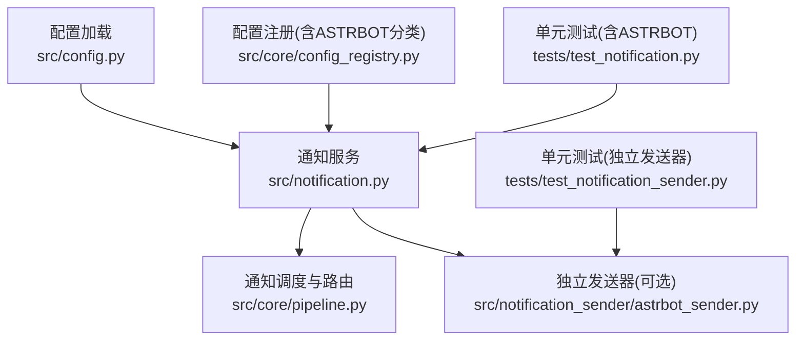
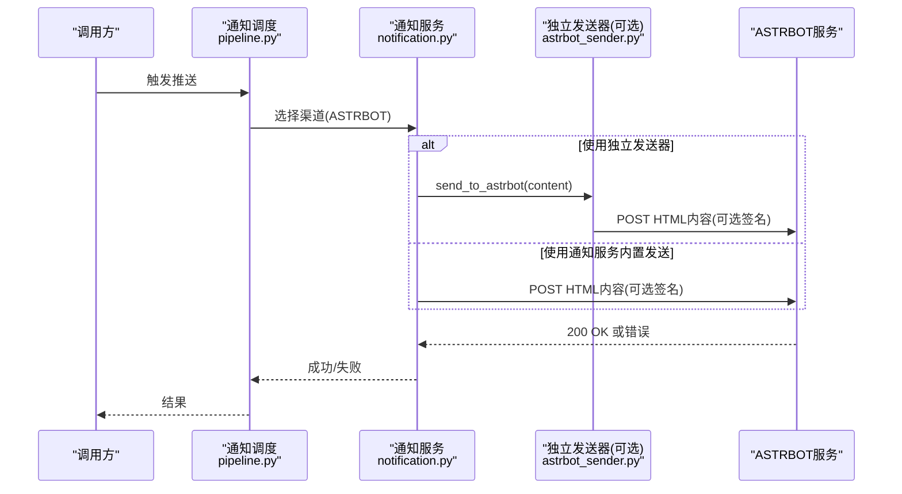
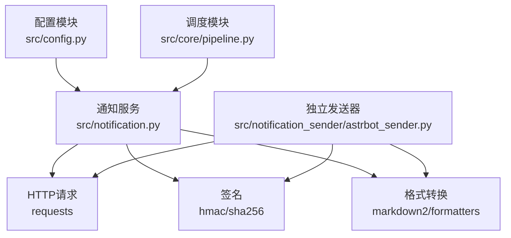

# ASTRBOT通知

<cite>
**本文引用的文件**
- [src/config.py](file://src/config.py)
- [src/notification.py](file://src/notification.py)
- [src/core/pipeline.py](file://src/core/pipeline.py)
- [src/core/config_registry.py](file://src/core/config_registry.py)
- [src/notification_sender/astrbot_sender.py](file://src/notification_sender/astrbot_sender.py)
- [tests/test_notification.py](file://tests/test_notification.py)
- [tests/test_notification_sender.py](file://tests/test_notification_sender.py)
</cite>

## 目录
1. [简介](#简介)
2. [项目结构](#项目结构)
3. [核心组件](#核心组件)
4. [架构总览](#架构总览)
5. [详细组件分析](#详细组件分析)
6. [依赖分析](#依赖分析)
7. [性能考虑](#性能考虑)
8. [故障排查指南](#故障排查指南)
9. [结论](#结论)
10. [附录](#附录)

## 简介
本文件面向希望在系统中启用并使用 ASTRBOT 通知渠道的用户与开发者，提供从配置到调用、从消息格式到错误处理的完整技术说明。ASTRBOT 在本项目中作为“自定义 Webhook”类型的子渠道被统一接入，支持通过 URL 与可选 Token 进行认证，消息内容以 HTML 文档形式提交。

## 项目结构
与 ASTRBOT 通知相关的核心模块与文件如下：
- 配置加载与环境变量映射：src/config.py
- 通知服务与渠道检测：src/notification.py
- 通知调度与路由：src/core/pipeline.py
- UI/配置注册（包含 ASTRBOT 分类）：src/core/config_registry.py
- 独立发送器实现（可选）：src/notification_sender/astrbot_sender.py
- 单元测试（含 ASTRBOT 发送测试）：tests/test_notification.py、tests/test_notification_sender.py

图表来源
- [src/config.py:376-377](file://src/config.py#L376-L377)
- [src/notification.py:252-271](file://src/notification.py#L252-L271)
- [src/core/pipeline.py:1435](file://src/core/pipeline.py#L1435)
- [src/core/config_registry.py:1821](file://src/core/config_registry.py#L1821)
- [src/notification_sender/astrbot_sender.py:30-33](file://src/notification_sender/astrbot_sender.py#L30-L33)
- [tests/test_notification.py:92-103](file://tests/test_notification.py#L92-L103)
- [tests/test_notification_sender.py:295-303](file://tests/test_notification_sender.py#L295-L303)

章节来源
- [src/config.py:376-377](file://src/config.py#L376-L377)
- [src/notification.py:252-271](file://src/notification.py#L252-L271)
- [src/core/pipeline.py:1435](file://src/core/pipeline.py#L1435)
- [src/core/config_registry.py:1821](file://src/core/config_registry.py#L1821)
- [src/notification_sender/astrbot_sender.py:30-33](file://src/notification_sender/astrbot_sender.py#L30-L33)
- [tests/test_notification.py:92-103](file://tests/test_notification.py#L92-L103)
- [tests/test_notification_sender.py:295-303](file://tests/test_notification_sender.py#L295-L303)

## 核心组件
- 配置项
  - ASTRBOT_URL：ASTRBOT 接收消息的 API 地址（必填）
  - ASTRBOT_TOKEN：用于生成 HMAC-SHA256 签名的密钥（可选；未提供则不签名）
- 渠道检测
  - 当 ASTRBOT_URL 存在时，通知服务会将 ASTRBOT 视为可用渠道
- 发送流程
  - 将 Markdown 内容转换为 HTML 文档
  - 构造 JSON 载荷，包含 content 字段
  - 若提供 ASTRBOT_TOKEN，则附加 X-Signature 与 X-Timestamp 请求头
  - 通过 HTTP POST 发送至 ASTRBOT_URL，期望响应状态码为 200

章节来源
- [src/config.py:376-377](file://src/config.py#L376-L377)
- [src/notification.py:252-271](file://src/notification.py#L252-L271)
- [src/notification.py:2931-2977](file://src/notification.py#L2931-L2977)
- [src/notification_sender/astrbot_sender.py:59-108](file://src/notification_sender/astrbot_sender.py#L59-L108)

## 架构总览
ASTRBOT 通知在系统中的整体调用链如下：

图表来源
- [src/core/pipeline.py:1435](file://src/core/pipeline.py#L1435)
- [src/notification.py:2931-2977](file://src/notification.py#L2931-L2977)
- [src/notification_sender/astrbot_sender.py:59-108](file://src/notification_sender/astrbot_sender.py#L59-L108)

## 详细组件分析

### 配置与环境变量
- 关键配置项
  - ASTRBOT_URL：ASTRBOT 接收消息的地址
  - ASTRBOT_TOKEN：可选，用于生成签名
- 加载逻辑
  - 从环境变量读取并注入到 Config 实例
  - 通知服务通过 get_config() 获取上述配置

章节来源
- [src/config.py:376-377](file://src/config.py#L376-L377)
- [src/config.py:437](file://src/config.py#L437)

### 渠道检测与可用性
- ASTRBOT 渠道可用性判断
  - 仅需 ASTRBOT_URL 非空即可认为可用
- 通知服务会将 ASTRBOT 加入可用渠道列表，随后统一发送

章节来源
- [src/notification.py:252-271](file://src/notification.py#L252-L271)

### 消息格式与发送实现
- 内容转换
  - 将 Markdown 内容转换为 HTML 文档
- 载荷构造
  - JSON 对象包含 content 字段（HTML 文本）
- 认证与签名
  - 若提供 ASTRBOT_TOKEN，则生成 HMAC-SHA256 签名
  - 请求头包含：
    - Content-Type: application/json
    - X-Signature: 签名
    - X-Timestamp: 时间戳
- 超时与错误处理
  - 超时时间：10 秒
  - 仅当响应状态码为 200 时视为成功
  - 其他状态码或异常均记录错误并返回失败

章节来源
- [src/notification.py:2931-2977](file://src/notification.py#L2931-L2977)
- [src/notification_sender/astrbot_sender.py:59-108](file://src/notification_sender/astrbot_sender.py#L59-L108)

### 通知调度与路由
- 调度入口
  - pipeline.py 中对 NotificationChannel.ASTRBOT 的分支调用 send_to_astrbot
- 路由行为
  - 通知服务统一遍历可用渠道并发送，ASTRBOT 与其他渠道并列处理

章节来源
- [src/core/pipeline.py:1435](file://src/core/pipeline.py#L1435)
- [src/notification.py:3026-3027](file://src/notification.py#L3026-L3027)

### 独立发送器（可选）
- 用途
  - 提供独立的 AstrbotSender，便于在不同场景下复用
- 行为
  - 与通知服务内置发送逻辑一致，包括签名、请求头、超时与状态码判断

章节来源
- [src/notification_sender/astrbot_sender.py:21-108](file://src/notification_sender/astrbot_sender.py#L21-L108)

### 单元测试验证
- 测试要点
  - 当仅配置 ASTRBOT_URL 时，ASTRBOT 渠道应被识别为可用
  - 发送成功时返回 True，且 requests.post 被调用一次
- 覆盖范围
  - 通知服务集成测试
  - 独立发送器测试

章节来源
- [tests/test_notification.py:92-103](file://tests/test_notification.py#L92-L103)
- [tests/test_notification_sender.py:295-303](file://tests/test_notification_sender.py#L295-L303)

## 依赖分析
- 组件耦合
  - 通知服务依赖配置模块提供的 URL 与 Token
  - 调度模块通过枚举值驱动渠道选择
  - 独立发送器可选地复用通知服务的转换与签名逻辑
- 外部依赖
  - requests：HTTP 请求
  - hmac/sha256：可选签名生成
  - markdown2/formatters：Markdown 到 HTML 的转换

图表来源
- [src/config.py:376-377](file://src/config.py#L376-L377)
- [src/notification.py:2931-2977](file://src/notification.py#L2931-L2977)
- [src/notification_sender/astrbot_sender.py:59-108](file://src/notification_sender/astrbot_sender.py#L59-L108)

章节来源
- [src/config.py:376-377](file://src/config.py#L376-L377)
- [src/notification.py:2931-2977](file://src/notification.py#L2931-L2977)
- [src/notification_sender/astrbot_sender.py:59-108](file://src/notification_sender/astrbot_sender.py#L59-L108)

## 性能考虑
- 单次发送超时上限为 10 秒，若外部服务响应较慢可能影响整体推送耗时
- ASTRBOT 未实现分片/分批发送逻辑，长文本建议在上游裁剪或拆分
- 独立发送器与通知服务内置实现均可使用，按场景选择以减少重复转换

## 故障排查指南
- 渠道不可用
  - 检查 ASTRBOT_URL 是否配置且可访问
- 发送失败
  - 查看日志中的状态码与响应体
  - 确认 ASTRBOT_TOKEN 是否正确（若启用签名）
- 认证失败
  - 若启用签名，确保 X-Signature 与 X-Timestamp 正确生成与传递
- 超时或网络异常
  - 检查网络连通性与代理设置
  - 调整外部服务端超时策略（本端超时为 10 秒）

章节来源
- [src/notification.py:2968-2976](file://src/notification.py#L2968-L2976)
- [src/notification_sender/astrbot_sender.py:101-108](file://src/notification_sender/astrbot_sender.py#L101-L108)

## 结论
ASTRBOT 通知在本系统中以“自定义 Webhook”的形式被统一接入，具备简洁的配置与发送流程。通过可选的 Token 签名机制提升安全性，结合通知服务的统一调度与错误处理，能够稳定地将 Markdown 转换后的 HTML 内容推送到 ASTRBOT 服务端。

## 附录

### 配置示例（环境变量）
- 必填
  - ASTRBOT_URL：ASTRBOT 接收地址
- 可选
  - ASTRBOT_TOKEN：用于生成签名的密钥

章节来源
- [src/config.py:376-377](file://src/config.py#L376-L377)

### API 调用方式与认证
- 请求方法：POST
- 载荷：JSON，包含 content（HTML 文本）
- 请求头：
  - Content-Type: application/json
  - X-Signature: 可选（当提供 ASTRBOT_TOKEN 时生成）
  - X-Timestamp: 可选（时间戳）
- 成功条件：HTTP 200

章节来源
- [src/notification.py:2946-2967](file://src/notification.py#L2946-L2967)
- [src/notification_sender/astrbot_sender.py:74-99](file://src/notification_sender/astrbot_sender.py#L74-L99)

### 消息格式支持
- 输入：Markdown
- 输出：HTML 文档
- 说明：通知服务负责转换，发送器不重复转换

章节来源
- [src/notification.py:2943](file://src/notification.py#L2943)
- [src/notification_sender/astrbot_sender.py:71](file://src/notification_sender/astrbot_sender.py#L71)

### 服务端配置与客户端设置
- 服务端
  - 配置 ASTRBOT_URL 与可选 ASTRBOT_TOKEN
- 客户端
  - 通过通知服务或独立发送器发起推送
  - 可在调度模块中按需启用 ASTRBOT 渠道

章节来源
- [src/config.py:376-377](file://src/config.py#L376-L377)
- [src/core/pipeline.py:1435](file://src/core/pipeline.py#L1435)

### 服务限制与频率
- 未发现针对 ASTRBOT 的特定速率限制或频率限制实现
- 建议遵循外部服务端策略，必要时在上游做限流与重试

### 错误处理机制
- 状态码非 200：记录错误并返回失败
- 异常捕获：记录异常并返回失败
- 独立发送器与通知服务内置实现均具备相同错误处理语义

章节来源
- [src/notification.py:2968-2976](file://src/notification.py#L2968-L2976)
- [src/notification_sender/astrbot_sender.py:101-108](file://src/notification_sender/astrbot_sender.py#L101-L108)

### 最佳实践
- 建议开启签名（提供 ASTRBOT_TOKEN），以增强请求可信度
- 长文本建议在上游进行合理拆分，避免一次性超长请求
- 在生产环境关注网络稳定性与超时设置，必要时增加重试策略

### 官方文档链接
- ASTRBOT 官方文档与使用说明请参考其官网与社区文档（本仓库未包含具体链接）