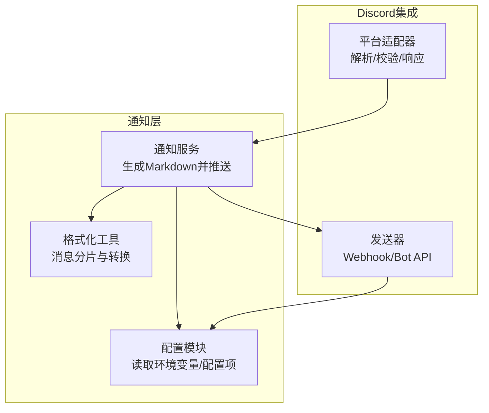
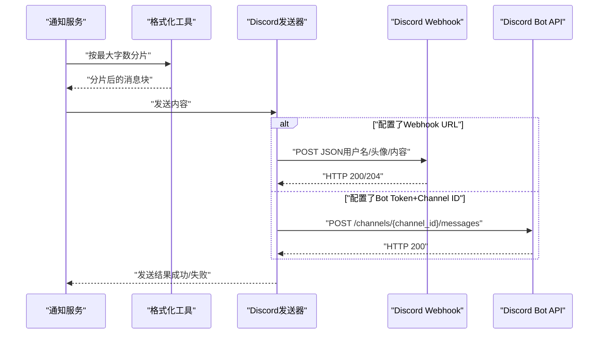
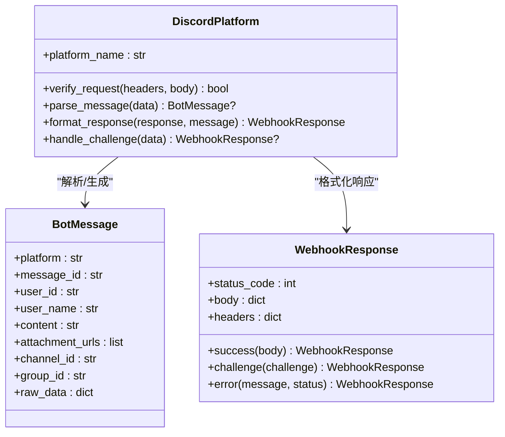
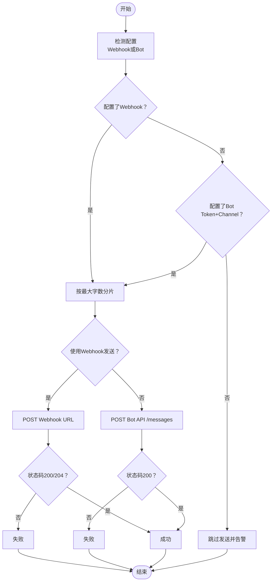
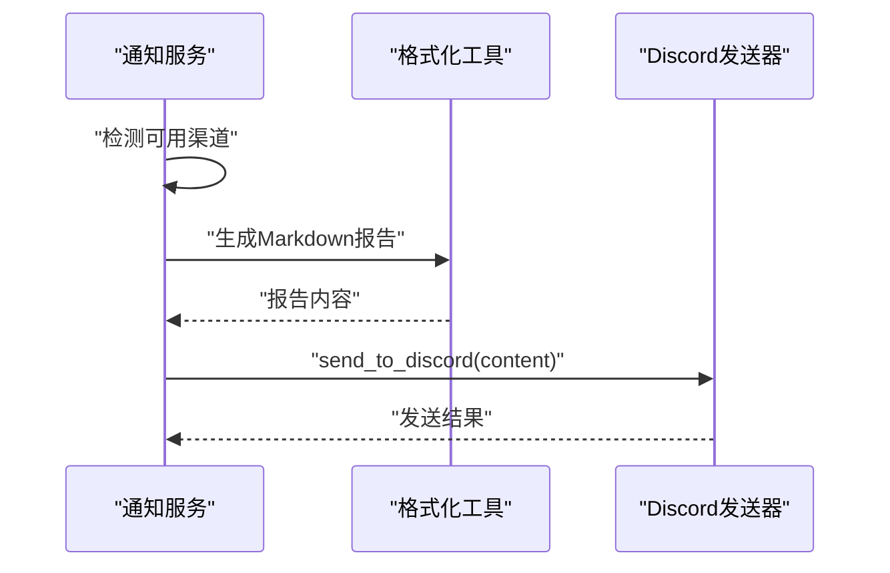
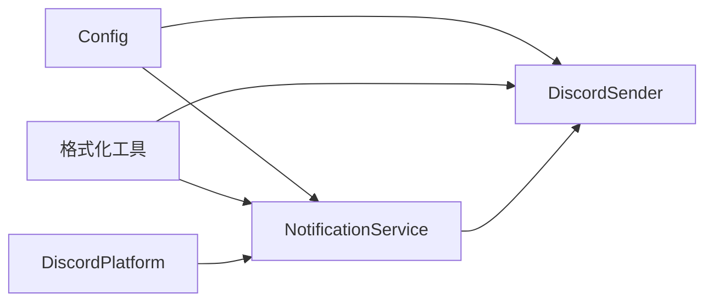

# Discord通知

<cite>
**本文档引用的文件**
- [bot/platforms/discord.py](file://bot/platforms/discord.py)
- [src/notification_sender/discord_sender.py](file://src/notification_sender/discord_sender.py)
- [src/notification.py](file://src/notification.py)
- [src/formatters.py](file://src/formatters.py)
- [src/config.py](file://src/config.py)
- [docs/bot/discord-bot-config.md](file://docs/bot/discord-bot-config.md)
- [docs/full-guide_EN.md](file://docs/full-guide_EN.md)
- [bot/models.py](file://bot/models.py)
- [tests/test_notification.py](file://tests/test_notification.py)
- [tests/test_notification_sender.py](file://tests/test_notification_sender.py)
</cite>

## 目录
1. [简介](#简介)
2. [项目结构](#项目结构)
3. [核心组件](#核心组件)
4. [架构总览](#架构总览)
5. [详细组件分析](#详细组件分析)
6. [依赖关系分析](#依赖关系分析)
7. [性能与限制](#性能与限制)
8. [故障排查指南](#故障排查指南)
9. [结论](#结论)
10. [附录](#附录)

## 简介
本文件面向“Discord通知渠道”的技术文档，覆盖以下主题：
- 配置方法：Webhook模式与Bot API模式的完整配置流程
- 权限设置：服务器权限、频道选择与Webhook URL获取
- 消息格式：Markdown支持、嵌入消息（Embed）与附件上传能力
- 速率限制与消息长度：Discord API限制、消息分片策略与最佳实践
- 开发者门户与权限管理：Discord开发者门户使用指南与权限配置最佳实践
- 配置示例：环境变量与UI配置项对照

本项目同时支持通过Webhook与Bot两种方式向Discord发送消息，并在通知服务中对消息进行分片与格式化，确保在不同服务器等级下稳定发送。

## 项目结构
与Discord通知相关的关键文件与职责如下：
- 平台适配器：负责解析Discord消息、校验Webhook签名、构造平台响应
- 发送器：负责根据配置选择Webhook或Bot API发送消息，并进行分片
- 通知服务：统一生成Markdown报告并通过已配置渠道推送
- 格式化工具：提供按字数/字节智能分片与Markdown转HTML等能力
- 配置模块：集中管理Discord相关配置项（Bot Token、频道ID、Webhook URL、最大字数等）

**图表来源**
- [src/notification.py:113-206](file://src/notification.py#L113-L206)
- [src/config.py:105-109](file://src/config.py#L105-L109)
- [src/formatters.py:578-583](file://src/formatters.py#L578-L583)
- [bot/platforms/discord.py:23-47](file://bot/platforms/discord.py#L23-L47)
- [src/notification_sender/discord_sender.py:18-41](file://src/notification_sender/discord_sender.py#L18-L41)

**章节来源**
- [src/notification.py:113-206](file://src/notification.py#L113-L206)
- [src/config.py:105-109](file://src/config.py#L105-L109)
- [src/formatters.py:578-583](file://src/formatters.py#L578-L583)
- [bot/platforms/discord.py:23-47](file://bot/platforms/discord.py#L23-L47)
- [src/notification_sender/discord_sender.py:18-41](file://src/notification_sender/discord_sender.py#L18-L41)

## 核心组件
- 平台适配器（DiscordPlatform）
  - 负责验证Webhook签名、解析消息为统一格式、将统一响应转换为Discord格式、处理验证挑战
- 发送器（DiscordSender）
  - 支持Webhook与Bot API两种发送路径；自动按最大字数分片；支持SSL校验开关
- 通知服务（NotificationService）
  - 统一生成Markdown报告；检测并推送至已配置渠道（包括Discord）
- 格式化工具（chunk_content_by_max_words）
  - 智能按分隔符/标题/加粗等结构分片，避免在UTF-8边界截断；支持Emoji等特殊字符长度计算
- 配置模块（Config）
  - 集中管理Discord Bot Token、主频道ID、Webhook URL、最大字数、SSL校验等

**章节来源**
- [bot/platforms/discord.py:23-162](file://bot/platforms/discord.py#L23-L162)
- [src/notification_sender/discord_sender.py:18-139](file://src/notification_sender/discord_sender.py#L18-L139)
- [src/notification.py:113-206](file://src/notification.py#L113-L206)
- [src/formatters.py:578-583](file://src/formatters.py#L578-L583)
- [src/config.py:105-109](file://src/config.py#L105-L109)

## 架构总览
下图展示Discord通知从生成到发送的端到端流程，包括Webhook与Bot两种路径：

**图表来源**
- [src/notification.py:345-538](file://src/notification.py#L345-L538)
- [src/formatters.py:578-583](file://src/formatters.py#L578-L583)
- [src/notification_sender/discord_sender.py:42-139](file://src/notification_sender/discord_sender.py#L42-L139)

## 详细组件分析

### 平台适配器（DiscordPlatform）
- 功能要点
  - 验证请求签名（当前为占位实现，预留后续完善）
  - 解析消息为统一格式（BotMessage），提取用户、频道、附件等信息
  - 将统一响应转换为Discord格式（content、允许提及等）
  - 处理验证挑战（Webhook验证与命令交互验证）
- 关键字段
  - 平台标识：discord
  - 消息解析：content、author、channel_id、guild_id、attachments、mentions等
  - 响应格式：content、tts、embeds、allowed_mentions

**图表来源**
- [bot/platforms/discord.py:23-162](file://bot/platforms/discord.py#L23-L162)
- [bot/models.py:32-117](file://bot/models.py#L32-L117)
- [bot/models.py:155-185](file://bot/models.py#L155-L185)

**章节来源**
- [bot/platforms/discord.py:23-162](file://bot/platforms/discord.py#L23-L162)
- [bot/models.py:32-117](file://bot/models.py#L32-L117)
- [bot/models.py:155-185](file://bot/models.py#L155-L185)

### 发送器（DiscordSender）
- 功能要点
  - 优先使用Webhook（配置简单、权限低）
  - 其次使用Bot API（权限高、需Token+Channel ID）
  - 按最大字数分片发送，避免单条消息超限
  - SSL证书校验可配置开关
- 关键逻辑
  - 配置检测：Webhook URL或Bot Token+Channel ID任一满足即可用
  - 发送路径：Webhook POST或Bot API POST
  - 错误处理：记录异常与HTTP状态码

**图表来源**
- [src/notification_sender/discord_sender.py:35-139](file://src/notification_sender/discord_sender.py#L35-L139)
- [src/formatters.py:578-583](file://src/formatters.py#L578-L583)

**章节来源**
- [src/notification_sender/discord_sender.py:18-139](file://src/notification_sender/discord_sender.py#L18-L139)
- [src/formatters.py:578-583](file://src/formatters.py#L578-L583)

### 通知服务（NotificationService）
- 功能要点
  - 生成Markdown格式的日报（支持仪表盘与详细版）
  - 检测已配置渠道（包括Discord），并统一推送
  - 支持多种渠道并发推送
- 关键配置
  - Discord配置：Bot Token、主频道ID、Webhook URL
  - 最大字节数（用于其他渠道）、消息类型（如企业微信）

**图表来源**
- [src/notification.py:113-206](file://src/notification.py#L113-L206)
- [src/notification.py:345-538](file://src/notification.py#L345-L538)
- [src/notification_sender/discord_sender.py:42-68](file://src/notification_sender/discord_sender.py#L42-L68)

**章节来源**
- [src/notification.py:113-206](file://src/notification.py#L113-L206)
- [src/notification.py:345-538](file://src/notification.py#L345-L538)
- [src/notification_sender/discord_sender.py:42-68](file://src/notification_sender/discord_sender.py#L42-L68)

### 配置与环境变量
- 配置项（来自配置类）
  - discord_bot_token：Discord Bot Token
  - discord_main_channel_id：Discord主频道ID
  - discord_webhook_url：Discord Webhook URL
  - discord_max_words：Discord最大字数（默认2000）
  - webhook_verify_ssl：Webhook HTTPS证书校验（默认开启）
- UI配置项（来自配置注册）
  - DISCORD_WEBHOOK_URL：Discord Webhook URL
  - DISCORD_BOT_TOKEN：Discord Bot Token
  - DISCORD_MAIN_CHANNEL_ID：Discord Channel ID
  - DISCORD_MAX_WORDS：Discord最大字数

**章节来源**
- [src/config.py:105-109](file://src/config.py#L105-L109)
- [src/config.py:179-181](file://src/config.py#L179-L181)
- [docs/full-guide_EN.md:181-184](file://docs/full-guide_EN.md#L181-L184)
- [src/core/config_registry.py:961-974](file://src/core/config_registry.py#L961-L974)
- [src/core/config_registry.py:975-979](file://src/core/config_registry.py#L975-L979)

## 依赖关系分析
- 组件耦合
  - DiscordSender依赖Config与格式化工具
  - NotificationService依赖Config、格式化工具与各渠道发送器
  - DiscordPlatform独立于发送器，仅参与Webhook验证与响应格式化
- 外部依赖
  - requests：用于Webhook与Bot API的HTTP请求
  - markdown2：用于Markdown转HTML（邮件/图片渲染等场景）
- 潜在循环依赖
  - 当前模块间为单向依赖，无明显循环

**图表来源**
- [src/config.py:105-109](file://src/config.py#L105-L109)
- [src/notification_sender/discord_sender.py:18-41](file://src/notification_sender/discord_sender.py#L18-L41)
- [src/notification.py:113-206](file://src/notification.py#L113-L206)
- [bot/platforms/discord.py:23-47](file://bot/platforms/discord.py#L23-L47)

**章节来源**
- [src/config.py:105-109](file://src/config.py#L105-L109)
- [src/notification_sender/discord_sender.py:18-41](file://src/notification_sender/discord_sender.py#L18-L41)
- [src/notification.py:113-206](file://src/notification.py#L113-L206)
- [bot/platforms/discord.py:23-47](file://bot/platforms/discord.py#L23-L47)

## 性能与限制
- 消息长度与分片
  - 默认最大字数：2000（可通过配置项调整）
  - 智能分片策略：优先按分隔符/标题/加粗等结构切分，避免在UTF-8边界截断
  - 特殊字符（如Emoji）按有效长度计算，确保不破坏字符边界
- HTTP请求与超时
  - Webhook与Bot API请求超时均为10秒
  - Webhook支持SSL证书校验开关（默认开启）
- 速率限制与最佳实践
  - Discord官方速率限制未在代码中显式硬编码，建议结合业务频率控制与重试策略
  - 若使用外部API（如AI/数据源）存在速率限制，应配合系统内的流控参数使用
- 测试验证
  - 单元测试覆盖了Webhook与Bot两种路径的发送行为与分片逻辑

**章节来源**
- [src/notification_sender/discord_sender.py:32-139](file://src/notification_sender/discord_sender.py#L32-L139)
- [src/formatters.py:578-583](file://src/formatters.py#L578-L583)
- [src/formatters.py:267-399](file://src/formatters.py#L267-L399)
- [tests/test_notification_sender.py:51-85](file://tests/test_notification_sender.py#L51-L85)
- [tests/test_notification.py:124-151](file://tests/test_notification.py#L124-L151)

## 故障排查指南
- 常见问题与定位
  - 配置不完整：仅配置Webhook或仅配置Bot Token+Channel ID即可启用，若两者均未配置则跳过发送
  - Webhook发送失败：检查URL、SSL校验、网络连通性；关注HTTP状态码
  - Bot API发送失败：检查Token与Channel ID是否正确、机器人是否在线、是否具备发送权限
  - 消息超长：确认最大字数配置是否合理，或适当减少内容体量
- 建议排查步骤
  - 确认环境变量/配置项已正确加载
  - 使用最小化内容测试Webhook与Bot路径
  - 查看日志输出，定位具体失败环节
- 相关测试参考
  - 单元测试覆盖了配置检测、Webhook与Bot发送路径、分片payload构建等关键逻辑

**章节来源**
- [src/notification_sender/discord_sender.py:35-68](file://src/notification_sender/discord_sender.py#L35-L68)
- [tests/test_notification_sender.py:51-85](file://tests/test_notification_sender.py#L51-L85)
- [tests/test_notification.py:124-151](file://tests/test_notification.py#L124-L151)

## 结论
本项目提供了完善的Discord通知能力，支持Webhook与Bot两种集成方式，并通过统一的消息分片与格式化策略，确保在不同服务器等级下稳定发送。配合清晰的配置项与测试用例，用户可快速完成配置并进行功能验证。

## 附录

### 配置示例与最佳实践
- Webhook模式（推荐用于仅发送消息场景）
  - 在Discord频道中创建Webhook，复制Webhook URL
  - 设置环境变量：DISCORD_WEBHOOK_URL
  - 可选：设置DISCORD_MAX_WORDS（默认2000）
- Bot API模式（推荐用于需要接收命令与更高权限场景）
  - 在Discord开发者门户创建应用与机器人，获取Bot Token
  - 为机器人授予必要权限（发送消息、嵌入链接、附加文件、读取消息历史、使用Slash命令等）
  - 获取目标频道ID（开启开发者模式后右键复制）
  - 设置环境变量：DISCORD_BOT_TOKEN、DISCORD_MAIN_CHANNEL_ID
  - 可选：设置DISCORD_MAX_WORDS、WEBHOOK_VERIFY_SSL
- 开发者门户与权限管理
  - 使用Discord开发者门户创建应用与机器人
  - 在OAuth2 URL Generator中选择bot与applications.commands，并赋予相应权限
  - 将机器人添加到目标服务器后，确认其在线与权限正常

**章节来源**
- [docs/bot/discord-bot-config.md:1-110](file://docs/bot/discord-bot-config.md#L1-L110)
- [src/config.py:105-109](file://src/config.py#L105-L109)
- [src/config.py:179-181](file://src/config.py#L179-L181)
- [docs/full-guide_EN.md:181-184](file://docs/full-guide_EN.md#L181-L184)