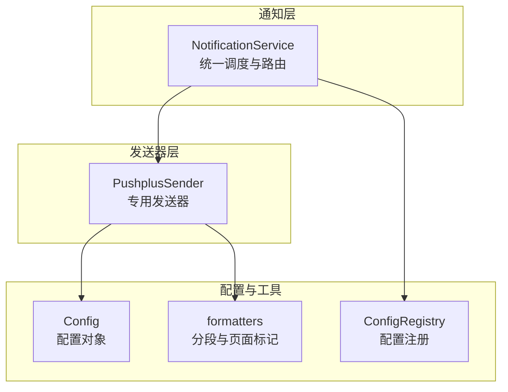
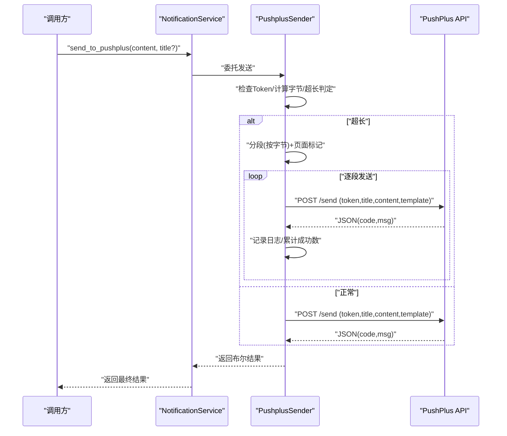
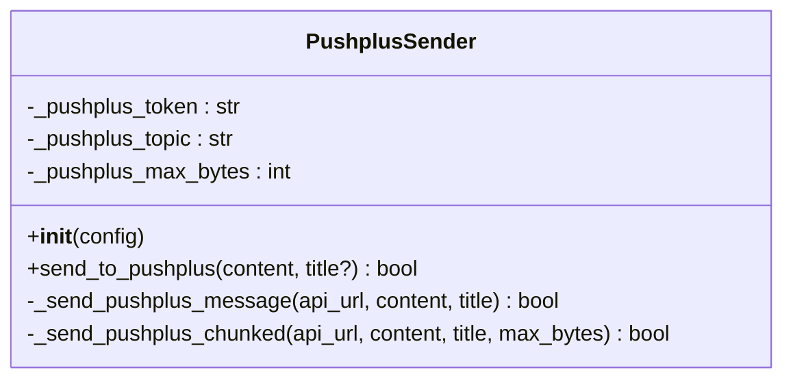
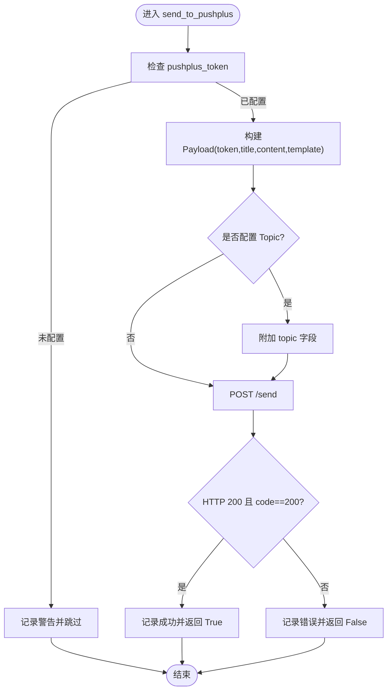
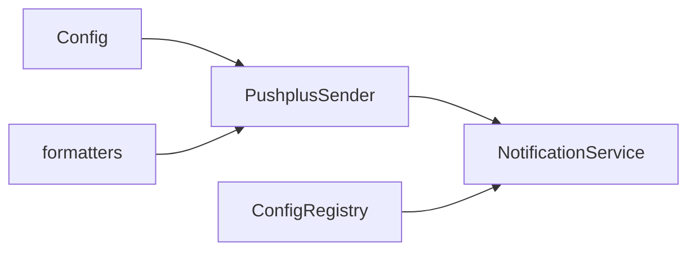

# PushPlus通知

<cite>
**本文引用的文件**
- [src/notification_sender/pushplus_sender.py](file://src/notification_sender/pushplus_sender.py)
- [src/notification.py](file://src/notification.py)
- [src/config.py](file://src/config.py)
- [src/core/config_registry.py](file://src/core/config_registry.py)
- [src/formatters.py](file://src/formatters.py)
- [tests/test_notification_sender.py](file://tests/test_notification_sender.py)
- [tests/test_notification.py](file://tests/test_notification.py)
- [README.md](file://README.md)
- [docs/full-guide.md](file://docs/full-guide.md)
</cite>

## 目录
1. [简介](#简介)
2. [项目结构](#项目结构)
3. [核心组件](#核心组件)
4. [架构概览](#架构概览)
5. [详细组件分析](#详细组件分析)
6. [依赖分析](#依赖分析)
7. [性能考量](#性能考量)
8. [故障排查指南](#故障排查指南)
9. [结论](#结论)
10. [附录](#附录)

## 简介
本章节面向PushPlus通知渠道的技术文档，聚焦于PushPlus服务的注册与Token获取、消息推送机制、分组推送与设备绑定、消息格式支持与模板配置、个性化设置、配置示例、分组管理与推送策略、API限制与频率控制、设备兼容性，以及官方使用指南与移动端应用配置方法。文档基于代码库中的实现与配置注册进行梳理，并提供可视化图示帮助理解。

## 项目结构
PushPlus通知在本项目中由两套实现共同支持：
- 专用发送器：PushplusSender（独立模块，便于单元测试与复用）
- 通知服务：NotificationService（统一调度与路由，支持多渠道并行）

二者均依赖统一配置对象与分段工具，确保消息长度控制与分页标记。

图表来源
- [src/notification.py:2680-2746](file://src/notification.py#L2680-L2746)
- [src/notification_sender/pushplus_sender.py:21-135](file://src/notification_sender/pushplus_sender.py#L21-L135)
- [src/config.py:120-122](file://src/config.py#L120-L122)
- [src/core/config_registry.py:753-766](file://src/core/config_registry.py#L753-L766)
- [src/formatters.py:291-374](file://src/formatters.py#L291-L374)

章节来源
- [src/notification.py:2680-2746](file://src/notification.py#L2680-L2746)
- [src/notification_sender/pushplus_sender.py:21-135](file://src/notification_sender/pushplus_sender.py#L21-L135)
- [src/config.py:120-122](file://src/config.py#L120-L122)
- [src/core/config_registry.py:753-766](file://src/core/config_registry.py#L753-L766)
- [src/formatters.py:291-374](file://src/formatters.py#L291-L374)

## 核心组件
- PushplusSender：封装PushPlus专用发送逻辑，负责构建请求负载、处理长消息分段、可选分组主题字段、错误处理与日志记录。
- NotificationService：统一通知入口，根据配置选择并调用PushPlus发送器，支持多渠道并行推送与失败计数。
- Config：集中管理推送相关配置项（Token、Topic、最大字节数等）。
- ConfigRegistry：对外暴露配置项元数据（UI控件、是否敏感、默认值、显示顺序等），便于Web界面与文档生成。
- formatters：提供按字节分段与页面标记工具，保障长消息可靠传输。

章节来源
- [src/notification_sender/pushplus_sender.py:21-135](file://src/notification_sender/pushplus_sender.py#L21-L135)
- [src/notification.py:2680-2746](file://src/notification.py#L2680-L2746)
- [src/config.py:120-122](file://src/config.py#L120-L122)
- [src/core/config_registry.py:753-766](file://src/core/config_registry.py#L753-L766)
- [src/formatters.py:291-374](file://src/formatters.py#L291-L374)

## 架构概览
PushPlus推送流程包括：配置加载、标题生成、Payload构建、请求发送、响应解析与日志记录；当消息超长时，自动分段并逐段发送，同时在标题中附加分页标记。

图表来源
- [src/notification.py:2680-2746](file://src/notification.py#L2680-L2746)
- [src/notification_sender/pushplus_sender.py:34-135](file://src/notification_sender/pushplus_sender.py#L34-L135)
- [src/formatters.py:291-374](file://src/formatters.py#L291-L374)

## 详细组件分析

### PushplusSender组件
PushplusSender负责PushPlus消息发送的核心逻辑，包括：
- 配置读取：Token、Topic、最大字节数
- 标题生成：缺省时使用日期作为标题后缀
- Payload构建：包含token、title、content、template=markdown
- 可选Topic：当配置了Topic时，附加到payload
- 错误处理：HTTP状态码与业务code判断、异常捕获、日志记录
- 长消息分段：基于字节预算预留JSON开销，按分隔符智能切分并添加页面标记

图表来源
- [src/notification_sender/pushplus_sender.py:21-135](file://src/notification_sender/pushplus_sender.py#L21-L135)

章节来源
- [src/notification_sender/pushplus_sender.py:21-135](file://src/notification_sender/pushplus_sender.py#L21-L135)

### NotificationService组件
NotificationService统一调度各通知渠道，其中PushPlus分支：
- 读取配置中的pushplus_token
- 若未配置Token则跳过
- 构造标准Payload并调用PushPlus端点
- 解析响应并记录日志
- 统计成功/失败计数，返回整体结果

图表来源
- [src/notification.py:2680-2746](file://src/notification.py#L2680-L2746)

章节来源
- [src/notification.py:2680-2746](file://src/notification.py#L2680-L2746)

### 配置与注册
- Config：定义pushplus_token、pushplus_topic、pushplus_max_bytes等字段
- ConfigRegistry：对外暴露配置项元数据，包括UI控件类型、是否敏感、默认值、显示顺序等
- README与完整指南：提供环境变量说明与最小配置示例

章节来源
- [src/config.py:120-122](file://src/config.py#L120-L122)
- [src/core/config_registry.py:753-766](file://src/core/config_registry.py#L753-L766)
- [src/core/config_registry.py:1034-1047](file://src/core/config_registry.py#L1034-L1047)
- [README.md:95-101](file://README.md#L95-L101)
- [docs/full-guide.md:80-109](file://docs/full-guide.md#L80-L109)
- [docs/full-guide.md:208-209](file://docs/full-guide.md#L208-L209)

### 消息格式与模板
- PushPlus支持多种模板类型（html/txt/json/markdown），当前实现固定使用markdown模板
- 内容编码采用UTF-8字节长度计算，确保跨字符安全
- 页面标记：在分段时自动附加“第x页/共y页”标记，便于阅读

章节来源
- [src/notification_sender/pushplus_sender.py:89-113](file://src/notification_sender/pushplus_sender.py#L89-L113)
- [src/formatters.py:291-374](file://src/formatters.py#L291-L374)

### 分组管理与设备绑定
- 分组推送：通过pushplus_topic配置实现一对多推送
- 设备绑定：PushPlus服务端侧管理，客户端无需额外绑定操作
- 本项目未实现设备绑定逻辑，分组由服务端Topic管理

章节来源
- [src/core/config_registry.py:1034-1047](file://src/core/config_registry.py#L1034-L1047)
- [src/notification_sender/pushplus_sender.py:97-98](file://src/notification_sender/pushplus_sender.py#L97-L98)

### 个性化设置
- 标题个性化：缺省时自动拼接日期；长消息分段时在标题后附加“(x/y)”标记
- 模板选择：当前固定为markdown
- 最大字节：可通过pushplus_max_bytes调整，影响分段阈值

章节来源
- [src/notification_sender/pushplus_sender.py:65-67](file://src/notification_sender/pushplus_sender.py#L65-L67)
- [src/notification_sender/pushplus_sender.py:124-126](file://src/notification_sender/pushplus_sender.py#L124-L126)
- [src/config.py:129-132](file://src/config.py#L129-L132)

### 配置示例与推送策略
- 最小配置：至少配置PUSHPLUS_TOKEN与STOCK_LIST
- 推送策略：可开启SINGLE_STOCK_NOTIFY实现单股即时推送；或使用REPORT_TYPE控制报告简洁程度
- 分组策略：配置PUSHPLUS_TOPIC实现一对多推送

章节来源
- [docs/full-guide.md:126-136](file://docs/full-guide.md#L126-L136)
- [docs/full-guide.md:95-105](file://docs/full-guide.md#L95-L105)
- [docs/full-guide.md:208-209](file://docs/full-guide.md#L208-L209)

## 依赖分析
- PushplusSender依赖Config与formatters
- NotificationService依赖PushplusSender与ConfigRegistry
- 测试覆盖：单元测试验证Token缺失时跳过、成功路径、长消息分段与多次请求

图表来源
- [src/notification_sender/pushplus_sender.py:14-15](file://src/notification_sender/pushplus_sender.py#L14-L15)
- [src/notification.py:2680-2746](file://src/notification.py#L2680-L2746)
- [src/core/config_registry.py:753-766](file://src/core/config_registry.py#L753-L766)

章节来源
- [tests/test_notification_sender.py:346-374](file://tests/test_notification_sender.py#L346-L374)
- [tests/test_notification.py:456-492](file://tests/test_notification.py#L456-L492)

## 性能考量
- 长消息分段：按预算字节切分，预留JSON开销，避免单次请求过大
- 分页标记：在标题中附加页码，提升可读性
- 请求间隔：分段发送时在批次间等待1秒，降低触发频率限制风险
- 超时控制：请求超时为10秒，避免阻塞

章节来源
- [src/notification_sender/pushplus_sender.py:115-135](file://src/notification_sender/pushplus_sender.py#L115-L135)
- [src/formatters.py:291-374](file://src/formatters.py#L291-L374)

## 故障排查指南
- Token未配置：发送器会记录警告并跳过推送
- 请求失败：记录HTTP状态码与错误信息
- 业务错误：当返回code!=200时，记录msg字段
- 长消息未送达：检查pushplus_max_bytes配置与分段日志
- 单元测试参考：验证Token缺失、成功路径与长消息分段行为

章节来源
- [src/notification_sender/pushplus_sender.py:59-61](file://src/notification_sender/pushplus_sender.py#L59-L61)
- [src/notification.py:2730-2741](file://src/notification.py#L2730-L2741)
- [tests/test_notification_sender.py:349-374](file://tests/test_notification_sender.py#L349-L374)
- [tests/test_notification.py:464-483](file://tests/test_notification.py#L464-L483)

## 结论
PushPlus通知在本项目中实现了稳定的Token驱动、可选分组推送与长消息分段能力。通过统一配置与分段工具，既满足国内推送场景，又兼顾可靠性与可读性。建议在生产环境中合理设置pushplus_max_bytes与SINGLE_STOCK_NOTIFY，以平衡推送及时性与平台限制。

## 附录

### PushPlus注册与Token获取
- 官方获取地址：[PushPlus](https://www.pushplus.plus)
- 配置项：PUSHPLUS_TOKEN
- UI注册：ConfigRegistry中定义为敏感字段，支持密码控件

章节来源
- [README.md:95-101](file://README.md#L95-L101)
- [docs/full-guide.md:83-83](file://docs/full-guide.md#L83-L83)
- [src/core/config_registry.py:753-766](file://src/core/config_registry.py#L753-L766)

### 分组管理与推送策略
- 分组Topic：PUSHPLUS_TOPIC
- 一对多推送：通过Topic实现
- 单股推送：SINGLE_STOCK_NOTIFY=true

章节来源
- [src/core/config_registry.py:1034-1047](file://src/core/config_registry.py#L1034-L1047)
- [docs/full-guide.md:95-105](file://docs/full-guide.md#L95-L105)

### 消息格式与模板
- 当前实现：template=markdown
- 支持类型：html/txt/json/markdown（PushPlus API支持）

章节来源
- [src/notification_sender/pushplus_sender.py:89-94](file://src/notification_sender/pushplus_sender.py#L89-L94)

### API限制与频率控制
- 平台限制：PushPlus单次请求大小与频率限制未在代码中显式硬编码
- 项目内实践：分段发送、1秒批次间隔、10秒超时
- 建议：结合自身Token配额与业务量，适当调整pushplus_max_bytes与SINGLE_STOCK_NOTIFY

章节来源
- [src/notification_sender/pushplus_sender.py:115-135](file://src/notification_sender/pushplus_sender.py#L115-L135)

### 设备兼容性
- PushPlus支持微信公众号推送与多种消息格式
- 本项目使用Markdown模板，确保主流客户端良好展示

章节来源
- [src/notification_sender/pushplus_sender.py:47-50](file://src/notification_sender/pushplus_sender.py#L47-L50)

### 官方使用指南与移动端配置
- 官方获取地址：[PushPlus](https://www.pushplus.plus)
- 移动端应用：通过PushPlus官方App获取Token并完成推送配置

章节来源
- [README.md:95-101](file://README.md#L95-L101)