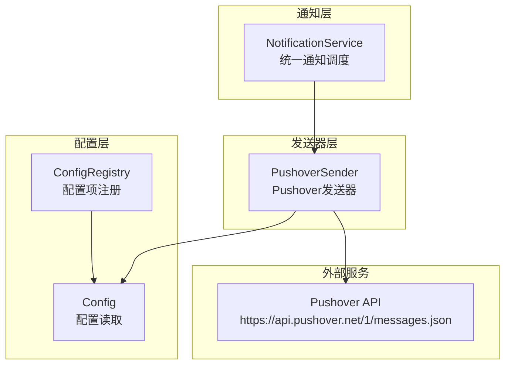
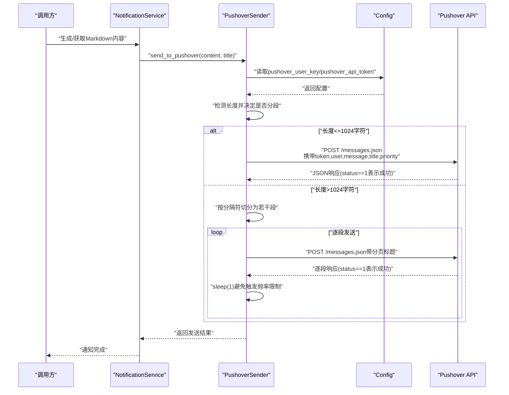
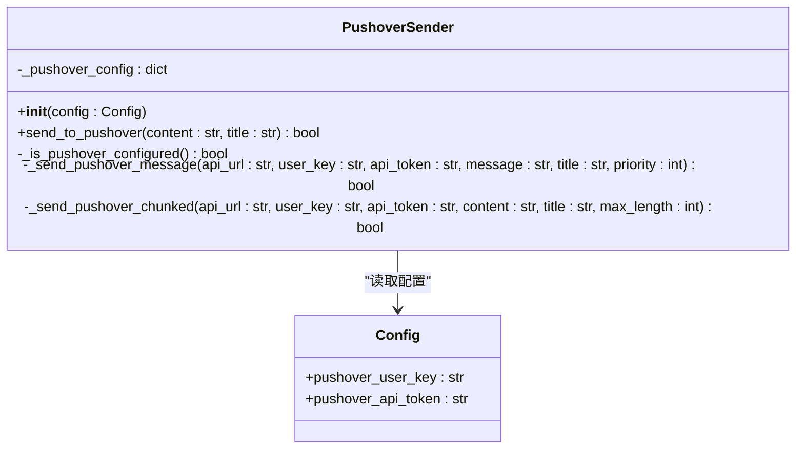
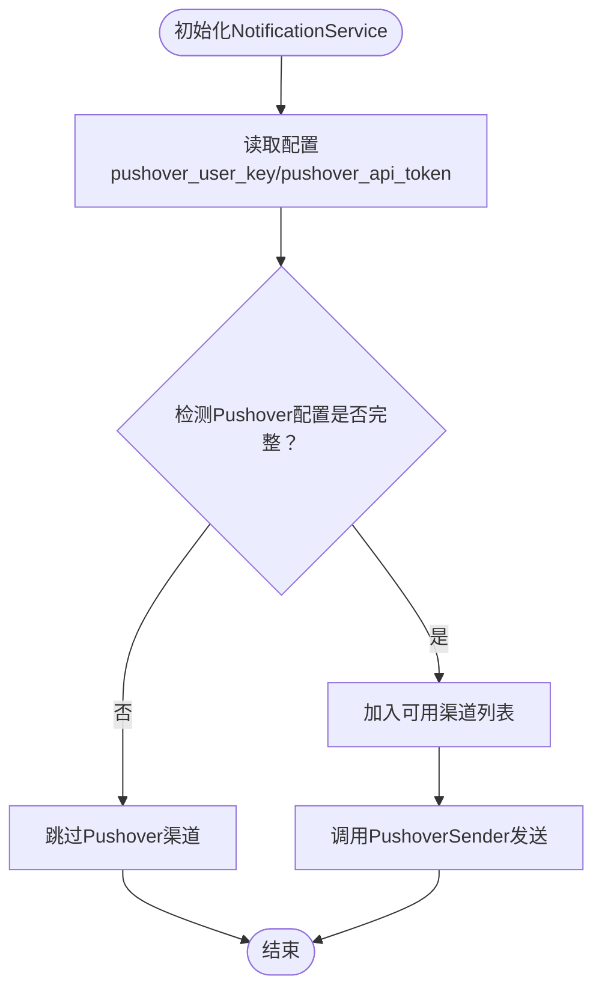
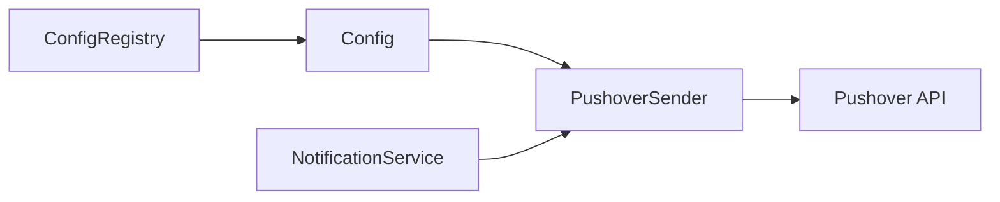

# Pushover通知

<cite>
**本文引用的文件**
- [src/notification_sender/pushover_sender.py](file://src/notification_sender/pushover_sender.py)
- [src/notification.py](file://src/notification.py)
- [src/config.py](file://src/config.py)
- [src/core/config_registry.py](file://src/core/config_registry.py)
- [tests/test_notification_sender.py](file://tests/test_notification_sender.py)
- [README.md](file://README.md)
</cite>

## 目录
1. [简介](#简介)
2. [项目结构](#项目结构)
3. [核心组件](#核心组件)
4. [架构总览](#架构总览)
5. [详细组件分析](#详细组件分析)
6. [依赖关系分析](#依赖关系分析)
7. [性能考量](#性能考量)
8. [故障排查指南](#故障排查指南)
9. [结论](#结论)
10. [附录](#附录)

## 简介
本章节面向Pushover通知渠道的技术文档，聚焦于Pushover服务的注册与配置流程、User Key与API Token的获取方式、消息优先级与分段发送策略、消息格式与长度限制、以及在本项目中的集成方式与最佳实践。文档同时提供配置示例、设备绑定与应用设置指引，并补充Pushover API限制、消息长度处理与设备同步机制说明。

## 项目结构
Pushover通知在本项目中由两部分组成：
- Pushover发送器：独立的发送器模块，负责构造请求、处理分段与优先级。
- 通知服务：统一的通知调度层，负责检测可用渠道并在满足条件时调用各发送器。

图示来源
- [src/notification.py:113-206](file://src/notification.py#L113-L206)
- [src/notification_sender/pushover_sender.py:20-37](file://src/notification_sender/pushover_sender.py#L20-L37)
- [src/config.py:32-125](file://src/config.py#L32-L125)
- [src/core/config_registry.py:1004-1033](file://src/core/config_registry.py#L1004-L1033)

章节来源
- [src/notification.py:113-206](file://src/notification.py#L113-L206)
- [src/notification_sender/pushover_sender.py:20-37](file://src/notification_sender/pushover_sender.py#L20-L37)
- [src/config.py:32-125](file://src/config.py#L32-L125)
- [src/core/config_registry.py:1004-1033](file://src/core/config_registry.py#L1004-L1033)

## 核心组件
- PushoverSender：负责Pushover消息发送，包括配置校验、消息长度处理、分段发送、优先级设置与错误处理。
- NotificationService：统一通知调度，检测已配置渠道并在满足条件时调用PushoverSender。
- Config：提供Pushover User Key与API Token的读取入口。
- ConfigRegistry：在UI配置系统中登记Pushover配置项，便于可视化管理。

章节来源
- [src/notification_sender/pushover_sender.py:20-37](file://src/notification_sender/pushover_sender.py#L20-L37)
- [src/notification.py:113-206](file://src/notification.py#L113-L206)
- [src/config.py:96-98](file://src/config.py#L96-L98)
- [src/core/config_registry.py:1006-1033](file://src/core/config_registry.py#L1006-L1033)

## 架构总览
Pushover消息发送的关键流程如下：

图示来源
- [src/notification_sender/pushover_sender.py:38-91](file://src/notification_sender/pushover_sender.py#L38-L91)
- [src/notification_sender/pushover_sender.py:141-211](file://src/notification_sender/pushover_sender.py#L141-L211)
- [src/config.py:367-368](file://src/config.py#L367-L368)

章节来源
- [src/notification_sender/pushover_sender.py:38-91](file://src/notification_sender/pushover_sender.py#L38-L91)
- [src/notification_sender/pushover_sender.py:141-211](file://src/notification_sender/pushover_sender.py#L141-L211)
- [src/config.py:367-368](file://src/config.py#L367-L368)

## 详细组件分析

### PushoverSender组件
PushoverSender负责Pushover消息的发送，核心能力包括：
- 配置校验：要求同时具备User Key与API Token。
- 消息长度处理：Pushover单条消息限制为1024字符；超过则按分隔符切分并逐段发送。
- 分段发送：自动在“分隔线”或“双换行”处分割，逐段发送并在标题中附加分页标识。
- 优先级设置：支持设置消息优先级（-2~2），默认为0。
- 错误处理：捕获网络异常与API返回错误，记录日志并返回False。

图示来源
- [src/notification_sender/pushover_sender.py:20-37](file://src/notification_sender/pushover_sender.py#L20-L37)
- [src/notification_sender/pushover_sender.py:38-91](file://src/notification_sender/pushover_sender.py#L38-L91)
- [src/notification_sender/pushover_sender.py:141-211](file://src/notification_sender/pushover_sender.py#L141-L211)
- [src/config.py:96-98](file://src/config.py#L96-L98)

章节来源
- [src/notification_sender/pushover_sender.py:20-37](file://src/notification_sender/pushover_sender.py#L20-L37)
- [src/notification_sender/pushover_sender.py:38-91](file://src/notification_sender/pushover_sender.py#L38-L91)
- [src/notification_sender/pushover_sender.py:141-211](file://src/notification_sender/pushover_sender.py#L141-L211)
- [src/config.py:96-98](file://src/config.py#L96-L98)

### NotificationService与Pushover集成
NotificationService在初始化时读取配置并检测可用渠道，若检测到Pushover配置完整，则将其加入可用渠道列表。随后在需要时调用PushoverSender进行发送。

图示来源
- [src/notification.py:132-206](file://src/notification.py#L132-L206)
- [src/notification.py:277-279](file://src/notification.py#L277-L279)

章节来源
- [src/notification.py:132-206](file://src/notification.py#L132-L206)
- [src/notification.py:277-279](file://src/notification.py#L277-L279)

### Pushover消息格式与长度处理
- 消息格式：Pushover支持HTML，但本项目将Markdown转换为纯文本以提升兼容性。
- 长度限制：单条消息最多1024字符；超过则按分隔符切分并逐段发送，标题中附加分页标识。
- 优先级：支持-2（最低）到2（最高）的优先级设置，默认0。
- 分段策略：优先按“分隔线”分割，其次按“双换行”分割，确保分页自然。

章节来源
- [src/notification_sender/pushover_sender.py:79-91](file://src/notification_sender/pushover_sender.py#L79-L91)
- [src/notification_sender/pushover_sender.py:141-211](file://src/notification_sender/pushover_sender.py#L141-L211)

### Pushover注册与配置流程
- 注册账户与应用：前往Pushover官网注册账号并创建应用，获取API Token。
- 获取User Key：在Pushover账户页面获取User Key。
- 配置方式：通过环境变量或配置文件设置PUSHOVER_USER_KEY与PUSHOVER_API_TOKEN。
- UI配置：在系统配置注册表中，Pushover配置项以“密码”控件呈现，便于安全输入。

章节来源
- [src/core/config_registry.py:1006-1033](file://src/core/config_registry.py#L1006-L1033)
- [src/config.py:367-368](file://src/config.py#L367-L368)
- [README.md:86-108](file://README.md#L86-L108)

### 设备绑定与应用设置
- 设备绑定：在Pushover账户中为应用绑定设备（iOS/Android/桌面），确保消息可送达。
- 应用设置：可在应用侧设置通知声音、震动、免打扰时段等偏好。
- 本项目未直接对接这些设置，发送端仅负责消息投递。

章节来源
- [src/notification_sender/pushover_sender.py:42-56](file://src/notification_sender/pushover_sender.py#L42-L56)

### API限制与重复提醒机制
- 单条长度限制：1024字符。
- 分段发送：超过限制时自动分段，逐段发送并添加分页标题。
- 频率限制防护：分段发送时在批次间增加1秒间隔，降低触发频率限制的风险。
- 重复提醒：Pushover支持重复提醒与优先级，本项目默认优先级为0，未强制开启重复提醒。

章节来源
- [src/notification_sender/pushover_sender.py:79-91](file://src/notification_sender/pushover_sender.py#L79-L91)
- [src/notification_sender/pushover_sender.py:207-211](file://src/notification_sender/pushover_sender.py#L207-L211)

### 配置示例与最佳实践
- 环境变量示例（.env）：
  - PUSHOVER_USER_KEY=your_user_key
  - PUSHOVER_API_TOKEN=your_api_token
- 在系统配置界面中，Pushover配置项以“密码”控件显示，便于安全输入。
- 最佳实践：
  - 将Markdown内容转换为纯文本，提高跨平台兼容性。
  - 对长内容使用分段发送，避免丢失。
  - 合理设置优先级，区分紧急程度。

章节来源
- [src/core/config_registry.py:1006-1033](file://src/core/config_registry.py#L1006-L1033)
- [src/config.py:367-368](file://src/config.py#L367-L368)
- [src/notification_sender/pushover_sender.py:79-91](file://src/notification_sender/pushover_sender.py#L79-L91)

### 移动应用与下载指南
- Pushover移动应用可在App Store与Google Play商店搜索“Pushover”下载安装。
- 安装后在账户页面绑定设备，即可接收来自本系统的推送。

章节来源
- [README.md:12-14](file://README.md#L12-L14)

## 依赖关系分析
PushoverSender依赖Config读取用户凭据，NotificationService在检测到Pushover配置后调用PushoverSender；ConfigRegistry在UI层注册Pushover配置项，形成“配置—发送—调度”的清晰依赖链。

图示来源
- [src/core/config_registry.py:1006-1033](file://src/core/config_registry.py#L1006-L1033)
- [src/config.py:367-368](file://src/config.py#L367-L368)
- [src/notification_sender/pushover_sender.py:20-37](file://src/notification_sender/pushover_sender.py#L20-L37)
- [src/notification.py:113-206](file://src/notification.py#L113-L206)

章节来源
- [src/core/config_registry.py:1006-1033](file://src/core/config_registry.py#L1006-L1033)
- [src/config.py:367-368](file://src/config.py#L367-L368)
- [src/notification_sender/pushover_sender.py:20-37](file://src/notification_sender/pushover_sender.py#L20-L37)
- [src/notification.py:113-206](file://src/notification.py#L113-L206)

## 性能考量
- 分段发送：长消息按段落切分，逐段发送并添加分页标题，提升可读性与成功率。
- 频率限制防护：批次间增加1秒休眠，降低触发Pushover频率限制的概率。
- 超长内容处理：通过分隔符优先策略减少截断带来的阅读障碍。

章节来源
- [src/notification_sender/pushover_sender.py:141-211](file://src/notification_sender/pushover_sender.py#L141-L211)

## 故障排查指南
- 配置不完整：若未设置User Key或API Token，发送将被跳过并记录警告。
- API返回错误：当Pushover返回status!=1时，记录错误并返回False。
- 网络异常：捕获异常并记录错误日志，返回False。
- 单元测试覆盖：包含Pushover发送器的配置校验与成功发送场景，便于回归验证。

章节来源
- [src/notification_sender/pushover_sender.py:64-66](file://src/notification_sender/pushover_sender.py#L64-L66)
- [src/notification_sender/pushover_sender.py:123-135](file://src/notification_sender/pushover_sender.py#L123-L135)
- [tests/test_notification_sender.py:328-344](file://tests/test_notification_sender.py#L328-L344)

## 结论
本项目对Pushover的通知集成简洁可靠：通过独立的PushoverSender模块实现配置校验、消息长度处理与分段发送，并在NotificationService中统一调度。结合ConfigRegistry的UI配置能力，用户可安全地完成Pushover的注册与配置。对于长消息与高优先级需求，项目提供了明确的处理策略与防护措施，满足日常推送场景。

## 附录
- Pushover官方API端点：https://api.pushover.net/1/messages.json
- 本项目对Pushover的实现参考：
  - [PushoverSender实现:38-91](file://src/notification_sender/pushover_sender.py#L38-L91)
  - [分段发送实现:141-211](file://src/notification_sender/pushover_sender.py#L141-L211)
  - [配置读取:367-368](file://src/config.py#L367-L368)
  - [配置项注册:1006-1033](file://src/core/config_registry.py#L1006-L1033)
  - [通知服务集成:113-206](file://src/notification.py#L113-L206)