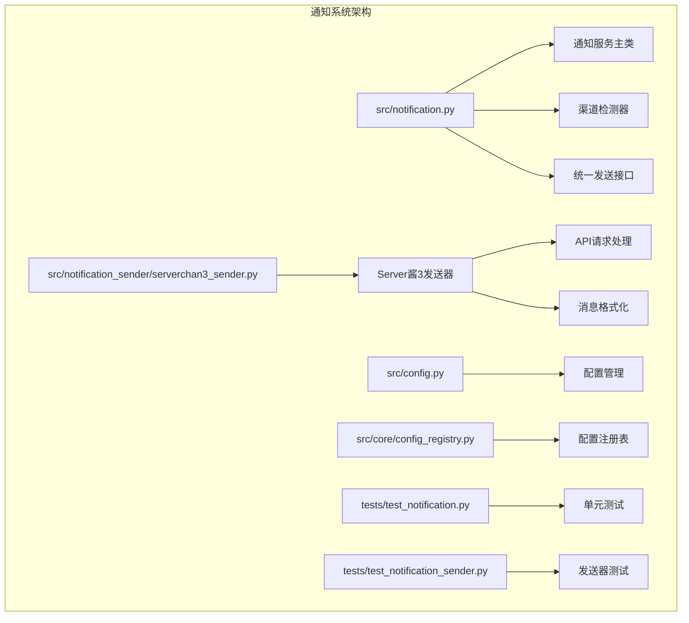
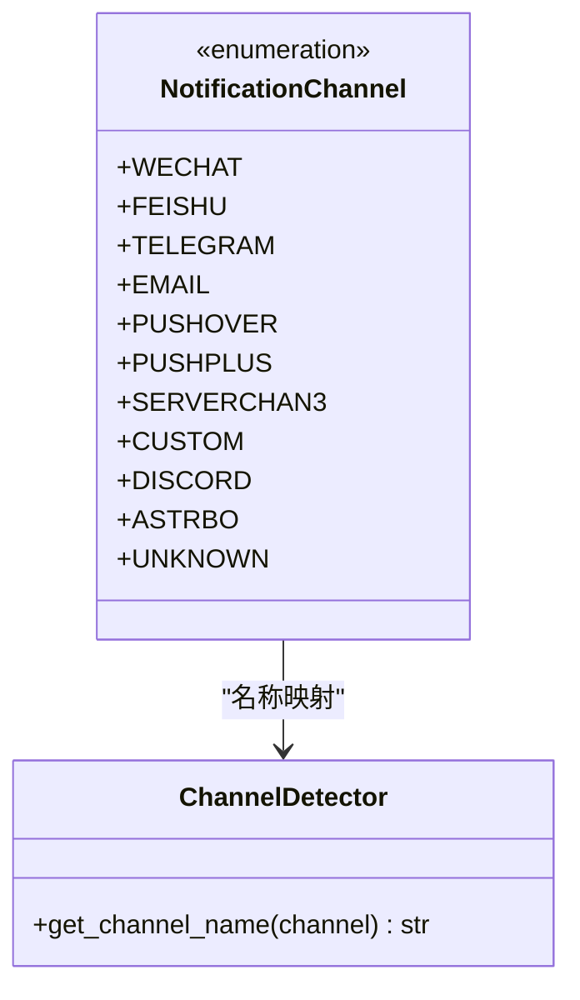
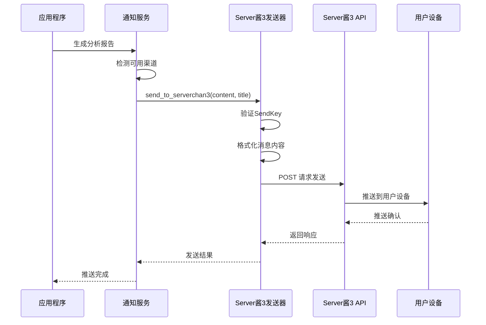
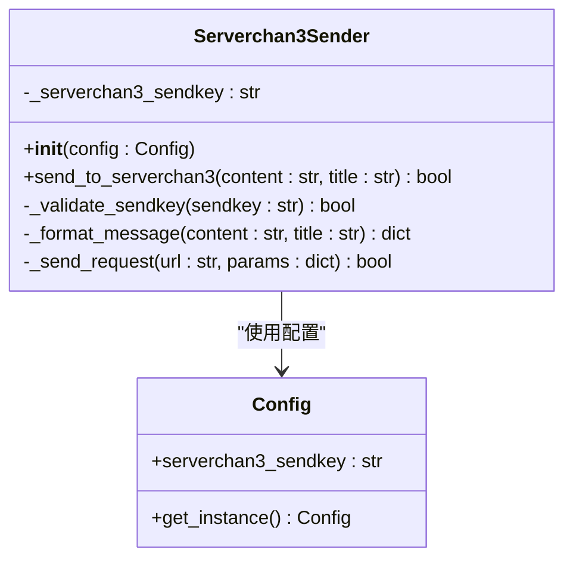
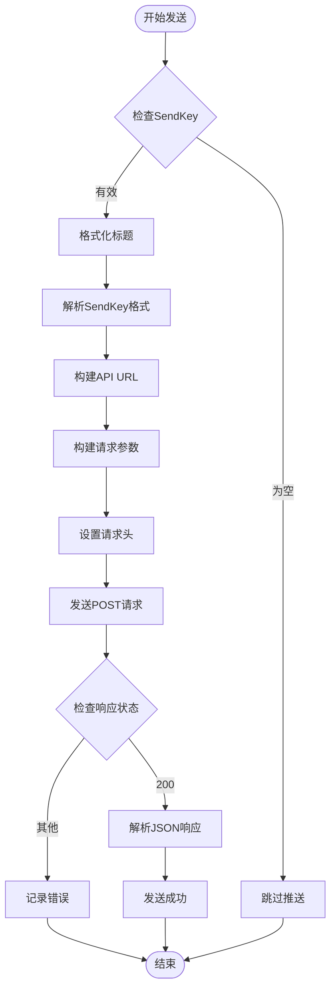
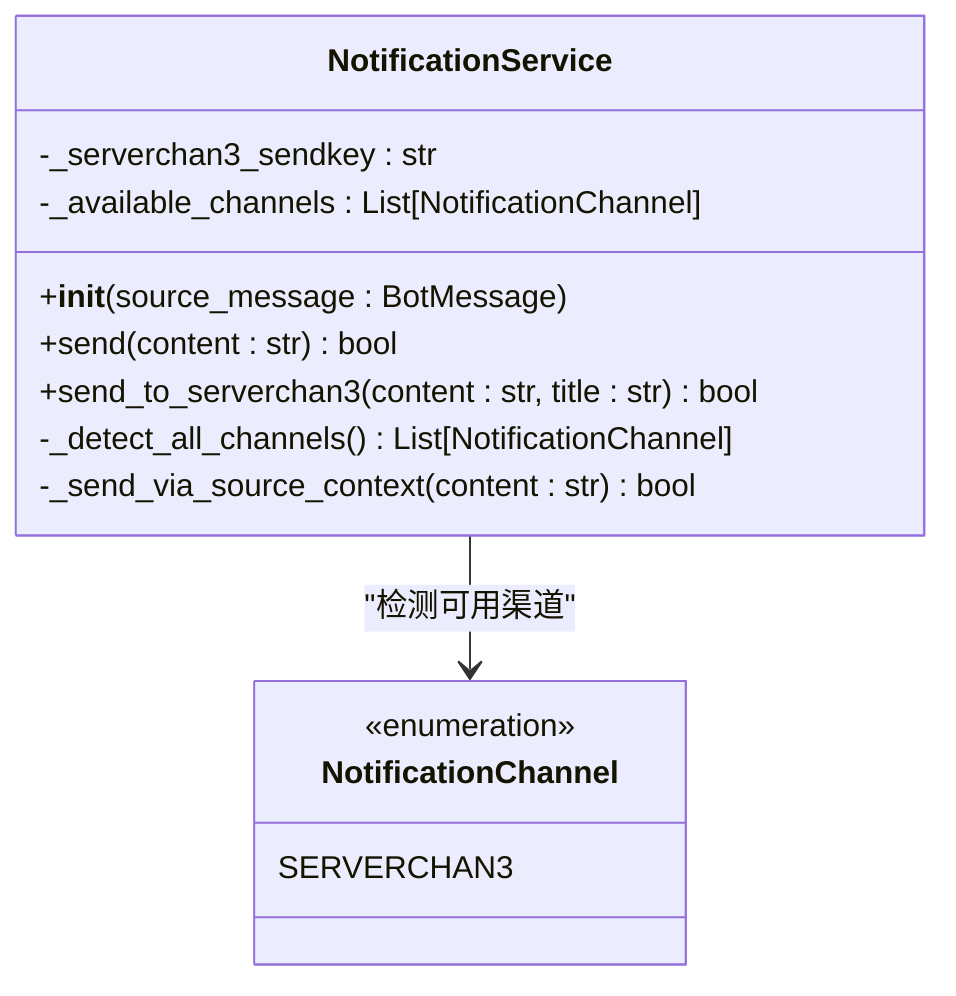
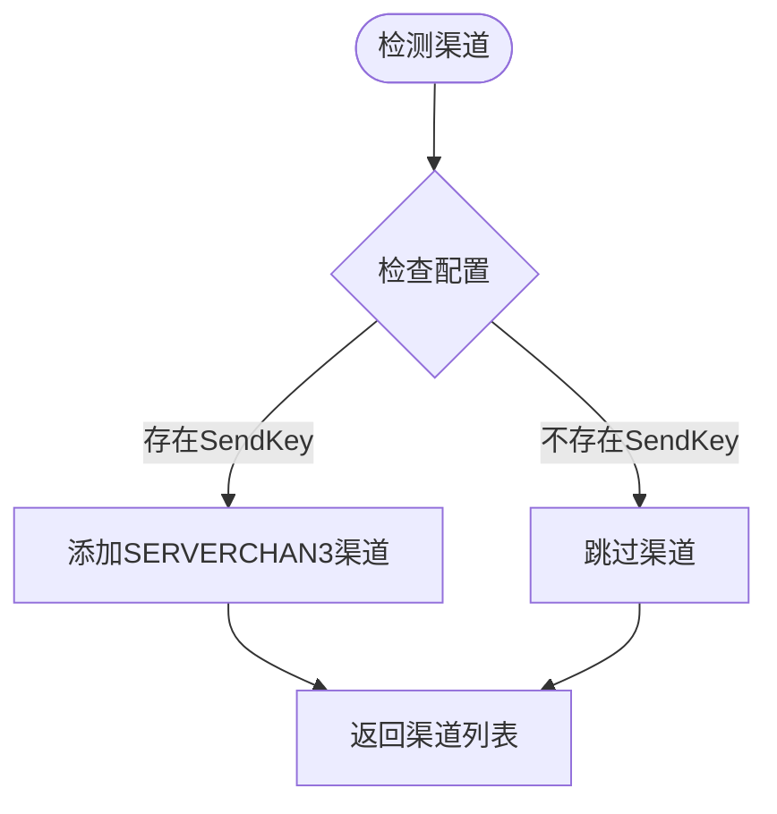
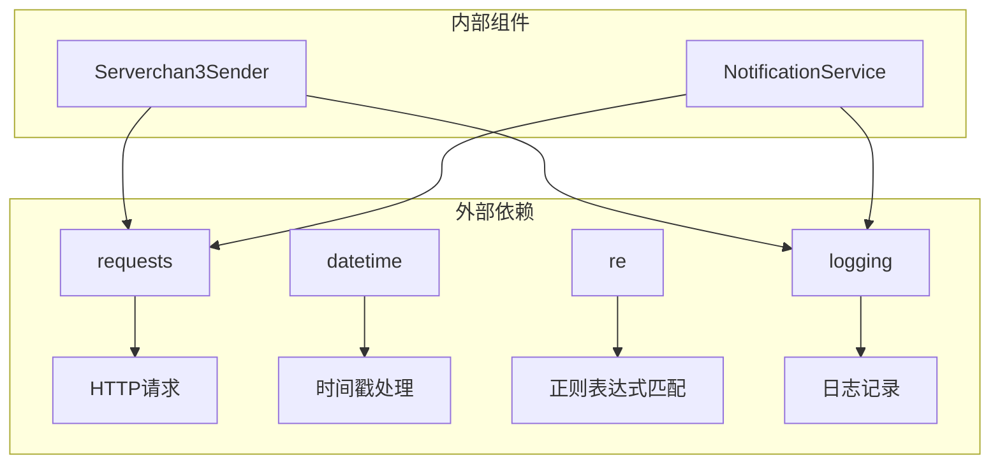
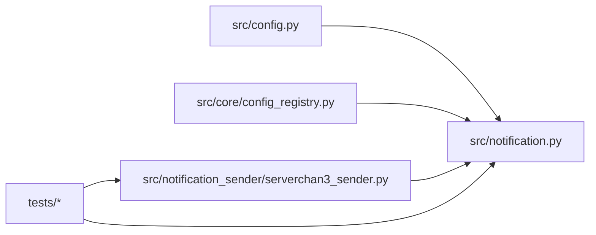

# Server酱3通知

<cite>
**本文档引用的文件**
- [src/notification.py](file://src/notification.py)
- [src/notification_sender/serverchan3_sender.py](file://src/notification_sender/serverchan3_sender.py)
- [src/config.py](file://src/config.py)
- [src/core/config_registry.py](file://src/core/config_registry.py)
- [tests/test_notification.py](file://tests/test_notification.py)
- [tests/test_notification_sender.py](file://tests/test_notification_sender.py)
</cite>

## 目录
1. [简介](#简介)
2. [项目结构](#项目结构)
3. [核心组件](#核心组件)
4. [架构概览](#架构概览)
5. [详细组件分析](#详细组件分析)
6. [依赖关系分析](#依赖关系分析)
7. [性能考虑](#性能考虑)
8. [故障排除指南](#故障排除指南)
9. [结论](#结论)
10. [附录](#附录)

## 简介

Server酱3是本项目支持的通知渠道之一，是一个国内推送服务，支持多家国产系统推送通道，可实现无后台推送。该项目实现了Server酱3通知的完整集成，包括SendKey配置、消息格式化、分组管理和设备绑定功能。

Server酱3通知渠道的主要特点：
- 国内推送服务，支持多家国产系统推送通道
- 简单易用的API接口
- 支持多种消息格式
- 提供分组管理和设备绑定功能
- 支持模板配置和个性化设置

## 项目结构

该项目采用模块化设计，Server酱3通知功能分布在以下关键文件中：



**图表来源**
- [src/notification.py:113-206](file://src/notification.py#L113-L206)
- [src/notification_sender/serverchan3_sender.py:20-29](file://src/notification_sender/serverchan3_sender.py#L20-L29)

**章节来源**
- [src/notification.py:1-800](file://src/notification.py#L1-L800)
- [src/notification_sender/serverchan3_sender.py:1-107](file://src/notification_sender/serverchan3_sender.py#L1-L107)

## 核心组件

### 通知渠道枚举

项目定义了统一的通知渠道枚举，Server酱3作为其中一个独立的渠道类型：



**图表来源**
- [src/notification.py:47-110](file://src/notification.py#L47-L110)

### 配置管理系统

Server酱3的配置通过统一的配置管理系统进行管理：

| 配置项 | 类型 | 默认值 | 描述 |
|--------|------|--------|------|
| SERVERCHAN3_SENDKEY | string | None | Server酱3的SendKey |
| serverchan3_sendkey | 属性 | None | 配置属性映射 |

**章节来源**
- [src/config.py:123-124](file://src/config.py#L123-L124)
- [src/config.py:370](file://src/config.py#L370)
- [src/core/config_registry.py:1051-1064](file://src/core/config_registry.py#L1051-L1064)

## 架构概览

Server酱3通知系统的整体架构如下：



**图表来源**
- [src/notification.py:2747-2821](file://src/notification.py#L2747-L2821)
- [src/notification_sender/serverchan3_sender.py:31-105](file://src/notification_sender/serverchan3_sender.py#L31-L105)

## 详细组件分析

### Server酱3发送器实现

Server酱3发送器是专门负责Server酱3消息推送的核心组件：



**图表来源**
- [src/notification_sender/serverchan3_sender.py:20-29](file://src/notification_sender/serverchan3_sender.py#L20-L29)
- [src/notification_sender/serverchan3_sender.py:31-105](file://src/notification_sender/serverchan3_sender.py#L31-L105)

#### 发送流程分析

Server酱3消息发送的具体流程：



**图表来源**
- [src/notification_sender/serverchan3_sender.py:65-105](file://src/notification_sender/serverchan3_sender.py#L65-L105)

### 通知服务集成

通知服务负责协调各个通知渠道的发送：



**图表来源**
- [src/notification.py:113-206](file://src/notification.py#L113-L206)
- [src/notification.py:2747-2821](file://src/notification.py#L2747-L2821)

#### 渠道检测逻辑

通知服务的Server酱3渠道检测机制：



**图表来源**
- [src/notification.py:240-242](file://src/notification.py#L240-L242)

**章节来源**
- [src/notification.py:2747-2821](file://src/notification.py#L2747-L2821)
- [src/notification_sender/serverchan3_sender.py:31-105](file://src/notification_sender/serverchan3_sender.py#L31-L105)

## 依赖关系分析

### 外部依赖

Server酱3通知功能依赖以下外部组件：



**图表来源**
- [src/notification_sender/serverchan3_sender.py:8-14](file://src/notification_sender/serverchan3_sender.py#L8-L14)
- [src/notification.py:32-42](file://src/notification.py#L32-L42)

### 内部依赖关系



**图表来源**
- [src/config.py:369-370](file://src/config.py#L369-L370)
- [src/core/config_registry.py:1051-1064](file://src/core/config_registry.py#L1051-L1064)

**章节来源**
- [src/config.py:369-370](file://src/config.py#L369-L370)
- [src/core/config_registry.py:1051-1064](file://src/core/config_registry.py#L1051-L1064)

## 性能考虑

### API调用优化

Server酱3通知的性能优化策略：

1. **超时控制**：所有API请求设置10秒超时时间
2. **错误处理**：完善的异常捕获和错误日志记录
3. **格式验证**：SendKey格式的正则表达式验证
4. **请求头设置**：正确的Content-Type设置

### 并发处理

通知服务支持多渠道并发发送，Server酱3作为独立渠道参与：

- **独立发送**：Server酱3与其他渠道并行发送
- **失败隔离**：单个渠道失败不影响其他渠道
- **结果聚合**：统计各渠道发送结果

## 故障排除指南

### 常见问题及解决方案

| 问题类型 | 症状 | 可能原因 | 解决方案 |
|----------|------|----------|----------|
| 配置错误 | 推送被跳过 | SERVERCHAN3_SENDKEY未设置 | 检查.env文件配置 |
| SendKey格式错误 | 发送失败 | SendKey格式不正确 | 验证SendKey格式 |
| 网络连接问题 | 请求超时 | 网络不稳定 | 检查网络连接 |
| API响应错误 | HTTP状态码非200 | 服务端错误 | 查看响应内容 |

### 调试信息

系统提供了详细的日志记录：

- **配置阶段**：记录SendKey配置状态
- **发送阶段**：记录请求URL和参数
- **响应阶段**：记录HTTP状态码和响应内容
- **错误阶段**：记录异常堆栈信息

**章节来源**
- [src/notification_sender/serverchan3_sender.py:92-105](file://src/notification_sender/serverchan3_sender.py#L92-L105)
- [src/notification.py:2808-2821](file://src/notification.py#L2808-L2821)

## 结论

Server酱3通知渠道在本项目中实现了完整的集成，具有以下优势：

1. **配置简单**：通过环境变量SERVERCHAN3_SENDKEY即可启用
2. **格式灵活**：支持Markdown格式的消息内容
3. **错误处理完善**：提供详细的日志和异常处理
4. **性能可靠**：合理的超时设置和错误恢复机制

建议在生产环境中：
- 确保SendKey的安全存储和传输
- 监控API响应状态和发送成功率
- 定期检查网络连接稳定性
- 配置适当的日志级别以便调试

## 附录

### 配置示例

#### 环境变量配置

```bash
# Server酱3配置
SERVERCHAN3_SENDKEY=SCTXXXXXXXXXXXXXXXXXXXXXX
```

#### 配置验证

```python
# 配置验证逻辑
def validate_serverchan3_config():
    config = get_config()
    if not config.serverchan3_sendkey:
        print("警告：未配置Server酱3 SendKey")
        return False
    return True
```

### API限制说明

根据代码实现，Server酱3 API的限制包括：

- **请求超时**：10秒
- **内容类型**：application/json;charset=utf-8
- **消息格式**：支持Markdown格式
- **SendKey格式**：支持标准格式和带编号的格式

### 设备兼容性

Server酱3支持多种国产系统推送通道，具体兼容性取决于用户设备的系统版本和应用版本。