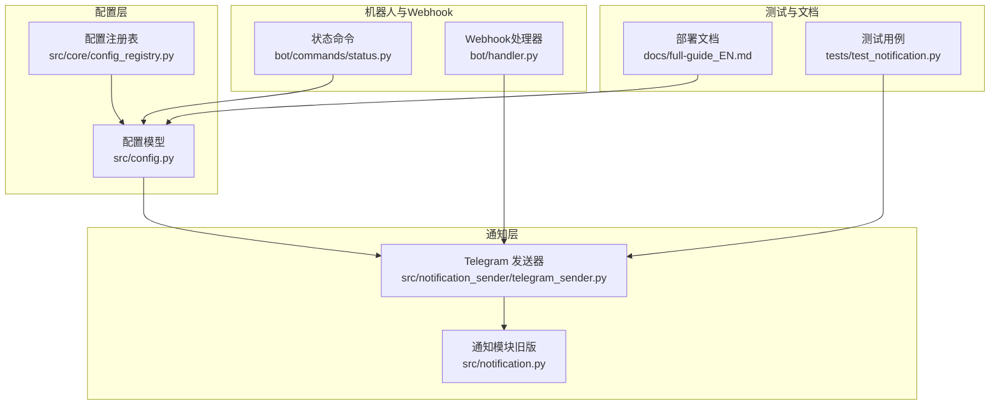
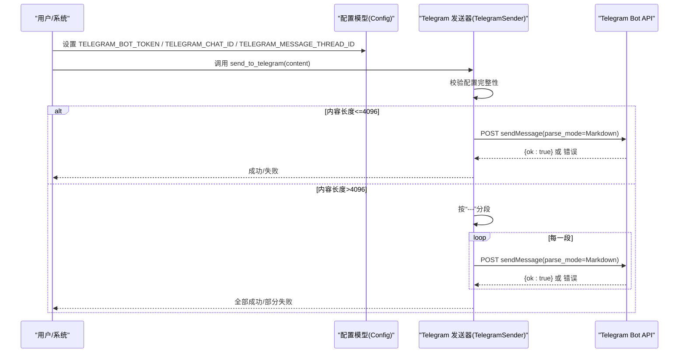
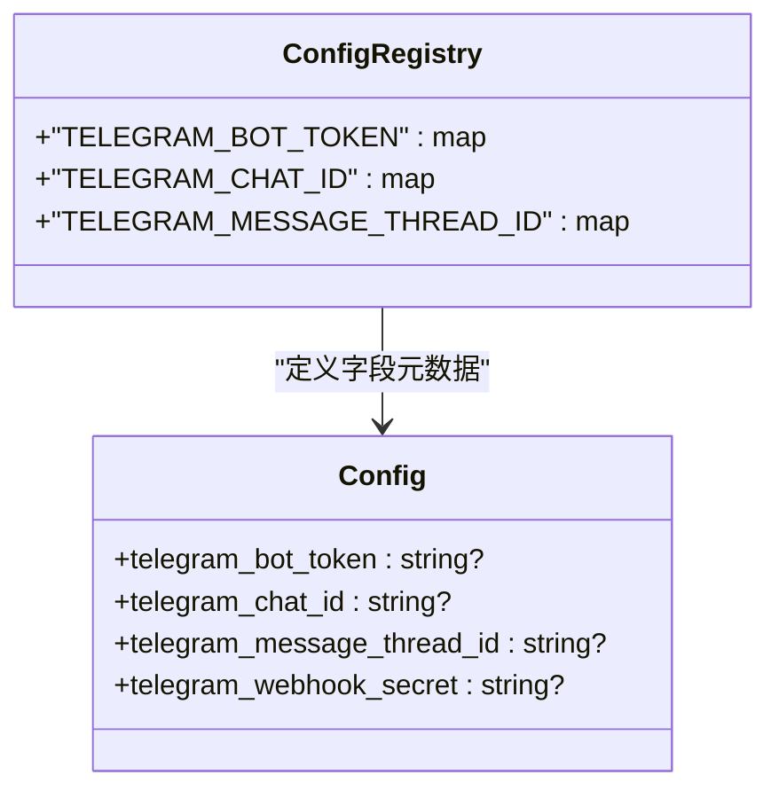
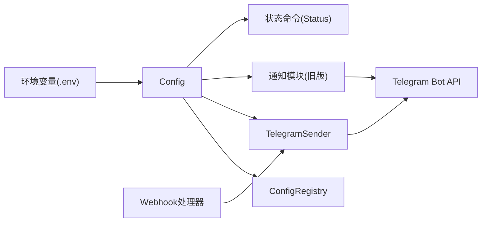

# Telegram通知

<cite>
**本文档引用的文件**
- [telegram_sender.py](file://src/notification_sender/telegram_sender.py)
- [config.py](file://src/config.py)
- [config_registry.py](file://src/core/config_registry.py)
- [status.py](file://bot/commands/status.py)
- [handler.py](file://bot/handler.py)
- [test_notification.py](file://tests/test_notification.py)
- [full-guide_EN.md](file://docs/full-guide_EN.md)
- [notification.py](file://src/notification.py)
</cite>

## 目录
1. [简介](#简介)
2. [项目结构](#项目结构)
3. [核心组件](#核心组件)
4. [架构总览](#架构总览)
5. [详细组件分析](#详细组件分析)
6. [依赖关系分析](#依赖关系分析)
7. [性能考量](#性能考量)
8. [故障排查指南](#故障排查指南)
9. [结论](#结论)
10. [附录](#附录)

## 简介
本文件面向使用 Telegram 作为通知渠道的用户与开发者，系统性说明如何在本项目中完成 Telegram Bot 的创建与配置，包括 Bot Token 获取、Chat ID 与消息线程（Topic/Thread）ID 的获取方法；详解消息格式支持（Markdown 与纯文本）、Markdown 渲染规则与兼容性处理；提供完整的配置示例、BotFather 使用指南、频道订阅设置；记录 Telegram API 限制、消息长度处理策略与错误响应码；并给出私聊、群组与频道三类场景下的不同配置方式与最佳实践。

## 项目结构
与 Telegram 通知相关的核心位置如下：
- 配置模型与环境变量映射：src/config.py
- 配置项注册与 UI 展示：src/core/config_registry.py
- 通知发送实现（文本与图片）：src/notification_sender/telegram_sender.py
- 旧版通知模块（仍保留 Telegram 发送逻辑）：src/notification.py
- 机器人状态命令（显示 Telegram 配置状态）：bot/commands/status.py
- Webhook 入口（Telegram Webhook）：bot/handler.py
- 测试用例（验证 Telegram 发送流程）：tests/test_notification.py
- 部署与配置参考文档：docs/full-guide_EN.md



**图表来源**
- [config.py:85-88](file://src/config.py#L85-L88)
- [config_registry.py:869-912](file://src/core/config_registry.py#L869-L912)
- [telegram_sender.py:21-38](file://src/notification_sender/telegram_sender.py#L21-L38)
- [notification.py:1970-2094](file://src/notification.py#L1970-L2094)
- [status.py:84](file://bot/commands/status.py#L84)
- [handler.py:136-139](file://bot/handler.py#L136-L139)
- [test_notification.py:504-517](file://tests/test_notification.py#L504-L517)
- [full-guide_EN.md:172-180](file://docs/full-guide_EN.md#L172-L180)

**章节来源**
- [config.py:85-88](file://src/config.py#L85-L88)
- [config_registry.py:869-912](file://src/core/config_registry.py#L869-L912)
- [telegram_sender.py:21-38](file://src/notification_sender/telegram_sender.py#L21-L38)
- [notification.py:1970-2094](file://src/notification.py#L1970-L2094)
- [status.py:84](file://bot/commands/status.py#L84)
- [handler.py:136-139](file://bot/handler.py#L136-L139)
- [test_notification.py:504-517](file://tests/test_notification.py#L504-L517)
- [full-guide_EN.md:172-180](file://docs/full-guide_EN.md#L172-L180)

## 核心组件
- 配置模型（Config）：定义 Telegram Bot Token、Chat ID、消息线程 ID 等字段，并从环境变量加载。
- 配置注册表（ConfigRegistry）：为 UI 提供 Telegram 配置项的标题、描述、输入控件与展示顺序。
- Telegram 发送器（TelegramSender）：封装 Telegram Bot API 的发送逻辑，支持 Markdown 转换、长文本分段、重试与限流处理。
- 通知模块（旧版）：同样提供 Telegram 发送能力，包含 Markdown 转换与分段发送逻辑。
- 状态命令（Status）：在机器人状态消息中显示 Telegram 通道是否已配置。
- Webhook 处理器（Handler）：统一入口处理 Telegram Webhook。
- 测试用例：验证 Telegram 发送路径与可用通道检测。

**章节来源**
- [config.py:85-88](file://src/config.py#L85-L88)
- [config_registry.py:869-912](file://src/core/config_registry.py#L869-L912)
- [telegram_sender.py:21-38](file://src/notification_sender/telegram_sender.py#L21-L38)
- [notification.py:1970-2094](file://src/notification.py#L1970-L2094)
- [status.py:84](file://bot/commands/status.py#L84)
- [handler.py:136-139](file://bot/handler.py#L136-L139)
- [test_notification.py:504-517](file://tests/test_notification.py#L504-L517)

## 架构总览
下图展示了 Telegram 通知从配置到发送的关键交互：



**图表来源**
- [telegram_sender.py:40-84](file://src/notification_sender/telegram_sender.py#L40-L84)
- [telegram_sender.py:86-161](file://src/notification_sender/telegram_sender.py#L86-L161)
- [telegram_sender.py:165-201](file://src/notification_sender/telegram_sender.py#L165-L201)

**章节来源**
- [telegram_sender.py:40-84](file://src/notification_sender/telegram_sender.py#L40-L84)
- [telegram_sender.py:86-161](file://src/notification_sender/telegram_sender.py#L86-L161)
- [telegram_sender.py:165-201](file://src/notification_sender/telegram_sender.py#L165-L201)

## 详细组件分析

### 组件一：配置模型与注册表
- 配置字段
  - TELEGRAM_BOT_TOKEN：来自 @BotFather 的 Bot Token
  - TELEGRAM_CHAT_ID：目标聊天或群组的 Chat ID
  - TELEGRAM_MESSAGE_THREAD_ID：群组 Topic/Thread ID（可选）
  - telegram_webhook_secret：Webhook 密钥（可选）
- 注册表字段
  - 提供 UI 控件类型（密码/文本）、敏感标记、必填性、默认值与展示顺序
- 环境变量加载
  - 通过环境变量注入，支持运行时动态更新



**图表来源**
- [config.py:85-88](file://src/config.py#L85-L88)
- [config.py:223](file://src/config.py#L223)
- [config_registry.py:869-912](file://src/core/config_registry.py#L869-L912)

**章节来源**
- [config.py:85-88](file://src/config.py#L85-L88)
- [config.py:223](file://src/config.py#L223)
- [config_registry.py:869-912](file://src/core/config_registry.py#L869-L912)

### 组件二：Telegram 发送器（TelegramSender）
- 功能要点
  - 校验配置完整性（Token 与 Chat ID 必备）
  - 发送文本消息：支持 Markdown，自动转换为 Telegram 兼容格式
  - 发送图片：基于 sendPhoto API
  - 长文本分段：按“---”分段，每段不超过 4096 字符
  - 错误处理：Markdown 解析失败时回退为纯文本；429 限流尊重 Retry-After；服务器错误指数退避重试
- Markdown 转换规则
  - 移除标题前缀（#）
  - 将 **bold** 转换为 *bold*
  - 对方括号与圆括号进行转义，保留链接 [text](url) 语法
- API 端点
  - 文本：https://api.telegram.org/bot<TOKEN>/sendMessage
  - 图片：https://api.telegram.org/bot<TOKEN>/sendPhoto

```mermaid
flowchart TD
Start(["进入 send_to_telegram"]) --> CheckCfg["校验配置: Token+ChatID"]
CheckCfg --> |不完整| Warn["记录警告并返回失败"]
CheckCfg --> |完整| LenCheck{"内容长度<=4096?"}
LenCheck --> |是| SendOne["发送单条消息<br/>Markdown 转换+发送"]
LenCheck --> |否| Chunk["按\"---\"分段"]
Chunk --> Loop{"逐段发送"}
Loop --> OneByOne["发送单条消息"]
OneByOne --> Loop
SendOne --> End(["返回结果"])
Loop --> End
```

**图表来源**
- [telegram_sender.py:40-84](file://src/notification_sender/telegram_sender.py#L40-L84)
- [telegram_sender.py:165-201](file://src/notification_sender/telegram_sender.py#L165-L201)

**章节来源**
- [telegram_sender.py:21-38](file://src/notification_sender/telegram_sender.py#L21-L38)
- [telegram_sender.py:40-84](file://src/notification_sender/telegram_sender.py#L40-L84)
- [telegram_sender.py:86-161](file://src/notification_sender/telegram_sender.py#L86-L161)
- [telegram_sender.py:165-201](file://src/notification_sender/telegram_sender.py#L165-L201)
- [telegram_sender.py:226-262](file://src/notification_sender/telegram_sender.py#L226-L262)

### 组件三：旧版通知模块（Telegram 发送逻辑）
- 与发送器一致的发送流程与错误处理策略
- Markdown 转换与分段发送逻辑与发送器保持一致

**章节来源**
- [notification.py:1970-2094](file://src/notification.py#L1970-L2094)
- [notification.py:2033-2069](file://src/notification.py#L2033-L2069)
- [notification.py:2071-2093](file://src/notification.py#L2071-L2093)

### 组件四：状态命令与可用通道检测
- 在状态消息中显示 Telegram 通道是否可用（由配置是否齐全决定）
- 便于快速确认通知链路是否已正确配置

**章节来源**
- [status.py:84](file://bot/commands/status.py#L84)

### 组件五：Webhook 入口
- 统一处理 Telegram Webhook，便于后续扩展交互式机器人功能

**章节来源**
- [handler.py:136-139](file://bot/handler.py#L136-L139)

### 组件六：测试用例
- 验证 Telegram 通道在配置齐全时可被识别
- 验证发送流程成功返回

**章节来源**
- [test_notification.py:504-517](file://tests/test_notification.py#L504-L517)

## 依赖关系分析
- 配置层
  - Config 从环境变量加载 Telegram 相关字段
  - ConfigRegistry 为 UI 提供字段元数据
- 发送层
  - TelegramSender 依赖 Config 进行参数注入
  - 旧版通知模块同样依赖 Config
- 机器人层
  - Status 命令依赖 Config 判断通道可用性
  - Handler 统一处理 Telegram Webhook



**图表来源**
- [config.py:85-88](file://src/config.py#L85-L88)
- [config_registry.py:869-912](file://src/core/config_registry.py#L869-L912)
- [telegram_sender.py:21-38](file://src/notification_sender/telegram_sender.py#L21-L38)
- [notification.py:1970-2094](file://src/notification.py#L1970-L2094)
- [status.py:84](file://bot/commands/status.py#L84)
- [handler.py:136-139](file://bot/handler.py#L136-L139)

**章节来源**
- [config.py:85-88](file://src/config.py#L85-L88)
- [config_registry.py:869-912](file://src/core/config_registry.py#L869-L912)
- [telegram_sender.py:21-38](file://src/notification_sender/telegram_sender.py#L21-L38)
- [notification.py:1970-2094](file://src/notification.py#L1970-L2094)
- [status.py:84](file://bot/commands/status.py#L84)
- [handler.py:136-139](file://bot/handler.py#L136-L139)

## 性能考量
- 指数退避重试：网络连接错误与服务器内部错误采用 2^attempt 秒退避，最多重试若干次
- 限流处理：HTTP 429 时尊重 Retry-After 头，避免触发更长时间限流
- 长文本分段：按“---”分段发送，单段不超过 4096 字符，提升成功率与可读性
- Markdown 转换成本：仅在发送前进行轻量正则替换，对性能影响较小

**章节来源**
- [telegram_sender.py:86-161](file://src/notification_sender/telegram_sender.py#L86-L161)
- [telegram_sender.py:165-201](file://src/notification_sender/telegram_sender.py#L165-L201)

## 故障排查指南
- 配置不完整
  - 现象：日志提示“配置不完整，跳过推送”
  - 排查：确认已设置 TELEGRAM_BOT_TOKEN 与 TELEGRAM_CHAT_ID
- Markdown 解析失败
  - 现象：API 返回解析错误描述
  - 处理：自动回退为纯文本发送
- 429 限流
  - 现象：收到 429 并带有 Retry-After
  - 处理：等待 Retry-After 指定时间后重试
- 服务器错误（5xx）
  - 现象：服务器内部错误
  - 处理：指数退避重试，避免雪崩
- 图片发送失败
  - 现象：sendPhoto 返回失败
  - 处理：检查 Chat ID 与 Token，确认网络可达

**章节来源**
- [telegram_sender.py:58-60](file://src/notification_sender/telegram_sender.py#L58-L60)
- [telegram_sender.py:121-141](file://src/notification_sender/telegram_sender.py#L121-L141)
- [telegram_sender.py:141-151](file://src/notification_sender/telegram_sender.py#L141-L151)
- [telegram_sender.py:152-161](file://src/notification_sender/telegram_sender.py#L152-L161)
- [telegram_sender.py:203-224](file://src/notification_sender/telegram_sender.py#L203-L224)

## 结论
本项目对 Telegram 通知提供了完善的配置与发送能力：支持 Bot Token 与 Chat ID 的环境变量注入，自动检测通道可用性，提供 Markdown 转换与纯文本回退机制，具备指数退避与限流处理，以及长文本分段发送策略。结合 BotFather 创建与频道/群组订阅设置，可覆盖私聊、群组与频道的多种使用场景。

## 附录

### A. Bot 创建与配置步骤
- 使用 BotFather 创建 Bot，获取 Bot Token
- 在目标聊天中发送一条消息，获取 Chat ID
- 如需向群组 Topic 发送，先在群组中开启 Topic 并获取 Topic ID
- 在环境变量中设置以下键值：
  - TELEGRAM_BOT_TOKEN
  - TELEGRAM_CHAT_ID
  - TELEGRAM_MESSAGE_THREAD_ID（可选）

**章节来源**
- [config.py:85-88](file://src/config.py#L85-L88)
- [config_registry.py:869-912](file://src/core/config_registry.py#L869-L912)
- [full-guide_EN.md:172-180](file://docs/full-guide_EN.md#L172-L180)

### B. 消息格式支持与渲染规则
- 支持 Markdown：自动转换为 Telegram 兼容格式
- 不支持的特性：标题（#）会被移除
- 兼容性转换：
  - 将 **bold** 转换为 *bold*
  - 对 [ ] ( ) 进行转义，保留 [text](url) 链接语法
- 纯文本回退：当 Markdown 解析失败时自动使用原始文本发送

**章节来源**
- [telegram_sender.py:226-262](file://src/notification_sender/telegram_sender.py#L226-L262)
- [notification.py:2071-2093](file://src/notification.py#L2071-L2093)

### C. API 限制与消息长度
- 单条消息最大长度：4096 字符
- 超长消息：按“---”分段发送
- 错误响应码：
  - 200：成功
  - 429：限流，尊重 Retry-After
  - 5xx：服务器错误，指数退避重试

**章节来源**
- [telegram_sender.py:70-78](file://src/notification_sender/telegram_sender.py#L70-L78)
- [telegram_sender.py:141-151](file://src/notification_sender/telegram_sender.py#L141-L151)
- [telegram_sender.py:152-161](file://src/notification_sender/telegram_sender.py#L152-L161)

### D. 私聊、群组与频道配置最佳实践
- 私聊：直接使用私聊 Chat ID
- 群组：使用群组 Chat ID；如需 Topic，请设置 TELEGRAM_MESSAGE_THREAD_ID
- 频道：使用频道 Chat ID；注意频道订阅后方可接收消息
- 建议：在生产环境中启用指数退避与限流处理，避免触发 API 限流

**章节来源**
- [config.py:85-88](file://src/config.py#L85-L88)
- [config_registry.py:869-912](file://src/core/config_registry.py#L869-L912)
- [telegram_sender.py:86-161](file://src/notification_sender/telegram_sender.py#L86-L161)