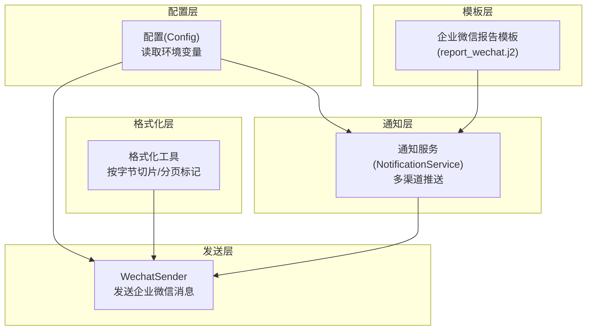
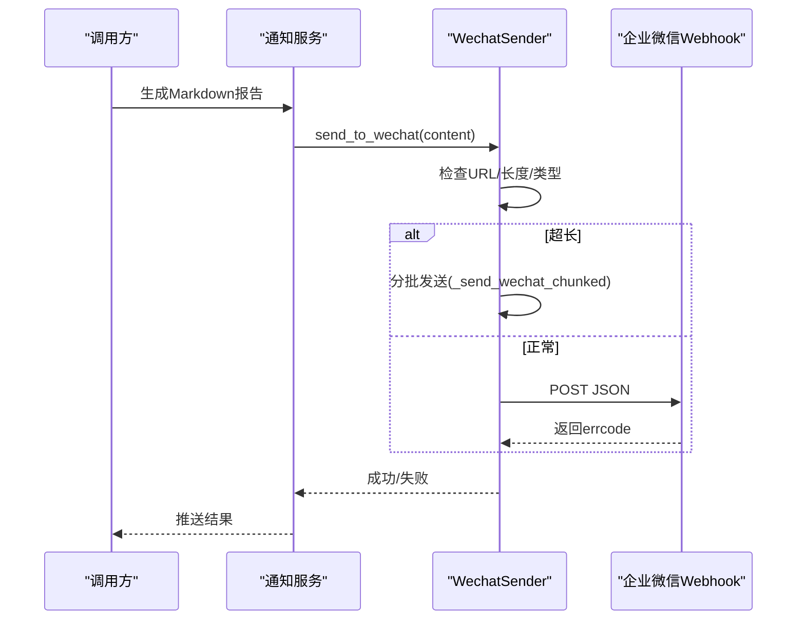
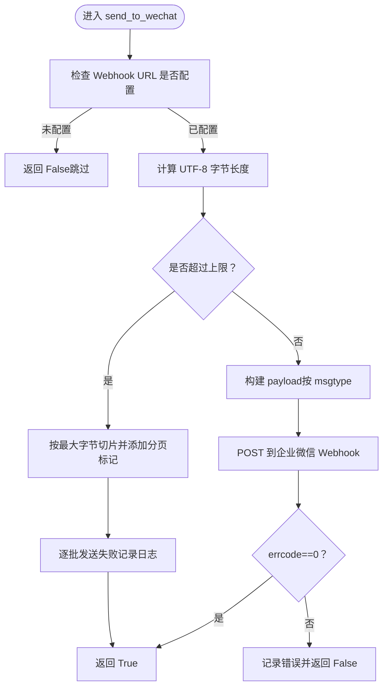
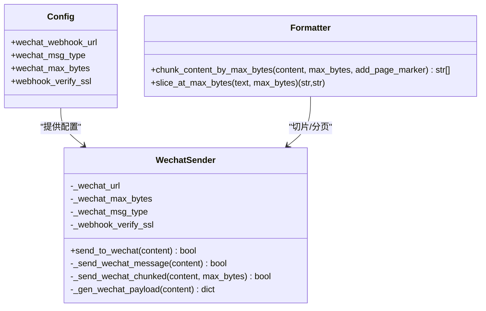
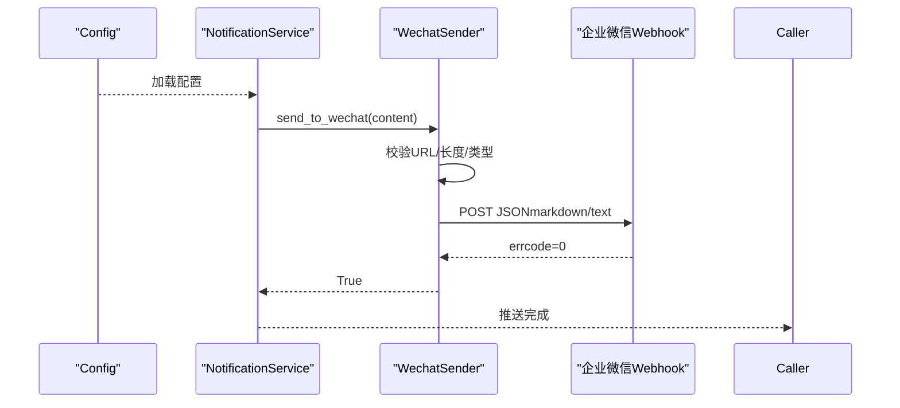

# 企业微信通知

<cite>
**本文档引用的文件**
- [src/notification_sender/wechat_sender.py](file://src/notification_sender/wechat_sender.py)
- [src/config.py](file://src/config.py)
- [src/formatters.py](file://src/formatters.py)
- [templates/report_wechat.j2](file://templates/report_wechat.j2)
- [tests/test_notification_sender.py](file://tests/test_notification_sender.py)
- [docs/full-guide.md](file://docs/full-guide.md)
- [bot/platforms/base.py](file://bot/platforms/base.py)
- [src/notification.py](file://src/notification.py)
</cite>

## 目录
1. [简介](#简介)
2. [项目结构](#项目结构)
3. [核心组件](#核心组件)
4. [架构总览](#架构总览)
5. [组件详解](#组件详解)
6. [依赖关系分析](#依赖关系分析)
7. [性能与限制](#性能与限制)
8. [调试与故障排除](#调试与故障排除)
9. [结论](#结论)
10. [附录](#附录)

## 简介
本章节面向企业微信 Webhook 通知渠道，提供从配置到集成、从消息类型到长度限制、从内容截断到调试排错的完整技术文档。重点覆盖以下方面：
- 企业微信 Webhook 的配置方法与集成原理
- 企业微信消息类型设置（markdown/text）
- Webhook URL 获取方式与消息格式要求
- 企业微信消息长度限制（4000字节）与内容截断处理机制
- 配置示例、消息模板格式与常见问题解决方案
- 企业微信机器人权限配置、群聊选择与消息发送限制
- 调试技巧与故障排除指南

## 项目结构
企业微信通知能力由“配置加载”“消息格式化”“发送器”“通知服务”等模块协同实现，核心文件如下：
- 配置加载：从环境变量读取 Webhook URL、消息类型、长度限制等
- 消息格式化：提供按字节切片与分页标记的通用工具
- 发送器：封装企业微信 Webhook 的请求与错误处理
- 通知服务：汇总渠道、触发多渠道并发推送
- 模板：提供企业微信专用的报告模板

图表来源
- [src/config.py](file://src/config.py)
- [src/formatters.py](file://src/formatters.py)
- [src/notification_sender/wechat_sender.py](file://src/notification_sender/wechat_sender.py)
- [src/notification.py](file://src/notification.py)
- [templates/report_wechat.j2](file://templates/report_wechat.j2)

章节来源
- [src/config.py](file://src/config.py)
- [src/formatters.py](file://src/formatters.py)
- [src/notification_sender/wechat_sender.py](file://src/notification_sender/wechat_sender.py)
- [src/notification.py](file://src/notification.py)
- [templates/report_wechat.j2](file://templates/report_wechat.j2)

## 核心组件
- 配置加载（Config）
  - 读取 WECHAT_WEBHOOK_URL、WECHAT_MSG_TYPE、WECHAT_MAX_BYTES、WEBHOOK_VERIFY_SSL 等环境变量
  - 提供默认值与类型安全的访问接口
- 消息格式化（formatters）
  - 提供按最大字节数切片、智能分段、分页标记等能力
- 发送器（WechatSender）
  - 构造企业微信 Webhook 消息体（markdown/text/image）
  - 处理超长内容自动分批发送
  - 图片消息限制与错误处理
- 通知服务（NotificationService）
  - 汇总渠道、检测可用通知渠道
  - 触发多渠道并发推送（包括企业微信）

章节来源
- [src/config.py](file://src/config.py)
- [src/formatters.py](file://src/formatters.py)
- [src/notification_sender/wechat_sender.py](file://src/notification_sender/wechat_sender.py)
- [src/notification.py](file://src/notification.py)

## 架构总览
企业微信通知的端到端流程如下：
- 业务侧生成 Markdown 报告
- 通知服务检测已配置渠道并触发推送
- WechatSender 根据消息类型构造 payload，并按长度限制进行分批
- 通过 Webhook URL 发送到企业微信
- 返回结果并记录日志

图表来源
- [src/notification.py](file://src/notification.py)
- [src/notification_sender/wechat_sender.py](file://src/notification_sender/wechat_sender.py)

## 组件详解

### 企业微信 Webhook 配置与集成
- 配置项
  - WECHAT_WEBHOOK_URL：企业微信 Webhook URL（必填）
  - WECHAT_MSG_TYPE：消息类型，支持 markdown/text（默认 markdown）
  - WECHAT_MAX_BYTES：消息最大字节数（默认 4000；text 类型默认 2000）
  - WEBHOOK_VERIFY_SSL：是否校验证书（默认 true）
- 集成要点
  - 通过 Config 从环境变量加载配置
  - NotificationService 检测渠道并触发推送
  - WechatSender 负责具体发送与错误处理

章节来源
- [src/config.py](file://src/config.py)
- [src/notification.py](file://src/notification.py)
- [docs/full-guide.md](file://docs/full-guide.md)

### 消息类型与消息格式
- 支持的消息类型
  - markdown：在企业微信中解析 Markdown 格式
  - text：发送纯文本
- 消息体结构
  - markdown 类型：包含 msgtype 与 markdown.content
  - text 类型：包含 msgtype 与 text.content
  - image 类型：包含 msgtype、image.base64、image.md5
- 企业微信限制
  - 文本类型限制约 2048 字节（内部实现按 2000 字节预留）
  - Markdown 类型限制约 4096 字节（内部实现按 4000 字节预留）
  - 图片类型限制约 2MB（base64 payload）

章节来源
- [src/notification_sender/wechat_sender.py](file://src/notification_sender/wechat_sender.py)
- [src/config.py](file://src/config.py)

### 长度限制与内容截断机制
- 长度检测
  - 以 UTF-8 字节为单位计算长度
  - 根据消息类型动态调整上限（text 类型上限不超过 2000）
- 截断策略
  - 使用按字节切片，避免在多字节字符中间截断
  - 智能按分隔符（如分隔线、标题）分段，保证分页自然
  - 可选添加分页标记（如 “📄 X/Y”），便于阅读
- 分批发送
  - 超长内容自动拆分为若干批次
  - 每批独立发送，失败不影响其他批次
  - 相邻批次之间有短暂延迟，降低频率压力

图表来源
- [src/notification_sender/wechat_sender.py](file://src/notification_sender/wechat_sender.py)
- [src/formatters.py](file://src/formatters.py)

章节来源
- [src/notification_sender/wechat_sender.py](file://src/notification_sender/wechat_sender.py)
- [src/formatters.py](file://src/formatters.py)

### 图片消息发送与限制
- 图片限制
  - base64 payload 不得超过 2MB
  - 超限直接拒绝发送，不发起网络请求
- 发送流程
  - 对图片进行 base64 编码与 MD5 计算
  - 构造 image 类型 payload 并发送
  - 校验 errcode 与 HTTP 状态码

章节来源
- [src/notification_sender/wechat_sender.py](file://src/notification_sender/wechat_sender.py)

### Webhook URL 获取方式与权限配置
- 获取方式
  - 在企业微信应用或群机器人中创建机器人，复制 Webhook URL
- 权限与群聊选择
  - 机器人权限需具备“发送消息”权限
  - Webhook URL 指向目标群聊，消息将发送到该群
- 常见限制
  - 企业微信对消息长度、频率与内容格式有限制
  - 建议开启 SSL 校验（WEBHOOK_VERIFY_SSL=true）

章节来源
- [docs/full-guide.md](file://docs/full-guide.md)
- [src/config.py](file://src/config.py)

### 消息模板与格式建议
- 模板来源
  - 企业微信专用模板：report_wechat.j2
- 格式建议
  - 使用标题、分隔线、列表等 Markdown 结构，提升可读性
  - 控制每段长度，避免超限导致截断
  - 适当使用分页标记，便于阅读长报告

章节来源
- [templates/report_wechat.j2](file://templates/report_wechat.j2)

### 配置示例与最佳实践
- 环境变量示例
  - WECHAT_WEBHOOK_URL：企业微信 Webhook URL
  - WECHAT_MSG_TYPE：markdown 或 text
  - WECHAT_MAX_BYTES：按需调整（默认 4000；text 类型建议 2000）
  - WEBHOOK_VERIFY_SSL：true（默认）
- 最佳实践
  - 优先使用 markdown 类型以获得更好的展示效果
  - 对长报告启用分页标记，提升可读性
  - 在高并发场景下注意批次间隔，避免触发频率限制

章节来源
- [src/config.py](file://src/config.py)
- [docs/full-guide.md](file://docs/full-guide.md)

## 依赖关系分析
WechatSender 与其他模块的依赖关系如下：

图表来源
- [src/config.py](file://src/config.py)
- [src/notification_sender/wechat_sender.py](file://src/notification_sender/wechat_sender.py)
- [src/formatters.py](file://src/formatters.py)

章节来源
- [src/config.py](file://src/config.py)
- [src/notification_sender/wechat_sender.py](file://src/notification_sender/wechat_sender.py)
- [src/formatters.py](file://src/formatters.py)

## 性能与限制
- 长度限制
  - text 类型上限：约 2048 字节（实现按 2000 字节预留）
  - markdown 类型上限：约 4096 字节（实现按 4000 字节预留）
- 图片限制
  - base64 payload 不超过 2MB
- 发送策略
  - 超长内容自动分批发送，相邻批次间有短暂延迟
  - 分页标记与智能分段减少截断带来的阅读障碍
- 网络与证书
  - 默认启用 SSL 校验，确保传输安全
  - 可通过 WEBHOOK_VERIFY_SSL 关闭校验（仅限可信内网）

章节来源
- [src/notification_sender/wechat_sender.py](file://src/notification_sender/wechat_sender.py)
- [src/config.py](file://src/config.py)

## 调试与故障排除
- 常见问题
  - Webhook URL 未配置：发送直接返回失败并记录警告
  - 证书校验失败：检查 WEBHOOK_VERIFY_SSL 与网络可达性
  - 消息超长：启用分页标记与智能分段，确认 WECHAT_MAX_BYTES 设置合理
  - 图片过大：图片超过 2MB 将被拒绝，建议改用文本或压缩
- 调试步骤
  - 检查环境变量是否正确加载（WECHAT_WEBHOOK_URL、WECHAT_MSG_TYPE、WECHAT_MAX_BYTES、WEBHOOK_VERIFY_SSL）
  - 查看日志输出，关注“发送失败/错误码/HTTP 状态码”
  - 使用单元测试验证 payload 构造与分批行为
- 相关测试
  - WechatSender 的 payload 构造与分批发送逻辑
  - 图片超限拒绝发送的行为

章节来源
- [tests/test_notification_sender.py](file://tests/test_notification_sender.py)
- [src/notification_sender/wechat_sender.py](file://src/notification_sender/wechat_sender.py)

## 结论
企业微信通知渠道通过清晰的配置、严谨的长度控制与智能分段机制，实现了稳定可靠的长文本推送。结合模板与日志，可在生产环境中高效落地。建议优先使用 markdown 类型与分页标记，合理设置长度阈值，并保持 SSL 校验开启以确保安全。

## 附录

### 企业微信 Webhook 集成流程（代码级）

图表来源
- [src/config.py](file://src/config.py)
- [src/notification.py](file://src/notification.py)
- [src/notification_sender/wechat_sender.py](file://src/notification_sender/wechat_sender.py)