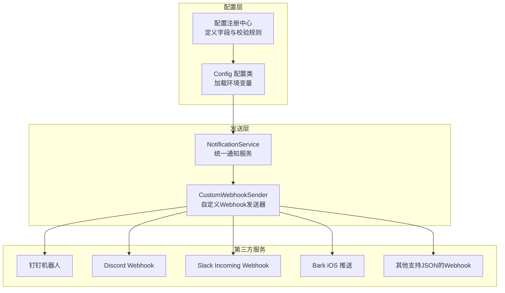
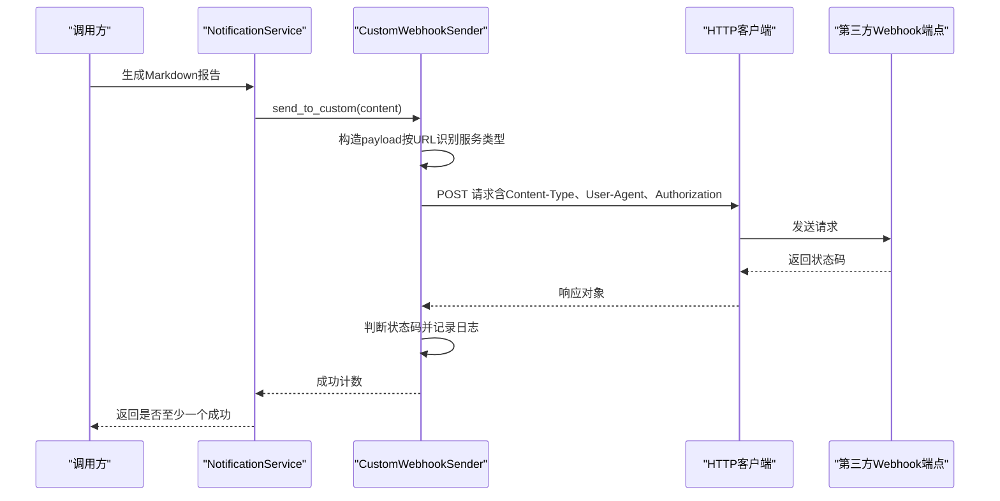
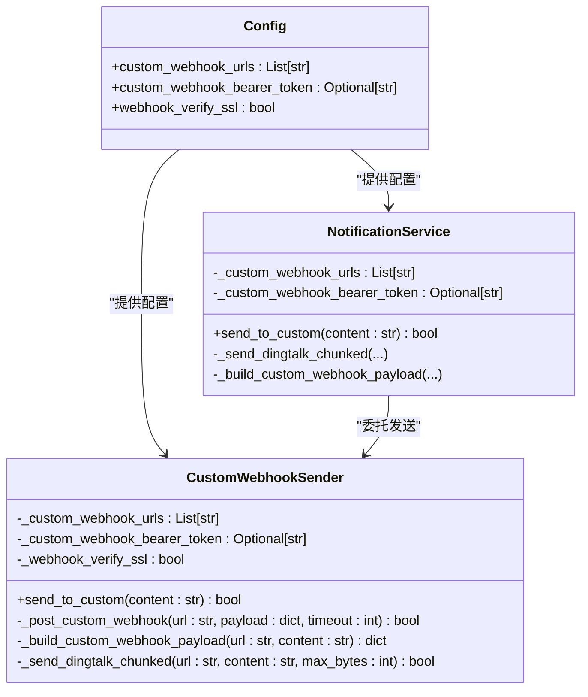
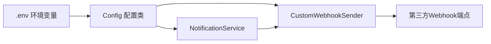

# 自定义Webhook通知

<cite>
**本文引用的文件**
- [src/notification.py](file://src/notification.py)
- [src/notification_sender/custom_webhook_sender.py](file://src/notification_sender/custom_webhook_sender.py)
- [src/config.py](file://src/config.py)
- [src/core/config_registry.py](file://src/core/config_registry.py)
- [docs/full-guide.md](file://docs/full-guide.md)
- [docs/full-guide_EN.md](file://docs/full-guide_EN.md)
</cite>

## 目录
1. [简介](#简介)
2. [项目结构](#项目结构)
3. [核心组件](#核心组件)
4. [架构总览](#架构总览)
5. [详细组件分析](#详细组件分析)
6. [依赖关系分析](#依赖关系分析)
7. [性能考量](#性能考量)
8. [故障排查指南](#故障排查指南)
9. [结论](#结论)
10. [附录](#附录)

## 简介
本文档面向“自定义Webhook通知渠道”的技术实现与使用，涵盖配置方法、通用集成原理、Bearer Token认证、请求头设置、消息格式要求、HTTP方法选择与响应处理机制，并提供配置示例、认证方式与消息模板定制建议、限制与错误处理及重试机制说明，以及第三方服务集成的最佳实践。

## 项目结构
自定义Webhook通知由以下模块协同实现：
- 配置层：负责从环境变量加载并暴露通知相关配置（URL列表、Bearer Token、SSL校验等）
- 发送层：负责将Markdown格式的分析报告通过HTTP POST发送到各Webhook端点
- 文档层：提供中文与英文的配置说明与最佳实践

图表来源
- [src/config.py:100-108](file://src/config.py#L100-L108)
- [src/core/config_registry.py:767-808](file://src/core/config_registry.py#L767-L808)
- [src/notification.py:175-184](file://src/notification.py#L175-L184)
- [src/notification_sender/custom_webhook_sender.py:19-31](file://src/notification_sender/custom_webhook_sender.py#L19-L31)

章节来源
- [src/config.py:100-108](file://src/config.py#L100-L108)
- [src/core/config_registry.py:767-808](file://src/core/config_registry.py#L767-L808)
- [src/notification.py:175-184](file://src/notification.py#L175-L184)
- [src/notification_sender/custom_webhook_sender.py:19-31](file://src/notification_sender/custom_webhook_sender.py#L19-L31)

## 核心组件
- 配置类 Config：从环境变量加载自定义Webhook URL列表、Bearer Token、SSL校验开关等
- 自定义Webhook发送器 CustomWebhookSender：负责构造payload、发送HTTP请求、处理响应
- 通知服务 NotificationService：统一调度各渠道，包括自定义Webhook

章节来源
- [src/config.py:100-108](file://src/config.py#L100-L108)
- [src/notification_sender/custom_webhook_sender.py:19-31](file://src/notification_sender/custom_webhook_sender.py#L19-L31)
- [src/notification.py:175-184](file://src/notification.py#L175-L184)

## 架构总览
自定义Webhook通知的发送流程如下：
- 从配置中读取URL列表与Bearer Token
- 将Markdown内容按服务类型构造payload
- 通过HTTP POST发送，携带必要的请求头（Content-Type、User-Agent、Authorization）
- 根据响应状态码判定成功与否，并记录日志

图表来源
- [src/notification.py:2305-2359](file://src/notification.py#L2305-L2359)
- [src/notification_sender/custom_webhook_sender.py:32-86](file://src/notification_sender/custom_webhook_sender.py#L32-L86)
- [src/notification_sender/custom_webhook_sender.py:134-148](file://src/notification_sender/custom_webhook_sender.py#L134-L148)

## 详细组件分析

### 配置与注册
- 自定义Webhook URL列表：支持多个URL，逗号分隔
- Bearer Token：用于需要认证的Webhook
- SSL校验：HTTPS证书校验开关，默认开启，支持自签名证书场景（仅限可信内网）

章节来源
- [src/config.py:100-108](file://src/config.py#L100-L108)
- [src/core/config_registry.py:767-808](file://src/core/config_registry.py#L767-L808)
- [docs/full-guide.md:203-205](file://docs/full-guide.md#L203-L205)
- [docs/full-guide_EN.md:188-190](file://docs/full-guide_EN.md#L188-L190)

### 发送器实现要点
- URL识别与payload构造：根据URL关键字自动识别服务类型并构造对应payload
  - 钉钉机器人：使用markdown类型
  - Discord Webhook：限制字符数并构造content
  - Slack Incoming Webhook：使用text字段
  - Bark：使用title/body/group
  - 通用：提供text/content/message/body键
- Bearer Token认证：在Authorization头中附加Bearer Token
- 请求头：统一设置Content-Type与User-Agent
- 超时与SSL：默认超时30秒，SSL校验可配置
- 错误处理：记录HTTP状态码与响应内容，异常捕获并记录

章节来源
- [src/notification_sender/custom_webhook_sender.py:134-148](file://src/notification_sender/custom_webhook_sender.py#L134-L148)
- [src/notification_sender/custom_webhook_sender.py:150-197](file://src/notification_sender/custom_webhook_sender.py#L150-L197)
- [src/notification_sender/custom_webhook_sender.py:199-235](file://src/notification_sender/custom_webhook_sender.py#L199-L235)

### 通知服务集成
- 统一调度：通知服务检测所有已配置渠道，包括自定义Webhook
- 分批发送：针对钉钉机器人，按字节限制进行分批发送
- 成功计数：统计成功发送的Webhook数量并记录日志

章节来源
- [src/notification.py:175-184](file://src/notification.py#L175-L184)
- [src/notification.py:2305-2359](file://src/notification.py#L2305-L2359)
- [src/notification.py:2447-2483](file://src/notification.py#L2447-L2483)

### 类关系图

图表来源
- [src/config.py:100-108](file://src/config.py#L100-L108)
- [src/notification_sender/custom_webhook_sender.py:19-31](file://src/notification_sender/custom_webhook_sender.py#L19-L31)
- [src/notification.py:175-184](file://src/notification.py#L175-L184)

## 依赖关系分析
- 配置依赖：自定义Webhook URL列表与Bearer Token来自Config
- 发送依赖：CustomWebhookSender依赖Config提供的URL列表与认证信息
- 通知服务依赖：NotificationService依赖Config与CustomWebhookSender

图表来源
- [src/config.py:371-372](file://src/config.py#L371-L372)
- [src/notification_sender/custom_webhook_sender.py:28-30](file://src/notification_sender/custom_webhook_sender.py#L28-L30)
- [src/notification.py:176-177](file://src/notification.py#L176-L177)

章节来源
- [src/config.py:371-372](file://src/config.py#L371-L372)
- [src/notification_sender/custom_webhook_sender.py:28-30](file://src/notification_sender/custom_webhook_sender.py#L28-L30)
- [src/notification.py:176-177](file://src/notification.py#L176-L177)

## 性能考量
- 并发与限流：系统默认并发较低以避免API限流，自定义Webhook发送遵循相同原则
- 分批发送：钉钉机器人按字节限制进行分批，避免单次请求过大导致失败
- 超时控制：默认超时30秒，可根据网络环境调整
- SSL校验：默认开启，确保安全性；自签名证书场景可按文档说明谨慎关闭

章节来源
- [src/notification.py:2447-2483](file://src/notification.py#L2447-L2483)
- [src/notification_sender/custom_webhook_sender.py:199-235](file://src/notification_sender/custom_webhook_sender.py#L199-L235)
- [src/config.py:190-194](file://src/config.py#L190-L194)

## 故障排查指南
- 未配置URL：若未配置自定义Webhook URL，将跳过推送并记录警告
- 认证失败：Bearer Token错误会导致HTTP 401/403，需检查Token有效性
- SSL证书问题：HTTPS证书校验失败时，可按文档说明在可信内网场景下关闭校验
- 请求超时：网络不稳定或目标端点响应慢可能导致超时，可适当增加超时时间
- 钉钉字节限制：超过字节限制会分批发送，确保内容结构合理以减少截断
- 响应内容：发送失败时会记录HTTP状态码与响应内容片段，便于定位问题

章节来源
- [src/notification.py:2325-2327](file://src/notification.py#L2325-L2327)
- [src/notification_sender/custom_webhook_sender.py:144-147](file://src/notification_sender/custom_webhook_sender.py#L144-L147)
- [src/notification_sender/custom_webhook_sender.py:114-117](file://src/notification_sender/custom_webhook_sender.py#L114-L117)
- [docs/full-guide.md](file://docs/full-guide.md#L205)

## 结论
自定义Webhook通知通过统一的配置与发送机制，实现了对多种第三方服务的通用集成。其核心特性包括：
- 支持多URL列表配置与Bearer Token认证
- 自动识别服务类型并构造payload
- 统一的请求头与超时控制
- 针对钉钉的分批发送与字节限制处理
- 完善的日志与错误记录

在生产环境中，建议：
- 优先使用Bearer Token认证
- 启用SSL校验以保障传输安全
- 合理规划Markdown内容结构，避免超长文本导致截断
- 在可信内网场景下谨慎使用自签名证书

## 附录

### 配置示例与字段说明
- 自定义Webhook URL列表：支持多个URL，逗号分隔
- Bearer Token：用于需要认证的Webhook
- SSL校验：HTTPS证书校验开关，默认开启

章节来源
- [docs/full-guide.md:203-205](file://docs/full-guide.md#L203-L205)
- [docs/full-guide_EN.md:188-190](file://docs/full-guide_EN.md#L188-L190)
- [src/core/config_registry.py:767-808](file://src/core/config_registry.py#L767-L808)

### 消息格式与服务适配
- 钉钉机器人：使用markdown类型
- Discord Webhook：限制字符数并构造content
- Slack Incoming Webhook：使用text字段
- Bark：使用title/body/group
- 通用：提供text/content/message/body键

章节来源
- [src/notification_sender/custom_webhook_sender.py:150-197](file://src/notification_sender/custom_webhook_sender.py#L150-L197)
- [src/notification.py:2485-2532](file://src/notification.py#L2485-L2532)

### HTTP方法与请求头
- 方法：HTTP POST
- Content-Type：application/json; charset=utf-8
- User-Agent：StockAnalysis/1.0
- Authorization：Bearer {token}（当配置Bearer Token时）

章节来源
- [src/notification_sender/custom_webhook_sender.py:134-142](file://src/notification_sender/custom_webhook_sender.py#L134-L142)

### 响应处理机制
- 成功：HTTP 200/204
- 失败：记录HTTP状态码与响应内容片段
- 异常：捕获异常并记录错误日志

章节来源
- [src/notification_sender/custom_webhook_sender.py:144-147](file://src/notification_sender/custom_webhook_sender.py#L144-L147)
- [src/notification_sender/custom_webhook_sender.py:114-117](file://src/notification_sender/custom_webhook_sender.py#L114-L117)

### 限制与最佳实践
- 钉钉字节限制：约20000字节，超限自动分批
- Discord字符限制：约2000字符，超限自动截断
- SSL校验：默认开启，自签名证书仅限可信内网
- 并发与限流：系统默认低并发，避免触发第三方限流

章节来源
- [src/notification.py:2447-2483](file://src/notification.py#L2447-L2483)
- [src/notification_sender/custom_webhook_sender.py:199-235](file://src/notification_sender/custom_webhook_sender.py#L199-L235)
- [docs/full-guide.md](file://docs/full-guide.md#L197)