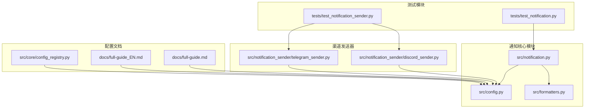
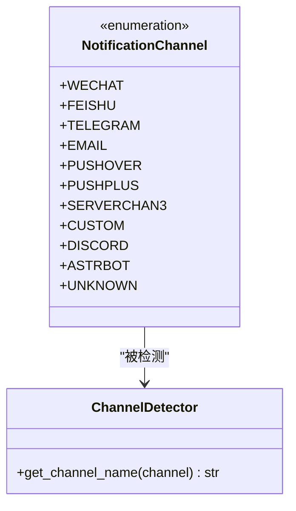
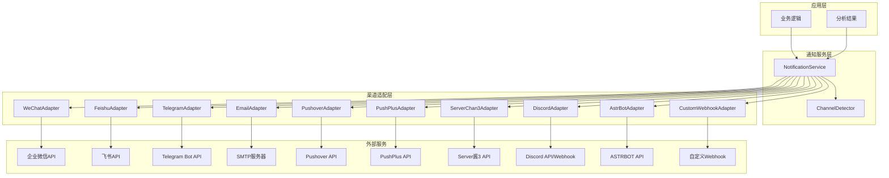
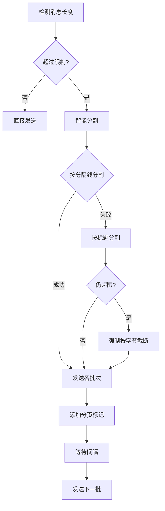
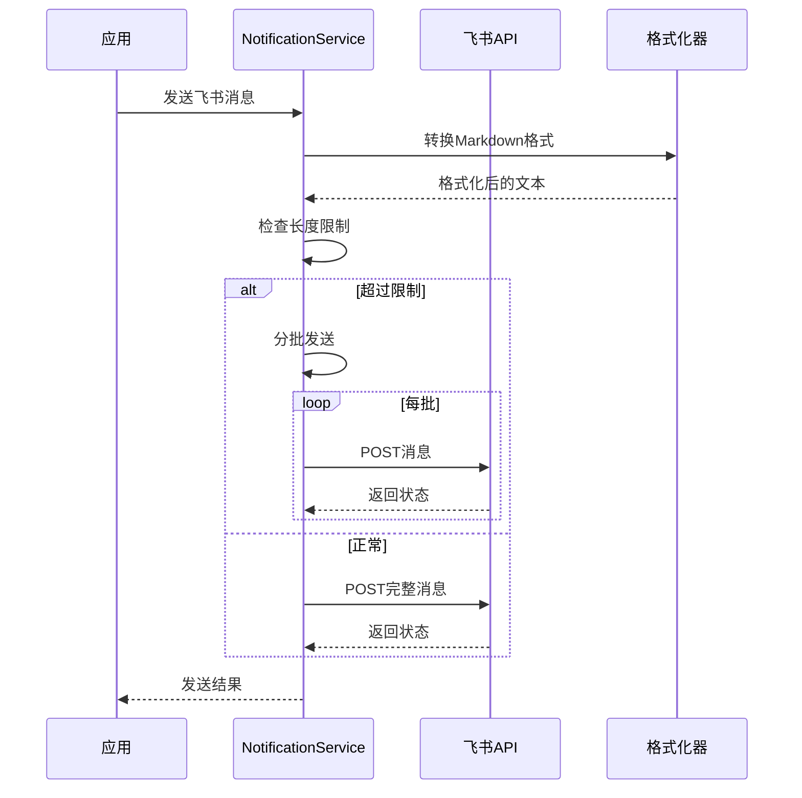
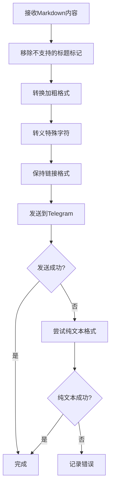
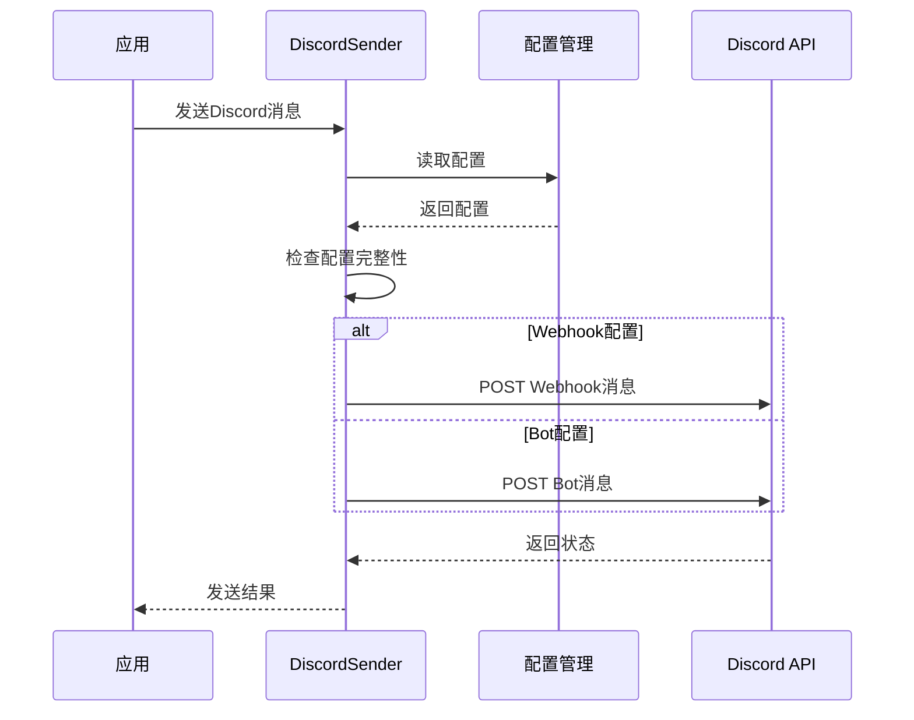
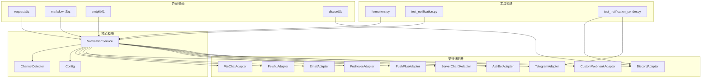

# 通知渠道管理

<cite>
**本文档引用的文件**
- [notification.py](file://src/notification.py)
- [config.py](file://src/config.py)
- [test_notification.py](file://tests/test_notification.py)
- [test_notification_sender.py](file://tests/test_notification_sender.py)
- [discord_sender.py](file://src/notification_sender/discord_sender.py)
- [telegram_sender.py](file://src/notification_sender/telegram_sender.py)
- [formatters.py](file://src/formatters.py)
- [full-guide.md](file://docs/full-guide.md)
- [full-guide_EN.md](file://docs/full-guide_EN.md)
- [config_registry.py](file://src/core/config_registry.py)
</cite>

## 目录
1. [简介](#简介)
2. [项目结构](#项目结构)
3. [核心组件](#核心组件)
4. [架构概览](#架构概览)
5. [详细组件分析](#详细组件分析)
6. [依赖分析](#依赖分析)
7. [性能考虑](#性能考虑)
8. [故障排除指南](#故障排除指南)
9. [结论](#结论)
10. [附录](#附录)

## 简介

通知渠道管理系统是A股自选股智能分析系统的核心组成部分，负责将分析结果通过多种渠道推送给用户。该系统支持10种不同的通知渠道，包括企业微信、飞书、Telegram、邮件、Pushover、PushPlus、Server酱3、Discord、ASTRBOT等，并提供了智能化的渠道检测机制和自动识别功能。

系统采用统一的通知服务架构，通过NotificationService类集中管理所有通知渠道，实现了配置驱动的渠道管理和自动化的消息路由。每个渠道都针对其特定的API规范进行了优化，包括消息格式转换、长度限制处理、错误恢复机制等。

## 项目结构

通知渠道管理相关的文件组织结构如下：



**图表来源**
- [notification.py:1-50](file://src/notification.py#L1-L50)
- [config.py:1-50](file://src/config.py#L1-L50)

**章节来源**
- [notification.py:1-100](file://src/notification.py#L1-L100)
- [config.py:1-100](file://src/config.py#L1-L100)

## 核心组件

### NotificationChannel枚举类

NotificationChannel枚举类定义了系统支持的所有通知渠道类型：



**图表来源**
- [notification.py:47-59](file://src/notification.py#L47-L59)
- [notification.py:87-110](file://src/notification.py#L87-L110)

系统支持的10种通知渠道各有其特点和适用场景：

1. **企业微信(WECHAT)**：适用于企业内部通知，支持Markdown和Text两种消息类型
2. **飞书(FEISHU)**：支持交互卡片和文本消息，提供丰富的消息格式
3. **Telegram(TELEGRAM)**：支持Markdown格式，具有良好的国际化支持
4. **邮件(EMAIL)**：自动识别SMTP服务器，支持HTML和纯文本双重格式
5. **Pushover(PUSHOVER)**：跨平台推送通知，支持iOS/Android/桌面端
6. **PushPlus(PUSHPLUS)**：国内推送服务，支持群发和个性化推送
7. **Server酱3(SERVERCHAN3)**：手机APP推送服务，使用SendKey认证
8. **Discord(DISCORD)**：支持Webhook和Bot两种接入方式
9. **ASTRBOT(ASTRBOT)**：支持自定义机器人协议
10. **自定义(Webhook)(CUSTOM)**：支持任意第三方Webhook服务

**章节来源**
- [notification.py:47-59](file://src/notification.py#L47-L59)
- [notification.py:87-110](file://src/notification.py#L87-L110)

### NotificationService主控制器

NotificationService是通知系统的核心控制器，负责：

- **渠道检测**：自动检测已配置的通知渠道
- **消息生成**：生成符合各渠道要求的格式化消息
- **消息路由**：将消息分发到所有已配置的渠道
- **错误处理**：提供完善的错误处理和恢复机制

**章节来源**
- [notification.py:113-206](file://src/notification.py#L113-L206)

## 架构概览

通知系统的整体架构采用分层设计，实现了高内聚、低耦合的模块化结构：



**图表来源**
- [notification.py:113-206](file://src/notification.py#L113-L206)
- [notification.py:207-254](file://src/notification.py#L207-L254)

## 详细组件分析

### 企业微信渠道

企业微信渠道支持两种消息类型：markdown和text。系统会根据配置自动选择合适的消息类型，并处理相应的长度限制。

#### 配置参数
- `wechat_webhook_url`：企业微信机器人Webhook URL
- `wechat_msg_type`：消息类型（markdown/text，默认markdown）
- `wechat_max_bytes`：消息最大字节数（默认4000）

#### 消息格式要求
- **Markdown类型**：支持完整的Markdown格式，适合复杂内容展示
- **Text类型**：纯文本格式，兼容性更好，适合简单内容

#### 长度限制处理
系统实现了智能分批发送机制，当消息超过限制时会自动分割：



**图表来源**
- [notification.py:1252-1360](file://src/notification.py#L1252-L1360)

**章节来源**
- [notification.py:1197-1472](file://src/notification.py#L1197-L1472)
- [notification.py:1473-1614](file://src/notification.py#L1473-L1614)

### 飞书渠道

飞书渠道支持交互卡片和文本消息两种格式，优先使用交互卡片以获得更好的视觉效果。

#### 配置参数
- `feishu_webhook_url`：飞书机器人Webhook URL
- `feishu_max_bytes`：消息最大字节数（默认20000字节）

#### 消息格式转换
系统会将标准Markdown转换为飞书支持的格式：



**图表来源**
- [notification.py:1473-1614](file://src/notification.py#L1473-L1614)

**章节来源**
- [notification.py:1473-1729](file://src/notification.py#L1473-L1729)

### Telegram渠道

Telegram渠道支持Markdown格式，具有良好的国际化支持和跨平台特性。

#### 配置参数
- `telegram_bot_token`：Telegram Bot Token
- `telegram_chat_id`：聊天ID
- `telegram_message_thread_id`：消息主题ID（用于群组话题）

#### 消息格式转换
系统会将标准Markdown转换为Telegram支持的格式：



**图表来源**
- [notification.py:2071-2094](file://src/notification.py#L2071-L2094)

**章节来源**
- [notification.py:1942-2094](file://src/notification.py#L1942-L2094)

### 邮件渠道

邮件渠道支持自动SMTP服务器识别和HTML/纯文本双重格式。

#### 配置参数
- `email_sender`：发件人邮箱
- `email_password`：邮箱授权码
- `email_receivers`：收件人列表
- `email_sender_name`：发件人显示名称

#### SMTP服务器自动识别
系统内置了主流邮箱服务商的SMTP配置：

| 邮箱服务商 | SMTP服务器 | 端口 | SSL/TLS |
|-----------|-----------|------|---------|
| QQ邮箱 | smtp.qq.com | 465 | SSL |
| 网易邮箱 | smtp.163.com/126.com | 465 | SSL |
| Gmail | smtp.gmail.com | 587 | TLS |
| Outlook | smtp-mail.outlook.com | 587 | TLS |
| 新浪邮箱 | smtp.sina.com | 465 | SSL |
| 搜狐邮箱 | smtp.sohu.com | 465 | SSL |
| 阿里云邮箱 | smtp.aliyun.com | 465 | SSL |
| 139邮箱 | smtp.139.com | 465 | SSL |

**章节来源**
- [notification.py:1731-1812](file://src/notification.py#L1731-L1812)
- [notification.py:62-84](file://src/notification.py#L62-L84)

### Pushover渠道

Pushover是一个跨平台的推送通知服务，支持iOS、Android和桌面端。

#### 配置参数
- `pushover_user_key`：用户Key
- `pushover_api_token`：应用API Token

#### 消息特性
- 支持最多1024字符的消息
- 支持HTML格式
- 支持优先级设置
- 支持多媒体附件

**章节来源**
- [notification.py:2095-2303](file://src/notification.py#L2095-L2303)

### PushPlus渠道

PushPlus是国内的推送服务，支持群发和个性化推送。

#### 配置参数
- `pushplus_token`：PushPlus Token
- `pushplus_topic`：群发主题代码

#### 消息特性
- 支持群发和一对一推送
- 支持多种消息格式
- 提供Web界面管理

**章节来源**
- [notification.py:2305-2380](file://src/notification.py#L2305-L2380)

### Server酱3渠道

Server酱3是手机APP推送服务，使用SendKey进行认证。

#### 配置参数
- `serverchan3_sendkey`：Server酱3 SendKey

#### 消息特性
- 手机APP推送
- 支持多种推送模板
- 提供Web管理界面

**章节来源**
- [notification.py:2305-2380](file://src/notification.py#L2305-L2380)

### Discord渠道

Discord渠道支持Webhook和Bot两种接入方式。

#### 配置参数
- `discord_webhook_url`：Discord Webhook URL
- `discord_bot_token`：Discord Bot Token
- `discord_main_channel_id`：Discord频道ID
- `discord_max_words`：Discord最大字符数限制（默认2000）

#### 发送机制
DiscordSender提供了专门的发送器，支持Webhook和Bot两种方式：



**图表来源**
- [discord_sender.py:18-57](file://src/notification_sender/discord_sender.py#L18-L57)

**章节来源**
- [discord_sender.py:18-57](file://src/notification_sender/discord_sender.py#L18-L57)

### ASTRBOT渠道

ASTRBOT是支持自定义机器人协议的通知渠道。

#### 配置参数
- `astrbot_url`：ASTRBOT服务URL
- `astrbot_token`：ASTRBOT访问令牌

**章节来源**
- [notification.py:252-271](file://src/notification.py#L252-L271)

### 自定义Webhook渠道

自定义Webhook渠道支持任意第三方Webhook服务。

#### 配置参数
- `custom_webhook_urls`：自定义Webhook URL列表
- `custom_webhook_bearer_token`：Bearer Token认证

#### 支持的服务
- 钉钉机器人
- Slack Incoming Webhook
- 自建通知服务
- 其他支持POST JSON的服务

**章节来源**
- [notification.py:2305-2380](file://src/notification.py#L2305-L2380)

## 依赖分析

通知系统的依赖关系呈现清晰的层次结构：



**图表来源**
- [notification.py:32-42](file://src/notification.py#L32-L42)
- [config.py:15-17](file://src/config.py#L15-L17)

### 组件耦合度分析

通知系统采用了低耦合的设计原则：

1. **渠道独立性**：每个渠道都有独立的适配器，相互之间不影响
2. **配置集中管理**：所有渠道配置都通过Config类统一管理
3. **格式化工具**：通过formatters模块提供统一的格式转换能力
4. **测试隔离**：每个渠道都有独立的测试模块

**章节来源**
- [notification.py:113-206](file://src/notification.py#L113-L206)
- [config.py:31-200](file://src/config.py#L31-L200)

## 性能考虑

通知系统在设计时充分考虑了性能优化：

### 并发处理
- **异步发送**：各渠道采用独立的发送流程，避免阻塞
- **批量处理**：支持多渠道同时发送，提高效率
- **连接池**：合理管理HTTP连接，减少连接开销

### 内存优化
- **流式处理**：长消息采用流式分批发送，避免内存溢出
- **智能截断**：按字节精确截断，确保不破坏多字节字符
- **缓存机制**：配置信息采用单例模式，避免重复加载

### 网络优化
- **超时控制**：为每个请求设置合理的超时时间
- **重试机制**：在网络异常时自动重试
- **限流处理**：避免频繁请求导致API限流

### 错误恢复
- **降级策略**：当某个渠道失败时不影响其他渠道
- **日志记录**：详细的错误日志便于问题排查
- **状态监控**：实时监控各渠道的可用性和成功率

## 故障排除指南

### 常见问题及解决方案

#### 1. 渠道配置问题

**问题**：通知渠道无法正常工作
**原因**：配置参数不正确或缺失
**解决方案**：
- 检查配置文件中的渠道参数
- 验证API密钥和Token的有效性
- 确认网络连接正常

#### 2. 消息格式问题

**问题**：消息格式不正确或显示异常
**原因**：不同渠道的消息格式要求不同
**解决方案**：
- 检查各渠道的消息格式转换
- 验证Markdown语法的正确性
- 确认特殊字符的转义处理

#### 3. 长度限制问题

**问题**：消息被截断或发送失败
**原因**：超过各渠道的长度限制
**解决方案**：
- 检查各渠道的长度限制配置
- 启用自动分批发送功能
- 优化消息内容结构

#### 4. 网络连接问题

**问题**：请求超时或连接失败
**原因**：网络环境或防火墙限制
**解决方案**：
- 检查代理设置
- 验证SSL证书
- 调整超时参数

### 调试技巧

#### 启用详细日志
```python
import logging
logging.basicConfig(level=logging.DEBUG)
```

#### 测试配置有效性
```python
from src.notification import NotificationService
service = NotificationService()
print("可用渠道:", service.get_available_channels())
```

#### 验证消息格式
```python
from src.notification import NotificationService
service = NotificationService()
# 生成测试消息
test_content = service.generate_daily_report(results)
print("消息长度:", len(test_content))
```

**章节来源**
- [test_notification.py:80-120](file://tests/test_notification.py#L80-L120)
- [test_notification_sender.py:51-85](file://tests/test_notification_sender.py#L51-L85)

## 结论

通知渠道管理系统通过精心设计的架构和完善的实现，为A股自选股智能分析系统提供了强大而灵活的通知能力。系统的主要优势包括：

1. **多渠道支持**：支持10种主流通知渠道，满足不同用户需求
2. **智能检测**：自动检测可用渠道，简化配置过程
3. **格式适配**：针对各渠道特点进行消息格式转换
4. **错误处理**：完善的错误处理和恢复机制
5. **性能优化**：高效的并发处理和资源管理

通过标准化的配置接口和模块化的架构设计，系统不仅易于使用和维护，还为未来的功能扩展奠定了坚实的基础。无论是个人用户还是企业用户，都能从中获得稳定可靠的通知服务体验。

## 附录

### 配置参数完整列表

#### 企业微信配置
- `WECHAT_WEBHOOK_URL`：企业微信Webhook URL
- `WECHAT_MSG_TYPE`：消息类型（markdown/text）
- `WECHAT_MAX_BYTES`：消息最大字节数

#### 飞书配置
- `FEISHU_WEBHOOK_URL`：飞书Webhook URL
- `FEISHU_MAX_BYTES`：消息最大字节数

#### Telegram配置
- `TELEGRAM_BOT_TOKEN`：Telegram Bot Token
- `TELEGRAM_CHAT_ID`：聊天ID
- `TELEGRAM_MESSAGE_THREAD_ID`：消息主题ID

#### 邮件配置
- `EMAIL_SENDER`：发件人邮箱
- `EMAIL_PASSWORD`：邮箱授权码
- `EMAIL_RECEIVERS`：收件人列表
- `EMAIL_SENDER_NAME`：发件人显示名称

#### Pushover配置
- `PUSHOVER_USER_KEY`：用户Key
- `PUSHOVER_API_TOKEN`：API Token

#### PushPlus配置
- `PUSHPLUS_TOKEN`：PushPlus Token
- `PUSHPLUS_TOPIC`：群发主题

#### Server酱3配置
- `SERVERCHAN3_SENDKEY`：SendKey

#### Discord配置
- `DISCORD_WEBHOOK_URL`：Webhook URL
- `DISCORD_BOT_TOKEN`：Bot Token
- `DISCORD_MAIN_CHANNEL_ID`：频道ID
- `DISCORD_MAX_WORDS`：最大字符数限制

#### 自定义Webhook配置
- `CUSTOM_WEBHOOK_URLS`：Webhook URL列表
- `CUSTOM_WEBHOOK_BEARER_TOKEN`：Bearer Token

**章节来源**
- [full-guide.md:185-200](file://docs/full-guide.md#L185-L200)
- [full-guide_EN.md:172-194](file://docs/full-guide_EN.md#L172-L194)
- [config_registry.py:1013-1054](file://src/core/config_registry.py#L1013-L1054)