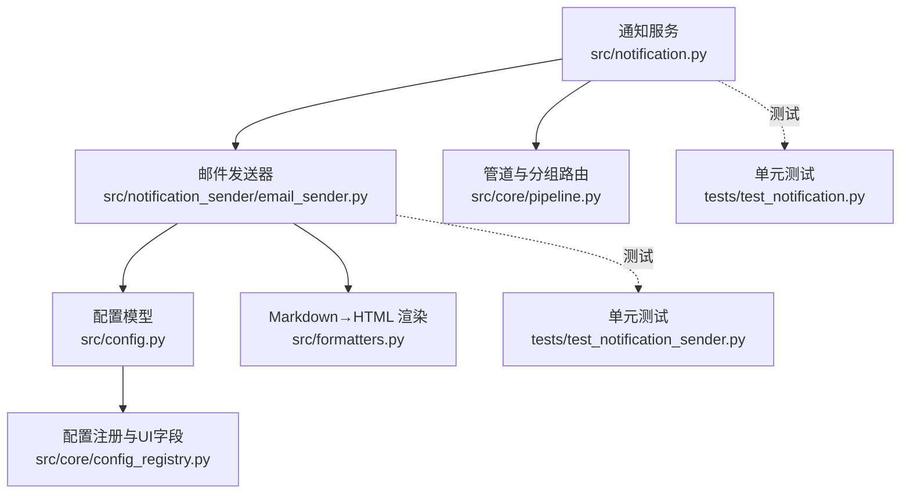
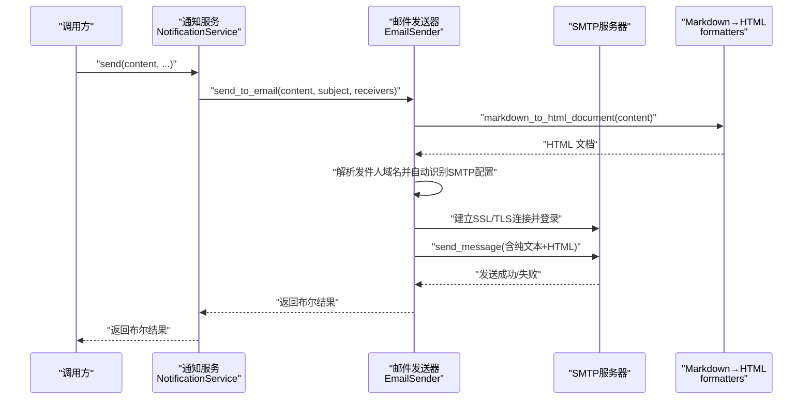
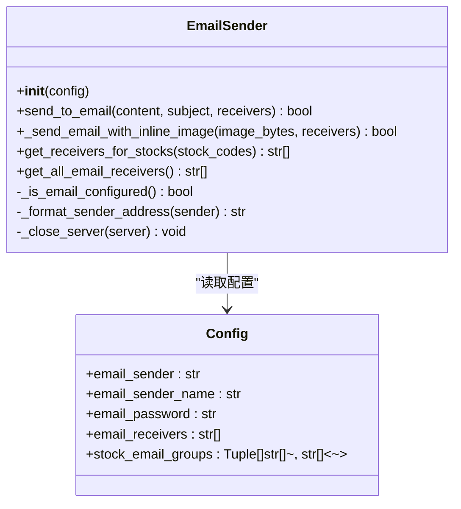
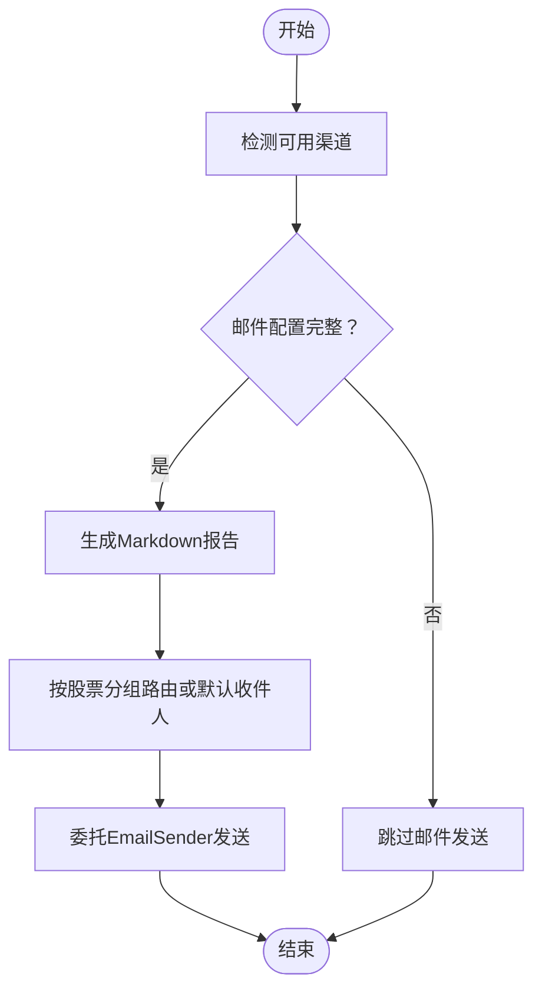
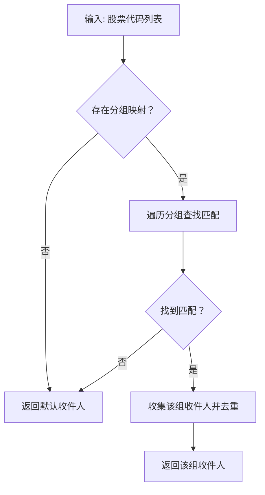
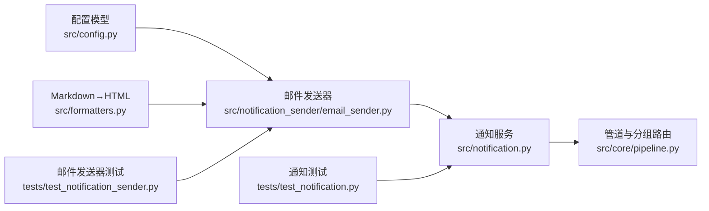

# 邮件通知

<cite>
**本文引用的文件**
- [src/notification.py](file://src/notification.py)
- [src/notification_sender/email_sender.py](file://src/notification_sender/email_sender.py)
- [src/config.py](file://src/config.py)
- [src/formatters.py](file://src/formatters.py)
- [tests/test_notification.py](file://tests/test_notification.py)
- [tests/test_notification_sender.py](file://tests/test_notification_sender.py)
- [src/core/pipeline.py](file://src/core/pipeline.py)
- [src/core/config_registry.py](file://src/core/config_registry.py)
</cite>

## 目录
1. [简介](#简介)
2. [项目结构](#项目结构)
3. [核心组件](#核心组件)
4. [架构总览](#架构总览)
5. [详细组件分析](#详细组件分析)
6. [依赖关系分析](#依赖关系分析)
7. [性能考量](#性能考量)
8. [故障排查指南](#故障排查指南)
9. [结论](#结论)
10. [附录](#附录)

## 简介
本技术文档聚焦于“邮件通知”渠道，系统性阐述 SMTP 服务器配置、邮件发送机制、认证与加密、发件人设置、收件人管理、主题格式、以及与系统其他模块的集成方式。文档还覆盖了对主流邮箱服务商（QQ邮箱、网易邮箱、Gmail、Outlook 等）的 SMTP 配置与自动识别能力，并给出常见问题的排查建议与最佳实践。

## 项目结构
邮件通知相关代码主要分布在以下模块：
- 通知服务与渠道检测：src/notification.py
- 邮件发送实现：src/notification_sender/email_sender.py
- 配置模型与环境变量解析：src/config.py
- Markdown 到 HTML 的邮件正文渲染：src/formatters.py
- 管道与分组路由：src/core/pipeline.py
- UI 配置注册与字段描述：src/core/config_registry.py
- 单元测试：tests/test_notification.py、tests/test_notification_sender.py

图表来源
- [src/notification.py:113-206](file://src/notification.py#L113-L206)
- [src/notification_sender/email_sender.py:50-272](file://src/notification_sender/email_sender.py#L50-L272)
- [src/config.py:85-100](file://src/config.py#L85-L100)
- [src/formatters.py:98-200](file://src/formatters.py#L98-L200)
- [src/core/pipeline.py:1375-1416](file://src/core/pipeline.py#L1375-L1416)
- [src/core/config_registry.py:915-957](file://src/core/config_registry.py#L915-L957)
- [tests/test_notification.py:350-396](file://tests/test_notification.py#L350-L396)
- [tests/test_notification_sender.py:183-219](file://tests/test_notification_sender.py#L183-L219)

章节来源
- [src/notification.py:113-206](file://src/notification.py#L113-L206)
- [src/notification_sender/email_sender.py:50-272](file://src/notification_sender/email_sender.py#L50-L272)
- [src/config.py:85-100](file://src/config.py#L85-L100)
- [src/formatters.py:98-200](file://src/formatters.py#L98-L200)
- [src/core/pipeline.py:1375-1416](file://src/core/pipeline.py#L1375-L1416)
- [src/core/config_registry.py:915-957](file://src/core/config_registry.py#L915-L957)
- [tests/test_notification.py:350-396](file://tests/test_notification.py#L350-L396)
- [tests/test_notification_sender.py:183-219](file://tests/test_notification_sender.py#L183-L219)

## 核心组件
- 通知服务 NotificationService：负责检测可用渠道（包括邮件）、聚合内容并通过各渠道发送；对邮件渠道的可用性由配置决定。
- 邮件发送器 EmailSender：封装 SMTP 发送逻辑，支持自动识别 SMTP 服务器、SSL/TLS 加密、主题与正文构建、收件人路由与图片内联发送。
- 配置模型 Config：定义邮件相关字段（发件人邮箱、发件人名称、授权码、收件人列表、股票分组邮件映射等），并从环境变量加载。
- Markdown 渲染：将 Markdown 内容转换为 HTML，用于邮件 HTML 正文与图片内联场景。
- 管道与分组路由：根据股票代码将邮件路由到对应的收件人组，支持按组聚合后再发送或按图片内联发送。

章节来源
- [src/notification.py:47-60](file://src/notification.py#L47-L60)
- [src/notification.py:113-206](file://src/notification.py#L113-L206)
- [src/notification_sender/email_sender.py:50-272](file://src/notification_sender/email_sender.py#L50-L272)
- [src/config.py:85-100](file://src/config.py#L85-L100)
- [src/formatters.py:98-200](file://src/formatters.py#L98-L200)
- [src/core/pipeline.py:1375-1416](file://src/core/pipeline.py#L1375-L1416)

## 架构总览
邮件通知在系统中的工作流如下：
- 通知服务根据配置检测邮件渠道是否可用；
- 生成 Markdown 报告；
- 通过邮件发送器自动识别 SMTP 服务器，建立 SSL 或 TLS 连接；
- 登录并发送邮件（支持纯文本与 HTML 双版本）；
- 对图片内联场景，构造内联图片并发送；
- 支持按股票代码分组路由到不同收件人集合。

图表来源
- [src/notification.py:113-206](file://src/notification.py#L113-L206)
- [src/notification_sender/email_sender.py:130-216](file://src/notification_sender/email_sender.py#L130-L216)
- [src/formatters.py:98-200](file://src/formatters.py#L98-L200)

章节来源
- [src/notification.py:113-206](file://src/notification.py#L113-L206)
- [src/notification_sender/email_sender.py:130-216](file://src/notification_sender/email_sender.py#L130-L216)
- [src/formatters.py:98-200](file://src/formatters.py#L98-L200)

## 详细组件分析

### 邮件发送器 EmailSender
- 自动识别 SMTP 配置：根据发件人邮箱域名匹配内置映射，若未知则尝试通用 smtp.<domain>。
- 加密与端口：内置映射区分 SSL（端口 465）与 TLS（端口 587）两类；未知域名默认 SSL。
- 主题与正文：默认主题包含日期；正文同时提供纯文本与 HTML 版本；图片内联场景构造 related multipart。
- 收件人管理：支持默认收件人列表；支持按股票代码分组路由；支持聚合所有组收件人。
- 错误处理：捕获认证错误、连接错误与通用异常；最终确保 SMTP 连接清理。

图表来源
- [src/notification_sender/email_sender.py:50-272](file://src/notification_sender/email_sender.py#L50-L272)
- [src/config.py:85-100](file://src/config.py#L85-L100)

章节来源
- [src/notification_sender/email_sender.py:50-272](file://src/notification_sender/email_sender.py#L50-L272)
- [src/config.py:85-100](file://src/config.py#L85-L100)

### 通知服务 NotificationService
- 渠道检测：仅依据配置存在性判断邮件可用；不解析 URL，简化为“配置即可用”。
- 报告生成：提供多种报告模板（日报、仪表盘等），统一输出 Markdown。
- 邮件发送：委托 EmailSender；支持按股票代码触发的分组路由；支持图片内联模式。

图表来源
- [src/notification.py:113-206](file://src/notification.py#L113-L206)
- [src/core/pipeline.py:1375-1416](file://src/core/pipeline.py#L1375-L1416)

章节来源
- [src/notification.py:113-206](file://src/notification.py#L113-L206)
- [src/core/pipeline.py:1375-1416](file://src/core/pipeline.py#L1375-L1416)

### 收件人管理与分组路由
- 默认收件人：当未配置股票分组映射或无匹配时，使用默认收件人列表。
- 分组映射：按股票代码匹配到对应收件人集合；支持多股票合并到同一组。
- 聚合收件人：支持聚合所有分组与默认收件人，用于市场复盘等全局广播场景。

图表来源
- [src/notification_sender/email_sender.py:71-106](file://src/notification_sender/email_sender.py#L71-L106)
- [tests/test_notification_sender.py:183-219](file://tests/test_notification_sender.py#L183-L219)

章节来源
- [src/notification_sender/email_sender.py:71-106](file://src/notification_sender/email_sender.py#L71-L106)
- [tests/test_notification_sender.py:183-219](file://tests/test_notification_sender.py#L183-L219)

### 邮件主题与正文格式
- 主题：默认包含日期，便于识别每日报告。
- 正文：同时提供纯文本与 HTML 两版本；HTML 由 Markdown 渲染生成，带基础样式。
- 图片内联：在图片内联模式下，HTML 中嵌入内联图片并设置 Content-ID，便于客户端直接显示。

章节来源
- [src/notification_sender/email_sender.py:130-216](file://src/notification_sender/email_sender.py#L130-L216)
- [src/formatters.py:98-200](file://src/formatters.py#L98-L200)

### SMTP 配置与自动识别
- 内置映射：涵盖 QQ 邮箱、网易邮箱、Gmail、Outlook、新浪、搜狐、阿里云、139 邮箱等。
- 未知域名：自动尝试 smtp.<domain>，默认 SSL（端口 465）。
- 加密方式：根据映射区分 SSL（SMTP_SSL）与 TLS（SMTP+starttls）。

章节来源
- [src/notification_sender/email_sender.py:25-47](file://src/notification_sender/email_sender.py#L25-L47)
- [src/notification.py:62-84](file://src/notification.py#L62-L84)

### 配置项与环境变量
- 邮件配置字段：发件人邮箱、发件人显示名、授权码、收件人列表、股票分组邮件映射。
- 环境变量加载：从系统环境变量与 .env 文件加载，支持多渠道配置。
- UI 注册：邮件相关字段在配置注册中定义，包含标题、描述、是否敏感、是否必填等。

章节来源
- [src/config.py:85-100](file://src/config.py#L85-L100)
- [src/config.py:360-366](file://src/config.py#L360-L366)
- [src/core/config_registry.py:915-957](file://src/core/config_registry.py#L915-L957)

## 依赖关系分析
- EmailSender 依赖 Config 提供的发件人、授权码、收件人与分组映射。
- NotificationService 依赖 EmailSender 完成邮件发送，并在管道中根据股票分组进行路由。
- Markdown 渲染依赖 formatters 提供的 HTML 转换能力。
- 测试覆盖：单元测试验证邮件发送流程、分组路由行为与错误处理路径。

图表来源
- [src/config.py:85-100](file://src/config.py#L85-L100)
- [src/notification_sender/email_sender.py:50-272](file://src/notification_sender/email_sender.py#L50-L272)
- [src/notification.py:113-206](file://src/notification.py#L113-L206)
- [src/core/pipeline.py:1375-1416](file://src/core/pipeline.py#L1375-L1416)
- [src/formatters.py:98-200](file://src/formatters.py#L98-L200)
- [tests/test_notification.py:350-396](file://tests/test_notification.py#L350-L396)
- [tests/test_notification_sender.py:183-219](file://tests/test_notification_sender.py#L183-L219)

章节来源
- [src/config.py:85-100](file://src/config.py#L85-L100)
- [src/notification_sender/email_sender.py:50-272](file://src/notification_sender/email_sender.py#L50-L272)
- [src/notification.py:113-206](file://src/notification.py#L113-L206)
- [src/core/pipeline.py:1375-1416](file://src/core/pipeline.py#L1375-L1416)
- [src/formatters.py:98-200](file://src/formatters.py#L98-L200)
- [tests/test_notification.py:350-396](file://tests/test_notification.py#L350-L396)
- [tests/test_notification_sender.py:183-219](file://tests/test_notification_sender.py#L183-L219)

## 性能考量
- 连接复用：当前实现每次发送新建连接并在 finally 中关闭，适合低频发送场景；高频场景可考虑连接池优化（需评估 SMTP 服务商限制与并发策略）。
- 内容体积：HTML 正文与图片内联会增加传输体积，建议在图片较大时采用外链或分批发送。
- 错误重试：当前未内置重试机制，建议在上层调用处结合业务需求增加幂等与重试策略。
- 并发与限流：系统整体并发与限流参数（如 max_workers）会影响 SMTP 发送的稳定性，应与 SMTP 服务商的速率限制相匹配。

[本节为通用指导，不直接分析具体文件]

## 故障排查指南
- 认证失败：检查发件人邮箱与授权码是否正确；确认邮箱服务商已开启 SMTP 且授权码可用。
- 连接失败：检查网络连通性与防火墙；确认域名解析正常；对于未知域名，确认 DNS 是否能解析到 smtp.<domain>。
- 加密错误：确认发件人域名对应的加密方式（SSL/TLS）与端口是否匹配；必要时手动指定 SMTP 配置。
- 收件人未达：核对收件人列表格式与去重逻辑；检查分组映射是否正确匹配股票代码。
- 图片内联失败：确认图片字节流有效；检查 Content-ID 设置与 HTML 内联语法。

章节来源
- [src/notification_sender/email_sender.py:205-213](file://src/notification_sender/email_sender.py#L205-L213)

## 结论
邮件通知渠道通过“配置即可用”的设计与“自动识别 SMTP”的能力，实现了对主流邮箱服务商的广泛兼容。配合分组路由与图片内联能力，能够满足个性化与可视化需求。建议在生产环境中结合 SMTP 服务商的速率限制与安全策略，合理规划发送频率与并发度，并完善错误处理与重试机制。

[本节为总结性内容，不直接分析具体文件]

## 附录

### 常见邮箱服务商 SMTP 配置（自动识别支持）
- QQ 邮箱：smtp.qq.com，端口 465，SSL
- 网易邮箱（163/126）：smtp.163.com / smtp.126.com，端口 465，SSL
- Gmail：smtp.gmail.com，端口 587，TLS
- Outlook（outlook.com/hotmail/live）：smtp-mail.outlook.com，端口 587，TLS
- 新浪：smtp.sina.com，端口 465，SSL
- 搜狐：smtp.sohu.com，端口 465，SSL
- 阿里云：smtp.aliyun.com，端口 465，SSL
- 139 邮箱：smtp.139.com，端口 465，SSL

章节来源
- [src/notification_sender/email_sender.py:25-47](file://src/notification_sender/email_sender.py#L25-L47)
- [src/notification.py:62-84](file://src/notification.py#L62-L84)

### 配置示例与字段说明
- 发件人邮箱：EMAIL_SENDER
- 发件人显示名：EMAIL_SENDER_NAME（默认值：daily_stock_analysis股票分析助手）
- 授权码：EMAIL_PASSWORD
- 收件人列表：EMAIL_RECEIVERS（逗号分隔）
- 股票分组邮件映射：stock_email_groups（在配置模型中定义）

章节来源
- [src/config.py:85-100](file://src/config.py#L85-L100)
- [src/config.py:360-366](file://src/config.py#L360-L366)
- [src/core/config_registry.py:915-957](file://src/core/config_registry.py#L915-L957)

### 收件人管理与分组路由
- 默认收件人：当无分组映射或无匹配时，使用默认收件人列表。
- 分组映射：按股票代码匹配到对应收件人集合；支持多股票合并到同一组。
- 聚合收件人：支持聚合所有分组与默认收件人，用于全局广播场景。

章节来源
- [src/notification_sender/email_sender.py:71-106](file://src/notification_sender/email_sender.py#L71-L106)
- [tests/test_notification_sender.py:183-219](file://tests/test_notification_sender.py#L183-L219)

### 邮件主题格式
- 默认主题包含日期，便于识别每日报告。

章节来源
- [src/notification_sender/email_sender.py:154-157](file://src/notification_sender/email_sender.py#L154-L157)

### 发送限制与退信处理
- 速率限制：系统未内置 SMTP 速率限制控制，建议结合业务侧限流策略与 SMTP 服务商限制。
- 退信处理：当前未实现自动退信检测与重发机制，建议在上层调用处增加幂等与重试策略。

章节来源
- [src/notification_sender/email_sender.py:205-213](file://src/notification_sender/email_sender.py#L205-L213)