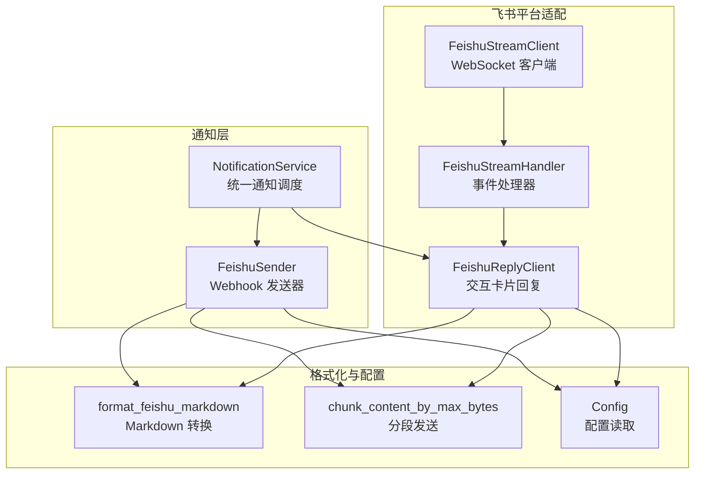
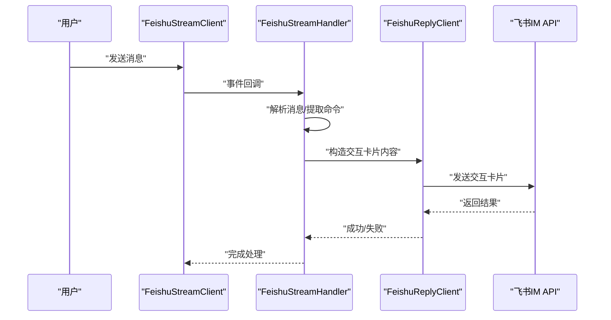
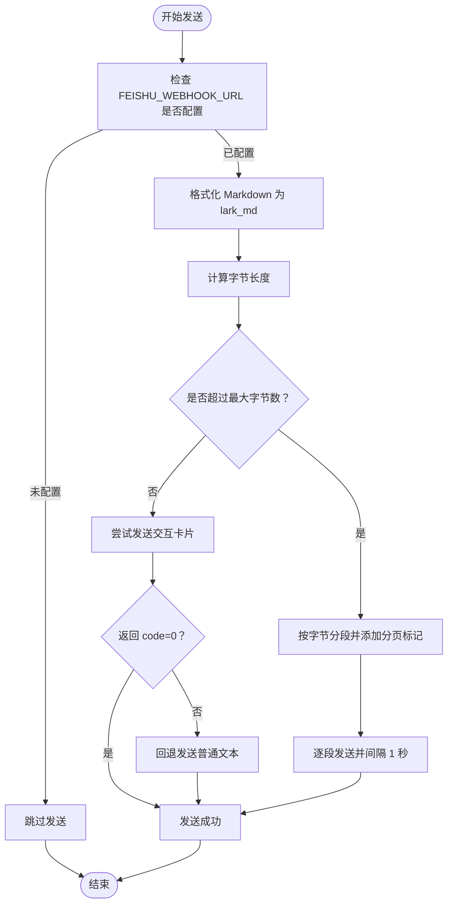
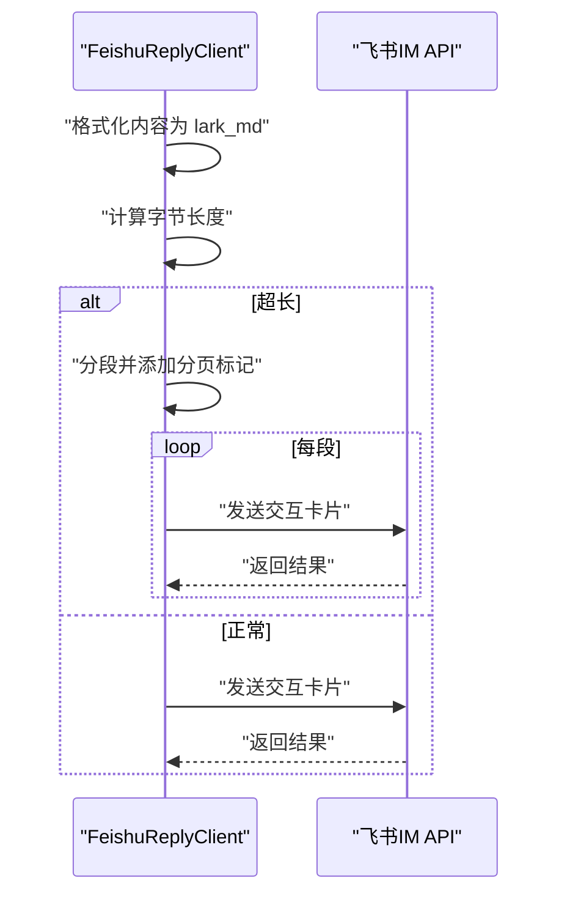
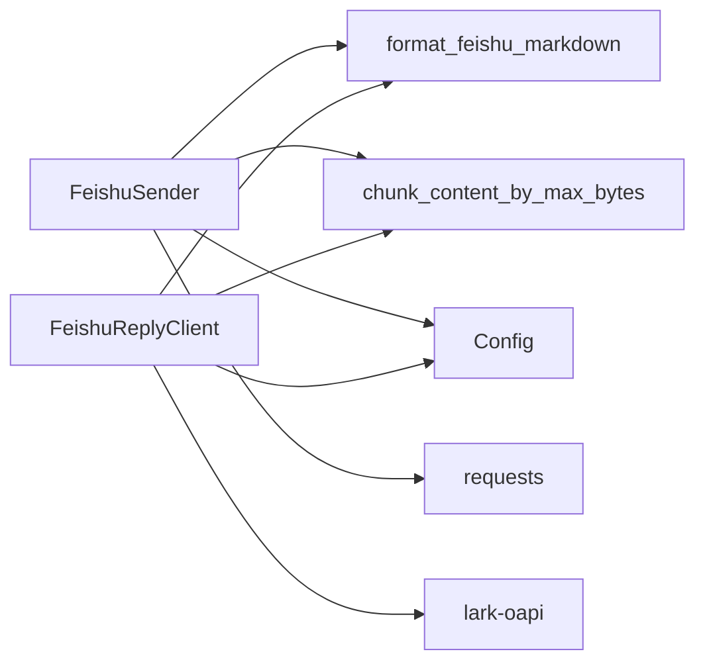

# 飞书通知

<cite>
**本文档引用的文件**
- [feishu_stream.py](file://bot/platforms/feishu_stream.py)
- [feishu_sender.py](file://src/notification_sender/feishu_sender.py)
- [notification.py](file://src/notification.py)
- [formatters.py](file://src/formatters.py)
- [config.py](file://src/config.py)
- [config_registry.py](file://src/core/config_registry.py)
- [full-guide.md](file://docs/full-guide.md)
- [feishu-bot-config.md](file://docs/bot/feishu-bot-config.md)
- [test_feishu_stream.py](file://tests/test_feishu_stream.py)
- [test_notification_sender.py](file://tests/test_notification_sender.py)
</cite>

## 更新摘要
**变更内容**
- 改进飞书Webhook消息格式化，采用交互式卡片布局替代简单文本消息
- 新增富文本渲染支持，提供更丰富的通知体验
- 增强分页发送功能，支持智能分段和分页标记
- 优化Markdown转换规则，提升飞书lark_md兼容性

## 目录
1. [简介](#简介)
2. [项目结构](#项目结构)
3. [核心组件](#核心组件)
4. [架构总览](#架构总览)
5. [详细组件分析](#详细组件分析)
6. [依赖分析](#依赖分析)
7. [性能考虑](#性能考虑)
8. [故障排查指南](#故障排查指南)
9. [结论](#结论)
10. [附录](#附录)

## 简介
本文件面向飞书通知渠道的技术文档，覆盖以下主题：
- 飞书 Webhook 的配置方法与集成原理
- 飞书消息格式要求、Markdown 语法支持与消息长度限制（20000 字节）
- 飞书机器人权限配置、群组选择与 Webhook URL 获取方式
- 完整的配置示例、消息模板格式与富文本渲染规则
- 飞书消息发送 API 限制、频率控制与错误处理机制
- 飞书机器人开发平台配置指南与调试技巧

## 项目结构
飞书通知能力由两条路径实现：
- Webhook 模式：通过自定义机器人 Webhook 发送消息
- Stream 模式：通过 lark-oapi SDK 建立 WebSocket 长连接，支持事件驱动与交互卡片富文本渲染



**图表来源**
- [notification.py:113-254](file://src/notification.py#L113-L254)
- [feishu_sender.py:20-183](file://src/notification_sender/feishu_sender.py#L20-L183)
- [feishu_stream.py:455-639](file://bot/platforms/feishu_stream.py#L455-L639)
- [formatters.py:290-374](file://src/formatters.py#L290-L374)
- [config.py:31-132](file://src/config.py#L31-L132)

**章节来源**
- [notification.py:113-254](file://src/notification.py#L113-L254)
- [feishu_sender.py:20-183](file://src/notification_sender/feishu_sender.py#L20-L183)
- [feishu_stream.py:455-639](file://bot/platforms/feishu_stream.py#L455-L639)
- [formatters.py:290-374](file://src/formatters.py#L290-L374)
- [config.py:31-132](file://src/config.py#L31-L132)

## 核心组件
- 飞书 Webhook 发送器（FeishuSender）
  - 负责将 Markdown 内容转换为飞书交互卡片（lark_md）格式并发送
  - 支持超长内容自动分段发送，并在每段末尾添加分页标记
  - 默认单条消息最大字节数为 20000（可通过配置调整）
- 飞书 Stream 客户端（FeishuStreamClient）
  - 通过 lark-oapi SDK 建立 WebSocket 长连接，无需公网与 Webhook
  - 支持事件解析、命令提取、@用户与分段回复
  - 交互卡片富文本渲染，支持 lark_md
- 格式化工具（format_feishu_markdown、chunk_content_by_max_bytes）
  - 将通用 Markdown 转换为飞书 lark_md 友好格式
  - 按字节智能切分，确保 UTF-8 边界安全与分页标记插入
- 配置系统（Config、config_registry）
  - 提供 FEISHU_WEBHOOK_URL、FEISHU_APP_ID、FEISHU_APP_SECRET、FEISHU_MAX_BYTES 等配置项
  - 支持从环境变量读取与默认值设置

**章节来源**
- [feishu_sender.py:20-183](file://src/notification_sender/feishu_sender.py#L20-L183)
- [feishu_stream.py:56-254](file://bot/platforms/feishu_stream.py#L56-L254)
- [formatters.py:400-493](file://src/formatters.py#L400-L493)
- [config.py:31-132](file://src/config.py#L31-L132)
- [config_registry.py:825-867](file://src/core/config_registry.py#L825-L867)

## 架构总览
飞书通知的两种模式在系统中并行存在，互不冲突：
- Webhook 模式：适合一次性或周期性推送，消息经由 Webhook URL 直接发送
- Stream 模式：适合事件驱动与交互式对话，通过 WebSocket 接收消息并即时回复



**图表来源**
- [feishu_stream.py:301-332](file://bot/platforms/feishu_stream.py#L301-L332)
- [feishu_stream.py:511-539](file://bot/platforms/feishu_stream.py#L511-L539)

**章节来源**
- [feishu_stream.py:257-453](file://bot/platforms/feishu_stream.py#L257-L453)

## 详细组件分析

### Webhook 模式：FeishuSender
- 功能要点
  - 将 Markdown 内容转换为飞书 lark_md 友好格式
  - 若内容超过最大字节数（默认 20000），自动分段发送并在每段末尾添加分页标记
  - 优先使用交互卡片（interactive）消息类型；若失败则回退为普通文本（text）
  - 支持 SSL 证书校验开关（WEBHOOK_VERIFY_SSL）
- 关键流程



**图表来源**
- [feishu_sender.py:34-113](file://src/notification_sender/feishu_sender.py#L34-L113)
- [feishu_sender.py:115-183](file://src/notification_sender/feishu_sender.py#L115-L183)
- [formatters.py:290-374](file://src/formatters.py#L290-L374)

**章节来源**
- [feishu_sender.py:20-183](file://src/notification_sender/feishu_sender.py#L20-L183)
- [formatters.py:290-374](file://src/formatters.py#L290-L374)

### Stream 模式：交互卡片与富文本
- 功能要点
  - 使用 lark-oapi SDK 建立 WebSocket 长连接，自动重连与心跳保活
  - 交互卡片支持 lark_md 富文本渲染，包括标题、引用、分隔线、表格等转换
  - 支持 @用户（at_user）与分段发送，超长内容自动分批
  - 会话级回复（回复原消息）与主动发送（按 chat_id）
- 关键流程



**图表来源**
- [feishu_stream.py:82-198](file://bot/platforms/feishu_stream.py#L82-L198)
- [feishu_stream.py:234-254](file://bot/platforms/feishu_stream.py#L234-L254)

**章节来源**
- [feishu_stream.py:56-254](file://bot/platforms/feishu_stream.py#L56-L254)

### Markdown 转换与分段策略
- Markdown 转换规则（lark_md 友好）
  - 标题（# / ## / ###）转换为加粗文本
  - 引用块（> ）转换为带表情前缀的文本
  - 分隔线（---）统一转换为细线
  - 表格转换为"键：值"条目列表
  - 列表项（- ）转换为带符号的条目
- 分段发送策略
  - 优先按"---"或"###"等分隔符智能切分
  - 若无法智能切分，则按字节上限强制截断
  - 每段末尾追加分页标记（如"📄 X/Y"），便于阅读
  - 段间发送间隔 1 秒，避免触发频率限制

**章节来源**
- [formatters.py:400-493](file://src/formatters.py#L400-L493)
- [formatters.py:290-374](file://src/formatters.py#L290-L374)

### 配置与权限
- 环境变量与配置项
  - FEISHU_WEBHOOK_URL：飞书自定义机器人 Webhook URL（可选）
  - FEISHU_APP_ID / FEISHU_APP_SECRET：飞书事件驱动机器人密钥（可选）
  - FEISHU_MAX_BYTES：飞书消息最大字节数（默认 20000，可调）
  - WEBHOOK_VERIFY_SSL：Webhook HTTPS 证书校验（默认开启）
- 权限与群组
  - 自定义机器人需在群组中添加为"机器人成员"，方可接收消息
  - 事件驱动机器人需在应用后台配置事件订阅与权限范围

**章节来源**
- [config.py:31-132](file://src/config.py#L31-L132)
- [config_registry.py:825-867](file://src/core/config_registry.py#L825-L867)
- [full-guide.md:67-209](file://docs/full-guide.md#L67-L209)

### 飞书机器人开发平台配置指南
- 创建应用与获取密钥
  - 登录飞书开放平台，创建 Echo Bot 应用，获取 App ID 与 App Secret
- 发布应用与添加到群组
  - 发布应用并邀请机器人进入目标群组
- 获取 Webhook URL
  - 在应用后台创建"自定义机器人"，复制 Webhook URL
- 配置与调试
  - 在本地或服务器环境中设置环境变量
  - 开启日志查看发送状态与错误详情
  - 对于 Webhook，可使用 WEBHOOK_VERIFY_SSL 控制证书校验

**章节来源**
- [feishu-bot-config.md:1-20](file://docs/bot/feishu-bot-config.md#L1-L20)

## 依赖分析
- 组件耦合
  - FeishuSender 依赖 format_feishu_markdown 与 chunk_content_by_max_bytes
  - FeishuReplyClient 同样依赖上述格式化与分段工具
  - 两者均依赖 Config 读取 FEISHU_WEBHOOK_URL、FEISHU_MAX_BYTES 等配置
- 外部依赖
  - requests：Webhook 发送
  - lark-oapi：Stream 模式事件处理与交互卡片发送
- 潜在风险
  - 未安装 lark-oapi 时，Stream 模式不可用
  - 未配置 Webhook URL 时，Webhook 模式自动跳过



**图表来源**
- [feishu_sender.py:13-31](file://src/notification_sender/feishu_sender.py#L13-L31)
- [feishu_stream.py:34-53](file://bot/platforms/feishu_stream.py#L34-L53)
- [formatters.py:400-493](file://src/formatters.py#L400-L493)

**章节来源**
- [feishu_sender.py:13-31](file://src/notification_sender/feishu_sender.py#L13-L31)
- [feishu_stream.py:34-53](file://bot/platforms/feishu_stream.py#L34-L53)

## 性能考虑
- 分段发送策略
  - 通过智能分隔符优先切分，减少强制截断带来的信息断裂
  - 每段末尾添加分页标记，提升可读性
- 频率控制
  - 段间发送间隔 1 秒，降低 API 限流风险
- 字节计算
  - 使用 UTF-8 编码字节长度计算，避免在多字节字符边界截断
- SSL 校验
  - 默认开启证书校验，保障传输安全；自签名证书场景可按需关闭（有 MITM 风险）

## 故障排查指南
- 常见问题与处理
  - Webhook URL 未配置：发送器会跳过飞书通道，检查环境变量
  - SSL 证书校验失败：检查 WEBHOOK_VERIFY_SSL 设置或网络证书链
  - 返回 code 非 0：查看日志中的错误码与错误信息，定位具体原因
  - 内容超长：确认 FEISHU_MAX_BYTES 设置是否合理，或增加阈值
  - Stream 模式不可用：确认已安装 lark-oapi，且 FEISHU_APP_ID/FEISHU_APP_SECRET 已配置
- 调试技巧
  - 启用详细日志，观察请求与响应内容
  - 使用测试用例验证分段与 @ 用户功能
  - 在飞书群组中手动测试交互卡片渲染效果

**章节来源**
- [feishu_sender.py:115-183](file://src/notification_sender/feishu_sender.py#L115-L183)
- [feishu_stream.py:541-565](file://bot/platforms/feishu_stream.py#L541-L565)
- [test_feishu_stream.py:47-83](file://tests/test_feishu_stream.py#L47-L83)
- [test_notification_sender.py:157-171](file://tests/test_notification_sender.py#L157-L171)

## 结论
飞书通知在本项目中提供了两条可靠路径：Webhook 与 Stream。前者适合批量与定时推送，后者适合事件驱动与富文本交互。通过统一的格式化与分段策略，系统能够在 20000 字节的限制下稳定发送长文本，并提供清晰的日志与错误反馈，便于运维与调试。

## 附录

### 配置示例（环境变量）
- Webhook 模式
  - FEISHU_WEBHOOK_URL：飞书自定义机器人 Webhook URL
  - FEISHU_MAX_BYTES：消息最大字节数（默认 20000）
  - WEBHOOK_VERIFY_SSL：HTTPS 证书校验（默认 true）
- Stream 模式
  - FEISHU_APP_ID / FEISHU_APP_SECRET：飞书事件驱动机器人密钥
  - FEISHU_MAX_BYTES：消息最大字节数（默认 20000）

**章节来源**
- [config.py:31-132](file://src/config.py#L31-L132)
- [config_registry.py:825-867](file://src/core/config_registry.py#L825-L867)
- [full-guide.md:67-209](file://docs/full-guide.md#L67-L209)

### 消息模板与富文本渲染规则
- 标题：转换为加粗文本
- 引用块：转换为带表情前缀的文本
- 分隔线：统一为细线
- 表格：转换为"键：值"条目列表
- 列表项：转换为带符号的条目
- 分段标记：每段末尾添加"📄 X/Y"

**章节来源**
- [formatters.py:400-493](file://src/formatters.py#L400-L493)

### 交互式卡片消息格式
飞书 Webhook 现已采用交互式卡片布局，提供更丰富的通知体验：

```json
{
  "msg_type": "interactive",
  "card": {
    "config": { "wide_screen_mode": true },
    "elements": [
      {
        "tag": "div",
        "text": {
          "tag": "lark_md",
          "content": "您的分析报告内容"
        }
      }
    ],
    "header": {
      "title": {
        "tag": "plain_text",
        "content": "股票智能分析报告"
      }
    }
  }
}
```

**章节来源**
- [feishu_sender.py:76-107](file://src/notification_sender/feishu_sender.py#L76-L107)
- [feishu_stream.py:108-120](file://bot/platforms/feishu_stream.py#L108-L120)