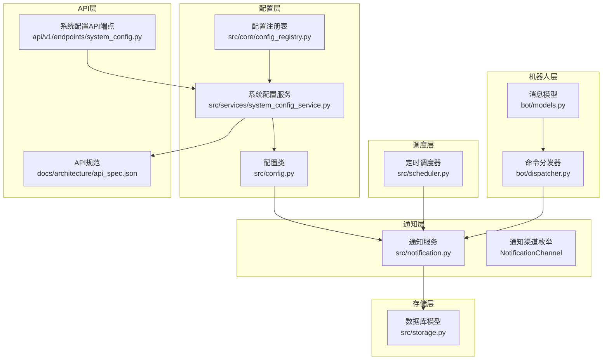
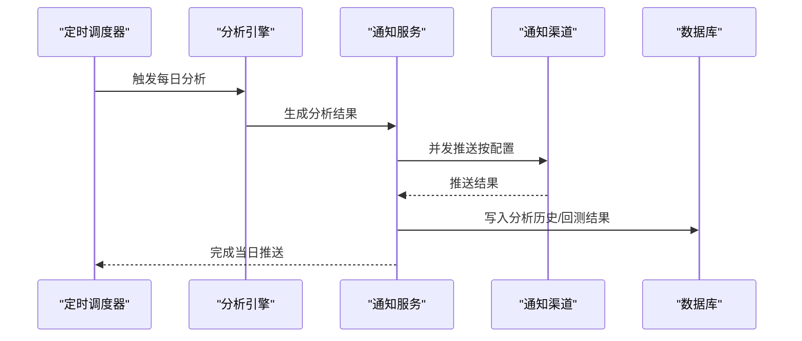
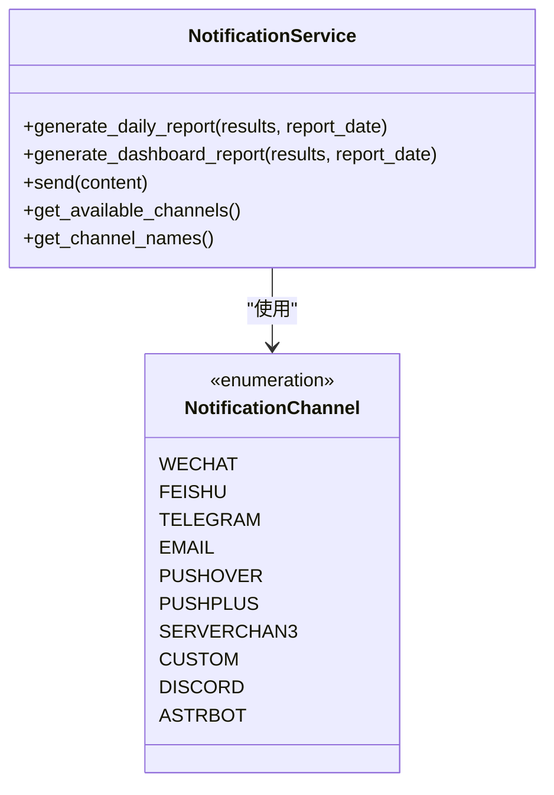
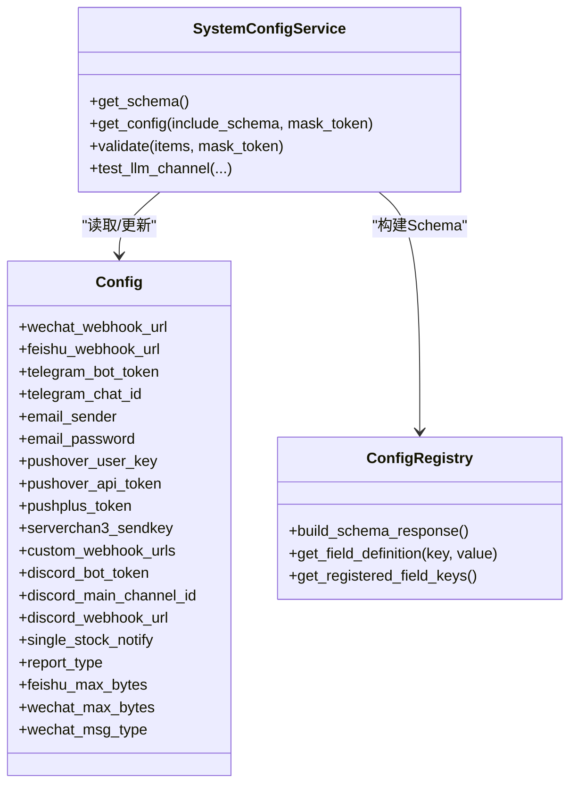
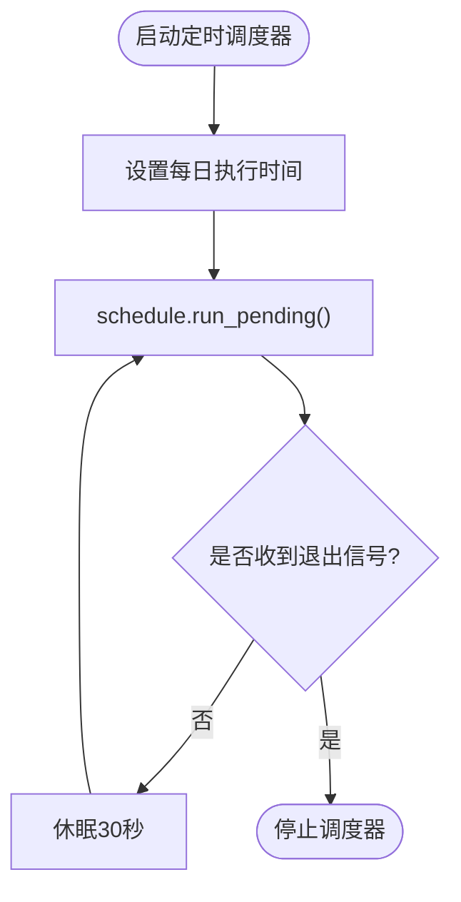
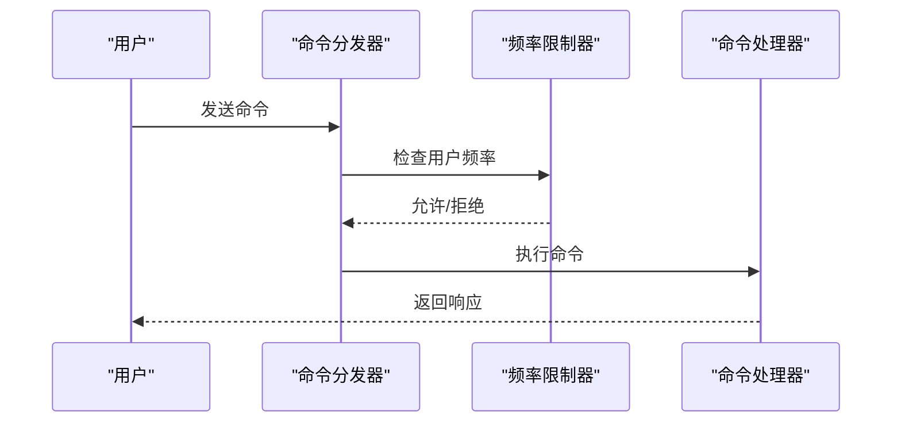
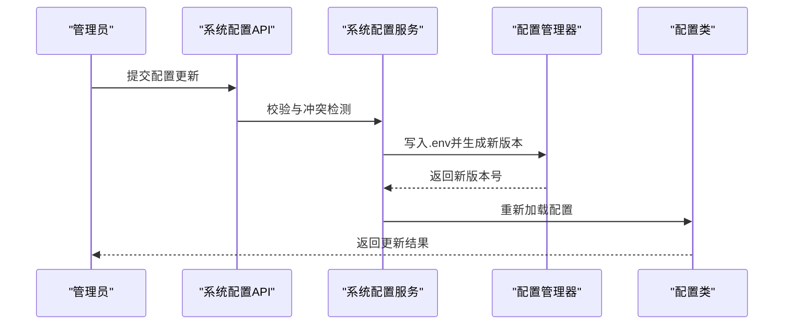
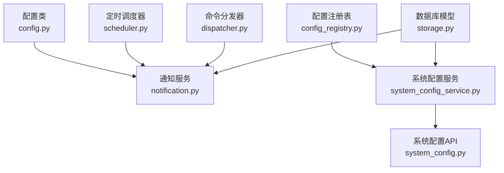

# 通知策略配置

<cite>
**本文引用的文件**
- [notification.py](file://src/notification.py)
- [scheduler.py](file://src/scheduler.py)
- [config.py](file://src/config.py)
- [config_registry.py](file://src/core/config_registry.py)
- [system_config_service.py](file://src/services/system_config_service.py)
- [storage.py](file://src/storage.py)
- [dispatcher.py](file://bot/dispatcher.py)
- [models.py](file://bot/models.py)
- [system_config.py](file://api/v1/endpoints/system_config.py)
- [api_spec.json](file://docs/architecture/api_spec.json)
</cite>

## 目录
1. [简介](#简介)
2. [项目结构](#项目结构)
3. [核心组件](#核心组件)
4. [架构总览](#架构总览)
5. [详细组件分析](#详细组件分析)
6. [依赖分析](#依赖分析)
7. [性能考虑](#性能考虑)
8. [故障排查指南](#故障排查指南)
9. [结论](#结论)
10. [附录](#附录)

## 简介
本文件面向“通知策略配置系统”的技术文档，围绕通知策略的配置方法、管理机制与运行时行为展开，涵盖推送频率控制、消息过滤规则、个性化定制选项；阐述批量推送策略、分组通知与定向推送的实现方式；说明通知时机控制、时间段限制与节假日处理逻辑；提供通知策略的动态调整、A/B测试与效果评估方法；记录通知策略的性能影响分析与资源消耗优化；并包含策略配置的版本管理、回滚机制与审计日志。

## 项目结构
通知策略配置系统主要由以下模块构成：
- 通知服务与渠道：通知服务负责生成报告并按配置向多渠道并发推送；渠道包括企业微信、飞书、Telegram、邮件、Pushover、PushPlus、Server酱3、Discord、AstrBot、自定义Webhook等。
- 配置与注册中心：配置类集中管理通知相关参数；配置注册表提供字段元数据与UI渲染信息；系统配置服务负责读取、校验与更新配置。
- 定时调度：定时器负责在设定时间点触发分析与推送。
- 机器人与命令分发：机器人平台适配与命令分发器支持按用户维度的频率限制与定向推送。
- 存储与审计：数据库模型记录分析历史、回测结果与LLM用量等，支撑效果评估与审计。

图表来源
- [notification.py:47-59](file://src/notification.py#L47-L59)
- [config.py:77-132](file://src/config.py#L77-L132)
- [config_registry.py:35-64](file://src/core/config_registry.py#L35-L64)
- [system_config_service.py:55-117](file://src/services/system_config_service.py#L55-L117)
- [scheduler.py:56-147](file://src/scheduler.py#L56-L147)
- [dispatcher.py:79-301](file://bot/dispatcher.py#L79-L301)
- [models.py:32-153](file://bot/models.py#L32-L153)
- [storage.py:623-746](file://src/storage.py#L623-L746)
- [system_config.py:91-214](file://api/v1/endpoints/system_config.py#L91-L214)
- [api_spec.json:1564-1619](file://docs/architecture/api_spec.json#L1564-L1619)

章节来源
- [notification.py:113-206](file://src/notification.py#L113-L206)
- [config.py:77-132](file://src/config.py#L77-L132)
- [config_registry.py:66-1054](file://src/core/config_registry.py#L66-L1054)
- [system_config_service.py:55-117](file://src/services/system_config_service.py#L55-L117)
- [scheduler.py:56-147](file://src/scheduler.py#L56-L147)
- [dispatcher.py:79-301](file://bot/dispatcher.py#L79-L301)
- [models.py:32-153](file://bot/models.py#L32-L153)
- [storage.py:623-746](file://src/storage.py#L623-L746)
- [system_config.py:91-214](file://api/v1/endpoints/system_config.py#L91-L214)
- [api_spec.json:1564-1619](file://docs/architecture/api_spec.json#L1564-L1619)

## 核心组件
- 通知服务（NotificationService）
  - 负责生成Markdown格式的日报，检测可用渠道并并发推送；支持本地保存报告；具备消息分段发送能力以规避渠道长度限制。
- 通知渠道（NotificationChannel）
  - 枚举定义所有支持的推送渠道，便于统一管理与扩展。
- 配置类（Config）
  - 集中管理通知相关配置项，如Webhook地址、令牌、消息长度限制、报告类型、单股推送模式等，并提供单例访问。
- 配置注册表（ConfigRegistry）
  - 提供字段元数据、UI控制类型、分类与显示顺序，用于动态表单渲染与配置校验。
- 系统配置服务（SystemConfigService）
  - 提供配置读取、校验、更新与版本控制，支持LLM通道测试、字段校验与冲突检测。
- 定时调度器（Scheduler）
  - 基于schedule库实现每日定时任务，支持优雅退出与心跳日志。
- 机器人与命令分发（CommandDispatcher）
  - 提供命令解析、参数校验、权限控制与频率限制，支持按用户维度的定向推送。
- 存储与审计（DatabaseManager/模型）
  - 提供数据库连接、事务与会话管理；模型记录分析历史、回测结果、LLM用量等，支撑效果评估与审计。

章节来源
- [notification.py:113-206](file://src/notification.py#L113-L206)
- [notification.py:47-59](file://src/notification.py#L47-L59)
- [config.py:77-132](file://src/config.py#L77-L132)
- [config_registry.py:66-1054](file://src/core/config_registry.py#L66-L1054)
- [system_config_service.py:55-117](file://src/services/system_config_service.py#L55-L117)
- [scheduler.py:56-147](file://src/scheduler.py#L56-L147)
- [dispatcher.py:79-301](file://bot/dispatcher.py#L79-L301)
- [storage.py:623-746](file://src/storage.py#L623-L746)

## 架构总览
通知策略配置系统的运行时交互如下：

图表来源
- [scheduler.py:85-119](file://src/scheduler.py#L85-L119)
- [notification.py:2992-3042](file://src/notification.py#L2992-L3042)
- [storage.py:208-270](file://src/storage.py#L208-L270)

章节来源
- [scheduler.py:85-119](file://src/scheduler.py#L85-L119)
- [notification.py:2992-3042](file://src/notification.py#L2992-L3042)
- [storage.py:208-270](file://src/storage.py#L208-L270)

## 详细组件分析

### 通知服务与渠道管理
- 渠道检测与可用性
  - 通知服务根据配置检测可用渠道，包括企业微信、飞书、Telegram、邮件、Pushover、PushPlus、Server酱3、Discord、AstrBot与自定义Webhook。
  - 每个渠道的配置项在配置类中集中管理，通知服务在初始化时读取并进行可用性判断。
- 并发推送与消息分段
  - 通知服务对所有可用渠道进行并发推送；针对超长消息，采用分段发送策略，确保不同渠道的长度限制得到满足。
- 报告生成
  - 支持生成“日报”与“决策仪表盘”两类报告，分别面向不同阅读偏好与场景。

图表来源
- [notification.py:113-206](file://src/notification.py#L113-L206)
- [notification.py:47-59](file://src/notification.py#L47-L59)

章节来源
- [notification.py:113-206](file://src/notification.py#L113-L206)
- [notification.py:207-254](file://src/notification.py#L207-L254)
- [notification.py:2992-3042](file://src/notification.py#L2992-L3042)

### 配置与注册中心
- 配置类（Config）
  - 集中定义通知相关配置项，如Webhook URL、令牌、消息长度限制、报告类型、单股推送模式等；提供单例访问与热读取能力。
- 配置注册表（ConfigRegistry）
  - 提供字段元数据（标题、描述、UI控件、分类、显示顺序、是否敏感等），用于动态表单渲染与配置校验。
- 系统配置服务（SystemConfigService）
  - 提供配置读取、校验、更新与版本控制；支持LLM通道测试、字段校验与冲突检测；与API端点配合实现在线配置管理。

图表来源
- [config.py:77-132](file://src/config.py#L77-L132)
- [system_config_service.py:55-117](file://src/services/system_config_service.py#L55-L117)
- [config_registry.py:66-1054](file://src/core/config_registry.py#L66-L1054)

章节来源
- [config.py:77-132](file://src/config.py#L77-L132)
- [system_config_service.py:55-117](file://src/services/system_config_service.py#L55-L117)
- [config_registry.py:66-1054](file://src/core/config_registry.py#L66-L1054)

### 定时调度与通知时机控制
- 定时调度器
  - 基于schedule库实现每日定时任务，支持设置执行时间、启动时立即执行与优雅退出；通过心跳日志与异常捕获保证稳定性。
- 通知时机控制
  - 通过配置项控制每日推送时间；结合分析引擎的执行周期，形成“分析完成后推送”的闭环。
- 时间段限制与节假日处理
  - 代码层面未内置节假日判断逻辑；可通过外部调度器或业务规则在调用侧进行时段限制与节假日跳过控制。

图表来源
- [scheduler.py:120-139](file://src/scheduler.py#L120-L139)

章节来源
- [scheduler.py:56-147](file://src/scheduler.py#L56-L147)

### 机器人与命令分发（推送频率控制与定向推送）
- 频率限制
  - 命令分发器基于滑动窗口算法实现每用户请求频率限制，防止滥用与风控。
- 定向推送
  - 机器人消息模型统一各平台消息格式；通过@机器人或命令形式触发分析与推送，支持按用户维度的定向响应。
- 权限控制
  - 支持管理员用户白名单，部分命令需管理员权限。

图表来源
- [dispatcher.py:21-77](file://bot/dispatcher.py#L21-L77)
- [dispatcher.py:230-291](file://bot/dispatcher.py#L230-L291)
- [models.py:32-116](file://bot/models.py#L32-L116)

章节来源
- [dispatcher.py:21-77](file://bot/dispatcher.py#L21-L77)
- [dispatcher.py:230-291](file://bot/dispatcher.py#L230-L291)
- [models.py:32-116](file://bot/models.py#L32-L116)

### 批量推送策略、分组通知与个性化定制
- 批量推送策略
  - 通知服务对所有可用渠道进行并发推送；若开启“单股推送模式”，可在分析完每只股票后立即推送，而非汇总后推送。
- 分组通知
  - 通过配置多个Webhook或令牌，实现向不同群组/频道的分发；渠道检测逻辑会自动识别并推送。
- 个性化定制
  - 报告类型（简单/完整）与消息长度限制（字节）可按渠道配置；支持Markdown格式与不同消息类型（如企业微信的text/markdown）。

章节来源
- [notification.py:113-206](file://src/notification.py#L113-L206)
- [config.py:114-132](file://src/config.py#L114-L132)

### 动态调整、A/B测试与效果评估
- 动态调整
  - 系统配置服务支持在线读取、校验与更新配置；通过API端点实现配置变更与冲突检测；配置版本控制用于避免并发写入冲突。
- A/B测试
  - 可通过切换不同渠道令牌或Webhook，对不同用户群体进行分流测试；结合回测与LLM用量模型进行效果对比。
- 效果评估
  - 数据库模型记录分析历史、回测结果与LLM用量，可用于胜率、方向准确率、平均回报等指标的统计分析。

图表来源
- [system_config.py:91-112](file://api/v1/endpoints/system_config.py#L91-L112)
- [system_config_service.py:55-117](file://src/services/system_config_service.py#L55-L117)
- [config.py:232-244](file://src/config.py#L232-L244)

章节来源
- [system_config.py:91-112](file://api/v1/endpoints/system_config.py#L91-L112)
- [system_config_service.py:55-117](file://src/services/system_config_service.py#L55-L117)
- [config.py:232-244](file://src/config.py#L232-L244)

### 版本管理、回滚机制与审计日志
- 版本管理
  - 配置管理器基于文件状态生成确定性版本字符串；API端点在冲突时返回当前版本号，避免并发写入覆盖。
- 回滚机制
  - 通过版本号检测与冲突响应，引导用户重新加载配置后重试；建议在变更前备份.env文件。
- 审计日志
  - LLM用量模型记录token使用情况；分析历史与回测结果可用于审计与追溯。

章节来源
- [system_config_service.py:93-96](file://src/services/system_config_service.py#L93-L96)
- [system_config.py:91-112](file://api/v1/endpoints/system_config.py#L91-L112)
- [storage.py:607-621](file://src/storage.py#L607-L621)
- [storage.py:208-270](file://src/storage.py#L208-L270)

## 依赖分析
通知策略配置系统的组件耦合关系如下：

图表来源
- [config.py:77-132](file://src/config.py#L77-L132)
- [notification.py:113-206](file://src/notification.py#L113-L206)
- [config_registry.py:66-1054](file://src/core/config_registry.py#L66-L1054)
- [system_config_service.py:55-117](file://src/services/system_config_service.py#L55-L117)
- [system_config.py:91-112](file://api/v1/endpoints/system_config.py#L91-L112)
- [scheduler.py:56-147](file://src/scheduler.py#L56-L147)
- [dispatcher.py:79-301](file://bot/dispatcher.py#L79-L301)
- [storage.py:623-746](file://src/storage.py#L623-L746)

章节来源
- [config.py:77-132](file://src/config.py#L77-L132)
- [notification.py:113-206](file://src/notification.py#L113-L206)
- [config_registry.py:66-1054](file://src/core/config_registry.py#L66-L1054)
- [system_config_service.py:55-117](file://src/services/system_config_service.py#L55-L117)
- [system_config.py:91-112](file://api/v1/endpoints/system_config.py#L91-L112)
- [scheduler.py:56-147](file://src/scheduler.py#L56-L147)
- [dispatcher.py:79-301](file://bot/dispatcher.py#L79-L301)
- [storage.py:623-746](file://src/storage.py#L623-L746)

## 性能考虑
- 并发推送
  - 通知服务对所有可用渠道进行并发推送，提升整体推送效率；建议合理设置渠道数量与令牌额度，避免触发第三方限流。
- 消息分段
  - 针对超长消息采用分段发送策略，减少单次请求失败概率；不同渠道的最大字节数在配置中可调。
- 频率限制
  - 机器人层的滑动窗口频率限制可有效防止滥用；通知层的并发策略需与第三方限流策略协同。
- 数据库存取
  - 数据库采用连接池与事务封装，建议在高并发场景下适当调整连接池大小与事务粒度。

## 故障排查指南
- 未配置通知渠道
  - 若未配置任何通知渠道，通知服务将记录警告并跳过推送；请检查配置类中的渠道相关字段。
- 渠道配置不完整
  - 每个渠道均有对应的配置项，如缺少必要令牌或URL，将无法启用该渠道；请核对配置并确保网络可达。
- 推送失败
  - 通知服务对每个渠道的推送结果进行统计；若失败较多，建议检查渠道令牌、网络连通性与第三方限流策略。
- 配置冲突
  - 在线更新配置时若出现版本冲突，API端点会返回当前版本号；请重新加载配置后重试。
- 机器人请求过于频繁
  - 命令分发器会根据滑动窗口限制用户请求频率；请等待冷却时间或降低请求频率。

章节来源
- [notification.py:200-205](file://src/notification.py#L200-L205)
- [notification.py:2992-3042](file://src/notification.py#L2992-L3042)
- [system_config.py:91-112](file://api/v1/endpoints/system_config.py#L91-L112)
- [dispatcher.py:240-246](file://bot/dispatcher.py#L240-L246)

## 结论
通知策略配置系统通过“通知服务+配置中心+调度器+机器人分发+存储审计”的架构，实现了灵活、可扩展的通知能力。系统支持多渠道并发推送、消息分段、频率限制与版本控制，能够满足批量推送、分组通知与定向推送的需求。通过数据库模型与API端点，系统具备动态调整、A/B测试与效果评估的基础能力。建议在生产环境中结合第三方限流策略与监控体系，持续优化推送性能与用户体验。

## 附录
- 配置字段类别与用途
  - 通知类配置字段（如Webhook URL、令牌、消息长度限制、报告类型、单股推送模式等）在配置注册表中定义，便于统一管理与UI渲染。
- API规范
  - 系统配置API端点提供Schema加载、配置读取、校验与冲突处理，确保配置变更的安全与一致性。

章节来源
- [config_registry.py:35-64](file://src/core/config_registry.py#L35-L64)
- [system_config.py:189-214](file://api/v1/endpoints/system_config.py#L189-L214)
- [api_spec.json:1564-1619](file://docs/architecture/api_spec.json#L1564-L1619)