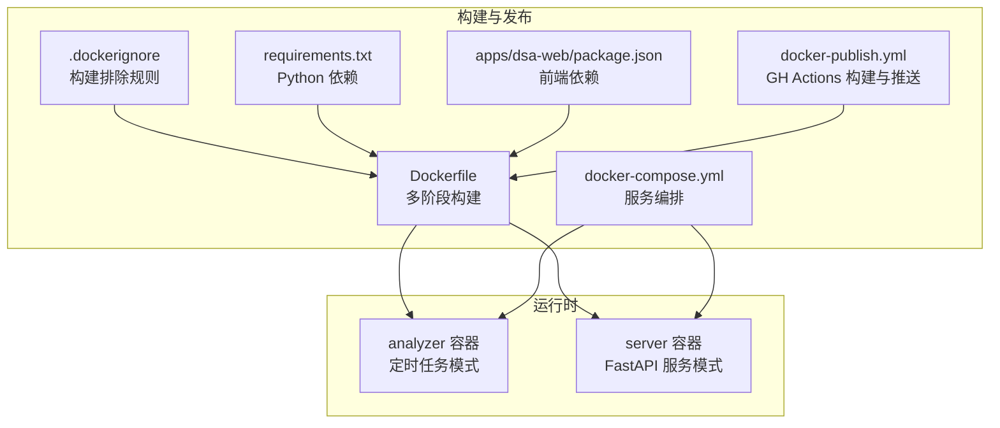
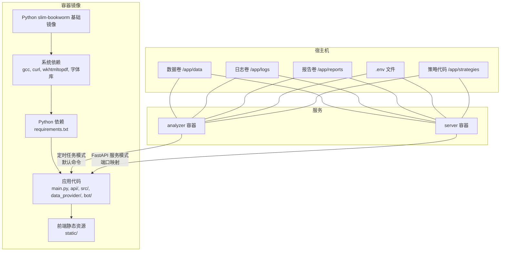
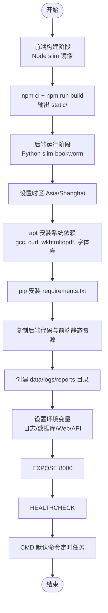
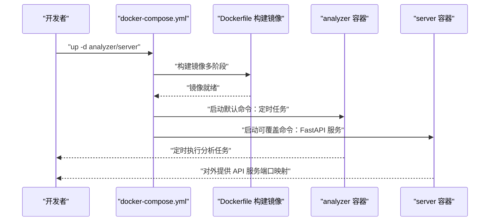
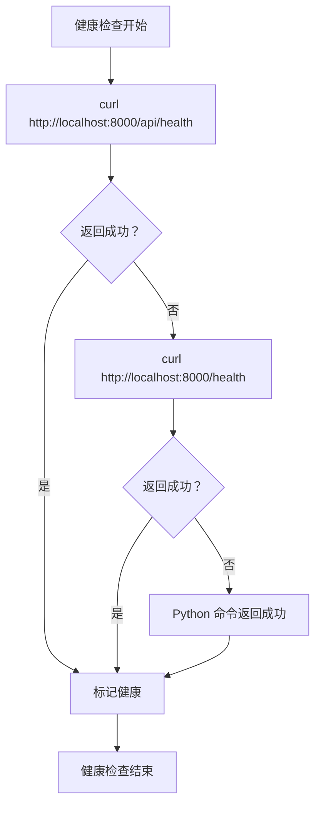
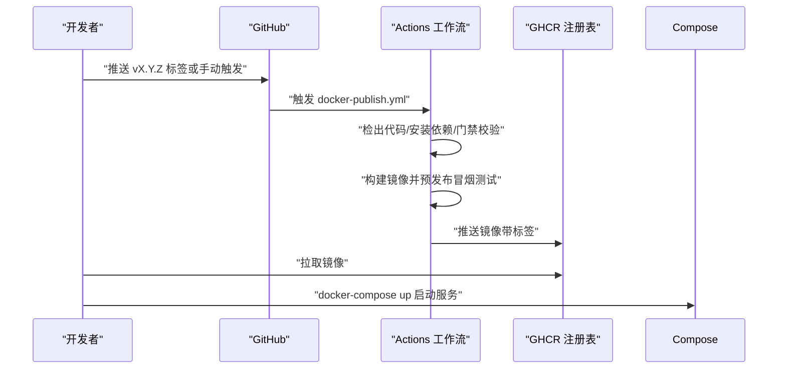
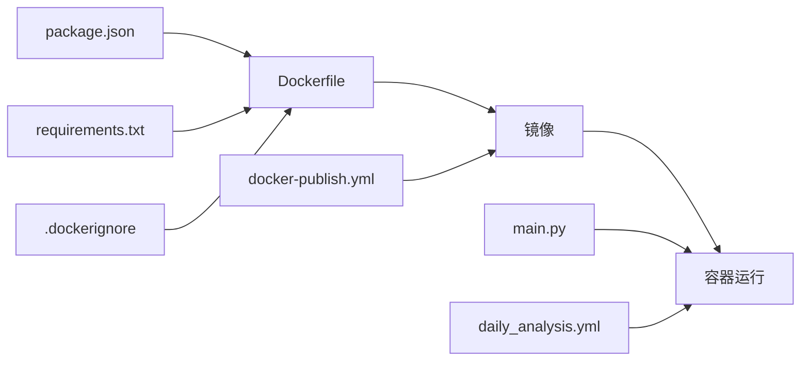

# 容器化部署

<cite>
**本文引用的文件**
- [Dockerfile](file://docker/Dockerfile)
- [docker-compose.yml](file://docker/docker-compose.yml)
- [.dockerignore](file://.dockerignore)
- [requirements.txt](file://requirements.txt)
- [pyproject.toml](file://pyproject.toml)
- [main.py](file://main.py)
- [package.json](file://apps/dsa-web/package.json)
- [docker-publish.yml](file://.github/workflows/docker-publish.yml)
- [daily_analysis.yml](file://.github/workflows/daily_analysis.yml)
- [DEPLOY.md](file://docs/DEPLOY.md)
- [zeabur-deployment.md](file://docs/docker/zeabur-deployment.md)
</cite>

## 目录
1. [简介](#简介)
2. [项目结构](#项目结构)
3. [核心组件](#核心组件)
4. [架构总览](#架构总览)
5. [详细组件分析](#详细组件分析)
6. [依赖关系分析](#依赖关系分析)
7. [性能考虑](#性能考虑)
8. [故障排查指南](#故障排查指南)
9. [结论](#结论)
10. [附录](#附录)

## 简介
本文件面向开发者与运维人员，提供该 A 股自选股智能分析系统的完整容器化部署指导。内容涵盖 Docker 多阶段构建策略、前后端集成、镜像构建与发布、Compose 编排、健康检查、端口暴露、默认启动命令、资源限制、安全与性能优化，以及在 Zeabur 等平台的部署最佳实践。

## 项目结构
围绕容器化部署的关键文件与目录如下：
- Dockerfile：多阶段构建，前端在独立阶段打包，后端在 Python slim 镜像中运行
- docker-compose.yml：服务编排，包含 analyzer（定时任务）与 server（FastAPI 服务）两个服务
- requirements.txt：后端 Python 依赖清单
- .dockerignore：构建时排除规则
- apps/dsa-web/package.json：前端依赖与构建脚本
- .github/workflows/docker-publish.yml：CI/CD 构建与推送镜像至 GHCR
- .github/workflows/daily_analysis.yml：GitHub Actions 定时分析任务（非容器）
- docs/DEPLOY.md 与 docs/docker/zeabur-deployment.md：部署与平台指南

图表来源
- [Dockerfile:1-77](file://docker/Dockerfile#L1-L77)
- [docker-compose.yml:1-69](file://docker/docker-compose.yml#L1-L69)
- [.dockerignore:1-31](file://.dockerignore#L1-L31)
- [requirements.txt:1-65](file://requirements.txt#L1-L65)
- [package.json:1-56](file://apps/dsa-web/package.json#L1-L56)
- [docker-publish.yml:1-120](file://.github/workflows/docker-publish.yml#L1-L120)

章节来源
- [Dockerfile:1-77](file://docker/Dockerfile#L1-L77)
- [docker-compose.yml:1-69](file://docker/docker-compose.yml#L1-L69)
- [.dockerignore:1-31](file://.dockerignore#L1-L31)
- [requirements.txt:1-65](file://requirements.txt#L1-L65)
- [package.json:1-56](file://apps/dsa-web/package.json#L1-L56)
- [docker-publish.yml:1-120](file://.github/workflows/docker-publish.yml#L1-L120)

## 核心组件
- 多阶段 Dockerfile
  - 前端构建阶段：基于 Node slim 镜像，安装依赖并执行构建，产物输出到 static 目录
  - 后端运行阶段：基于 Python slim-bookworm，安装系统依赖（含 wkhtmltopdf），复制后端代码与前端静态资源，设置时区、环境变量、暴露端口、健康检查与默认命令
- Docker Compose 编排
  - analyzer：默认启动命令为定时任务模式
  - server：可覆盖命令为仅启动 FastAPI 服务，映射端口
  - 共享卷：挂载 data、logs、reports、.env、strategies 等
  - 资源限制：内存上限与预留
- 健康检查
  - 通过 curl 访问 /api/health 或 /health，或回退到 Python 命令
- 环境变量与默认值
  - 时区、日志目录、数据库路径、Web/API 服务绑定地址与端口等
- 前端静态资源
  - FastAPI 自动托管 static 目录；Dockerfile 多阶段构建时将前端产物复制到 static

章节来源
- [Dockerfile:6-14](file://docker/Dockerfile#L6-L14)
- [Dockerfile:17-51](file://docker/Dockerfile#L17-L51)
- [Dockerfile:22-24](file://docker/Dockerfile#L22-L24)
- [Dockerfile:57-65](file://docker/Dockerfile#L57-L65)
- [Dockerfile:70-76](file://docker/Dockerfile#L70-L76)
- [docker-compose.yml:57-68](file://docker/docker-compose.yml#L57-L68)
- [docker-compose.yml:23-28](file://docker/docker-compose.yml#L23-L28)

## 架构总览
下图展示容器化部署的整体架构：前端构建与后端运行分离，Compose 启动两个服务，分别承担定时分析与 API 服务职责，共享数据卷并受健康检查与资源限制约束。

图表来源
- [Dockerfile:17-51](file://docker/Dockerfile#L17-L51)
- [Dockerfile:67-68](file://docker/Dockerfile#L67-L68)
- [docker-compose.yml:23-28](file://docker/docker-compose.yml#L23-L28)
- [docker-compose.yml:65-68](file://docker/docker-compose.yml#L65-L68)

## 详细组件分析

### Dockerfile 多阶段构建策略
- 前端构建阶段（web-builder）
  - 基于 Node slim 镜像，复制前端 package.json 与 lock 文件，执行依赖安装与构建
  - 产出静态资源目录 static/
- 后端运行阶段
  - 基于 Python slim-bookworm，设置时区 Asia/Shanghai
  - 安装系统依赖（含 wkhtmltopdf 与渲染库），安装 Python 依赖
  - 复制后端代码与前端静态资源，创建数据/日志/报告目录
  - 设置环境变量（日志目录、数据库路径、Web/API 绑定地址与端口）
  - 暴露端口 8000，声明健康检查，设置默认命令（定时任务模式）

图表来源
- [Dockerfile:6-14](file://docker/Dockerfile#L6-L14)
- [Dockerfile:17-51](file://docker/Dockerfile#L17-L51)
- [Dockerfile:22-24](file://docker/Dockerfile#L22-L24)
- [Dockerfile:57-65](file://docker/Dockerfile#L57-L65)
- [Dockerfile:70-76](file://docker/Dockerfile#L70-L76)

章节来源
- [Dockerfile:6-14](file://docker/Dockerfile#L6-L14)
- [Dockerfile:17-51](file://docker/Dockerfile#L17-L51)
- [Dockerfile:22-24](file://docker/Dockerfile#L22-L24)
- [Dockerfile:57-65](file://docker/Dockerfile#L57-L65)
- [Dockerfile:70-76](file://docker/Dockerfile#L70-L76)

### Docker Compose 编排与服务定义
- 通用配置（x-common）
  - 构建上下文指向项目根目录，Dockerfile 路径为 docker/Dockerfile
  - 重启策略：unless-stopped
  - env_file：从 .env 加载环境变量
  - volumes：挂载 data、logs、reports、.env、strategies（只读）
  - environment：设置时区、WEBUI_HOST、API_PORT（来自 .env）
  - logging：json-file 驱动，单文件最大 10MB，最多 3 个
  - deploy.resources.limits/reservations：内存限制与预留
- analyzer 服务
  - 容器名：stock-analyzer
  - 默认命令：定时任务模式（由 Dockerfile CMD 决定）
- server 服务
  - 容器名：stock-server
  - 可覆盖命令：仅启动 FastAPI 服务（--serve-only），绑定 0.0.0.0 与端口
  - 端口映射：${API_PORT:-8000}:${API_PORT:-8000}

图表来源
- [docker-compose.yml:10-17](file://docker/docker-compose.yml#L10-L17)
- [docker-compose.yml:57-68](file://docker/docker-compose.yml#L57-L68)
- [Dockerfile:75-76](file://docker/Dockerfile#L75-L76)

章节来源
- [docker-compose.yml:10-17](file://docker/docker-compose.yml#L10-L17)
- [docker-compose.yml:57-68](file://docker/docker-compose.yml#L57-L68)
- [Dockerfile:75-76](file://docker/Dockerfile#L75-L76)

### 健康检查机制
- 健康检查策略
  - 每 30 秒检查一次，超时 10 秒，启动期 10 秒，重试 3 次
  - 依次尝试访问 /api/health 与 /health；若均失败则回退到 Python 命令返回成功
- 适用场景
  - WebUI 模式与 FastAPI 模式均可通过 /health 端点判断健康状态
  - 非服务模式（仅定时任务）健康检查回退为成功，避免误判

图表来源
- [Dockerfile:70-73](file://docker/Dockerfile#L70-L73)

章节来源
- [Dockerfile:70-73](file://docker/Dockerfile#L70-L73)

### 端口暴露与默认启动命令
- 端口暴露
  - EXPOSE 8000，便于容器与宿主机通信
- 默认启动命令
  - CMD ["python", "main.py", "--schedule"]，即定时任务模式
- 可覆盖命令
  - server 服务可通过 command 覆盖为仅启动 FastAPI 服务（--serve-only），并指定 --host 与 --port

章节来源
- [Dockerfile:65-65](file://docker/Dockerfile#L65-L65)
- [Dockerfile:75-76](file://docker/Dockerfile#L75-L76)
- [docker-compose.yml:65-65](file://docker/docker-compose.yml#L65-L65)

### 环境变量与数据卷管理
- 环境变量
  - 时区：Asia/Shanghai
  - 日志目录：/app/logs
  - 数据库路径：/app/data/stock_analysis.db
  - Web/API 服务绑定地址与端口（由 WEBUI_HOST 与 API_PORT 控制）
- 数据卷
  - /app/data：数据库与数据文件
  - /app/logs：日志文件
  - /app/reports：分析报告
  - /app/.env：挂载 .env 文件
  - /app/strategies：策略代码（只读）

章节来源
- [Dockerfile:22-24](file://docker/Dockerfile#L22-L24)
- [Dockerfile:57-62](file://docker/Dockerfile#L57-L62)
- [Dockerfile:67-68](file://docker/Dockerfile#L67-L68)
- [docker-compose.yml:23-28](file://docker/docker-compose.yml#L23-L28)

### 前端静态资源与 FastAPI 托管
- 前端构建
  - 使用 Node slim 镜像安装依赖并构建，输出到 static 目录
- 静态资源托管
  - Dockerfile 将前端构建产物复制到 /app/static
  - FastAPI 自动托管 static 目录，无需额外配置即可提供 WebUI

章节来源
- [Dockerfile:6-14](file://docker/Dockerfile#L6-L14)
- [Dockerfile:51-51](file://docker/Dockerfile#L51-L51)
- [package.json:6-12](file://apps/dsa-web/package.json#L6-L12)

### CI/CD 与镜像构建、推送与拉取
- GitHub Actions 工作流
  - docker-publish.yml：在推送语义化版本标签或手动触发时，构建镜像并推送到 GHCR，带元数据标签（latest、tag、sha）
  - daily_analysis.yml：定时执行分析任务（非容器），用于云端无服务器分析
- 构建与推送流程
  - 解析发布标签或手动输入，检出对应代码
  - 安装后端门禁依赖，执行门禁脚本
  - 预发布冒烟测试：构建镜像并运行简单校验
  - 使用 metadata-action 生成标签，build-push-action 推送镜像
- 拉取与使用
  - 在目标环境使用 docker pull 拉取镜像，或通过 Compose 直接启动

图表来源
- [docker-publish.yml:1-120](file://.github/workflows/docker-publish.yml#L1-L120)
- [daily_analysis.yml:1-286](file://.github/workflows/daily_analysis.yml#L1-L286)

章节来源
- [docker-publish.yml:1-120](file://.github/workflows/docker-publish.yml#L1-L120)
- [daily_analysis.yml:1-286](file://.github/workflows/daily_analysis.yml#L1-L286)

### 多容器编排策略与网络配置
- 服务定义
  - analyzer：定时任务模式，适合后台分析
  - server：FastAPI 服务模式，提供 API 与 WebUI
- 网络配置
  - server 服务通过 ports 将容器端口映射到宿主机端口（默认 8000）
  - 若使用 host 网络模式，端口映射无效，端口由命令行参数指定
- 数据卷挂载
  - 共享 /app/data、/app/logs、/app/reports，确保数据持久化
- 环境变量管理
  - 通过 env_file 从 .env 加载，避免硬编码敏感信息

章节来源
- [docker-compose.yml:57-68](file://docker/docker-compose.yml#L57-L68)
- [docker-compose.yml:19-21](file://docker/docker-compose.yml#L19-L21)
- [docker-compose.yml:23-28](file://docker/docker-compose.yml#L23-L28)

### 资源限制、安全配置与性能优化
- 资源限制
  - Compose 中设置 deploy.resources.limits.memory 与 reservations.memory，避免资源争抢
- 安全配置
  - 使用只读挂载 /app/strategies，减少容器内写入风险
  - 通过 .env 管理敏感配置，避免明文注入
- 性能优化
  - 多阶段构建减少最终镜像体积
  - 使用 slim 镜像与最小化系统依赖
  - 健康检查与日志轮转（json-file 驱动）提升可观测性

章节来源
- [docker-compose.yml:48-53](file://docker/docker-compose.yml#L48-L53)
- [docker-compose.yml:42-46](file://docker/docker-compose.yml#L42-L46)
- [.dockerignore:1-31](file://.dockerignore#L1-L31)

## 依赖关系分析
- Dockerfile 依赖
  - 前端依赖：apps/dsa-web/package.json
  - 后端依赖：requirements.txt
  - 构建排除：.dockerignore
- 运行时依赖
  - main.py 提供命令行入口与服务模式（定时任务、FastAPI 服务等）
- CI/CD 依赖
  - docker-publish.yml 依赖 Dockerfile 与 GHCR 凭据
  - daily_analysis.yml 依赖 secrets/vars 与 Python 环境

图表来源
- [package.json:1-56](file://apps/dsa-web/package.json#L1-L56)
- [requirements.txt:1-65](file://requirements.txt#L1-L65)
- [.dockerignore:1-31](file://.dockerignore#L1-L31)
- [Dockerfile:1-77](file://docker/Dockerfile#L1-L77)
- [main.py:1-200](file://main.py#L1-L200)
- [docker-publish.yml:1-120](file://.github/workflows/docker-publish.yml#L1-L120)
- [daily_analysis.yml:1-286](file://.github/workflows/daily_analysis.yml#L1-L286)

章节来源
- [package.json:1-56](file://apps/dsa-web/package.json#L1-L56)
- [requirements.txt:1-65](file://requirements.txt#L1-L65)
- [.dockerignore:1-31](file://.dockerignore#L1-L31)
- [Dockerfile:1-77](file://docker/Dockerfile#L1-L77)
- [main.py:1-200](file://main.py#L1-L200)
- [docker-publish.yml:1-120](file://.github/workflows/docker-publish.yml#L1-L120)
- [daily_analysis.yml:1-286](file://.github/workflows/daily_analysis.yml#L1-L286)

## 性能考虑
- 镜像体积与启动速度
  - 使用 slim 基础镜像与多阶段构建，减少层与体积
- I/O 与存储
  - 挂载外部卷至 /app/data、/app/logs、/app/reports，避免容器内文件碎片化
- 网络与 API
  - 通过 EXPOSE 8000 与端口映射，结合健康检查保障服务可用性
- 资源占用
  - 合理设置内存上限与预留，避免 OOM 与资源饥饿

## 故障排查指南
- 健康检查失败
  - 检查 /api/health 与 /health 端点是否可达
  - 确认服务模式（定时任务模式健康检查会回退为成功）
- 端口不可访问
  - 确认 server 服务已覆盖命令为 --serve-only，并正确映射端口
  - 检查宿主机防火墙与安全组放行
- 数据丢失
  - 确认已挂载 /app/data 持久化卷
- 日志定位
  - 使用 docker-compose logs -f 查看实时日志
  - 在容器内查看 /app/logs 下的日志文件

章节来源
- [Dockerfile:70-73](file://docker/Dockerfile#L70-L73)
- [docker-compose.yml:65-68](file://docker/docker-compose.yml#L65-L68)
- [DEPLOY.md:240-248](file://docs/DEPLOY.md#L240-L248)

## 结论
该容器化方案通过多阶段构建将前端与后端解耦，借助 Compose 实现服务编排与数据持久化，配合健康检查与资源限制，满足生产环境的稳定性与可维护性要求。结合 GH Actions 的自动化构建与推送，可实现从代码到镜像再到部署的全链路自动化。对于不同平台（如 Zeabur），可按需调整启动命令、环境变量与挂载策略，快速上线服务。

## 附录
- 平台部署参考
  - Zeabur 部署指南：包含启动命令、环境变量、挂载配置、健康检查与多实例部署建议
- 部署操作参考
  - Docker Compose 一键启动、日志查看、重启与更新流程
- 前端与后端依赖
  - requirements.txt 与 apps/dsa-web/package.json 用于镜像构建与运行

章节来源
- [zeabur-deployment.md:1-334](file://docs/docker/zeabur-deployment.md#L1-L334)
- [DEPLOY.md:1-464](file://docs/DEPLOY.md#L1-L464)
- [requirements.txt:1-65](file://requirements.txt#L1-L65)
- [package.json:1-56](file://apps/dsa-web/package.json#L1-L56)