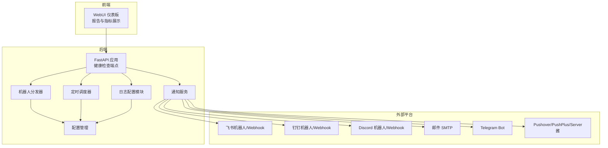
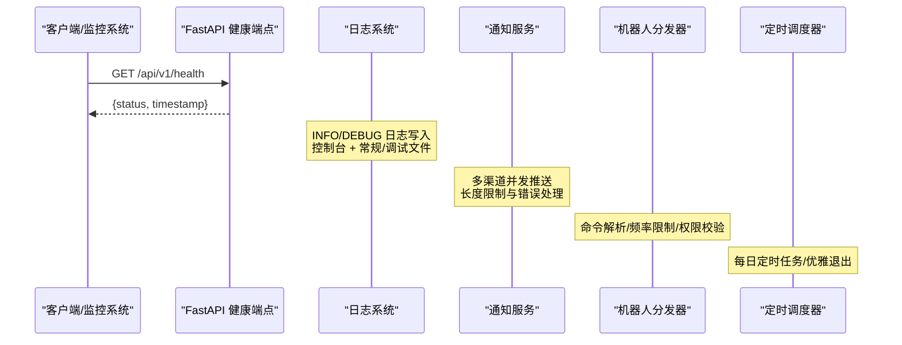
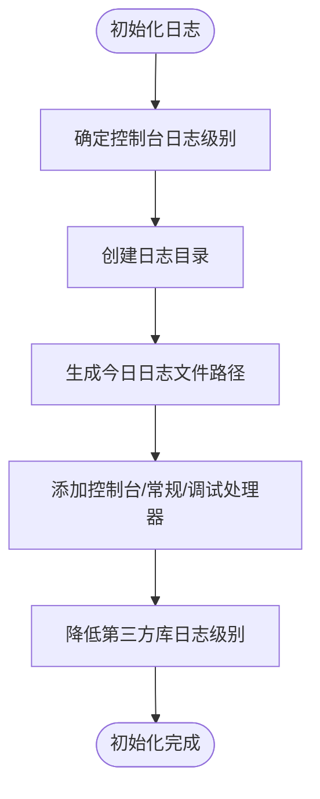
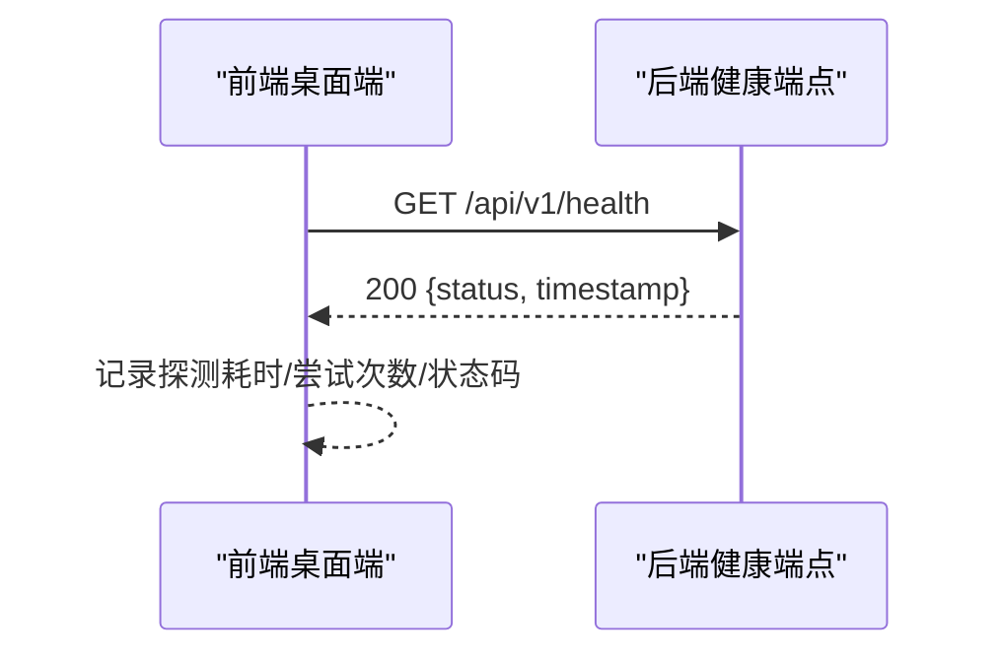
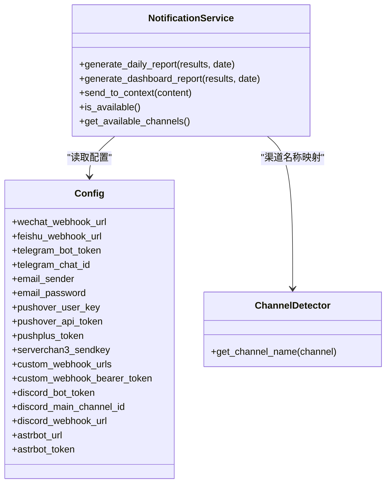
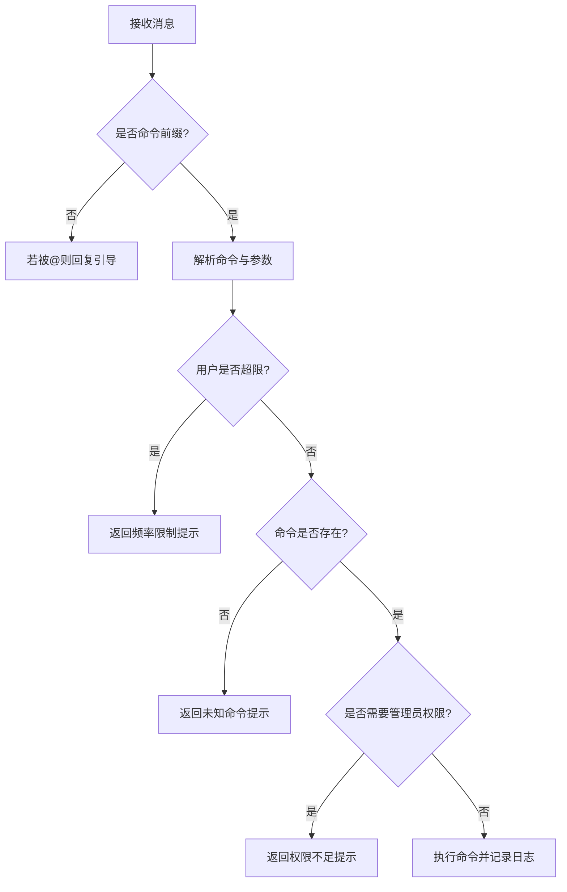
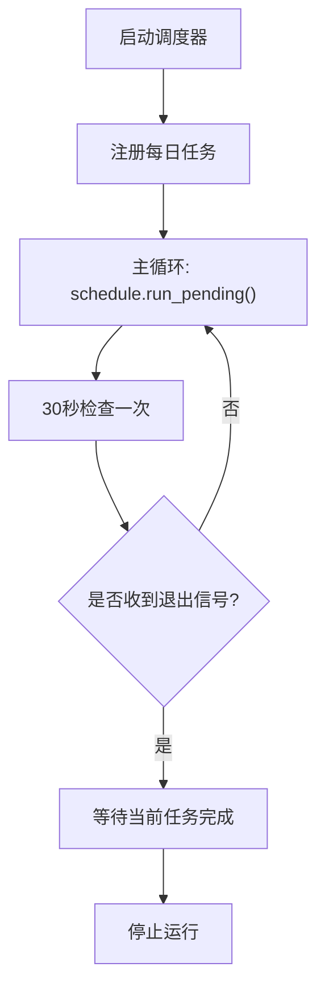
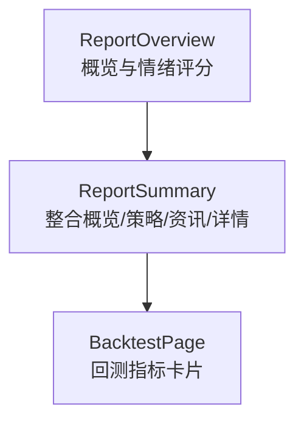
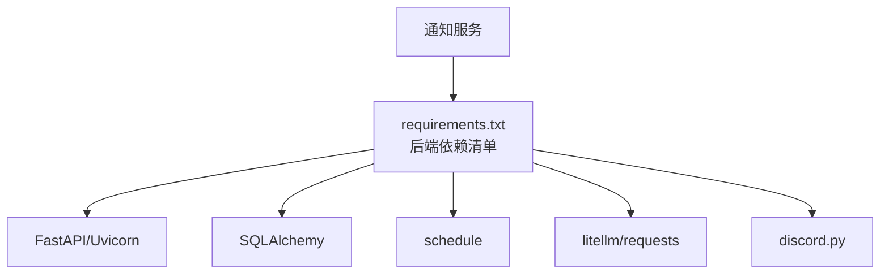

# 监控告警

<cite>
**本文引用的文件**
- [src/logging_config.py](file://src/logging_config.py)
- [api/v1/endpoints/health.py](file://api/v1/endpoints/health.py)
- [api/v1/schemas/common.py](file://api/v1/schemas/common.py)
- [src/notification.py](file://src/notification.py)
- [bot/dispatcher.py](file://bot/dispatcher.py)
- [bot/models.py](file://bot/models.py)
- [src/scheduler.py](file://src/scheduler.py)
- [src/config.py](file://src/config.py)
- [requirements.txt](file://requirements.txt)
- [apps/dsa-web/src/components/report/ReportOverview.tsx](file://apps/dsa-web/src/components/report/ReportOverview.tsx)
- [apps/dsa-web/src/components/report/ReportSummary.tsx](file://apps/dsa-web/src/components/report/ReportSummary.tsx)
- [apps/dsa-web/src/pages/BacktestPage.tsx](file://apps/dsa-web/src/pages/BacktestPage.tsx)
</cite>

## 目录
1. [简介](#简介)
2. [项目结构](#项目结构)
3. [核心组件](#核心组件)
4. [架构总览](#架构总览)
5. [详细组件分析](#详细组件分析)
6. [依赖分析](#依赖分析)
7. [性能考虑](#性能考虑)
8. [故障排查指南](#故障排查指南)
9. [结论](#结论)
10. [附录](#附录)

## 简介
本文件面向运维与开发团队，围绕系统监控与告警主题，结合仓库现有代码，给出日志系统设计、健康检查、通知通道、定时任务与可视化展示的实践说明。文档重点覆盖以下方面：
- 日志系统：日志级别、输出格式、轮转与存储策略
- 健康检查：API 健康端点与前端健康探测流程
- 通知通道：多渠道推送能力与配置要点
- 定时任务：优雅退出与每日定时执行
- 可视化：前端仪表板与关键指标展示
- 告警与去重：当前代码未内置告警规则，本文提供可落地的配置与触发机制建议

## 项目结构
本项目采用“后端 API + 机器人平台适配 + Web 前端”的分层架构。与监控告警相关的关键模块如下：
- 日志：统一日志初始化与格式化
- 健康检查：FastAPI 健康端点与前端健康探测
- 通知：多渠道推送服务
- 机器人：命令分发与频率限制
- 定时：每日定时任务与优雅退出
- 配置：集中式配置与环境变量加载
- 前端：报告与指标卡片展示

图表来源
- [src/logging_config.py:52-156](file://src/logging_config.py#L52-L156)
- [api/v1/endpoints/health.py:21-34](file://api/v1/endpoints/health.py#L21-L34)
- [src/notification.py:113-206](file://src/notification.py#L113-L206)
- [bot/dispatcher.py:79-120](file://bot/dispatcher.py#L79-L120)
- [src/scheduler.py:56-151](file://src/scheduler.py#L56-L151)
- [src/config.py:31-244](file://src/config.py#L31-L244)

章节来源
- [src/logging_config.py:52-156](file://src/logging_config.py#L52-L156)
- [api/v1/endpoints/health.py:21-34](file://api/v1/endpoints/health.py#L21-L34)
- [src/notification.py:113-206](file://src/notification.py#L113-L206)
- [bot/dispatcher.py:79-120](file://bot/dispatcher.py#L79-L120)
- [src/scheduler.py:56-151](file://src/scheduler.py#L56-L151)
- [src/config.py:31-244](file://src/config.py#L31-L244)

## 核心组件
- 日志系统：统一格式化、控制台 + 常规/调试文件三层输出、第三方库降噪、按日期轮转
- 健康检查：/api/v1/health 返回服务状态与时间戳
- 通知服务：多渠道推送（飞书、钉钉、Discord、Telegram、邮件、Pushover 等），支持长度限制与并发
- 机器人分发器：命令解析、别名映射、频率限制、权限校验
- 定时调度器：每日定时任务、优雅退出、心跳日志
- 配置中心：单例配置、环境变量加载、通知与日志等关键参数
- 前端仪表板：报告概览、指标卡片、回测指标展示

章节来源
- [src/logging_config.py:52-156](file://src/logging_config.py#L52-L156)
- [api/v1/endpoints/health.py:21-34](file://api/v1/endpoints/health.py#L21-L34)
- [src/notification.py:113-206](file://src/notification.py#L113-L206)
- [bot/dispatcher.py:79-120](file://bot/dispatcher.py#L79-L120)
- [src/scheduler.py:56-151](file://src/scheduler.py#L56-L151)
- [src/config.py:31-244](file://src/config.py#L31-L244)
- [apps/dsa-web/src/components/report/ReportOverview.tsx:1-144](file://apps/dsa-web/src/components/report/ReportOverview.tsx#L1-L144)
- [apps/dsa-web/src/components/report/ReportSummary.tsx:1-62](file://apps/dsa-web/src/components/report/ReportSummary.tsx#L1-L62)
- [apps/dsa-web/src/pages/BacktestPage.tsx:47-93](file://apps/dsa-web/src/pages/BacktestPage.tsx#L47-L93)

## 架构总览
下图展示了监控与告警相关的关键交互：日志写入、健康检查、通知通道、定时任务与前端可视化。

图表来源
- [api/v1/endpoints/health.py:21-34](file://api/v1/endpoints/health.py#L21-L34)
- [src/logging_config.py:52-156](file://src/logging_config.py#L52-L156)
- [src/notification.py:113-206](file://src/notification.py#L113-L206)
- [bot/dispatcher.py:79-120](file://bot/dispatcher.py#L79-L120)
- [src/scheduler.py:56-151](file://src/scheduler.py#L56-L151)

## 详细组件分析

### 日志系统设计与存储策略
- 日志格式：包含时间、级别、相对路径与行号，便于快速定位
- 输出层级：
  - 控制台：根据 debug 或显式级别输出
  - 常规日志文件：INFO 级别，10MB 轮转，保留 5 份
  - 调试日志文件：DEBUG 级别，50MB 轮转，保留 3 份
- 第三方库降噪：默认降低 urllib3/sqlalchemy/google/httpx 等日志级别
- 存储策略：按日期命名日志文件，避免单文件过大；轮转保留历史以便问题回溯

图表来源
- [src/logging_config.py:52-156](file://src/logging_config.py#L52-L156)

章节来源
- [src/logging_config.py:52-156](file://src/logging_config.py#L52-L156)

### 健康检查与前端探测
- 后端健康端点：返回状态与时间戳，供 LB/探针使用
- 前端健康探测：桌面端对后端健康检查的进度与超时处理，便于启动阶段观测

图表来源
- [api/v1/endpoints/health.py:21-34](file://api/v1/endpoints/health.py#L21-L34)
- [apps/dsa-web/src/pages/__tests__/SettingsPage.test.tsx:320-345](file://apps/dsa-web/src/pages/__tests__/SettingsPage.test.tsx#L320-L345)

章节来源
- [api/v1/endpoints/health.py:21-34](file://api/v1/endpoints/health.py#L21-L34)
- [api/v1/schemas/common.py:32-44](file://api/v1/schemas/common.py#L32-L44)
- [apps/dsa-web/src/pages/__tests__/SettingsPage.test.tsx:320-345](file://apps/dsa-web/src/pages/__tests__/SettingsPage.test.tsx#L320-L345)

### 通知通道与推送策略
- 支持渠道：飞书、钉钉、Discord、Telegram、邮件、Pushover、PushPlus、Server酱、自定义 Webhook、ASTRBOT
- 配置要点：各渠道 URL/Token/账号等通过配置中心注入；支持长度限制与并发推送
- 上下文渠道：支持从消息上下文提取临时会话 Webhook（如钉钉会话、飞书会话）

图表来源
- [src/notification.py:113-206](file://src/notification.py#L113-L206)
- [src/config.py:77-133](file://src/config.py#L77-L133)

章节来源
- [src/notification.py:113-206](file://src/notification.py#L113-L206)
- [src/config.py:77-133](file://src/config.py#L77-L133)

### 机器人分发与频率限制
- 命令注册/别名：支持命令名与别名查询
- 频率限制：基于滑动窗口，限制每个用户在窗口内的请求数
- 权限控制：管理员白名单
- 异常处理：命令执行异常记录日志并返回错误响应

图表来源
- [bot/dispatcher.py:21-77](file://bot/dispatcher.py#L21-L77)
- [bot/dispatcher.py:230-291](file://bot/dispatcher.py#L230-L291)
- [bot/models.py:66-116](file://bot/models.py#L66-L116)

章节来源
- [bot/dispatcher.py:21-77](file://bot/dispatcher.py#L21-L77)
- [bot/dispatcher.py:230-291](file://bot/dispatcher.py#L230-L291)
- [bot/models.py:66-116](file://bot/models.py#L66-L116)

### 定时调度与优雅退出
- 每日定时任务：支持设置执行时间、立即执行一次、周期运行
- 优雅退出：捕获 SIGINT/SIGTERM，等待当前任务完成后退出
- 心跳日志：每小时打印一次运行状态与下次执行时间

图表来源
- [src/scheduler.py:120-151](file://src/scheduler.py#L120-L151)

章节来源
- [src/scheduler.py:56-151](file://src/scheduler.py#L56-L151)

### 前端仪表板与可视化
- 报告概览：股票信息、价格涨跌、操作建议、趋势预测、情绪评分
- 指标卡片：回测页面展示方向准确率、胜率、平均回报、止损/止盈触发率等
- 展示语言：根据报告语言切换文案

图表来源
- [apps/dsa-web/src/components/report/ReportOverview.tsx:1-144](file://apps/dsa-web/src/components/report/ReportOverview.tsx#L1-L144)
- [apps/dsa-web/src/components/report/ReportSummary.tsx:1-62](file://apps/dsa-web/src/components/report/ReportSummary.tsx#L1-L62)
- [apps/dsa-web/src/pages/BacktestPage.tsx:47-93](file://apps/dsa-web/src/pages/BacktestPage.tsx#L47-L93)

章节来源
- [apps/dsa-web/src/components/report/ReportOverview.tsx:1-144](file://apps/dsa-web/src/components/report/ReportOverview.tsx#L1-L144)
- [apps/dsa-web/src/components/report/ReportSummary.tsx:1-62](file://apps/dsa-web/src/components/report/ReportSummary.tsx#L1-L62)
- [apps/dsa-web/src/pages/BacktestPage.tsx:47-93](file://apps/dsa-web/src/pages/BacktestPage.tsx#L47-L93)

## 依赖分析
- 核心运行时依赖：FastAPI、Uvicorn、SQLAlchemy、schedule、tenacity、litellm、requests/markdown2、discord.py 等
- 健康检查与前端：前端桌面端包含健康探测逻辑，后端提供 /api/v1/health
- 通知通道：通知服务依赖配置中心提供的各平台凭据

图表来源
- [requirements.txt:62-65](file://requirements.txt#L62-L65)

章节来源
- [requirements.txt:6-65](file://requirements.txt#L6-L65)

## 性能考虑
- 日志轮转：常规 10MB、调试 50MB，避免单文件过大影响 IO
- 第三方库降噪：降低 urllib3/sqlalchemy/google/httpx 等日志级别，减少噪音
- 通知并发：多渠道并发推送，注意网络抖动与限流，必要时增加重试与退避
- 前端渲染：报告与指标卡片按需加载，避免一次性渲染大量节点
- 定时任务：30 秒检查间隔与优雅退出，保证任务稳定性

## 故障排查指南
- 健康检查失败
  - 检查后端 /api/v1/health 是否可达
  - 查看前端健康探测日志（超时/状态码/错误码）
- 通知未送达
  - 核对配置中心中各渠道 URL/Token/账号
  - 关注通知服务日志中的可用渠道与错误提示
- 机器人响应异常
  - 检查命令前缀、别名与权限
  - 查看频率限制是否触发
- 日志缺失或过大
  - 确认日志目录与轮转配置
  - 检查第三方库降噪是否生效

章节来源
- [api/v1/endpoints/health.py:21-34](file://api/v1/endpoints/health.py#L21-L34)
- [apps/dsa-web/src/pages/__tests__/SettingsPage.test.tsx:320-345](file://apps/dsa-web/src/pages/__tests__/SettingsPage.test.tsx#L320-L345)
- [src/notification.py:113-206](file://src/notification.py#L113-L206)
- [bot/dispatcher.py:230-291](file://bot/dispatcher.py#L230-L291)
- [src/logging_config.py:52-156](file://src/logging_config.py#L52-L156)

## 结论
本项目提供了完善的日志、健康检查、通知通道、机器人与定时任务能力，配合前端仪表板实现了可观测性与可操作性。当前代码未内置“告警规则”与“阈值触发”，但具备充足的监控数据与通知基础设施，可在此基础上扩展告警规则、阈值与升级策略，形成闭环的监控告警体系。

## 附录

### 告警规则与触发机制（建议）
- 规则定义
  - 系统资源：CPU/内存/磁盘/IO 使用率阈值
  - 应用性能：API 响应时间、错误率、吞吐量
  - 业务指标：分析任务成功率、通知送达率、机器人命中率
- 阈值设定
  - 建议采用滚动窗口（如 5 分钟）与动态阈值（标准差/分位数）
- 告警级别
  - 告警等级：Info/Warn/Error/Critical
- 通知渠道
  - 与现有通知服务对接，支持多渠道并行
- 去重与静默
  - 去重：基于规则指纹与标签聚合
  - 静默：时段静默、标签静默
- 升级策略
  - 未确认升级：10/30/60 分钟
  - 未恢复升级：每小时升级一次

说明：以上为概念性建议，需结合实际监控系统（如 Prometheus/Grafana/PagerDuty 等）与现有通知服务实现。