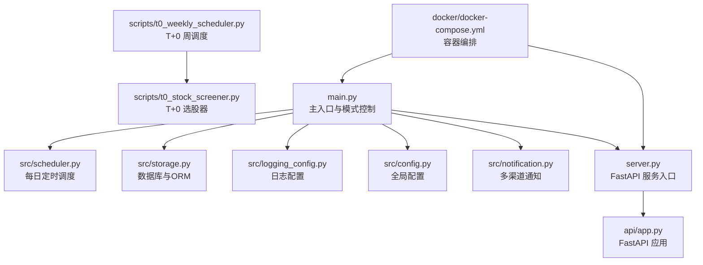
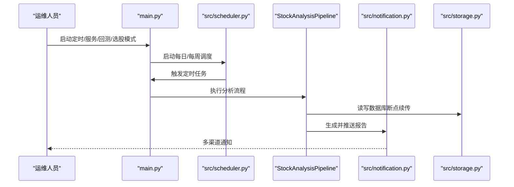
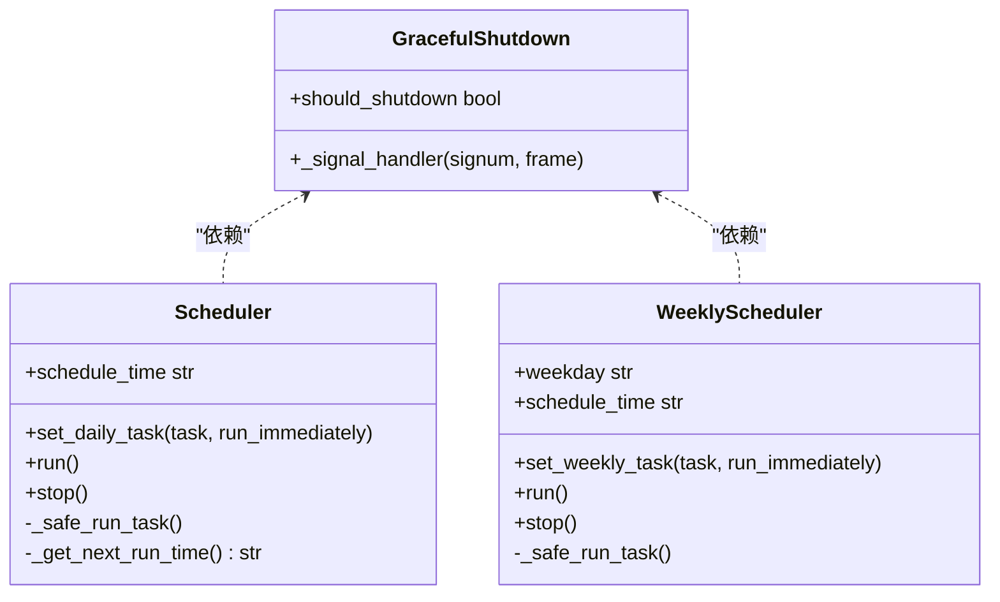
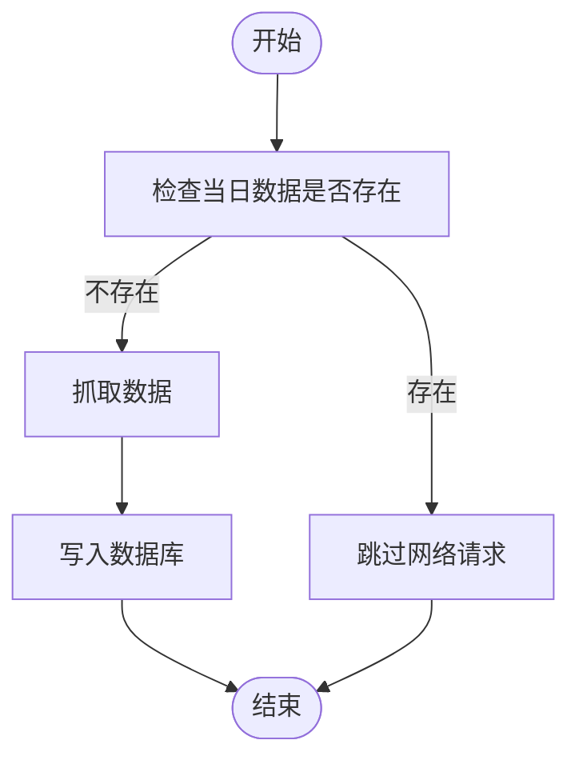
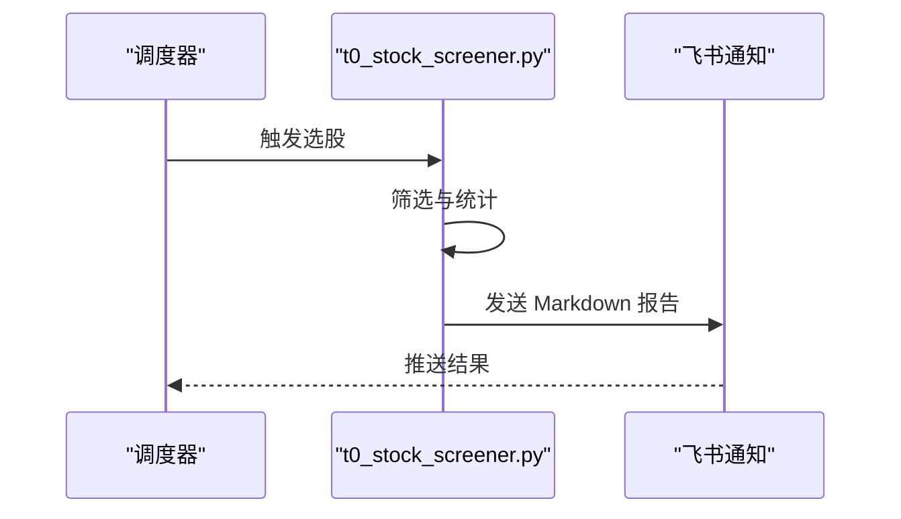
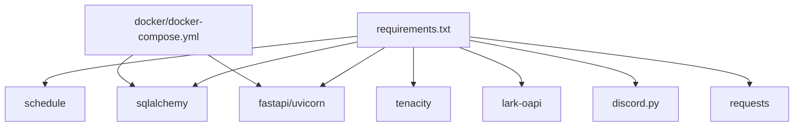

# 运维维护

<cite>
**本文引用的文件**
- [README.md](file://README.md)
- [T0_WEEKLY_README_FIRST.md](file://T0_WEEKLY_README_FIRST.md)
- [scripts/t0_weekly_scheduler.py](file://scripts/t0_weekly_scheduler.py)
- [scripts/t0_stock_screener.py](file://scripts/t0_stock_screener.py)
- [src/scheduler.py](file://src/scheduler.py)
- [src/storage.py](file://src/storage.py)
- [src/logging_config.py](file://src/logging_config.py)
- [src/config.py](file://src/config.py)
- [main.py](file://main.py)
- [server.py](file://server.py)
- [requirements.txt](file://requirements.txt)
- [docker/docker-compose.yml](file://docker/docker-compose.yml)
- [src/notification.py](file://src/notification.py)
- [src/analyzer.py](file://src/analyzer.py)
</cite>

## 目录
1. [简介](#简介)
2. [项目结构](#项目结构)
3. [核心组件](#核心组件)
4. [架构总览](#架构总览)
5. [详细组件分析](#详细组件分析)
6. [依赖分析](#依赖分析)
7. [性能考虑](#性能考虑)
8. [故障排除指南](#故障排除指南)
9. [结论](#结论)
10. [附录](#附录)

## 简介
本文件面向系统运维与维护人员，围绕日常维护任务、任务调度系统、系统升级策略、故障排除、性能优化与安全加固等方面，结合代码库的实际实现，提供可操作的指导与最佳实践。内容涵盖：
- 数据备份与恢复
- 日志轮转与清理
- 缓存与数据库维护
- 配置检查与热更新
- 定时任务监控与异常处理
- 升级策略与回滚机制
- 故障定位与修复验证
- 性能优化与并发控制
- 安全加固与合规

## 项目结构
该项目采用模块化分层设计，主要模块包括：
- 定时调度与入口：main.py、src/scheduler.py、scripts/t0_weekly_scheduler.py
- 数据与存储：src/storage.py（SQLite + SQLAlchemy）
- 日志与配置：src/logging_config.py、src/config.py
- 通知与推送：src/notification.py
- API 服务：server.py、api/app.py（由 server.py 导入）
- Docker 部署：docker/docker-compose.yml
- T+0 选股子系统：scripts/t0_stock_screener.py、scripts/t0_weekly_scheduler.py
- 依赖管理：requirements.txt

图表来源
- [main.py:1-723](file://main.py#L1-L723)
- [src/scheduler.py:1-185](file://src/scheduler.py#L1-L185)
- [src/storage.py:1-800](file://src/storage.py#L1-L800)
- [src/logging_config.py:1-156](file://src/logging_config.py#L1-L156)
- [src/config.py:1-580](file://src/config.py#L1-L580)
- [server.py:1-55](file://server.py#L1-L55)
- [scripts/t0_weekly_scheduler.py:1-227](file://scripts/t0_weekly_scheduler.py#L1-L227)
- [scripts/t0_stock_screener.py:1-555](file://scripts/t0_stock_screener.py#L1-L555)
- [docker/docker-compose.yml:1-69](file://docker/docker-compose.yml#L1-L69)

章节来源
- [README.md:1-284](file://README.md#L1-L284)
- [main.py:1-723](file://main.py#L1-L723)
- [docker/docker-compose.yml:1-69](file://docker/docker-compose.yml#L1-L69)

## 核心组件
- 定时调度器
  - 每日调度：src/scheduler.py 提供每日定时任务与优雅退出。
  - 周调度：scripts/t0_weekly_scheduler.py 提供周调度与异常处理。
- 存储与数据库
  - SQLite + SQLAlchemy，提供 ORM 模型与会话管理；支持断点续传与唯一约束。
- 日志系统
  - 统一日志格式与多通道输出（控制台、常规日志文件、调试日志文件），并降低第三方库噪声。
- 配置管理
  - 单例配置，从 .env 加载，支持热读取 STOCK_LIST。
- 通知与推送
  - 多渠道推送（企业微信、飞书、Telegram、邮件、Pushover、Discord、自定义 Webhook 等）。
- API 服务
  - server.py 导出 FastAPI 应用，支持独立启动与集成模式。

章节来源
- [src/scheduler.py:1-185](file://src/scheduler.py#L1-L185)
- [scripts/t0_weekly_scheduler.py:1-227](file://scripts/t0_weekly_scheduler.py#L1-L227)
- [src/storage.py:1-800](file://src/storage.py#L1-L800)
- [src/logging_config.py:1-156](file://src/logging_config.py#L1-L156)
- [src/config.py:1-580](file://src/config.py#L1-L580)
- [src/notification.py:1-800](file://src/notification.py#L1-L800)
- [server.py:1-55](file://server.py#L1-L55)

## 架构总览
系统通过 main.py 统一入口协调各模块，支持多种运行模式：
- 定时任务模式：每日自动执行分析与推送
- Web 服务模式：提供 API 与 Web 界面
- T+0 选股模式：每周自动选股并推送
- 回测模式：对历史分析结果进行回测评估

图表来源
- [main.py:666-690](file://main.py#L666-L690)
- [src/scheduler.py:120-139](file://src/scheduler.py#L120-L139)
- [src/storage.py:747-777](file://src/storage.py#L747-L777)
- [src/notification.py:113-206](file://src/notification.py#L113-L206)

## 详细组件分析

### 组件A：定时调度系统（每日/每周）
- 功能要点
  - 每日定时执行分析任务，支持启动时立即执行一次
  - 周调度支持自定义执行时间与星期，具备优雅退出与异常捕获
  - 通过信号处理确保任务完成后再退出
- 维护要点
  - 监控调度器心跳日志，确认下次执行时间
  - 定期检查 schedule 库安装与版本
  - 遇到异常时查看日志文件与调试日志

图表来源
- [src/scheduler.py:27-151](file://src/scheduler.py#L27-L151)
- [scripts/t0_weekly_scheduler.py:38-173](file://scripts/t0_weekly_scheduler.py#L38-L173)

章节来源
- [src/scheduler.py:56-151](file://src/scheduler.py#L56-L151)
- [scripts/t0_weekly_scheduler.py:67-173](file://scripts/t0_weekly_scheduler.py#L67-L173)

### 组件B：存储与数据库（SQLite + SQLAlchemy）
- 功能要点
  - 单例数据库管理器，自动创建表与连接池
  - 提供 has_today_data 断点续传逻辑，避免重复抓取
  - 支持上下文事务与会话管理
- 维护要点
  - 定期检查数据库文件大小与碎片
  - 使用 vacuum/analyze 优化数据库性能
  - 备份前先停止写入或使用只读快照

图表来源
- [src/storage.py:747-777](file://src/storage.py#L747-L777)
- [src/storage.py:778-800](file://src/storage.py#L778-L800)

章节来源
- [src/storage.py:623-746](file://src/storage.py#L623-L746)
- [src/storage.py:747-800](file://src/storage.py#L747-L800)

### 组件C：日志系统（统一日志配置）
- 功能要点
  - 控制台 + 常规日志文件 + 调试日志文件三层输出
  - 自动降低第三方库日志级别，减少噪音
  - 相对路径格式化，便于定位
- 维护要点
  - 定期轮转与清理日志文件，避免磁盘占用过高
  - 生产环境建议开启 INFO 级别，调试时开启 DEBUG

章节来源
- [src/logging_config.py:52-156](file://src/logging_config.py#L52-L156)

### 组件D：配置管理（单例配置）
- 功能要点
  - 从 .env 加载配置，支持热读取 STOCK_LIST
  - 提供 validate 校验缺失或无效配置项
  - 自动注入 TUSHARE_TOKEN 时优先实时数据源
- 维护要点
  - 配置变更后，确保 .env 文件权限最小化
  - 定期校验配置有效性，特别是通知渠道与 API Key

章节来源
- [src/config.py:232-437](file://src/config.py#L232-L437)
- [src/config.py:507-546](file://src/config.py#L507-L546)

### 组件E：通知与推送（多渠道）
- 功能要点
  - 支持企业微信、飞书、Telegram、邮件、Pushover、Discord、自定义 Webhook
  - 支持聚合推送与单股推送模式
  - 消息长度限制与渠道检测
- 维护要点
  - 定期测试各渠道连通性
  - 配置变更后验证通知可用性

章节来源
- [src/notification.py:113-206](file://src/notification.py#L113-L206)
- [src/notification.py:207-254](file://src/notification.py#L207-L254)

### 组件F：API 服务（FastAPI）
- 功能要点
  - server.py 导出应用，支持独立启动
  - main.py 可同时启动 API 服务与分析任务
- 维护要点
  - Docker 环境下注意端口映射与日志驱动配置
  - 生产环境建议使用反向代理与健康检查

章节来源
- [server.py:21-55](file://server.py#L21-L55)
- [main.py:445-470](file://main.py#L445-L470)
- [docker/docker-compose.yml:55-69](file://docker/docker-compose.yml#L55-L69)

### 组件G：T+0 选股系统（周调度与选股器）
- 功能要点
  - 周调度器支持自定义执行时间与星期
  - 选股器基于多维度指标筛选，支持飞书通知与 CSV 导出
  - 内置参数可调，支持放宽/收紧筛选条件
- 维护要点
  - 定期验证 Tushare Token 与积分余额
  - 检查飞书 Webhook 配置与网络可达性

图表来源
- [scripts/t0_weekly_scheduler.py:174-183](file://scripts/t0_weekly_scheduler.py#L174-L183)
- [scripts/t0_stock_screener.py:462-541](file://scripts/t0_stock_screener.py#L462-L541)

章节来源
- [scripts/t0_weekly_scheduler.py:174-227](file://scripts/t0_weekly_scheduler.py#L174-L227)
- [scripts/t0_stock_screener.py:338-460](file://scripts/t0_stock_screener.py#L338-L460)

## 依赖分析
- 核心依赖
  - schedule：轻量级定时任务
  - sqlalchemy：ORM 与数据库连接
  - tenacity：指数退避重试
  - fastapi/uvicorn：Web 服务
  - lark-oapi/discord.py/requests 等：通知与网络请求
- Docker 依赖
  - docker-compose.yml 定义服务与卷挂载，限制内存并配置日志驱动

图表来源
- [requirements.txt:1-65](file://requirements.txt#L1-L65)
- [docker/docker-compose.yml:13-54](file://docker/docker-compose.yml#L13-L54)

章节来源
- [requirements.txt:1-65](file://requirements.txt#L1-L65)
- [docker/docker-compose.yml:1-69](file://docker/docker-compose.yml#L1-L69)

## 性能考虑
- 数据库性能
  - 使用唯一约束与索引优化查询
  - 定期执行数据库维护（如 vacuum/analyze）
  - 控制并发写入，避免锁竞争
- 日志性能
  - 合理设置日志级别与轮转策略
  - 使用异步/缓冲输出（如需要）
- 并发与限流
  - 配置 max_workers 控制并发
  - 为外部 API（如 Tushare、AI 模型）设置合理的请求间隔与重试
- 缓存与断点续传
  - 利用 has_today_data 避免重复抓取
  - 合理设置实时行情缓存 TTL

章节来源
- [src/storage.py:106-110](file://src/storage.py#L106-L110)
- [src/config.py:152-156](file://src/config.py#L152-L156)
- [src/analyzer.py:531-702](file://src/analyzer.py#L531-L702)

## 故障排除指南
- 定时任务异常
  - 检查调度器日志与心跳输出
  - 确认 schedule 库安装与版本
  - 验证信号处理是否生效
- 数据库问题
  - 检查数据库文件是否存在与权限
  - 使用断点续传逻辑避免重复抓取
  - 备份前停止写入或使用只读快照
- 通知失败
  - 逐一验证各渠道配置与连通性
  - 查看通知服务可用渠道列表
- API 服务异常
  - 检查端口映射与日志驱动
  - 使用健康检查接口确认服务状态
- T+0 选股异常
  - 验证 Tushare Token 与积分余额
  - 检查飞书 Webhook 配置与网络可达性
  - 根据筛选条件放宽/收紧参数进行测试

章节来源
- [src/scheduler.py:120-139](file://src/scheduler.py#L120-L139)
- [src/storage.py:623-746](file://src/storage.py#L623-L746)
- [src/notification.py:113-206](file://src/notification.py#L113-L206)
- [server.py:46-55](file://server.py#L46-L55)
- [scripts/t0_stock_screener.py:344-358](file://scripts/t0_stock_screener.py#L344-L358)

## 结论
本系统通过模块化设计与完善的日志、配置、调度与通知机制，提供了可靠的自动化分析与推送能力。运维人员应重点关注：
- 定时任务的监控与异常处理
- 数据库与日志的维护与备份
- 配置的热更新与校验
- 通知渠道的连通性与合规
- 升级与回滚的策略与验证

## 附录

### 日常维护任务清单
- 数据备份
  - 备份 SQLite 数据库文件与日志目录
  - 使用只读快照或停止写入后备份
- 日志清理
  - 定期轮转与清理过期日志
  - 控制日志文件大小与保留数量
- 缓存与数据库维护
  - 执行数据库维护命令（如 vacuum/analyze）
  - 检查断点续传逻辑与唯一约束
- 配置检查
  - 验证 .env 配置项与权限
  - 使用 validate 方法检查缺失项
- 任务调度维护
  - 监控调度器心跳与异常日志
  - 验证信号处理与优雅退出
- 升级与回滚
  - 使用版本标签与分支管理
  - 回滚时恢复数据库与配置文件
- 安全加固
  - 最小权限原则管理 .env
  - 使用 HTTPS 与代理配置（如需要）
  - 定期扫描依赖漏洞

章节来源
- [src/storage.py:623-746](file://src/storage.py#L623-L746)
- [src/logging_config.py:52-156](file://src/logging_config.py#L52-L156)
- [src/config.py:507-546](file://src/config.py#L507-L546)
- [src/scheduler.py:120-139](file://src/scheduler.py#L120-L139)
- [server.py:46-55](file://server.py#L46-L55)