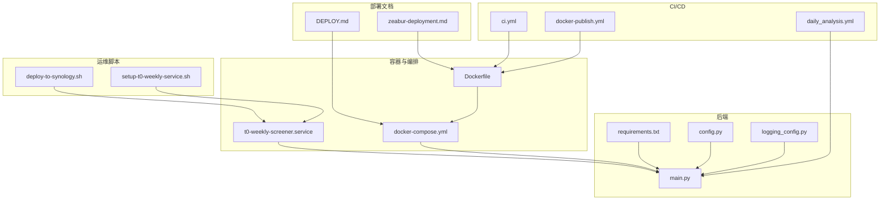
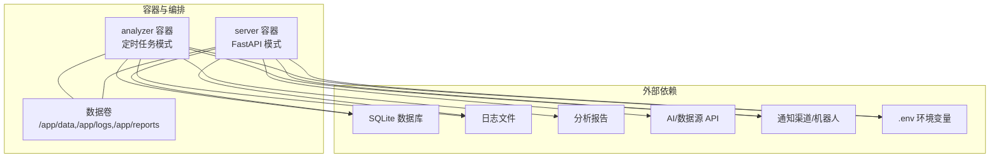
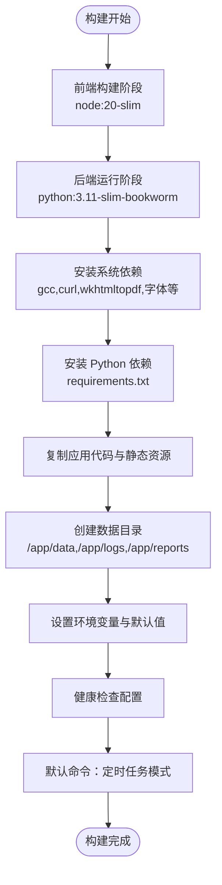
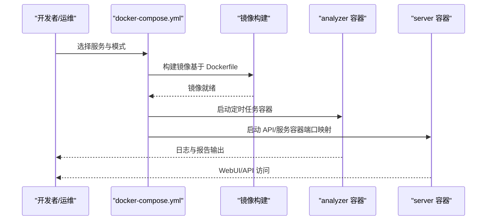
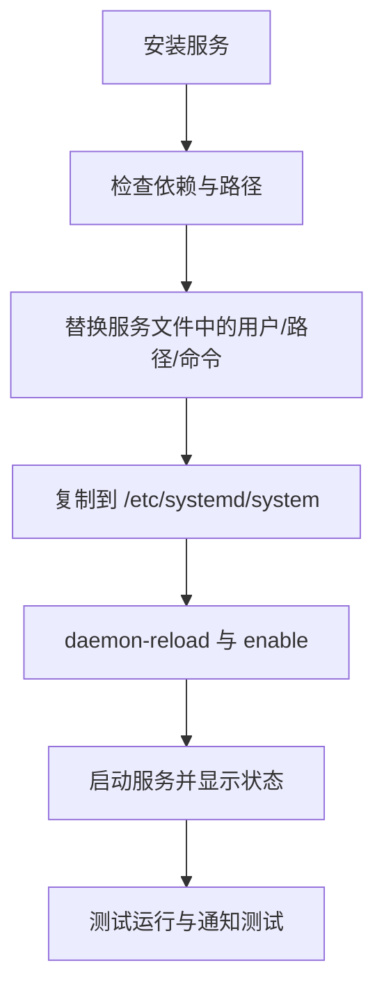
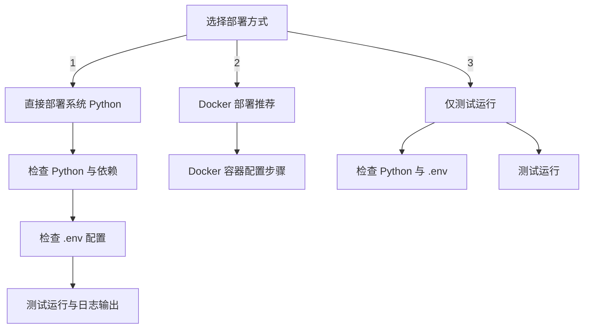
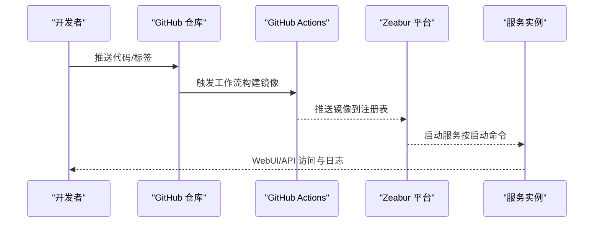
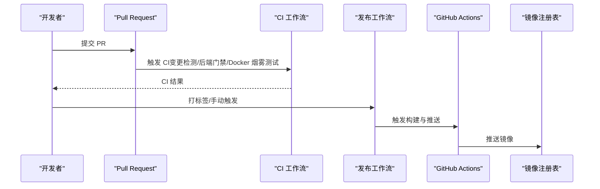
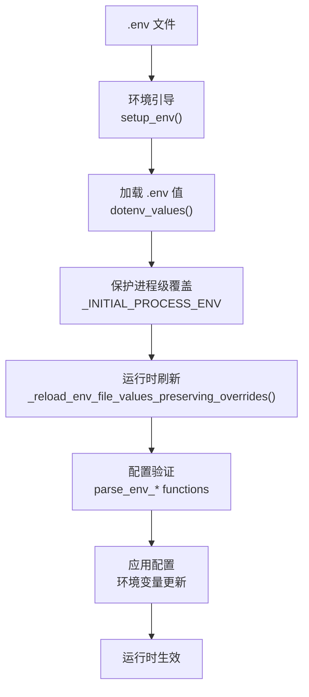
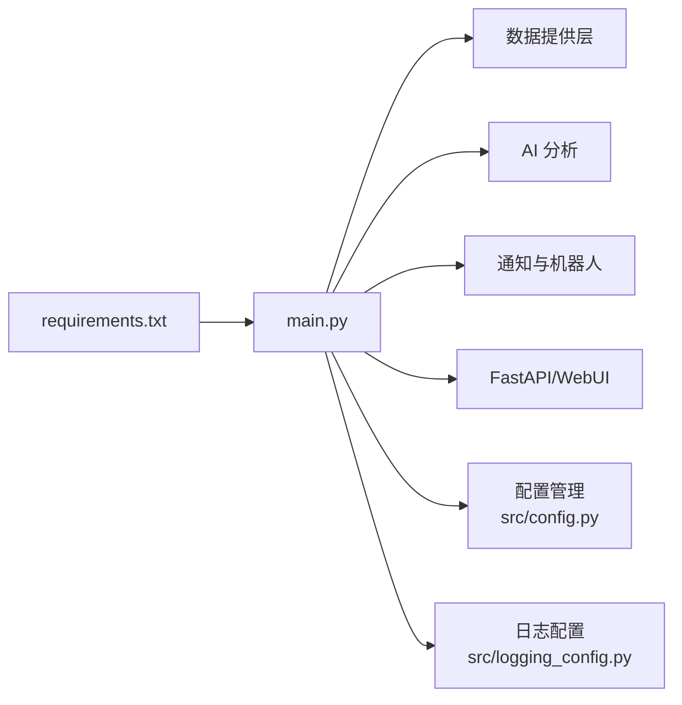

# 部署与运维

<cite>
**本文引用的文件**
- [Dockerfile](file://docker/Dockerfile)
- [docker-compose.yml](file://docker/docker-compose.yml)
- [t0-weekly-screener.service](file://docker/t0-weekly-screener.service)
- [DEPLOY.md](file://docs/DEPLOY.md)
- [zeabur-deployment.md](file://docs/docker/zeabur-deployment.md)
- [deploy-to-synology.sh](file://scripts/deploy-to-synology.sh)
- [setup-t0-weekly-service.sh](file://scripts/setup-t0-weekly-service.sh)
- [ci.yml](file://.github/workflows/ci.yml)
- [docker-publish.yml](file://.github/workflows/docker-publish.yml)
- [daily_analysis.yml](file://.github/workflows/daily_analysis.yml)
- [requirements.txt](file://requirements.txt)
- [main.py](file://main.py)
- [config.py](file://src/config.py)
- [logging_config.py](file://src/logging_config.py)
</cite>

## 更新摘要
**所做更改**
- 更新了 Docker 工作流部分，反映最新的多阶段构建和环境变量管理改进
- 增强了环境变量管理章节，详细说明 .env 文件处理和运行时环境变量更新机制
- 完善了 CI/CD 流程描述，突出环境变量注入和配置验证的新特性
- 更新了部署方式章节，强调增强的环境变量管理和配置验证功能
- 新增了环境变量管理最佳实践和故障排除指南

## 目录
1. [简介](#简介)
2. [项目结构](#项目结构)
3. [核心组件](#核心组件)
4. [架构总览](#架构总览)
5. [详细组件分析](#详细组件分析)
6. [依赖关系分析](#依赖关系分析)
7. [性能考虑](#性能考虑)
8. [故障排除指南](#故障排除指南)
9. [结论](#结论)
10. [附录](#附录)

## 简介
本文件面向系统运维与平台工程团队，提供该股票分析系统的全面部署与运维指南。内容覆盖：
- Docker 容器化配置、镜像构建与多容器编排策略
- 多种部署方式：Docker Compose、Synology 套件、云服务（含 Zeabur）、GitHub Actions 免服务器运行
- CI/CD 流程设计、自动化测试与发布策略
- 监控告警、日志收集与性能分析方法
- 故障排除、应急响应与系统恢复策略
- 运维最佳实践、安全加固与性能优化建议
- 备份恢复、容量规划与扩展升级方案
- 系统维护、版本管理与问题诊断指引

## 项目结构
该仓库采用"后端服务 + 前端 Web 应用 + 机器人/通知 + 数据提供层 + 配置与脚本"的分层组织方式。与部署运维密切相关的目录与文件包括：
- docker/：容器化与编排配置
- docs/：部署与运维文档
- scripts/：部署与服务管理脚本
- .github/workflows/：CI/CD 工作流
- requirements.txt：后端依赖清单
- main.py：主入口与命令行参数解析

**图表来源**
- [Dockerfile:1-77](file://docker/Dockerfile#L1-L77)
- [docker-compose.yml:1-69](file://docker/docker-compose.yml#L1-L69)
- [t0-weekly-screener.service:1-37](file://docker/t0-weekly-screener.service#L1-L37)
- [DEPLOY.md:1-494](file://docs/DEPLOY.md#L1-L494)
- [zeabur-deployment.md:1-334](file://docs/docker/zeabur-deployment.md#L1-L334)
- [deploy-to-synology.sh:1-225](file://scripts/deploy-to-synology.sh#L1-L225)
- [setup-t0-weekly-service.sh:1-271](file://scripts/setup-t0-weekly-service.sh#L1-L271)
- [ci.yml:1-127](file://.github/workflows/ci.yml#L1-L127)
- [docker-publish.yml:1-166](file://.github/workflows/docker-publish.yml#L1-L166)
- [daily_analysis.yml:1-313](file://.github/workflows/daily_analysis.yml#L1-L313)
- [requirements.txt:1-69](file://requirements.txt#L1-L69)
- [main.py:1-200](file://main.py#L1-L200)
- [config.py:1-200](file://src/config.py#L1-L200)
- [logging_config.py:1-156](file://src/logging_config.py#L1-L156)

**章节来源**
- [Dockerfile:1-77](file://docker/Dockerfile#L1-L77)
- [docker-compose.yml:1-69](file://docker/docker-compose.yml#L1-L69)
- [DEPLOY.md:1-494](file://docs/DEPLOY.md#L1-L494)
- [zeabur-deployment.md:1-334](file://docs/docker/zeabur-deployment.md#L1-L334)
- [deploy-to-synology.sh:1-225](file://scripts/deploy-to-synology.sh#L1-L225)
- [setup-t0-weekly-service.sh:1-271](file://scripts/setup-t0-weekly-service.sh#L1-L271)
- [ci.yml:1-127](file://.github/workflows/ci.yml#L1-L127)
- [docker-publish.yml:1-166](file://.github/workflows/docker-publish.yml#L1-L166)
- [daily_analysis.yml:1-313](file://.github/workflows/daily_analysis.yml#L1-L313)
- [requirements.txt:1-69](file://requirements.txt#L1-L69)
- [main.py:1-200](file://main.py#L1-L200)
- [config.py:1-200](file://src/config.py#L1-L200)
- [logging_config.py:1-156](file://src/logging_config.py#L1-L156)

## 核心组件
- 容器镜像与多阶段构建：前端在独立阶段打包，后端在 Python slim 基础镜像中运行，集成系统依赖与静态资源。
- Docker Compose 编排：统一构建、环境变量注入、数据卷挂载、健康检查与资源限制。
- 系统服务与定时任务：systemd 服务文件与 Shell 脚本，支持开机自启、自动重启与日志管理。
- 云与免服务器部署：Zeabur 部署指南与 GitHub Actions 工作流，支持 API 服务、WebUI、机器人与定时分析。
- CI/CD：多阶段流水线，包含变更检测、后端门禁、Docker 构建烟雾测试、发布门禁与镜像推送。
- 环境变量管理：增强的 .env 文件处理、运行时环境变量更新机制和配置验证功能。

**章节来源**
- [Dockerfile:1-77](file://docker/Dockerfile#L1-L77)
- [docker-compose.yml:1-69](file://docker/docker-compose.yml#L1-L69)
- [t0-weekly-screener.service:1-37](file://docker/t0-weekly-screener.service#L1-L37)
- [DEPLOY.md:1-494](file://docs/DEPLOY.md#L1-L494)
- [zeabur-deployment.md:1-334](file://docs/docker/zeabur-deployment.md#L1-L334)
- [ci.yml:1-127](file://.github/workflows/ci.yml#L1-L127)
- [docker-publish.yml:1-166](file://.github/workflows/docker-publish.yml#L1-L166)
- [daily_analysis.yml:1-313](file://.github/workflows/daily_analysis.yml#L1-L313)
- [config.py:1-200](file://src/config.py#L1-L200)
- [main.py:1-200](file://main.py#L1-L200)

## 架构总览
系统支持多种运行模式与部署形态，核心交互如下：

**图表来源**
- [docker-compose.yml:55-69](file://docker/docker-compose.yml#L55-L69)
- [Dockerfile:53-77](file://docker/Dockerfile#L53-L77)
- [main.py:62-200](file://main.py#L62-L200)

## 详细组件分析

### Docker 容器化与镜像构建
- 多阶段构建：前端在 node:20-slim 中打包，后端在 python:3.11-slim-bookworm 中运行，减少镜像体积并提升安全性。
- 系统依赖：安装编译工具、wkhtmltopdf 及其依赖，确保 Markdown 转图片能力。
- 环境变量与默认值：设置时区、日志目录、数据库路径、Web/API 监听地址与端口。
- 数据卷：暴露 /app/data、/app/logs、/app/reports，便于持久化与备份。
- 健康检查：对 FastAPI 的 /api/health 与 WebUI 的 /health 进行探测，非服务模式返回健康。
- 默认命令：启动定时任务模式，可通过覆盖命令切换为仅 API 服务模式。

**图表来源**
- [Dockerfile:6-77](file://docker/Dockerfile#L6-L77)

**章节来源**
- [Dockerfile:1-77](file://docker/Dockerfile#L1-L77)

### Docker Compose 多容器编排
- 通用模板：build 来源、重启策略、环境变量文件、数据卷挂载、日志驱动与资源限制。
- 服务定义：
  - analyzer：定时任务模式容器，适合后台分析与报告生成。
  - server：FastAPI 模式容器，对外提供 API 与 WebUI，支持端口映射与命令覆盖。
- 环境变量：从 .env 注入，包含时区、监听地址、API 端口等。
- 数据持久化：将宿主机目录挂载至容器内的数据、日志与报告目录。
- 资源限制：限制内存上限与预留，避免资源争用。

**图表来源**
- [docker-compose.yml:10-69](file://docker/docker-compose.yml#L10-L69)
- [Dockerfile:1-77](file://docker/Dockerfile#L1-L77)

**章节来源**
- [docker-compose.yml:1-69](file://docker/docker-compose.yml#L1-L69)

### 系统服务与定时任务（systemd）
- 服务文件：定义用户、工作目录、执行命令、自动重启与日志输出到 journald。
- 部署脚本：自动检查依赖、替换路径与用户、安装到 /etc/systemd/system、重载并启用服务。
- 状态与日志：提供 systemctl 管理命令与 journalctl 查看日志。
- 测试运行：支持不带通知与带通知的测试执行，便于验证配置。

**图表来源**
- [setup-t0-weekly-service.sh:87-141](file://scripts/setup-t0-weekly-service.sh#L87-L141)
- [t0-weekly-screener.service:1-37](file://docker/t0-weekly-screener.service#L1-L37)

**章节来源**
- [setup-t0-weekly-service.sh:1-271](file://scripts/setup-t0-weekly-service.sh#L1-L271)
- [t0-weekly-screener.service:1-37](file://docker/t0-weekly-screener.service#L1-L37)

### Synology 套件部署
- 脚本化部署：提供直接部署（系统 Python）、Docker 部署与测试运行三种模式。
- 配置检查：校验 .env 文件与关键配置项（如飞书 Webhook、Tushare Token）。
- 任务计划：提供 DSM 任务计划配置步骤，支持每周定时执行。
- Docker 部署：推荐使用 Container Manager，提供完整的容器配置步骤与环境变量设置。

**图表来源**
- [deploy-to-synology.sh:156-207](file://scripts/deploy-to-synology.sh#L156-L207)

**章节来源**
- [deploy-to-synology.sh:1-225](file://scripts/deploy-to-synology.sh#L1-L225)

### 云服务与 Zeabur 部署
- 部署流程：连接 GitHub 仓库、自动检测 Dockerfile、构建镜像、启动服务。
- 启动命令：支持定时任务、FastAPI、仅 API、仅大盘复盘等多种模式。
- 环境变量：API 服务、分析配置、通知渠道等通过环境变量管理。
- 挂载配置：持久化存储 /app/data、/app/logs、/app/reports。
- 健康检查：内置 WebUI/HTTP 健康端点检查。
- 监控与日志：Zeabur 控制台提供日志与监控指标。

**图表来源**
- [docker-publish.yml:1-166](file://.github/workflows/docker-publish.yml#L1-L166)
- [zeabur-deployment.md:1-334](file://docs/docker/zeabur-deployment.md#L1-L334)

**章节来源**
- [zeabur-deployment.md:1-334](file://docs/docker/zeabur-deployment.md#L1-L334)
- [docker-publish.yml:1-166](file://.github/workflows/docker-publish.yml#L1-L166)

### CI/CD 流程设计与自动化测试
- CI 工作流（ci.yml）：
  - 变更检测：区分前端与后端变更，减少不必要的构建。
  - AI 资产治理：检查 AI 相关资产。
  - 后端门禁：安装依赖并执行后端门禁脚本。
  - Docker 构建与烟雾测试：构建镜像并在容器内验证关键模块导入。
  - 前端门禁：仅在前端路径有变更时执行 Lint 与 Build。
- 发布工作流（docker-publish.yml）：
  - 触发条件：打标签或手动触发。
  - 发布前门禁：后端门禁、发布文档校验（标签注释）。
  - 构建与推送：使用 metadata 动态生成标签，构建并推送到 ghcr.io。
- 定时分析工作流（daily_analysis.yml）：
  - 定时触发：周一到周五北京时间 18:00（UTC 10:00）。
  - 多渠道通知：支持企业微信、飞书、Telegram、Discord、邮件等。
  - 运行模式：完整分析、仅大盘复盘、仅股票分析。
  - 超时与并发控制：设置超时与并发组，避免资源冲突。

**图表来源**
- [ci.yml:1-127](file://.github/workflows/ci.yml#L1-L127)
- [docker-publish.yml:1-166](file://.github/workflows/docker-publish.yml#L1-L166)
- [daily_analysis.yml:1-313](file://.github/workflows/daily_analysis.yml#L1-L313)

**章节来源**
- [ci.yml:1-127](file://.github/workflows/ci.yml#L1-L127)
- [docker-publish.yml:1-166](file://.github/workflows/docker-publish.yml#L1-L166)
- [daily_analysis.yml:1-313](file://.github/workflows/daily_analysis.yml#L1-L313)

### 环境变量管理增强
**更新** 系统现在具备增强的环境变量管理功能，包括：

- **.env 文件处理**：主程序启动时自动加载 .env 文件，支持运行时重新加载而不影响进程环境变量。
- **运行时环境变量更新**：提供 `_reload_env_file_values_preserving_overrides()` 函数，允许在不破坏进程级环境变量的情况下刷新 .env 管理的环境变量。
- **配置验证**：通过 `src/config.py` 中的配置管理模块，提供类型安全的配置访问和验证。
- **代理配置**：支持通过 `USE_PROXY` 环境变量控制代理设置，适用于 GitHub Actions 等特定环境。

**图表来源**
- [main.py:62-200](file://main.py#L62-L200)
- [config.py:62-160](file://src/config.py#L62-L160)

**章节来源**
- [main.py:1-200](file://main.py#L1-L200)
- [config.py:1-200](file://src/config.py#L1-L200)

### 部署方式与配置要点
- Docker Compose 部署（推荐）
  - 安装 Docker，准备 .env，一键启动 analyzer 与 server。
  - 常用命令：启动、停止、重启、日志查看、进入容器调试、手动执行分析。
  - 数据持久化：挂载 data、logs、reports 目录。
- 直接部署
  - 安装 Python 3.10+，创建虚拟环境，安装 requirements.txt。
  - 配置 .env，支持前台运行、后台运行、WebUI 启动与定时任务模式。
- Systemd 服务
  - 使用 systemd 服务文件与安装脚本，实现开机自启、自动重启与日志管理。
- GitHub Actions 免服务器部署
  - 配置 Secrets（AI/数据源/通知渠道），设置定时与手动触发，查看 Artifacts 报告。
- Zeabur 部署
  - 连接 GitHub 仓库，自动检测 Dockerfile，配置启动命令、环境变量与持久化存储。

**章节来源**
- [DEPLOY.md:18-494](file://docs/DEPLOY.md#L18-L494)
- [zeabur-deployment.md:1-334](file://docs/docker/zeabur-deployment.md#L1-L334)

### 监控告警、日志收集与性能分析
- 日志查看
  - Docker：docker-compose logs -f --tail=100。
  - 直接部署：tail -f /opt/stock-analyzer/logs/stock_analysis_*.log。
- 健康检查
  - Docker：HEALTHCHECK 检查 /api/health 与 /health。
  - Zeabur：内置健康检查与监控指标（CPU、内存、网络、磁盘）。
- 性能分析
  - 资源限制：Compose 中设置内存上限与预留。
  - 并发与线程：通过命令行参数与配置控制并发线程数。
- 通知与可观测性
  - 多渠道通知：企业微信、飞书、Telegram、Discord、邮件等。
  - 日志轮转：Compose 中使用 json-file 驱动并限制大小与数量。

**章节来源**
- [DEPLOY.md:238-301](file://docs/DEPLOY.md#L238-L301)
- [zeabur-deployment.md:193-288](file://docs/docker/zeabur-deployment.md#L193-L288)
- [docker-compose.yml:42-53](file://docker/docker-compose.yml#L42-L53)

### 故障排除指南、应急响应与恢复策略
- 常见问题
  - Docker 构建失败：清理缓存后重新构建。
  - API 访问超时：检查代理配置与网络连通性。
  - 数据库锁定：停止服务后删除锁文件。
  - 内存不足：调整 Compose 中的内存限制。
- 应急响应
  - 快速降级：切换到备用数据源或禁用部分功能。
  - 临时修复：通过环境变量或命令行参数调整运行模式。
- 系统恢复
  - 数据恢复：从持久化卷恢复 /app/data。
  - 配置恢复：从 .env 与环境变量恢复。
  - 服务恢复：systemd 重启服务或重建容器。

**章节来源**
- [DEPLOY.md:272-301](file://docs/DEPLOY.md#L272-L301)

### 运维最佳实践、安全加固与性能优化
- 最佳实践
  - 使用持久化存储：始终挂载 /app/data。
  - 合理健康检查：根据实际服务行为调整参数。
  - 环境变量管理：敏感信息通过 Secrets/环境变量注入。
  - 定期备份：下载 /app/data 目录进行备份。
  - 启动模式选择：按需选择定时任务或 API 服务模式。
  - 监控服务状态：定期检查日志与指标。
- 安全加固
  - 限制容器权限与网络访问。
  - 使用只读挂载策略（如 strategies 目录 ro）。
  - 通过环境变量注入密钥，避免硬编码。
- 性能优化
  - 调整并发线程数与资源限制。
  - 使用多阶段构建减小镜像体积。
  - 合理的日志轮转与清理策略。

**章节来源**
- [zeabur-deployment.md:322-330](file://docs/docker/zeabur-deployment.md#L322-L330)
- [docker-compose.yml:23-53](file://docker/docker-compose.yml#L23-L53)

### 备份恢复、容量规划与扩展升级
- 备份恢复
  - 定期导出 /app/data 目录，结合 .env 与 reports 目录进行完整备份。
  - 迁移时在目标服务器解压并启动服务。
- 容量规划
  - 日志与报告按天/月清理策略，避免磁盘占满。
  - 根据并发与数据量调整内存与存储。
- 扩展升级
  - 多实例部署：分别运行 API 服务、定时任务与机器人实例，共享 /app/data。
  - 自动更新：推送新代码后自动触发构建与部署。

**章节来源**
- [DEPLOY.md:304-320](file://docs/DEPLOY.md#L304-L320)
- [zeabur-deployment.md:235-271](file://docs/docker/zeabur-deployment.md#L235-L271)

### 系统维护、版本管理与问题诊断
- 版本管理
  - 使用语义化标签，发布前门禁校验标签注释。
  - 通过 CI/CD 自动构建与推送镜像。
- 系统维护
  - 定期清理旧日志与报告。
  - 检查服务状态与日志，及时发现异常。
- 问题诊断
  - 进入容器调试：docker exec 或 Zeabur exec。
  - 检查环境变量与网络连通性。
  - 查看 Artifacts 报告与日志。

**章节来源**
- [docker-publish.yml:58-78](file://.github/workflows/docker-publish.yml#L58-L78)
- [daily_analysis.yml:258-313](file://.github/workflows/daily_analysis.yml#L258-L313)
- [zeabur-deployment.md:289-321](file://docs/docker/zeabur-deployment.md#L289-L321)

## 依赖关系分析
- 后端依赖：通过 requirements.txt 管理，包含数据源、AI 分析、通知渠道、Web 框架等。
- 前端依赖：apps/dsa-web 使用 Node.js 生态，Dockerfile 中在构建阶段打包静态资源。
- 运行时依赖：容器内安装系统依赖（如 wkhtmltopdf），满足 Markdown 转图片需求。
- 通知与机器人：支持多种通知渠道，通过环境变量启用。

**图表来源**
- [requirements.txt:1-69](file://requirements.txt#L1-L69)
- [main.py:1-200](file://main.py#L1-L200)
- [config.py:1-200](file://src/config.py#L1-L200)
- [logging_config.py:1-156](file://src/logging_config.py#L1-L156)

**章节来源**
- [requirements.txt:1-69](file://requirements.txt#L1-L69)
- [main.py:1-200](file://main.py#L1-L200)
- [config.py:1-200](file://src/config.py#L1-L200)
- [logging_config.py:1-156](file://src/logging_config.py#L1-L156)

## 性能考虑
- 容器资源限制：Compose 中设置内存上限与预留，避免资源争用。
- 并发与线程：通过命令行参数与配置控制并发线程数，平衡吞吐与稳定性。
- 镜像体积：多阶段构建减少镜像体积，缩短拉取与启动时间。
- 日志轮转：使用 json-file 驱动并限制大小与数量，降低磁盘压力。

**章节来源**
- [docker-compose.yml:48-53](file://docker/docker-compose.yml#L48-L53)
- [Dockerfile:26-35](file://docker/Dockerfile#L26-L35)

## 故障排除指南
- Docker 构建失败：清理缓存后重新构建。
- API 访问超时：检查代理配置与网络连通性。
- 数据库锁定：停止服务后删除锁文件。
- 内存不足：调整 Compose 中的内存限制。
- 日志查看：Docker 使用 docker-compose logs -f，直接部署使用 tail -f。
- 服务状态：systemd 使用 systemctl status，Zeabur 使用控制台日志与监控。

**章节来源**
- [DEPLOY.md:272-301](file://docs/DEPLOY.md#L272-L301)
- [zeabur-deployment.md:289-321](file://docs/docker/zeabur-deployment.md#L289-L321)

## 结论
本指南提供了从容器化、编排到多平台部署的完整运维方案，配合 CI/CD 流水线与监控日志体系，能够支撑系统在不同环境下的稳定运行与持续交付。新增的增强环境变量管理功能进一步提升了配置灵活性和安全性。建议在生产环境中遵循持久化存储、健康检查、环境变量管理与定期备份的最佳实践，并根据业务负载动态调整资源与并发策略。

## 附录
- 常用命令与路径参考
  - Docker Compose：启动、停止、重启、日志、进入容器、手动执行分析。
  - systemd：安装服务、查看状态、启动/停止/重启、卸载服务。
  - GitHub Actions：查看工作流运行历史、Artifacts、手动触发与定时配置。
  - Zeabur：查看日志、监控指标、环境变量与存储卷配置。

**章节来源**
- [DEPLOY.md:62-137](file://docs/DEPLOY.md#L62-L137)
- [setup-t0-weekly-service.sh:211-271](file://scripts/setup-t0-weekly-service.sh#L211-L271)
- [daily_analysis.yml:38-313](file://.github/workflows/daily_analysis.yml#L38-L313)
- [zeabur-deployment.md:272-321](file://docs/docker/zeabur-deployment.md#L272-L321)