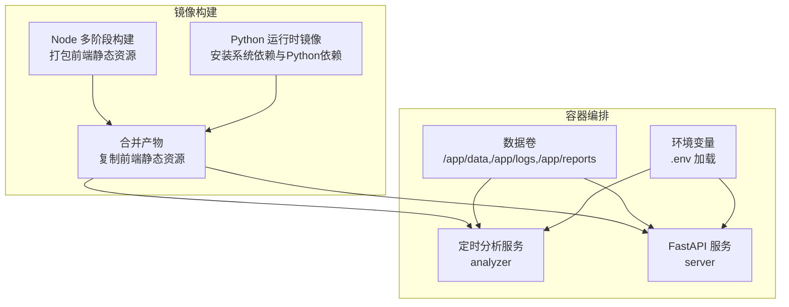
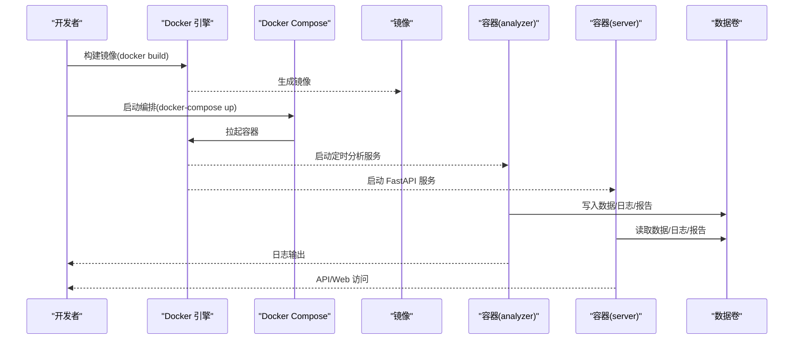
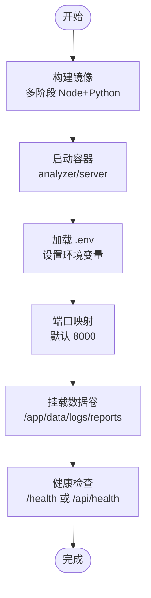
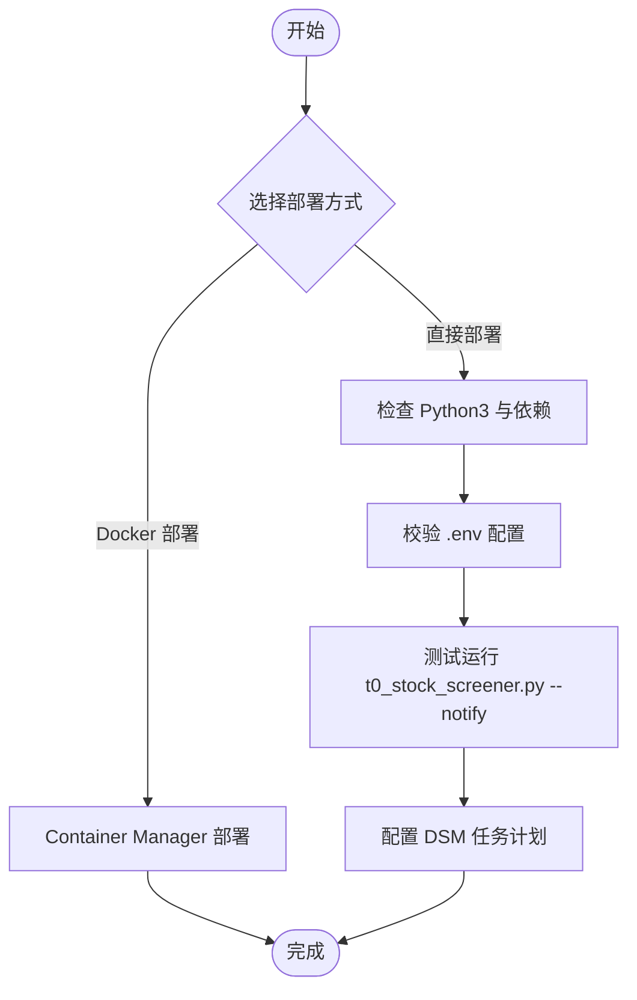
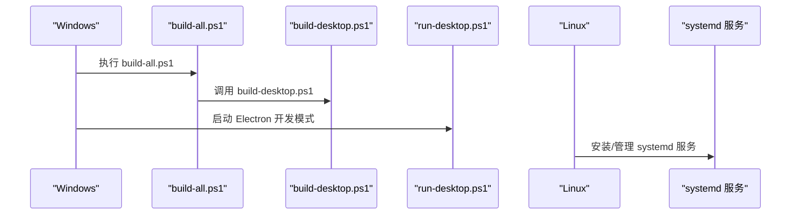
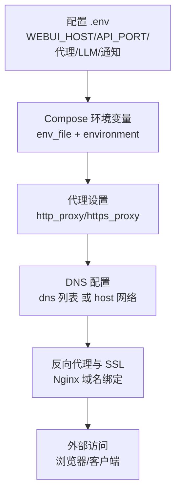
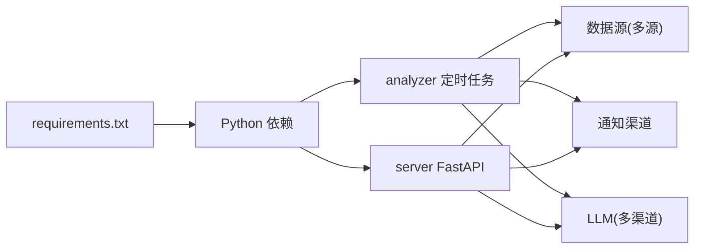
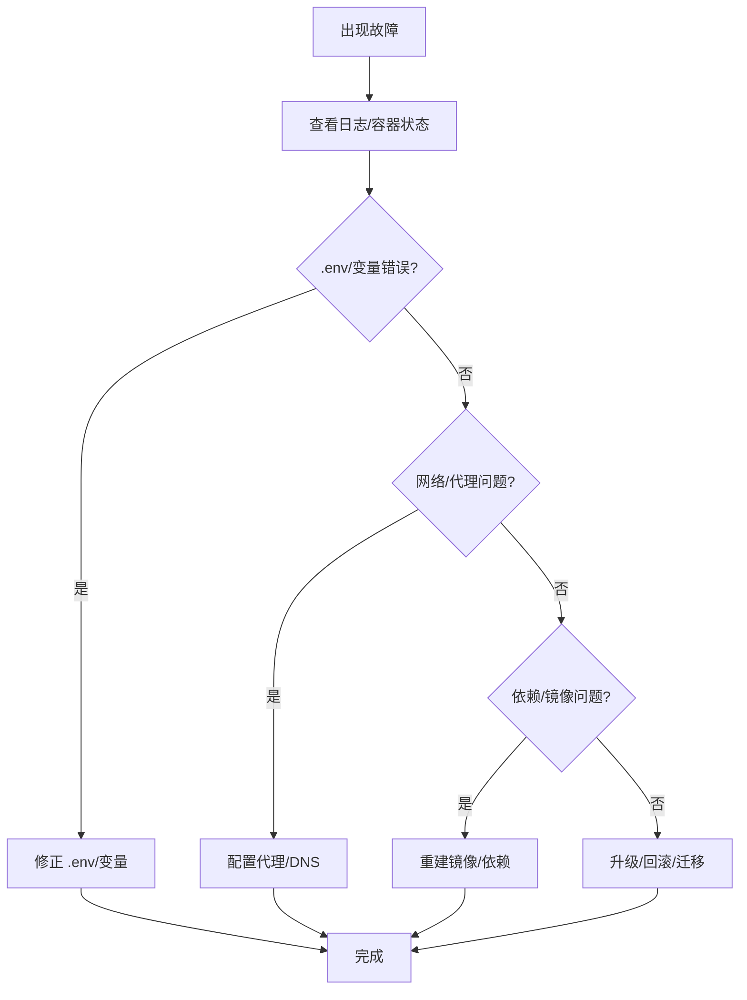

# 部署方式

<cite>
**本文引用的文件**
- [Dockerfile](file://docker/Dockerfile)
- [docker-compose.yml](file://docker/docker-compose.yml)
- [t0-weekly-screener.service](file://docker/t0-weekly-screener.service)
- [DEPLOY.md](file://docs/DEPLOY.md)
- [T0_WEEKLY_DEPLOYMENT_CHECKLIST.md](file://docs/T0_WEEKLY_DEPLOYMENT_CHECKLIST.md)
- [t0-weekly-screener-config.md](file://docs/t0-weekly-screener-config.md)
- [deploy-to-synology.sh](file://scripts/deploy-to-synology.sh)
- [setup-t0-weekly-service.sh](file://scripts/setup-t0-weekly-service.sh)
- [requirements.txt](file://requirements.txt)
- [cloudflare-gemini-proxy.js](file://scripts/cloudflare-gemini-proxy.js)
- [main.py](file://main.py)
- [FAQ.md](file://docs/FAQ.md)
</cite>

## 目录
1. [简介](#简介)
2. [项目结构](#项目结构)
3. [核心组件](#核心组件)
4. [架构总览](#架构总览)
5. [详细组件分析](#详细组件分析)
6. [依赖关系分析](#依赖关系分析)
7. [性能考虑](#性能考虑)
8. [故障排查指南](#故障排查指南)
9. [结论](#结论)
10. [附录](#附录)

## 简介
本指南面向不同技术背景的用户，提供多种部署路径的完整实施指南，覆盖：
- Docker 部署：镜像构建、容器启动、Compose 编排与配置管理
- Synology 套件部署：DSM 应用安装、权限配置与系统集成
- 本地开发部署：Windows 与 Linux 环境下的构建脚本使用
- 云服务部署策略：环境变量配置、域名绑定与 SSL 证书设置
- 不同部署场景的配置差异与注意事项
- 部署前检查清单、部署后验证步骤与常见问题解决方案
- 面向不同技术水平的部署路径选择建议

## 项目结构
该项目采用多阶段构建与多服务编排思路：
- 后端与 Web 前端分离：前端静态资源在多阶段构建中打包，后端 Python 服务提供 API 与 Web 界面
- Docker Compose 提供统一编排：定时分析服务与 FastAPI 服务可独立或共同运行
- 配置通过 .env 文件集中管理，支持代理、时区、端口、卷挂载等
- 本地开发与生产环境通过命令行参数与环境变量解耦

**图表来源**
- [Dockerfile:1-77](file://docker/Dockerfile#L1-L77)
- [docker-compose.yml:1-69](file://docker/docker-compose.yml#L1-L69)

**章节来源**
- [Dockerfile:1-77](file://docker/Dockerfile#L1-L77)
- [docker-compose.yml:1-69](file://docker/docker-compose.yml#L1-L69)

## 核心组件
- Docker 镜像与 Compose
  - 多阶段构建：前端静态资源在 Node 镜像中构建，Python 运行时镜像中安装系统与 Python 依赖
  - 环境变量默认值：日志目录、数据库路径、Web 监听地址与端口
  - 健康检查：对 /health 与 /api/health 的轮询探测
  - 数据卷：/app/data、/app/logs、/app/reports 持久化
- 定时分析与 Web 服务
  - analyzer：定时任务模式，配合 schedule 执行分析
  - server：FastAPI 服务，支持 --serve-only 与 --host/--port 参数
- Synology 部署脚本
  - deploy-to-synology.sh：提供直接部署与 Docker 部署两种路径，含依赖检查、.env 校验、测试运行与任务计划配置
  - setup-t0-weekly-service.sh：systemd 服务安装与管理，支持测试运行、状态查询与卸载
- 依赖与环境
  - requirements.txt：核心依赖、数据源、AI 分析、网络请求、Discord、报告模板引擎、FastAPI 等
  - main.py：命令行参数解析与运行模式（定时、Web、Serve 等）

**章节来源**
- [Dockerfile:1-77](file://docker/Dockerfile#L1-L77)
- [docker-compose.yml:1-69](file://docker/docker-compose.yml#L1-L69)
- [requirements.txt:1-65](file://requirements.txt#L1-L65)
- [main.py:57-200](file://main.py#L57-L200)

## 架构总览
下图展示从镜像构建到容器运行、再到服务编排的整体流程。

**图表来源**
- [Dockerfile:1-77](file://docker/Dockerfile#L1-L77)
- [docker-compose.yml:1-69](file://docker/docker-compose.yml#L1-L69)

## 详细组件分析

### Docker 部署流程
- 镜像构建
  - 多阶段：前端在 node:20-slim 中构建，Python 在 python:3.11-slim-bookworm 中安装系统依赖与 Python 依赖
  - 时区设置：Asia/Shanghai；安装 wkhtmltopdf 与字体依赖
  - 复制静态资源：将前端构建产物复制到 /static
- 容器启动
  - 默认命令：执行定时分析（--schedule）
  - FastAPI 模式：通过 server 服务覆盖命令为 --serve-only 并绑定 0.0.0.0
  - 端口映射：默认 8000，可通过 API_PORT 覆盖
- 配置管理
  - .env 文件通过 env_file 挂载到容器内
  - 环境变量：WEBUI_HOST、API_PORT、TZ 等
  - 代理设置：http_proxy/https_proxy（Compose 中可配置）
  - 资源限制：内存上限与预留
- 健康检查
  - 对 /health 与 /api/health 的轮询探测，失败时重试

**图表来源**
- [Dockerfile:1-77](file://docker/Dockerfile#L1-L77)
- [docker-compose.yml:1-69](file://docker/docker-compose.yml#L1-L69)

**章节来源**
- [Dockerfile:1-77](file://docker/Dockerfile#L1-L77)
- [docker-compose.yml:1-69](file://docker/docker-compose.yml#L1-L69)

### Synology 套件部署方法
- 直接部署（使用系统 Python）
  - 检查 Python3 与依赖：schedule、pandas、numpy、requests、dotenv
  - .env 校验：FEISHU_WEBHOOK_URL、TUSHARE_TOKEN
  - 测试运行：执行 t0_stock_screener.py --notify
  - 创建启动脚本与任务计划：通过 DSM 任务计划配置每周执行
- Docker 部署（推荐）
  - Container Manager 安装 python:3.10-slim 镜像
  - 配置容器：自动重启、执行指令（pip 安装依赖并启动调度器）、存储映射、可选环境变量
  - 优势：环境隔离、易于管理、不影响系统 Python

**图表来源**
- [deploy-to-synology.sh:1-225](file://scripts/deploy-to-synology.sh#L1-L225)

**章节来源**
- [deploy-to-synology.sh:1-225](file://scripts/deploy-to-synology.sh#L1-L225)

### 本地开发部署（Windows 与 Linux）
- Windows
  - build-all.ps1：依次调用后端与桌面构建脚本
  - build-desktop.ps1：检查开发者模式、设置 Electron Builder 缓存、构建桌面应用
  - run-desktop.ps1：构建 React 静态资源并启动 Electron 开发模式
- Linux
  - systemd 服务：setup-t0-weekly-service.sh 支持安装、状态查询、启动/停止/重启、卸载与测试运行
  - 服务文件模板：t0-weekly-screener.service，需替换 User、WorkingDirectory、ExecStart

**图表来源**
- [build-all.ps1:1-9](file://scripts/build-all.ps1#L1-L9)
- [build-desktop.ps1:1-63](file://scripts/build-desktop.ps1#L1-L63)
- [run-desktop.ps1:1-18](file://scripts/run-desktop.ps1#L1-L18)
- [setup-t0-weekly-service.sh:1-271](file://scripts/setup-t0-weekly-service.sh#L1-L271)
- [t0-weekly-screener.service:1-37](file://docker/t0-weekly-screener.service#L1-L37)

**章节来源**
- [build-all.ps1:1-9](file://scripts/build-all.ps1#L1-L9)
- [build-desktop.ps1:1-63](file://scripts/build-desktop.ps1#L1-L63)
- [run-desktop.ps1:1-18](file://scripts/run-desktop.ps1#L1-L18)
- [setup-t0-weekly-service.sh:1-271](file://scripts/setup-t0-weekly-service.sh#L1-L271)
- [t0-weekly-screener.service:1-37](file://docker/t0-weekly-screener.service#L1-L37)

### 云服务部署策略
- 环境变量配置
  - .env 文件集中管理：WEBUI_HOST、API_PORT、TZ、代理、LLM 与通知渠道等
  - Docker 环境变量：通过 env_file 与 environment 字段统一注入
- 域名绑定与 SSL
  - 建议通过反向代理（如 Nginx）绑定域名并配置 SSL 证书，容器内服务监听 0.0.0.0 并暴露 8000 端口
- 代理与网络
  - 代理：Compose 中设置 http_proxy/https_proxy；或在 main.py 中通过 USE_PROXY 控制本地代理
  - DNS：若容器内 DNS 解析失败，可在 Compose 中显式配置 dns 或改用 host 网络模式

**图表来源**
- [docker-compose.yml:1-69](file://docker/docker-compose.yml#L1-L69)
- [main.py:28-36](file://main.py#L28-L36)
- [DEPLOY.md:215-235](file://docs/DEPLOY.md#L215-L235)

**章节来源**
- [docker-compose.yml:1-69](file://docker/docker-compose.yml#L1-L69)
- [main.py:28-36](file://main.py#L28-L36)
- [DEPLOY.md:215-235](file://docs/DEPLOY.md#L215-L235)

## 依赖关系分析
- 镜像层依赖
  - 前端构建依赖：Node 20、npm
  - 系统依赖：gcc、curl、wkhtmltopdf、字体与图像库
  - Python 依赖：通过 requirements.txt 安装
- 运行时服务依赖
  - analyzer：定时任务（schedule）与数据源（多源优先级）
  - server：FastAPI + uvicorn，支持 --host/--port
- 外部集成
  - 数据源：Tushare、AkShare、Efinance、Yahoo Finance 等
  - 通知渠道：飞书、企业微信、Telegram、Discord 等
  - LLM：Gemini、OpenAI、DeepSeek、Ollama 等（通过 litellm）

**图表来源**
- [requirements.txt:1-65](file://requirements.txt#L1-L65)
- [docker-compose.yml:1-69](file://docker/docker-compose.yml#L1-L69)

**章节来源**
- [requirements.txt:1-65](file://requirements.txt#L1-L65)
- [docker-compose.yml:1-69](file://docker/docker-compose.yml#L1-L69)

## 性能考虑
- 资源限制：Compose 中对内存上限与预留进行限制，避免资源争用
- 并发与限流：多数据源自动切换与熔断保护，减少被限流风险
- 代理与网络：合理设置代理与 DNS，避免 API 访问超时
- 日志与报告：定期清理旧日志与报告，控制磁盘占用

**章节来源**
- [docker-compose.yml:48-53](file://docker/docker-compose.yml#L48-L53)
- [FAQ.md:56-68](file://docs/FAQ.md#L56-L68)

## 故障排查指南
- Docker 容器启动后立即退出
  - 检查 .env 格式与变量是否正确，查看容器日志
- API 服务无法访问
  - 确保 server 使用 --host 0.0.0.0，检查端口映射
- DNS 解析失败
  - 在 Compose 中显式配置 dns，或改用 host 网络模式
- 代理与网络
  - 在 .env 中设置 USE_PROXY、PROXY_HOST、PROXY_PORT；或在 Compose 中设置 http_proxy/https_proxy
- GitHub Actions 定时任务
  - Secrets 与 Variables 区分，确保敏感信息放入 Secrets，非敏感放入 Variables

**图表来源**
- [FAQ.md:226-274](file://docs/FAQ.md#L226-L274)
- [DEPLOY.md:272-301](file://docs/DEPLOY.md#L272-L301)

**章节来源**
- [FAQ.md:226-274](file://docs/FAQ.md#L226-L274)
- [DEPLOY.md:272-301](file://docs/DEPLOY.md#L272-L301)

## 结论
- Docker Compose 是推荐的通用部署方式，具备环境隔离、易迁移与易升级的优势
- Synology 用户可优先选择 Docker 部署，简化依赖与权限管理
- 本地开发可使用 Windows PowerShell 脚本与 Linux systemd 服务分别满足跨平台需求
- 云服务部署建议结合反向代理与 SSL，确保安全与可用性
- 部署前后应遵循检查清单与验证步骤，及时排查常见问题

## 附录

### 部署前检查清单
- Docker 部署
  - 已安装 Docker 与 Docker Compose
  - 已准备 .env 并包含必要配置（如 GEMINI_API_KEY、STOCK_LIST 等）
  - 已构建并启动容器，健康检查通过
- Synology 部署
  - 已检查 Python3 与依赖
  - 已校验 .env（FEISHU_WEBHOOK_URL、TUSHARE_TOKEN）
  - 已测试运行并配置任务计划
- 本地开发
  - Windows：已执行 build-all.ps1 与 run-desktop.ps1
  - Linux：已安装 systemd 服务并通过测试运行

**章节来源**
- [DEPLOY.md:1-15](file://docs/DEPLOY.md#L1-L15)
- [T0_WEEKLY_DEPLOYMENT_CHECKLIST.md:1-429](file://docs/T0_WEEKLY_DEPLOYMENT_CHECKLIST.md#L1-L429)

### 部署后验证步骤
- Docker
  - 访问 Web 界面：http://服务器公网IP:8000
  - 查看日志：docker-compose logs -f
  - 检查健康检查：/health 或 /api/health
- Synology
  - 飞书消息接收与 CSV 文件生成
  - systemd/journalctl 状态与日志
- 本地开发
  - Windows：Electron 开发模式运行正常
  - Linux：systemd 服务 active(running)，下次执行时间正确

**章节来源**
- [DEPLOY.md:50-81](file://docs/DEPLOY.md#L50-L81)
- [T0_WEEKLY_DEPLOYMENT_CHECKLIST.md:192-262](file://docs/T0_WEEKLY_DEPLOYMENT_CHECKLIST.md#L192-L262)

### 不同部署场景的配置差异
- Docker vs 直接部署
  - Docker：通过 .env 与 env_file 注入，支持代理与 DNS；直接部署：需在系统环境中设置代理
- Synology Docker vs 直接部署
  - Docker：隔离性强，依赖通过 pip 安装；直接部署：依赖需在系统 Python 环境安装
- 云服务
  - 反向代理与 SSL 配置，域名绑定；容器内服务监听 0.0.0.0 并暴露端口

**章节来源**
- [DEPLOY.md:18-140](file://docs/DEPLOY.md#L18-L140)
- [t0-weekly-screener-config.md:1-158](file://docs/t0-weekly-screener-config.md#L1-L158)

### 部署路径选择建议
- 初学者：Docker Compose（一键部署、环境隔离）
- 系统管理员：Systemd 服务（系统级管理、开机自启）
- Synology 用户：Docker 部署（Container Manager）
- 云服务器：Docker + 反向代理 + SSL
- 无服务器：GitHub Actions（免服务器、自动定时）

**章节来源**
- [DEPLOY.md:5-15](file://docs/DEPLOY.md#L5-L15)

### 云服务部署策略（域名与 SSL）
- 反向代理：Nginx 绑定域名并配置 SSL 证书
- 端口与监听：容器内服务监听 0.0.0.0，端口映射到 8000
- 代理与网络：在 .env 或 Compose 中配置代理与 DNS

**章节来源**
- [DEPLOY.md:215-235](file://docs/DEPLOY.md#L215-L235)
- [FAQ.md:254-274](file://docs/FAQ.md#L254-L274)

### 代理与网络配置示例
- Docker：在 docker-compose.yml 中设置 http_proxy/https_proxy
- 直接部署：在 main.py 中通过 USE_PROXY 控制本地代理
- Cloudflare Worker：提供 Gemini API 透明反向代理脚本，便于受限网络环境

**章节来源**
- [docker-compose.yml:39-41](file://docker/docker-compose.yml#L39-L41)
- [main.py:28-36](file://main.py#L28-L36)
- [cloudflare-gemini-proxy.js:1-65](file://scripts/cloudflare-gemini-proxy.js#L1-L65)