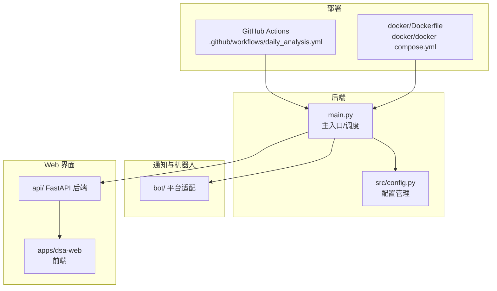
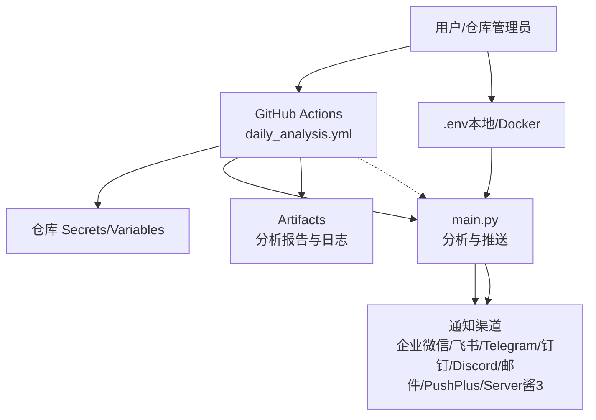
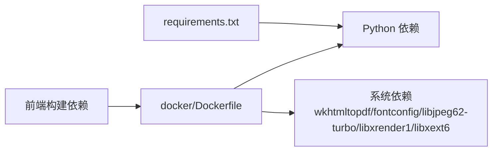
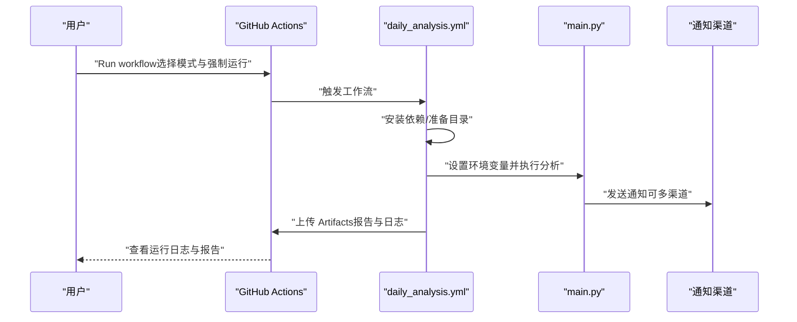

# 快速开始

<cite>
**本文引用的文件**
- [README.md](file://README.md)
- [docs/DEPLOY.md](file://docs/DEPLOY.md)
- [docs/FAQ.md](file://docs/FAQ.md)
- [.github/workflows/daily_analysis.yml](file://.github/workflows/daily_analysis.yml)
- [docker/docker-compose.yml](file://docker/docker-compose.yml)
- [docker/Dockerfile](file://docker/Dockerfile)
- [requirements.txt](file://requirements.txt)
- [main.py](file://main.py)
- [src/config.py](file://src/config.py)
- [docs/full-guide.md](file://docs/full-guide.md)
- [docs/bot/discord-bot-config.md](file://docs/bot/discord-bot-config.md)
- [docs/bot/feishu-bot-config.md](file://docs/bot/feishu-bot-config.md)
</cite>

## 目录
1. [简介](#简介)
2. [项目结构](#项目结构)
3. [核心组件](#核心组件)
4. [架构总览](#架构总览)
5. [详细组件分析](#详细组件分析)
6. [依赖关系分析](#依赖关系分析)
7. [性能注意事项](#性能注意事项)
8. [故障排查指南](#故障排查指南)
9. [结论](#结论)
10. [附录](#附录)

## 简介
本指南面向首次部署 A股自选股智能分析系统（AI 驱动的每日决策仪表盘与大盘复盘）的用户，提供两种部署方式的完整步骤：GitHub Actions 自动化部署与本地/Docker 部署。文档还涵盖 AI 模型配置（GEMINI_API_KEY、OPENAI_API_KEY 等）、通知渠道配置（企业微信、飞书、Telegram、钉钉、Discord、邮件、PushPlus、Server酱3 等）、本地运行与 Docker 命令示例、以及常见问题排查与验证步骤。

## 项目结构
系统采用多模块组织，核心包括：
- 后端主程序与调度：main.py
- 配置管理：src/config.py
- GitHub Actions 工作流：.github/workflows/daily_analysis.yml
- Docker 部署：docker/Dockerfile、docker/docker-compose.yml
- 通知与机器人：bot/ 平台适配
- Web 界面：apps/dsa-web（React 前端）与 FastAPI 后端 api/

图表来源
- [main.py:1-120](file://main.py#L1-L120)
- [src/config.py:1-120](file://src/config.py#L1-L120)
- [.github/workflows/daily_analysis.yml:1-120](file://.github/workflows/daily_analysis.yml#L1-L120)
- [docker/Dockerfile:1-60](file://docker/Dockerfile#L1-L60)
- [docker/docker-compose.yml:1-69](file://docker/docker-compose.yml#L1-L69)

章节来源
- [README.md:59-153](file://README.md#L59-L153)
- [docs/DEPLOY.md:18-140](file://docs/DEPLOY.md#L18-L140)

## 核心组件
- GitHub Actions 工作流：定时触发与手动触发，自动安装依赖、执行分析、上传报告归档。
- 配置系统：统一从环境变量/Secrets/Variables 读取，支持 AI 模型、通知渠道、数据源、定时任务等。
- 通知系统：支持企业微信、飞书、Telegram、Discord、钉钉、PushPlus、Server酱3、邮件等多种渠道。
- Docker 镜像与编排：多阶段构建前端与后端，暴露 API 端口，持久化数据/日志/报告。
- Web 界面：FastAPI + React，提供配置管理、任务监控与手动分析。

章节来源
- [.github/workflows/daily_analysis.yml:1-286](file://.github/workflows/daily_analysis.yml#L1-L286)
- [src/config.py:1-200](file://src/config.py#L1-L200)
- [docker/Dockerfile:1-77](file://docker/Dockerfile#L1-L77)
- [docker/docker-compose.yml:1-69](file://docker/docker-compose.yml#L1-L69)
- [main.py:510-723](file://main.py#L510-L723)

## 架构总览
下图展示 GitHub Actions 与本地/容器两种部署路径的总体交互：

图表来源
- [.github/workflows/daily_analysis.yml:1-286](file://.github/workflows/daily_analysis.yml#L1-L286)
- [main.py:510-723](file://main.py#L510-L723)

## 详细组件分析

### GitHub Actions 自动化部署（推荐）
- Fork 仓库并启用 Actions
- 配置 Secrets（至少配置 AI 模型与通知渠道之一）
- 手动测试与验证
- 默认工作日 18:00（北京时间）自动执行

步骤详解
1) Fork 仓库
- 点击 Fork 按钮，随后在仓库页面点击 Settings → Secrets and variables → Actions → New repository secret，添加如下 Secrets（示例）：
  - GEMINI_API_KEY（必填其一）
  - WECHAT_WEBHOOK_URL / FEISHU_WEBHOOK_URL / TELEGRAM_BOT_TOKEN + TELEGRAM_CHAT_ID / EMAIL_SENDER + EMAIL_PASSWORD / PUSHPLUS_TOKEN / SERVERCHAN3_SENDKEY / CUSTOM_WEBHOOK_URLS 等（任选其一）
  - STOCK_LIST（必填）
  - TAVILY_API_KEYS（推荐）
  - OPENAI_API_KEY / OPENAI_BASE_URL / OPENAI_MODEL（可选）
  - ANTHROPIC_API_KEY / ANTHROPIC_MODEL（可选）
  - AIHUBMIX_KEY（可选）
  - TUSHARE_TOKEN（可选）
  - 其他搜索与数据源 API Keys（可选）

2) 启用 Actions
- 在仓库 Actions 标签页，点击 “I understand my workflows, go ahead and enable them”

3) 手动测试
- 在 Actions → “每日股票分析” workflow → Run workflow → 选择运行模式（full / market-only / stocks-only）→ Run workflow

4) 定时说明
- 默认每周一至周五 UTC 10:00（北京时间 18:00）触发；可通过修改 cron 表达式调整。

5) 验证与报告
- 查看运行历史与日志；Artifacts 中下载 analysis-reports-* 以获取报告与日志。

章节来源
- [README.md:61-135](file://README.md#L61-L135)
- [docs/DEPLOY.md:323-464](file://docs/DEPLOY.md#L323-L464)
- [.github/workflows/daily_analysis.yml:1-286](file://.github/workflows/daily_analysis.yml#L1-L286)

### 本地运行与 Docker 部署
- 本地运行
  - 克隆仓库、安装依赖、复制并编辑 .env、运行 main.py
  - 可选：--webui / --webui-only / --serve / --serve-only 等参数
- Docker 部署
  - 使用 docker-compose 一键启动，包含定时分析与 Web 界面服务
  - 数据持久化：data/、logs/、reports/ 目录映射
  - 端口：默认 8000（可通过 .env/API_PORT 覆盖）

命令示例（来自文档）
- 本地安装与运行
  - git clone <repo> && cd daily_stock_analysis
  - pip install -r requirements.txt
  - cp .env.example .env && vim .env
  - python main.py
- Docker Compose
  - docker-compose -f ./docker/docker-compose.yml up -d
  - docker-compose -f ./docker/docker-compose.yml logs -f
  - docker-compose -f ./docker/docker-compose.yml ps
  - docker-compose -f ./docker/docker-compose.yml exec stock-analyzer bash
  - docker-compose -f ./docker/docker-compose.yml exec stock-analyzer python main.py --no-notify

章节来源
- [README.md:136-153](file://README.md#L136-L153)
- [docs/DEPLOY.md:18-140](file://docs/DEPLOY.md#L18-L140)
- [docker/docker-compose.yml:1-69](file://docker/docker-compose.yml#L1-L69)
- [docker/Dockerfile:1-77](file://docker/Dockerfile#L1-L77)

### AI 模型配置（GEMINI_API_KEY 与 OPENAI_API_KEY）
- GEMINI_API_KEY（必填其一）
  - 获取地址：Google AI Studio
  - 可选：GEMINI_MODEL、GEMINI_MODEL_FALLBACK、GEMINI_REQUEST_DELAY
- OPENAI_API_KEY（可选）
  - 支持 DeepSeek、通义千问等兼容服务
  - 可选：OPENAI_BASE_URL、OPENAI_MODEL
- 其他可选模型通道
  - ANTHROPIC_API_KEY / ANTHROPIC_MODEL
  - AIHUBMIX_KEY（一 Key 多模型，无需额外 Base URL）
  - LITELLM_CONFIG / LLM_CHANNELS（高级 YAML 渠道配置）

章节来源
- [README.md:74-83](file://README.md#L74-L83)
- [docs/full-guide.md:42-136](file://docs/full-guide.md#L42-L136)
- [.github/workflows/daily_analysis.yml:70-87](file://.github/workflows/daily_analysis.yml#L70-L87)

### 通知渠道配置
- 企业微信 Webhook：WECHAT_WEBHOOK_URL（可选）
- 飞书 Webhook：FEISHU_WEBHOOK_URL（可选）
- Telegram：TELEGRAM_BOT_TOKEN + TELEGRAM_CHAT_ID（可选）
- Discord：DISCORD_WEBHOOK_URL 或 DISCORD_BOT_TOKEN + DISCORD_MAIN_CHANNEL_ID（可选）
- 钉钉：CUSTOM_WEBHOOK_URLS（可选）
- PushPlus：PUSHPLUS_TOKEN（可选）
- Server酱3：SERVERCHAN3_SENDKEY（可选）
- 邮件：EMAIL_SENDER + EMAIL_PASSWORD（可选），EMAIL_RECEIVERS（可选）
- 其他行为配置：SINGLE_STOCK_NOTIFY、REPORT_TYPE、ANALYSIS_DELAY、MERGE_EMAIL_NOTIFICATION 等

章节来源
- [README.md:86-108](file://README.md#L86-L108)
- [docs/full-guide.md:67-125](file://docs/full-guide.md#L67-L125)
- [.github/workflows/daily_analysis.yml:108-153](file://.github/workflows/daily_analysis.yml#L108-L153)

### Web 界面与 API
- Web 界面：首次运行需编译前端；启动后访问 http://127.0.0.1:8000
- FastAPI 后端：支持 /api/v1/... 接口；可单独启动服务或与分析任务结合
- Docker 中健康检查：/health 或 /api/health

章节来源
- [README.md:207-231](file://README.md#L207-L231)
- [docker/Dockerfile:70-77](file://docker/Dockerfile#L70-L77)
- [main.py:445-470](file://main.py#L445-L470)

## 依赖关系分析
- 依赖安装：requirements.txt 指定核心库（dotenv、tenacity、sqlalchemy、schedule、exchange-calendars、efinance、akshare、tushare、pytdx、baostock、yfinance、lark-oapi、pandas、numpy、json-repair、litellm、tiktoken、openai、PyYAML、tavily-python、google-search-results、requests、markdown2、imgkit、fake-useragent、httpx、dingtalk-stream、discord.py、newspaper3k、lxml_html_clean、jinja2、fastapi、uvicorn、python-multipart）
- Docker 依赖：镜像内安装 Python 依赖与 wkhtmltopdf（用于 Markdown 转图片）
- Web 依赖：前端构建与静态资源打包

图表来源
- [requirements.txt:1-65](file://requirements.txt#L1-L65)
- [docker/Dockerfile:26-41](file://docker/Dockerfile#L26-L41)

章节来源
- [requirements.txt:1-65](file://requirements.txt#L1-L65)
- [docker/Dockerfile:1-77](file://docker/Dockerfile#L1-L77)

## 性能注意事项
- 低并发与防封禁：max_workers 默认较低，避免对免费数据源造成过大压力
- 请求间隔与重试：gemini_request_delay、akshare_sleep_min/max、retry 配置等
- 分析间隔：ANALYSIS_DELAY 用于避免个股与大盘分析之间的 API 限流
- Docker 资源限制：可设置内存上限与保留，避免容器被 OOM
- 代理与网络：国内服务器访问 Gemini 可配置代理；DNS 解析失败时可显式配置 DNS 或改用 host 网络模式

章节来源
- [src/config.py:150-200](file://src/config.py#L150-L200)
- [docs/DEPLOY.md:215-274](file://docs/DEPLOY.md#L215-L274)
- [docs/FAQ.md:106-118](file://docs/FAQ.md#L106-L118)

## 故障排查指南
- GitHub Actions 环境变量未生效
  - 确保在 Settings → Secrets and variables → Actions 中配置（Secrets 用于敏感信息，Variables 用于非敏感配置）
- .env 文件不生效
  - GitHub Actions 环境中 .env 不生效，必须使用 Secrets/Variables
- 代理与网络
  - 本地运行可配置 USE_PROXY、PROXY_HOST、PROXY_PORT；GitHub Actions 环境无需代理
  - Docker 中网络/DNS 解析失败：可配置 dns 或使用 host 网络模式
- API 限流与 429
  - Gemini 免费版有速率限制；减少并发、增加请求延迟、切换备用模型
- 通知消息过长
  - 平台消息长度限制不同，系统已实现自动分块；可启用 SINGLE_STOCK_NOTIFY 或 REPORT_TYPE=simple
- Docker 容器启动即退出
  - 检查环境变量、.env 格式、依赖版本冲突
- Web 界面无法访问
  - 确认端口映射、WEBUI_HOST、安全组放行

章节来源
- [docs/FAQ.md:71-118](file://docs/FAQ.md#L71-L118)
- [docs/FAQ.md:119-224](file://docs/FAQ.md#L119-L224)
- [docs/FAQ.md:226-274](file://docs/FAQ.md#L226-L274)
- [docs/DEPLOY.md:215-274](file://docs/DEPLOY.md#L215-L274)

## 结论
通过本快速开始指南，您可以在 5 分钟内完成 GitHub Actions 的自动化部署，并在本地或 Docker 环境中运行系统。建议至少配置 GEMINI_API_KEY、至少一个通知渠道与 STOCK_LIST，再根据需要补充搜索 API 与备用模型。遇到问题时，优先检查 Secrets/Variables 配置、网络与代理设置、以及通知渠道的长度限制与权限配置。

## 附录

### GitHub Actions 工作流执行序列（手动触发）

图表来源
- [.github/workflows/daily_analysis.yml:1-286](file://.github/workflows/daily_analysis.yml#L1-L286)
- [main.py:510-723](file://main.py#L510-L723)

### 本地运行与 Docker 命令速查
- 本地运行
  - 安装依赖：pip install -r requirements.txt
  - 配置 .env：cp .env.example .env && vim .env
  - 运行：python main.py
  - Web 界面：python main.py --webui 或 --webui-only
- Docker
  - 启动：docker-compose -f ./docker/docker-compose.yml up -d
  - 日志：docker-compose -f ./docker/docker-compose.yml logs -f
  - 调试：docker-compose -f ./docker/docker-compose.yml exec stock-analyzer bash
  - 手动分析：docker-compose -f ./docker/docker-compose.yml exec stock-analyzer python main.py --no-notify

章节来源
- [README.md:136-153](file://README.md#L136-L153)
- [docs/DEPLOY.md:46-81](file://docs/DEPLOY.md#L46-L81)

### 通知渠道配置要点
- 企业微信：WECHAT_WEBHOOK_URL；消息类型可设为 text 以规避格式问题
- 飞书：FEISHU_WEBHOOK_URL；支持 Markdown
- Telegram：TELEGRAM_BOT_TOKEN + TELEGRAM_CHAT_ID；可选 TELEGRAM_MESSAGE_THREAD_ID
- Discord：DISCORD_WEBHOOK_URL 或 DISCORD_BOT_TOKEN + DISCORD_MAIN_CHANNEL_ID
- 钉钉：CUSTOM_WEBHOOK_URLS（可配置 Bearer Token）
- PushPlus / Server酱3：PUSHPLUS_TOKEN / SERVERCHAN3_SENDKEY
- 邮件：EMAIL_SENDER + EMAIL_PASSWORD；EMAIL_RECEIVERS（可选）

章节来源
- [README.md:86-108](file://README.md#L86-L108)
- [docs/full-guide.md:67-125](file://docs/full-guide.md#L67-L125)
- [docs/bot/discord-bot-config.md:1-110](file://docs/bot/discord-bot-config.md#L1-L110)
- [docs/bot/feishu-bot-config.md:1-20](file://docs/bot/feishu-bot-config.md#L1-L20)