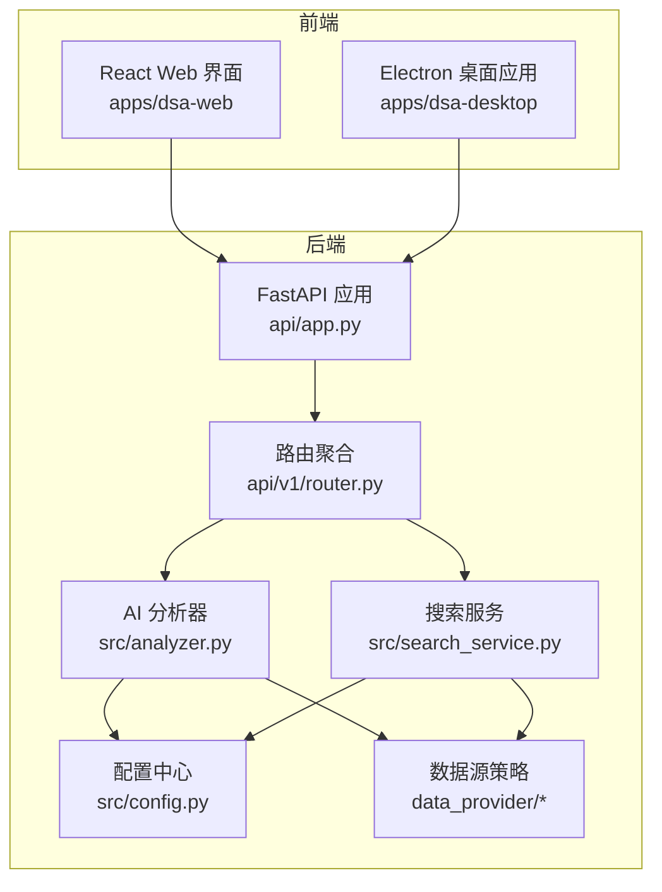
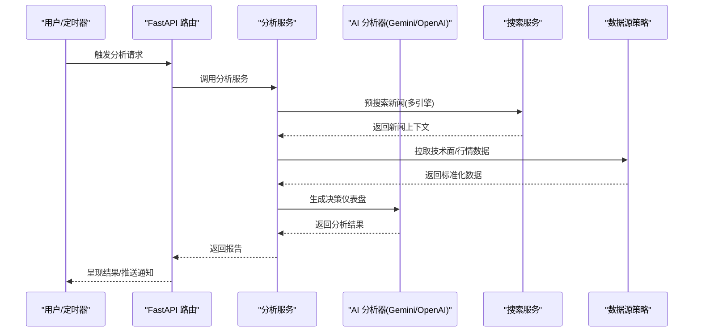
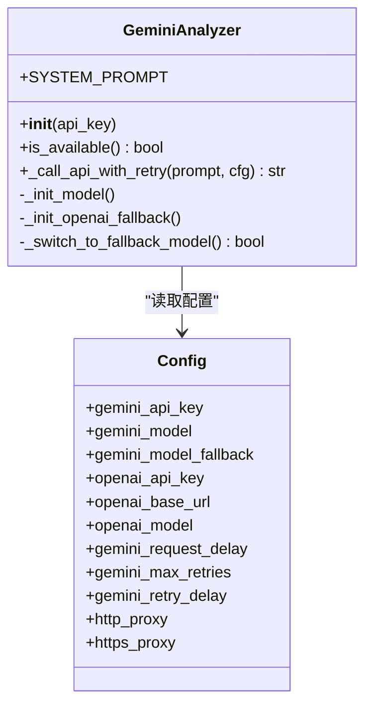
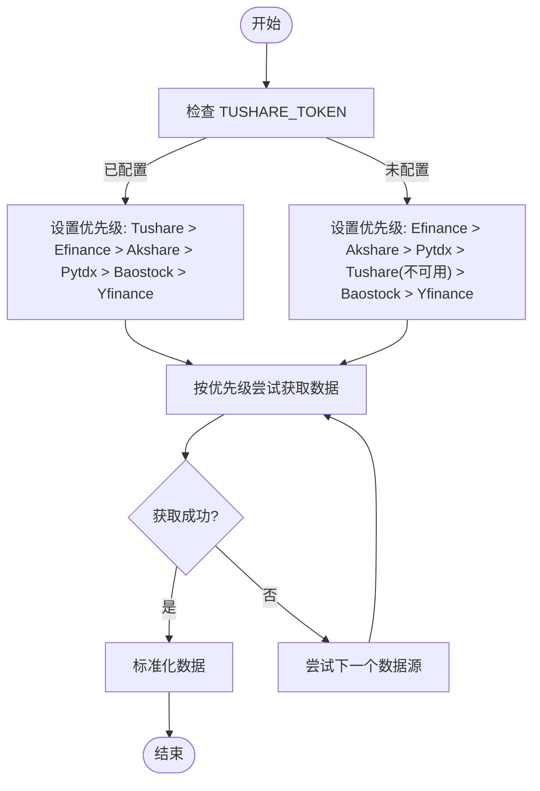
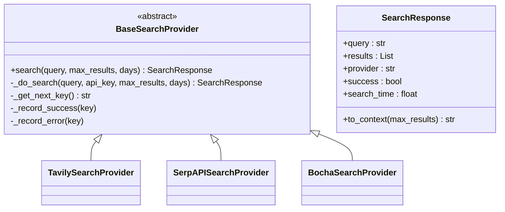
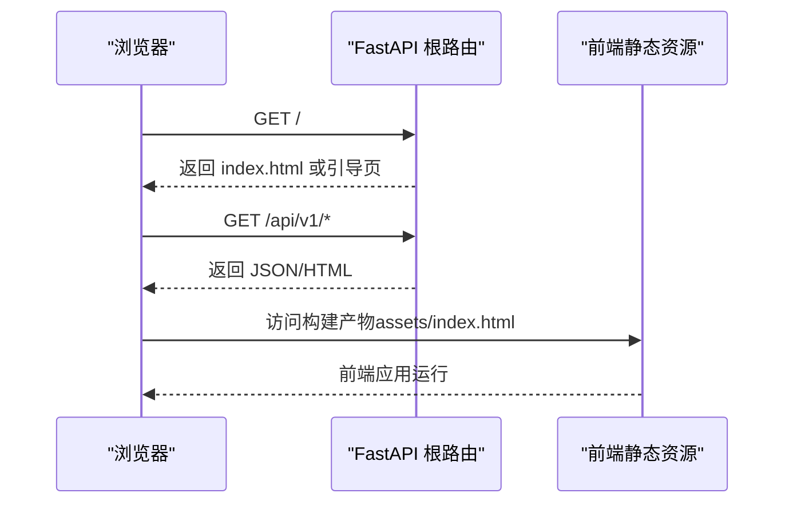
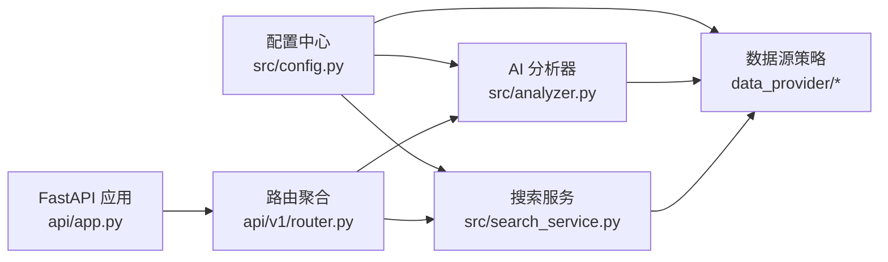

# 技术栈与数据来源

<cite>
**本文引用的文件**
- [requirements.txt](file://requirements.txt)
- [pyproject.toml](file://pyproject.toml)
- [README.md](file://README.md)
- [src/config.py](file://src/config.py)
- [data_provider/__init__.py](file://data_provider/__init__.py)
- [data_provider/akshare_fetcher.py](file://data_provider/akshare_fetcher.py)
- [data_provider/tushare_fetcher.py](file://data_provider/tushare_fetcher.py)
- [data_provider/yfinance_fetcher.py](file://data_provider/yfinance_fetcher.py)
- [src/analyzer.py](file://src/analyzer.py)
- [src/search_service.py](file://src/search_service.py)
- [api/app.py](file://api/app.py)
- [api/v1/router.py](file://api/v1/router.py)
- [apps/dsa-web/package.json](file://apps/dsa-web/package.json)
- [apps/dsa-desktop/package.json](file://apps/dsa-desktop/package.json)
</cite>

## 目录
1. [简介](#简介)
2. [项目结构](#项目结构)
3. [核心组件](#核心组件)
4. [架构总览](#架构总览)
5. [详细组件分析](#详细组件分析)
6. [依赖关系分析](#依赖关系分析)
7. [性能考量](#性能考量)
8. [故障排查指南](#故障排查指南)
9. [结论](#结论)
10. [附录](#附录)

## 简介
本文件面向A股自选股智能分析系统的开发者与运维人员，系统性梳理技术栈与数据来源，覆盖以下主题：
- AI模型支持与使用：Gemini（免费）、OpenAI兼容（DeepSeek、通义千问等）、Claude、Ollama等
- 行情数据源：AkShare、Tushare、Pytdx、Baostock、YFinance
- 新闻搜索：Tavily、SerpAPI、Bocha、Brave等
- 技术架构：Python后端、React前端、Electron桌面应用
- 关键依赖库与版本要求、配置与流控策略、Web界面与API设计

## 项目结构
项目采用“后端Python + 前端React + 桌面Electron”的分层架构：
- 后端：FastAPI提供REST API，封装分析服务、数据源策略、搜索服务、定时任务与通知
- 前端：React + Vite构建Web界面，提供配置管理、任务监控与手动分析
- 桌面：Electron承载桌面应用，打包后可独立运行
- 数据层：SQLite本地数据库，结合多数据源策略与缓存

图表来源
- [api/app.py:48-204](file://api/app.py#L48-L204)
- [api/v1/router.py:12-72](file://api/v1/router.py#L12-L72)
- [src/config.py:31-580](file://src/config.py#L31-L580)
- [src/analyzer.py:334-800](file://src/analyzer.py#L334-L800)
- [src/search_service.py:1-200](file://src/search_service.py#L1-L200)
- [data_provider/__init__.py:12-30](file://data_provider/__init__.py#L12-L30)

章节来源
- [api/app.py:48-204](file://api/app.py#L48-L204)
- [api/v1/router.py:12-72](file://api/v1/router.py#L12-L72)
- [apps/dsa-web/package.json:1-56](file://apps/dsa-web/package.json#L1-L56)
- [apps/dsa-desktop/package.json:1-43](file://apps/dsa-desktop/package.json#L1-L43)

## 核心组件
- 配置中心：集中管理AI模型、数据源、通知、定时任务、代理与流控等配置，支持从.env加载与热更新
- 数据源策略层：统一抽象与优先级调度，实现自动故障切换与速率控制
- AI分析器：封装Gemini/OpenAI兼容模型调用，结合外部新闻与技术面生成“决策仪表盘”
- 搜索服务：统一接入Tavily、SerpAPI、Bocha等搜索引擎，支持多Key负载均衡与熔断
- Web API：FastAPI提供分析、历史、股票、回测、系统配置等接口，并内置CORS与健康检查
- 前端与桌面：React SPA + Electron应用，提供可视化配置与任务监控

章节来源
- [src/config.py:31-580](file://src/config.py#L31-L580)
- [data_provider/__init__.py:12-30](file://data_provider/__init__.py#L12-L30)
- [src/analyzer.py:334-800](file://src/analyzer.py#L334-L800)
- [src/search_service.py:1-200](file://src/search_service.py#L1-L200)
- [api/app.py:48-204](file://api/app.py#L48-L204)

## 架构总览
系统采用“策略模式 + 统一入口 + 多源备份”的设计：
- 数据源策略：根据Token与优先级动态调整，AkShare为主，Tushare为付费优先，YFinance兜底
- AI分析：Gemini优先，失败后自动切换OpenAI兼容模型；外部新闻通过搜索服务预拉取
- 通知与推送：飞书、企业微信、Telegram、Discord、钉钉、Pushover、PushPlus、Server酱等多通道
- Web与桌面：FastAPI + React SPA，Electron打包，支持本地运行与Docker部署

图表来源
- [api/v1/router.py:12-72](file://api/v1/router.py#L12-L72)
- [src/analyzer.py:334-800](file://src/analyzer.py#L334-L800)
- [src/search_service.py:1-200](file://src/search_service.py#L1-L200)
- [data_provider/__init__.py:12-30](file://data_provider/__init__.py#L12-L30)

## 详细组件分析

### AI模型支持与使用
- 支持模型
  - Gemini（免费）：主模型与备选模型可配置，支持自定义API端点（代理）
  - OpenAI兼容：DeepSeek、通义千问、Moonshot等，统一通过OpenAI客户端适配
  - Claude、Ollama：通过OpenAI兼容接口或本地推理服务对接（需在配置中指定base_url/model）
- 使用方式
  - 优先使用Gemini，失败后自动切换至OpenAI兼容模型
  - 支持温度、重试、限流与代理配置
  - 输出格式为“决策仪表盘”，包含核心结论、数据透视、舆情情报、作战计划与检查清单
- 配置要点
  - GEMINI_API_KEY、GEMINI_MODEL、GEMINI_MODEL_FALLBACK、OPENAI_API_KEY、OPENAI_BASE_URL、OPENAI_MODEL、OPENAI_TEMPERATURE
  - 请求间隔、最大重试、代理与NO_PROXY域名单

图表来源
- [src/analyzer.py:334-800](file://src/analyzer.py#L334-L800)
- [src/config.py:53-120](file://src/config.py#L53-L120)

章节来源
- [src/analyzer.py:334-800](file://src/analyzer.py#L334-L800)
- [src/config.py:53-120](file://src/config.py#L53-L120)
- [README.md:42-48](file://README.md#L42-L48)

### 行情数据源与策略
- 支持数据源与优先级
  - 配置了TUSHARE_TOKEN：TushareFetcher（最高优先级）、EfinanceFetcher、AkshareFetcher、PytdxFetcher、BaostockFetcher、YfinanceFetcher
  - 未配置TUSHARE_TOKEN：EfinanceFetcher（最高优先级）、AkshareFetcher、PytdxFetcher、TushareFetcher（不可用）、BaostockFetcher、YfinanceFetcher
- 防封禁与流控
  - Akshare：随机UA、随机休眠、指数退避重试、熔断器
  - Tushare：每分钟计数器、配额保护、失败降级
  - Yfinance：代码映射、时区处理、回退策略
- 实时行情增强
  - 支持实时行情来源优先级配置、缓存与熔断器
  - 可选筹码分布（云端部署建议关闭）

图表来源
- [data_provider/__init__.py:12-30](file://data_provider/__init__.py#L12-L30)
- [data_provider/akshare_fetcher.py:15-40](file://data_provider/akshare_fetcher.py#L15-L40)
- [data_provider/tushare_fetcher.py:11-15](file://data_provider/tushare_fetcher.py#L11-L15)
- [data_provider/yfinance_fetcher.py:11-15](file://data_provider/yfinance_fetcher.py#L11-L15)

章节来源
- [data_provider/__init__.py:12-30](file://data_provider/__init__.py#L12-L30)
- [data_provider/akshare_fetcher.py:15-40](file://data_provider/akshare_fetcher.py#L15-L40)
- [data_provider/tushare_fetcher.py:11-15](file://data_provider/tushare_fetcher.py#L11-L15)
- [data_provider/yfinance_fetcher.py:11-15](file://data_provider/yfinance_fetcher.py#L11-L15)
- [src/config.py:426-436](file://src/config.py#L426-L436)

### 新闻搜索服务
- 支持搜索引擎
  - Tavily：AI优化、高级搜索、免费额度
  - SerpAPI：Google/Bing/百度、知识图谱、答案盒
  - Bocha：中文优化、AI摘要、时间范围过滤
  - Brave：隐私优先、美股优化
- 能力与特性
  - 多Key轮询与错误计数、瞬时网络错误重试、结果缓存与格式化
  - 可配置搜索天数窗口、结果数量上限
- 集成方式
  - AI分析前先调用搜索服务，将新闻摘要注入提示词上下文

图表来源
- [src/search_service.py:144-255](file://src/search_service.py#L144-L255)
- [src/search_service.py:257-333](file://src/search_service.py#L257-L333)
- [src/search_service.py:346-548](file://src/search_service.py#L346-L548)
- [src/search_service.py:550-744](file://src/search_service.py#L550-L744)

章节来源
- [src/search_service.py:1-200](file://src/search_service.py#L1-L200)
- [src/search_service.py:257-333](file://src/search_service.py#L257-L333)
- [src/search_service.py:346-548](file://src/search_service.py#L346-L548)
- [src/search_service.py:550-744](file://src/search_service.py#L550-L744)

### Web API与前端/桌面
- FastAPI应用
  - 路由前缀/api/v1，注册分析、历史、股票、回测、系统配置等模块
  - CORS中间件、认证中间件、健康检查、静态文件托管（SPA回退）
- 前端（React + Vite）
  - 依赖React、TailwindCSS、Recharts、Axios等，构建产物托管于后端
- 桌面（Electron）
  - 打包脚本与构建配置，包含后端资源与示例配置文件

图表来源
- [api/app.py:120-203](file://api/app.py#L120-L203)
- [api/v1/router.py:12-72](file://api/v1/router.py#L12-L72)

章节来源
- [api/app.py:48-204](file://api/app.py#L48-L204)
- [api/v1/router.py:12-72](file://api/v1/router.py#L12-L72)
- [apps/dsa-web/package.json:1-56](file://apps/dsa-web/package.json#L1-L56)
- [apps/dsa-desktop/package.json:1-43](file://apps/dsa-desktop/package.json#L1-L43)

## 依赖关系分析
- Python核心依赖
  - 配置与调度：python-dotenv、tenacity、schedule、exchange-calendars
  - 数据处理：pandas、numpy、openpyxl、pypinyin、json-repair
  - 数据源：efinance、akshare、tushare、pytdx、baostock、yfinance、tickflow
  - AI分析：litellm、openai、tiktoken、PyYAML
  - 搜索引擎：tavily-python、google-search-results
  - Web框架：fastapi、uvicorn、python-multipart
  - 网络与工具：requests、httpx[socks]、markdown2、imgkit、fake-useragent、newspaper3k、lxml_html_clean
  - 报告模板：jinja2
  - 机器人：lark-oapi（飞书）、discord.py、dingtalk-stream
- 前端依赖
  - React、Next Themes、TailwindCSS、Axios、Recharts、Zustand等
- 桌面依赖
  - electron、electron-builder

图表来源
- [src/config.py:31-580](file://src/config.py#L31-L580)
- [src/analyzer.py:334-800](file://src/analyzer.py#L334-L800)
- [src/search_service.py:1-200](file://src/search_service.py#L1-L200)
- [data_provider/__init__.py:12-30](file://data_provider/__init__.py#L12-L30)
- [api/app.py:48-204](file://api/app.py#L48-L204)
- [api/v1/router.py:12-72](file://api/v1/router.py#L12-L72)

章节来源
- [requirements.txt:1-65](file://requirements.txt#L1-L65)
- [pyproject.toml:1-29](file://pyproject.toml#L1-L29)
- [src/config.py:31-580](file://src/config.py#L31-L580)

## 性能考量
- 数据源防封禁
  - Akshare：随机UA、随机休眠、指数退避重试、熔断器
  - Tushare：每分钟计数器、配额保护、失败降级
- 实时行情缓存
  - 默认缓存1200秒，降低请求频率与封禁风险
- 代理与NO_PROXY
  - 自动排除国内数据源域名，避免代理导致行情获取失败
- 并发与限流
  - 最大并发数可控、分析间隔可配置，避免API限流
- 搜索服务
  - 多Key轮询、瞬时错误重试、错误计数与熔断

章节来源
- [data_provider/akshare_fetcher.py:15-40](file://data_provider/akshare_fetcher.py#L15-L40)
- [data_provider/tushare_fetcher.py:11-15](file://data_provider/tushare_fetcher.py#L11-L15)
- [src/config.py:260-299](file://src/config.py#L260-L299)
- [src/config.py:426-436](file://src/config.py#L426-L436)
- [src/search_service.py:52-75](file://src/search_service.py#L52-L75)

## 故障排查指南
- AI模型不可用
  - 检查GEMINI_API_KEY或OPENAI_API_KEY是否配置，确认base_url/model与温度参数
  - 查看重试次数与请求间隔配置，必要时开启代理
- 数据源获取失败
  - Akshare：检查UA轮换、随机休眠与重试日志；确认NO_PROXY配置
  - Tushare：检查Token与配额；观察每分钟计数与冷却
  - Yfinance：确认代码映射与时区处理；必要时启用Stooq兜底
- 搜索服务异常
  - 检查TAVILY_API_KEYS、SERPAPI_API_KEYS、BOCHA_API_KEYS、BRAVE_API_KEYS
  - 观察瞬时错误重试与Key错误计数，必要时更换Key
- Web界面无法访问
  - 确认前端已构建；检查CORS配置与静态文件挂载
  - 访问/api/health确认服务状态

章节来源
- [src/analyzer.py:567-620](file://src/analyzer.py#L567-L620)
- [src/search_service.py:170-202](file://src/search_service.py#L170-L202)
- [api/app.py:161-174](file://api/app.py#L161-L174)

## 结论
本系统通过“策略化数据源 + 统一AI分析 + 多引擎搜索 + 多通道通知”的组合，实现了A股/港股/美股自选股的自动化智能分析与推送。技术栈清晰、可扩展性强，适合本地运行、Docker部署与桌面应用分发。

## 附录
- 关键配置项（摘录）
  - AI模型：GEMINI_API_KEY、GEMINI_MODEL、GEMINI_MODEL_FALLBACK、OPENAI_API_KEY、OPENAI_BASE_URL、OPENAI_MODEL、OPENAI_TEMPERATURE
  - 数据源：TUSHARE_TOKEN、REALTIME_SOURCE_PRIORITY、ENABLE_REALTIME_QUOTE、ENABLE_CHIP_DISTRIBUTION、REALTIME_CACHE_TTL、CIRCUIT_BREAKER_COOLDOWN
  - 搜索引擎：TAVILY_API_KEYS、SERPAPI_API_KEYS、BOCHA_API_KEYS、BRAVE_API_KEYS
  - 通知：WECHAT_WEBHOOK_URL、FEISHU_WEBHOOK_URL、TELEGRAM_*、EMAIL_*、PUSHOVER_*、PUSHPLUS_TOKEN、SERVERCHAN3_SENDKEY、CUSTOM_WEBHOOK_URLS、DISCORD_*
  - Web与桌面：WEBUI_ENABLED、WEBUI_HOST、WEBUI_PORT、CORS_ORIGINS、CORS_ALLOW_ALL

章节来源
- [src/config.py:53-133](file://src/config.py#L53-L133)
- [src/config.py:313-357](file://src/config.py#L313-L357)
- [src/config.py:358-425](file://src/config.py#L358-L425)
- [README.md:74-122](file://README.md#L74-L122)