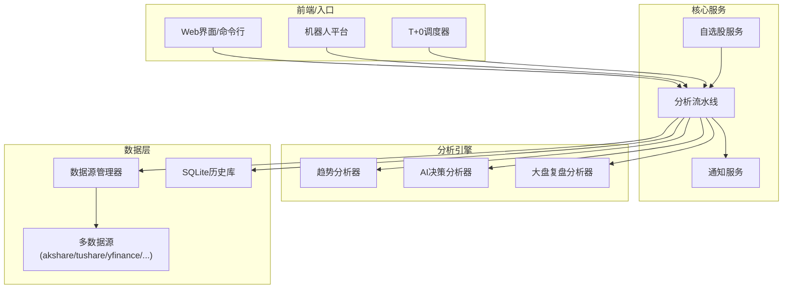
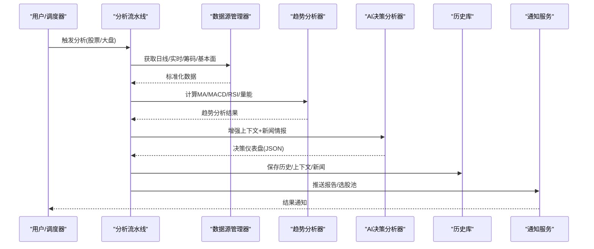
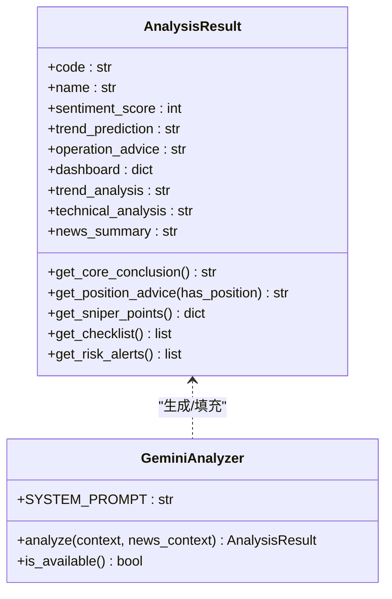
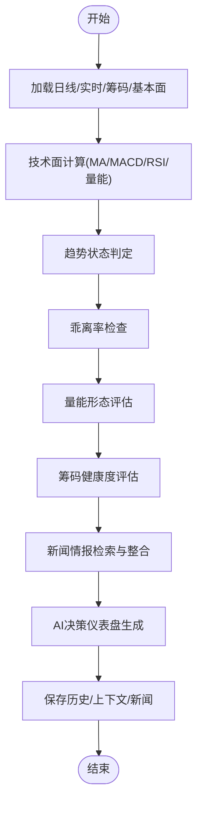
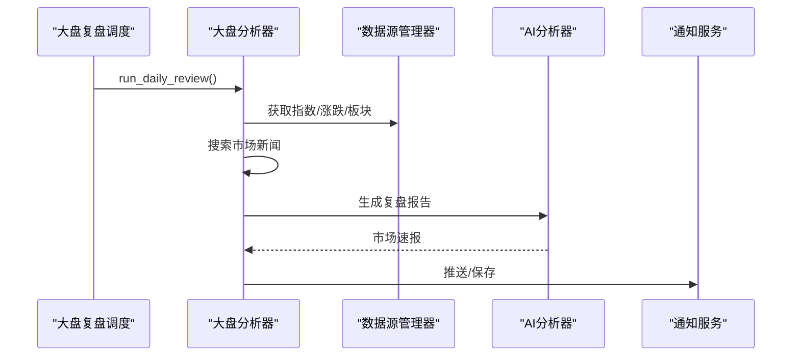
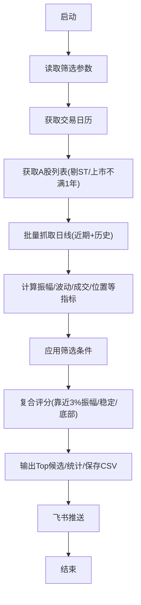
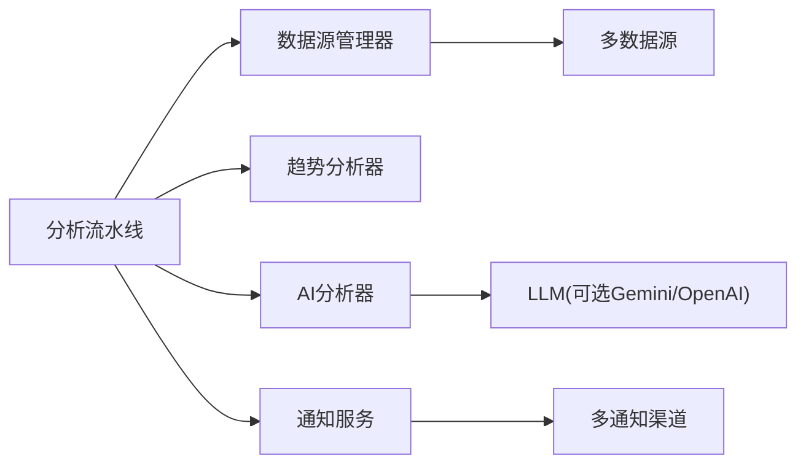

# 核心功能特性

<cite>
**本文档引用的文件**
- [analyzer.py](file://src/analyzer.py)
- [stock_analyzer.py](file://src/stock_analyzer.py)
- [pipeline.py](file://src/core/pipeline.py)
- [market_analyzer.py](file://src/market_analyzer.py)
- [market_review.py](file://src/core/market_review.py)
- [t0_weekly_scheduler.py](file://scripts/t0_weekly_scheduler.py)
- [t0_stock_screener.py](file://scripts/t0_stock_screener.py)
- [watchlist_service.py](file://src/services/watchlist_service.py)
- [base.py](file://data_provider/base.py)
- [config.py](file://src/config.py)
</cite>

## 目录
1. [简介](#简介)
2. [项目结构](#项目结构)
3. [核心组件](#核心组件)
4. [架构总览](#架构总览)
5. [详细组件分析](#详细组件分析)
6. [依赖关系分析](#依赖关系分析)
7. [性能考量](#性能考量)
8. [故障排查指南](#故障排查指南)
9. [结论](#结论)
10. [附录](#附录)

## 简介
本文件面向A股自选股智能分析系统，聚焦核心功能特性说明与使用示例，包括：
- AI决策仪表盘：一句话核心结论、精确买卖点位、操作检查清单的生成机制
- 多维度分析能力：技术面（MA5/MA10/MA20等）、筹码分布、舆情情报、实时行情监控
- 全球市场支持：A股、港股、美股数据获取与分析
- 大盘复盘：每日市场概览、板块涨跌分析、资金流向
- T+0选股池：每周自动筛选适合T+0交易的股票池机制

## 项目结构
系统采用模块化分层设计，核心模块包括：
- 数据层：统一数据源管理器，支持A/H/K/US多市场数据接入与自动切换
- 分析层：趋势交易分析器、AI决策分析器、大盘复盘分析器
- 流水线：核心分析流水线，协调数据获取、增强上下文、AI分析、历史记录与通知
- 服务层：自选股watchlist服务、通知服务、社交舆情服务
- 调度层：T+0周度定时任务调度器

图表来源
- [pipeline.py:48-120](file://src/core/pipeline.py#L48-L120)
- [base.py:464-779](file://data_provider/base.py#L464-L779)
- [market_review.py:27-88](file://src/core/market_review.py#L27-L88)

章节来源
- [pipeline.py:48-120](file://src/core/pipeline.py#L48-L120)
- [base.py:464-779](file://data_provider/base.py#L464-L779)
- [market_review.py:27-88](file://src/core/market_review.py#L27-L88)

## 核心组件
- AI决策分析器（AnalysisResult + GeminiAnalyzer）
  - 生成决策仪表盘JSON，包含核心结论、数据透视、情报与作战计划
  - 提供一键提取核心结论、持仓建议、狙击点位、检查清单、风险预警的能力
- 趋势交易分析器（StockTrendAnalyzer）
  - 基于MA5/MA10/MA20多头排列、乖离率、量能、MACD/RSI等指标生成买入信号
- 大盘复盘分析器（MarketAnalyzer）
  - 获取主要指数、涨跌统计、板块排行，结合新闻生成极简市场速报
- 数据源管理器（DataFetcherManager）
  - 统一接入A/H/K/US多市场数据，自动故障切换与指标标准化
- T+0选股池调度器（WeeklyScheduler + Screener）
  - 每周一9:00自动筛选适合T+0交易的股票池，并通过飞书机器人推送

章节来源
- [analyzer.py:164-332](file://src/analyzer.py#L164-L332)
- [analyzer.py:334-798](file://src/analyzer.py#L334-L798)
- [stock_analyzer.py:171-800](file://src/stock_analyzer.py#L171-L800)
- [market_analyzer.py:78-529](file://src/market_analyzer.py#L78-L529)
- [base.py:464-779](file://data_provider/base.py#L464-L779)
- [t0_weekly_scheduler.py:67-172](file://scripts/t0_weekly_scheduler.py#L67-L172)
- [t0_stock_screener.py:338-460](file://scripts/t0_stock_screener.py#L338-L460)

## 架构总览
系统通过分析流水线串联数据获取、增强上下文、AI分析与历史记录，支持多市场、多维度、自动化与可扩展的通知。

图表来源
- [pipeline.py:183-430](file://src/core/pipeline.py#L183-L430)
- [analyzer.py:334-798](file://src/analyzer.py#L334-L798)
- [stock_analyzer.py:205-262](file://src/stock_analyzer.py#L205-L262)

## 详细组件分析

### AI决策仪表盘功能
- 生成机制
  - 系统提示词定义“严进策略、趋势交易、效率优先、买点偏好、风险排查重点”
  - 输出结构化JSON，包含核心结论、数据透视、情报、作战计划四大模块
  - 支持根据持仓状态返回差异化建议
- 一键提取能力
  - 核心结论：一句话明确建议
  - 持仓建议：区分“空仓/持仓”两套指引
  - 精确点位：理想/次优买入点、止损位、目标位
  - 检查清单：逐项打钩的可执行检查项
  - 风险预警：重大风险点清单
- 使用示例
  - 输入：某股票的历史K线、实时行情、筹码分布、趋势分析结果、新闻情报
  - 输出：决策仪表盘JSON，包含核心结论、狙击点位、操作清单、风险提示
  - 效果：帮助用户快速做出“买/加仓/持有/减仓/卖”的决策，并给出具体价位与风控策略

图表来源
- [analyzer.py:164-332](file://src/analyzer.py#L164-L332)
- [analyzer.py:334-798](file://src/analyzer.py#L334-L798)

章节来源
- [analyzer.py:164-332](file://src/analyzer.py#L164-L332)
- [analyzer.py:334-798](file://src/analyzer.py#L334-L798)

### 多维度分析能力
- 技术面分析
  - 均线系统：MA5/MA10/MA20多头排列、间距与发散判断
  - 乖离率：与MA5偏离度控制在5%以内
  - 量能：缩量回调优先、量比与换手率
  - 指标：MACD金叉/死叉、RSI超买超卖
- 筹码分布分析
  - 获利比例、平均成本、筹码集中度健康度
- 舆情情报整合
  - 多维度新闻搜索与格式化，支持风险排查与积极催化
- 实时行情监控
  - 量比、换手率、市盈/市净、涨跌幅等增强数据

图表来源
- [stock_analyzer.py:205-262](file://src/stock_analyzer.py#L205-L262)
- [pipeline.py:280-430](file://src/core/pipeline.py#L280-L430)

章节来源
- [stock_analyzer.py:171-800](file://src/stock_analyzer.py#L171-L800)
- [pipeline.py:183-430](file://src/core/pipeline.py#L183-L430)

### 全球市场支持能力
- 多市场接入
  - A股：6位数字代码
  - 港股：HK前缀或5位数字
  - 美股：1-5位字母（含可能的后缀）
  - 指数与板块：通过统一管理器适配不同数据源
- 数据源策略
  - 自动故障切换、优先级排序、智能随机休眠防封禁
  - 实时行情增强（量比、换手率、PE/PB等）

章节来源
- [base.py:121-164](file://data_provider/base.py#L121-L164)
- [base.py:464-779](file://data_provider/base.py#L464-L779)
- [config.py:426-437](file://src/config.py#L426-L437)

### 大盘复盘功能
- 数据采集
  - 主要指数、涨跌统计、板块排行
  - 新闻搜索与情报整合
- 报告生成
  - AI生成极简市场速报（指数、要点、热点、资金、关注）
  - 无AI时的模板生成
- 推送与归档
  - 支持合并推送、文件保存、多渠道通知

图表来源
- [market_review.py:27-88](file://src/core/market_review.py#L27-L88)
- [market_analyzer.py:508-529](file://src/market_analyzer.py#L508-L529)

章节来源
- [market_review.py:27-120](file://src/core/market_review.py#L27-L120)
- [market_analyzer.py:78-529](file://src/market_analyzer.py#L78-L529)

### T+0选股池功能
- 筛选策略
  - 财务健康：剔除亏损/ST/PT类
  - 波动率：日振幅2.5%-4.0%（甜点3%左右）
  - 位置：近一年底部，涨幅不超过20%
  - 流动性：日均成交量/成交额达标
  - 价格区间：5-30元区间
  - 稳定性：振幅CV适度
- 自动化
  - 每周一9:00自动运行
  - 通过飞书机器人推送Top候选
  - 结果保存为CSV便于复盘

图表来源
- [t0_stock_screener.py:132-460](file://scripts/t0_stock_screener.py#L132-L460)
- [t0_weekly_scheduler.py:174-183](file://scripts/t0_weekly_scheduler.py#L174-L183)

章节来源
- [t0_stock_screener.py:1-555](file://scripts/t0_stock_screener.py#L1-L555)
- [t0_weekly_scheduler.py:1-227](file://scripts/t0_weekly_scheduler.py#L1-L227)

### 自选股管理
- watchlist服务
  - 支持增删查、热重载、代码格式校验与标准化
  - 支持中文名称解析为代码
- 与分析流水线集成
  - 从.env读取自选股列表，支持运行时刷新

章节来源
- [watchlist_service.py:81-244](file://src/services/watchlist_service.py#L81-L244)
- [config.py:474-506](file://src/config.py#L474-L506)

## 依赖关系分析
- 组件耦合
  - 分析流水线对数据源管理器、趋势分析器、AI分析器、通知服务松耦合
  - 数据源管理器通过策略模式屏蔽多数据源差异
- 外部依赖
  - Gemini/OpenAI API（AI分析）
  - 多搜索引擎API（新闻情报）
  - 多数据源（akshare/tushare/yfinance等）
  - 通知渠道（飞书/企业微信/邮件/Telegram等）

图表来源
- [pipeline.py:83-120](file://src/core/pipeline.py#L83-L120)
- [base.py:464-779](file://data_provider/base.py#L464-L779)
- [config.py:342-437](file://src/config.py#L342-L437)

章节来源
- [pipeline.py:83-120](file://src/core/pipeline.py#L83-L120)
- [base.py:464-779](file://data_provider/base.py#L464-L779)
- [config.py:342-437](file://src/config.py#L342-L437)

## 性能考量
- 并发与防封禁
  - 最大并发数可控，智能随机休眠降低被封概率
  - 数据源自动切换与熔断冷却
- 数据缓存与增量
  - 实时行情缓存、断点续传、历史库复用
- 模型与重试
  - Gemini/OpenAI双通道、指数退避重试、限流与代理配置

## 故障排查指南
- AI分析不可用
  - 检查Gemini/OpenAI Key配置；查看模型初始化日志
- 新闻搜索失败
  - 检查搜索引擎Key配置；确认网络代理设置
- 数据源获取失败
  - 查看数据源优先级与自动切换日志；确认Token与配额
- 通知推送失败
  - 检查对应渠道的URL/Token/权限；查看通知服务日志

章节来源
- [config.py:507-547](file://src/config.py#L507-L547)
- [pipeline.py:104-119](file://src/core/pipeline.py#L104-L119)

## 结论
本系统通过“数据标准化 + 多维度分析 + AI决策仪表盘 + 自动化调度”的架构，实现了A股自选股的智能化分析与全球市场的多市场支持。AI决策仪表盘提供清晰的一句话结论、精确点位与可执行检查清单；T+0选股池通过量化策略与自动化调度，帮助用户高效筛选适合日内交易的标的。整体具备良好的扩展性与可维护性，适合个人与团队长期使用。

## 附录
- 使用示例（概念性说明）
  - AI决策仪表盘：输入某股票的上下文与新闻，输出包含核心结论、狙击点位与检查清单的JSON
  - 大盘复盘：每日自动汇总主要指数、涨跌统计、板块排行与新闻，生成极简速报并推送
  - T+0选股池：每周一自动筛选Top候选，输出统计与候选清单并通过飞书推送
- 配置要点
  - 在.env中配置STOCK_LIST、数据源Token、AI Key、通知渠道等
  - 可通过环境变量调整并发、实时行情开关、代理与日志级别