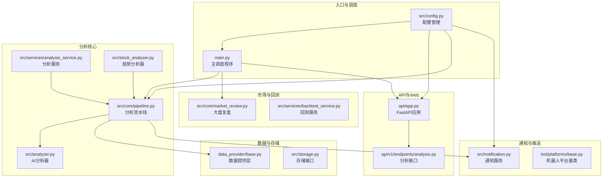
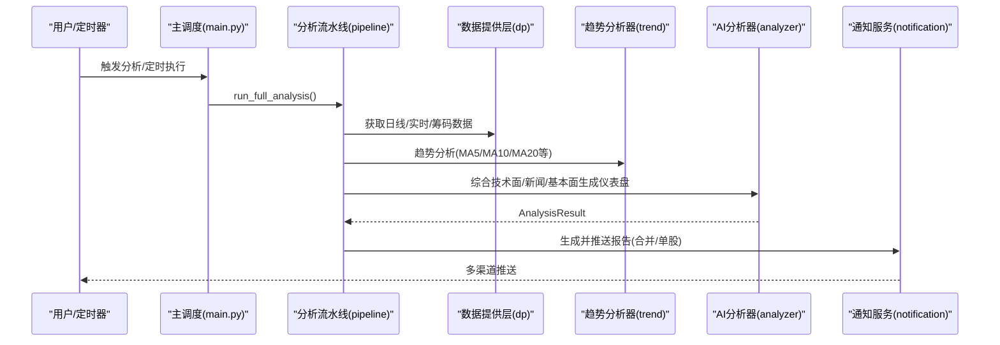
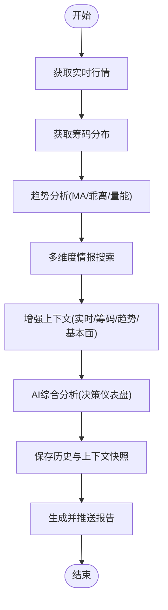
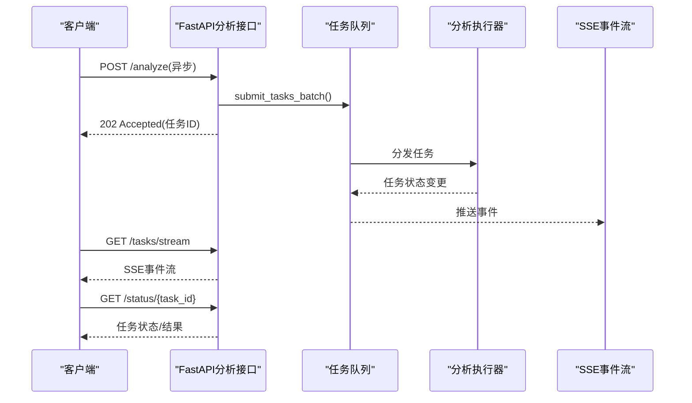
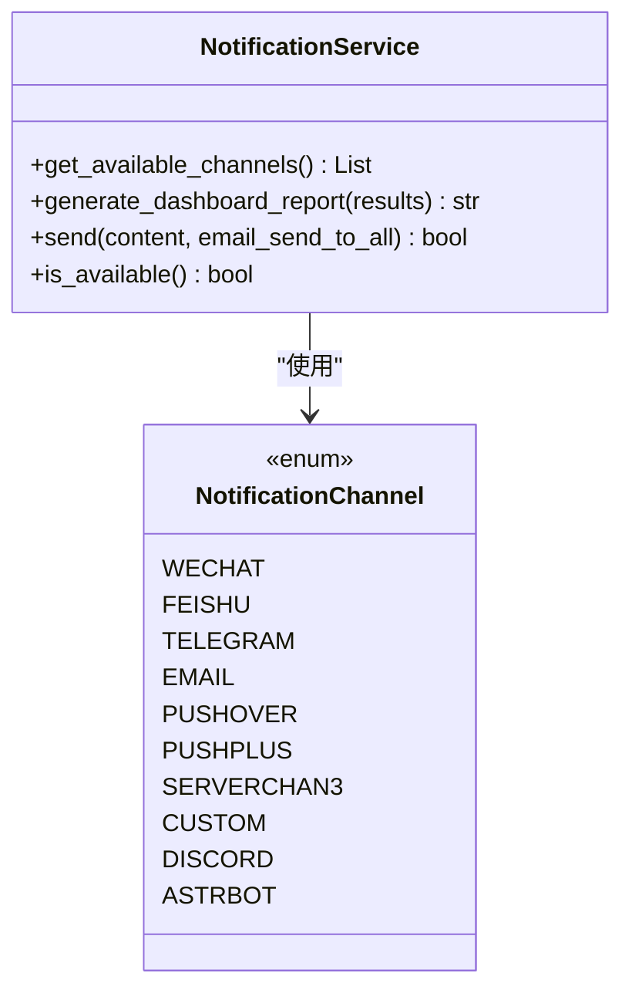
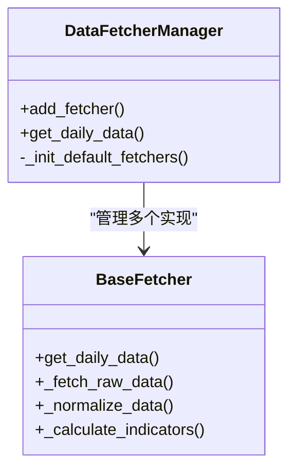
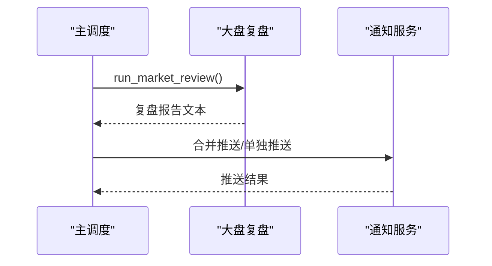
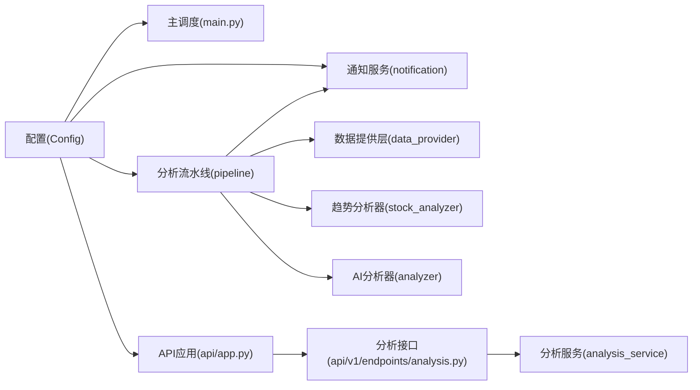

# 系统介绍

<cite>
**本文引用的文件**
- [README.md](file://README.md)
- [main.py](file://main.py)
- [src/config.py](file://src/config.py)
- [src/enums.py](file://src/enums.py)
- [api/app.py](file://api/app.py)
- [api/v1/endpoints/analysis.py](file://api/v1/endpoints/analysis.py)
- [src/core/pipeline.py](file://src/core/pipeline.py)
- [src/services/analysis_service.py](file://src/services/analysis_service.py)
- [src/notification.py](file://src/notification.py)
- [data_provider/base.py](file://data_provider/base.py)
- [src/stock_analyzer.py](file://src/stock_analyzer.py)
- [src/core/market_review.py](file://src/core/market_review.py)
- [bot/platforms/base.py](file://bot/platforms/base.py)
</cite>

## 目录
1. [引言](#引言)
2. [项目结构](#项目结构)
3. [核心组件](#核心组件)
4. [架构总览](#架构总览)
5. [详细组件分析](#详细组件分析)
6. [依赖关系分析](#依赖关系分析)
7. [性能考量](#性能考量)
8. [故障排查指南](#故障排查指南)
9. [结论](#结论)
10. [附录](#附录)

## 引言
本系统是一个面向A股、港股、美股市场的“自选股智能分析系统”，以AI大模型为核心驱动，提供“决策仪表盘”式的多维度分析与实时推送能力。系统旨在帮助个人投资者、机构研究团队与量化分析师高效完成：
- 个人投资者：日常自选股跟踪与择时建议
- 机构研究：宏观与个股层面的交叉验证与情报整合
- 量化分析师：基于历史分析结果的回测与策略验证

系统具备如下核心价值主张：
- AI驱动的“一句话核心结论 + 精确买卖点位 + 操作检查清单”的决策仪表盘
- 多维度分析：技术面、筹码分布、舆情情报、实时行情
- 全球市场覆盖：A股、港股、美股
- 大盘复盘：每日市场概览、板块涨跌、北向资金等
- AI回测验证：自动评估历史分析准确率、方向胜率、止盈止损命中率
- T+0 选股池：每周自动筛选适合T+0交易的股票池
- 多渠道通知：企业微信、飞书、Telegram、钉钉、邮件、Pushover等
- 自动化与零成本：支持GitHub Actions定时执行，无需服务器

## 项目结构
系统采用模块化分层设计，包含后端主程序、API网关、分析流水线、数据提供层、通知与推送、Web界面与机器人平台等模块。

**图表来源**
- [main.py:1-723](file://main.py#L1-L723)
- [src/config.py:1-580](file://src/config.py#L1-L580)
- [api/app.py:1-209](file://api/app.py#L1-L209)
- [api/v1/endpoints/analysis.py:1-694](file://api/v1/endpoints/analysis.py#L1-L694)
- [src/core/pipeline.py:1-800](file://src/core/pipeline.py#L1-L800)
- [src/services/analysis_service.py:1-171](file://src/services/analysis_service.py#L1-L171)
- [src/notification.py:1-800](file://src/notification.py#L1-L800)
- [data_provider/base.py:1-800](file://data_provider/base.py#L1-L800)
- [src/stock_analyzer.py:1-200](file://src/stock_analyzer.py#L1-L200)
- [src/core/market_review.py:1-120](file://src/core/market_review.py#L1-L120)

**章节来源**
- [README.md:1-284](file://README.md#L1-L284)
- [main.py:1-723](file://main.py#L1-L723)
- [src/config.py:1-580](file://src/config.py#L1-L580)

## 核心组件
- 配置管理（Config）：集中管理全局配置，支持从.env加载、热读取自选股列表、校验与数据库URL生成。
- 分析流水线（StockAnalysisPipeline）：统一调度数据获取、趋势分析、新闻情报、AI综合分析与历史记录保存。
- AI分析器（GeminiAnalyzer/AnalysisResult）：封装大模型调用，生成决策仪表盘与详细分析。
- 趋势分析器（StockTrendAnalyzer）：基于交易理念（严进、趋势、效率、买点偏好）进行技术面判断。
- 数据提供层（DataFetcherManager/BaseFetcher）：策略模式管理多数据源，自动故障切换与指标计算。
- 通知服务（NotificationService）：多渠道推送（企业微信、飞书、Telegram、邮件、Pushover等）。
- API网关（FastAPI）：提供分析触发、任务状态查询、SSE实时流等接口。
- 大盘复盘（MarketAnalyzer + run_market_review）：按区域生成市场概览与板块表现。
- 回测服务（BacktestService）：对历史分析结果进行方向胜率、止盈止损命中率等评估。

**章节来源**
- [src/config.py:31-580](file://src/config.py#L31-L580)
- [src/core/pipeline.py:48-800](file://src/core/pipeline.py#L48-L800)
- [src/analyzer.py:164-200](file://src/analyzer.py#L164-L200)
- [src/stock_analyzer.py:171-200](file://src/stock_analyzer.py#L171-L200)
- [data_provider/base.py:233-800](file://data_provider/base.py#L233-L800)
- [src/notification.py:113-800](file://src/notification.py#L113-L800)
- [api/app.py:48-209](file://api/app.py#L48-L209)
- [src/core/market_review.py:27-120](file://src/core/market_review.py#L27-L120)

## 架构总览
系统采用“主调度 + 分析流水线 + API网关 + 通知服务”的分层架构。主程序负责定时任务与一次性分析；API层提供异步任务队列与SSE实时流；分析流水线串联数据获取、趋势与新闻情报、AI综合分析与历史记录；通知服务负责多渠道推送；数据提供层通过策略模式实现多数据源自动切换与指标标准化。

**图表来源**
- [main.py:258-443](file://main.py#L258-L443)
- [src/core/pipeline.py:183-430](file://src/core/pipeline.py#L183-L430)
- [src/notification.py:345-800](file://src/notification.py#L345-L800)

**章节来源**
- [main.py:258-443](file://main.py#L258-L443)
- [src/core/pipeline.py:183-430](file://src/core/pipeline.py#L183-L430)

## 详细组件分析

### 分析流水线（StockAnalysisPipeline）
- 职责：统一调度数据获取、趋势分析、新闻情报、AI综合分析与历史记录保存；支持并发控制与异常处理。
- 关键流程：
  - 获取实时行情（量比、换手率）与筹码分布
  - 趋势分析（MA5>MA10>MA20多头排列、乖离率、量能形态）
  - 多维度情报搜索（最新消息+风险排查+业绩预期）
  - 增强上下文（实时行情、筹码、趋势、股票名称、基本面）
  - 调用AI生成决策仪表盘
  - 保存分析历史与上下文快照
- 并发与稳定性：最大并发线程数来自配置，异常单股不影响整体；支持Agent模式与传统分析路径。

**图表来源**
- [src/core/pipeline.py:183-430](file://src/core/pipeline.py#L183-L430)

**章节来源**
- [src/core/pipeline.py:48-800](file://src/core/pipeline.py#L48-L800)

### API与任务队列（FastAPI + 任务流）
- FastAPI应用：注册路由、CORS中间件、健康检查、静态资源托管。
- 分析接口：
  - POST /api/v1/analysis/analyze：支持同步与异步模式，批量提交任务，防重复提交。
  - GET /api/v1/analysis/tasks：按状态筛选任务列表。
  - GET /api/v1/analysis/tasks/stream：SSE实时推送任务状态变化。
  - GET /api/v1/analysis/status/{task_id}：查询单个任务状态，优先队列，否则回退数据库历史记录。
- 任务队列：异步执行分析，支持SSE事件流，便于前端实时展示进度。

**图表来源**
- [api/app.py:48-209](file://api/app.py#L48-L209)
- [api/v1/endpoints/analysis.py:72-571](file://api/v1/endpoints/analysis.py#L72-L571)

**章节来源**
- [api/app.py:48-209](file://api/app.py#L48-L209)
- [api/v1/endpoints/analysis.py:72-571](file://api/v1/endpoints/analysis.py#L72-L571)

### 通知与多渠道推送
- 渠道支持：企业微信、飞书、Telegram、邮件SMTP、Pushover、PushPlus、Server酱3、Discord、AstrBot、自定义Webhook等。
- 特性：支持Markdown格式、消息长度限制、合并推送（个股+大盘复盘）、上下文渠道（如钉钉会话、飞书会话）。
- 生成与发送：根据配置检测可用渠道，生成决策仪表盘或日报，按渠道并发发送。

**图表来源**
- [src/notification.py:113-800](file://src/notification.py#L113-L800)

**章节来源**
- [src/notification.py:113-800](file://src/notification.py#L113-L800)

### 数据提供层（策略模式）
- BaseFetcher：抽象基类，定义统一接口与数据标准化方法。
- DataFetcherManager：策略管理器，按优先级自动切换数据源，实现故障切换与指标计算。
- 默认数据源优先级：根据配置动态调整（如Tushare Token存在时优先级提升）。

**图表来源**
- [data_provider/base.py:233-800](file://data_provider/base.py#L233-L800)

**章节来源**
- [data_provider/base.py:233-800](file://data_provider/base.py#L233-L800)

### 大盘复盘与回测
- 大盘复盘：按区域（cn/us/both）生成市场概览、板块涨跌、北向资金等，支持合并推送。
- 回测：对历史分析结果进行方向胜率、止盈止损命中率等评估，支持自动回测与结果统计。

**图表来源**
- [src/core/market_review.py:27-120](file://src/core/market_review.py#L27-L120)
- [main.py:332-420](file://main.py#L332-L420)

**章节来源**
- [src/core/market_review.py:27-120](file://src/core/market_review.py#L27-L120)
- [main.py:332-420](file://main.py#L332-L420)

## 依赖关系分析
- 配置依赖：所有模块通过Config单例访问全局配置，支持热读取自选股列表与校验。
- 分析依赖：分析流水线依赖数据提供层、趋势分析器、AI分析器与通知服务。
- API依赖：分析接口依赖任务队列、分析服务与存储接口。
- 通知依赖：通知服务依赖配置中的渠道参数与消息格式化工具。

**图表来源**
- [src/config.py:232-580](file://src/config.py#L232-L580)
- [main.py:510-723](file://main.py#L510-L723)
- [api/app.py:48-209](file://api/app.py#L48-L209)
- [api/v1/endpoints/analysis.py:72-571](file://api/v1/endpoints/analysis.py#L72-L571)
- [src/core/pipeline.py:48-120](file://src/core/pipeline.py#L48-L120)
- [src/notification.py:113-200](file://src/notification.py#L113-L200)

**章节来源**
- [src/config.py:232-580](file://src/config.py#L232-L580)
- [main.py:510-723](file://main.py#L510-L723)
- [api/app.py:48-209](file://api/app.py#L48-L209)
- [api/v1/endpoints/analysis.py:72-571](file://api/v1/endpoints/analysis.py#L72-L571)
- [src/core/pipeline.py:48-120](file://src/core/pipeline.py#L48-L120)
- [src/notification.py:113-200](file://src/notification.py#L113-L200)

## 性能考量
- 并发与防封禁：最大并发线程数可控，数据源请求内置随机休眠与指数退避；实时行情与筹码分布可开关，避免频繁API调用。
- 缓存与断点续传：数据库按自然日断点续传，避免重复拉取；实时行情缓存与熔断器冷却时间降低限流风险。
- 指标计算：统一在数据层标准化与计算，减少重复计算与数据不一致。
- 推送节流：消息长度限制与分批发送，避免渠道限制导致失败。

[本节为通用指导，无需特定文件引用]

## 故障排查指南
- 配置校验：检查STOCK_LIST、API Key、搜索引擎Key、通知渠道等是否配置完整；系统会在启动时输出警告。
- 数据源问题：若某数据源失败，系统自动切换到下一个；可通过日志查看失败原因与重试次数。
- 通知失败：检查渠道配置与网络连通性；合并推送模式下需确认合并逻辑。
- API异常：查看SSE事件流与任务状态接口，定位异步任务执行问题。
- 回测失败：检查回测配置与历史数据完整性，系统会记录失败统计。

**章节来源**
- [src/config.py:507-546](file://src/config.py#L507-L546)
- [data_provider/base.py:38-62](file://data_provider/base.py#L38-L62)
- [src/notification.py:281-284](file://src/notification.py#L281-L284)
- [api/v1/endpoints/analysis.py:470-571](file://api/v1/endpoints/analysis.py#L470-L571)

## 结论
本系统通过“AI驱动 + 多维度分析 + 自动化推送”的组合，为不同层次用户提供清晰、可执行的投资决策支持。个人投资者可获得每日“决策仪表盘”，机构研究团队可借助回测与情报整合进行交叉验证，量化分析师可基于历史分析结果开展策略验证。系统以模块化架构与策略模式实现高扩展性与稳定性，配合多渠道推送与Web界面，满足多样化使用场景。

[本节为总结性内容，无需特定文件引用]

## 附录
- 快速开始与部署：支持GitHub Actions零成本自动化、Docker部署与本地运行。
- Web界面：包含配置管理、任务监控与手动分析功能，访问http://127.0.0.1:8000。
- 免责声明：本项目仅供学习与研究使用，不构成任何投资建议。

**章节来源**
- [README.md:59-236](file://README.md#L59-L236)