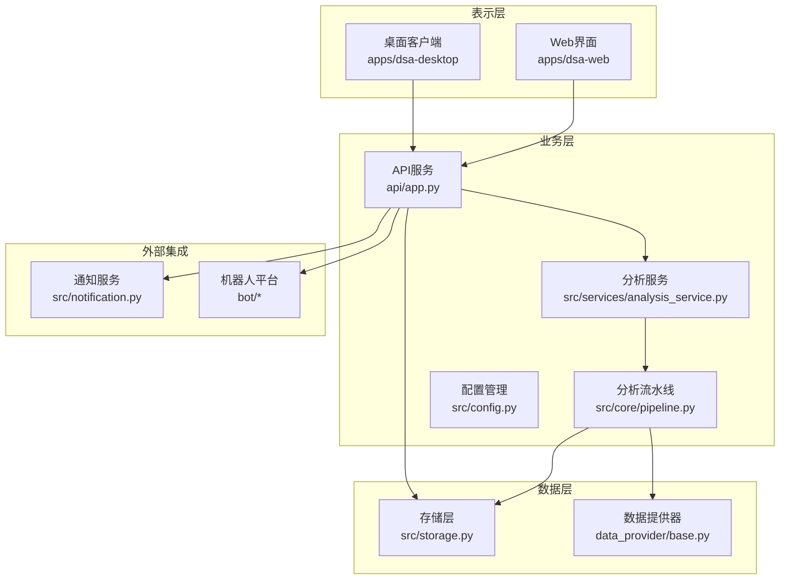
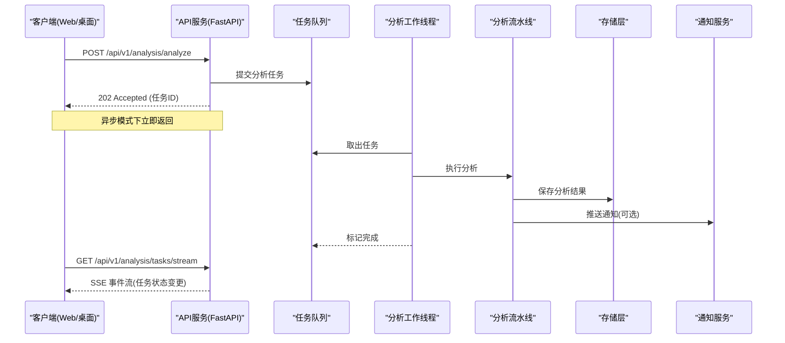
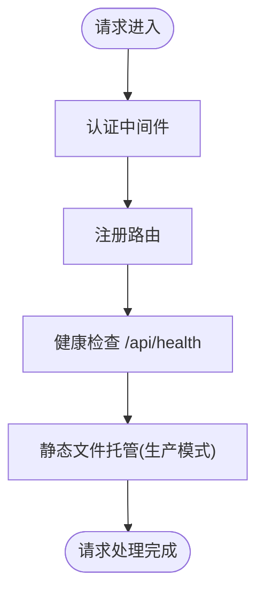
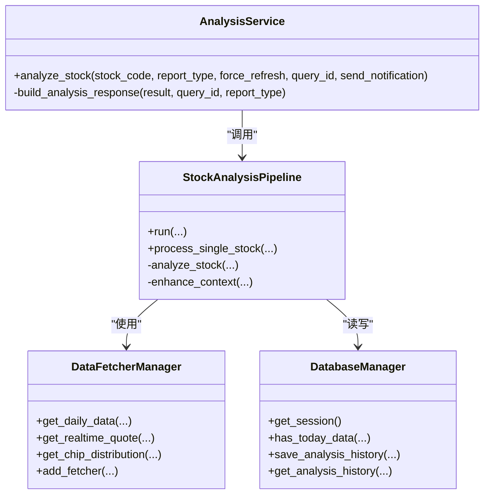
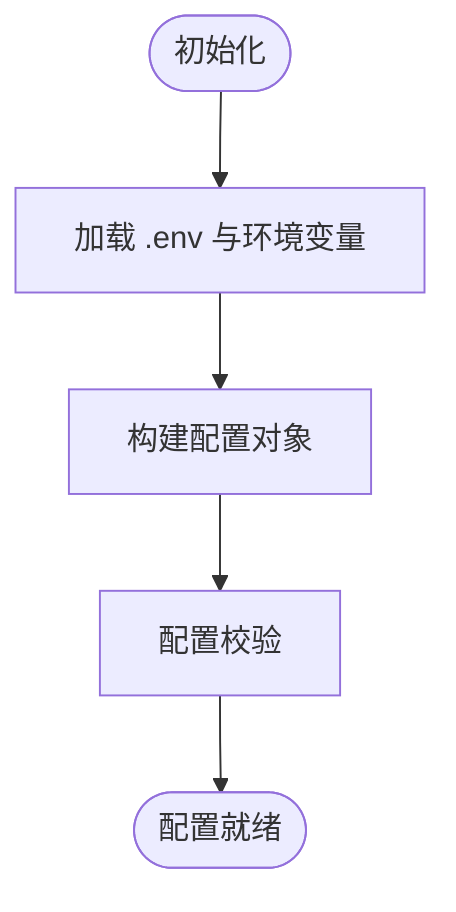
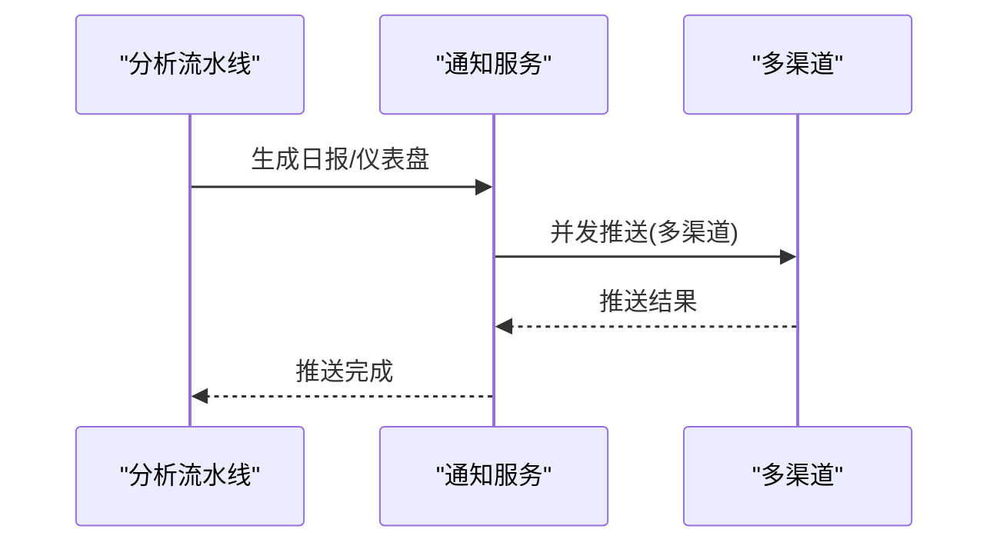
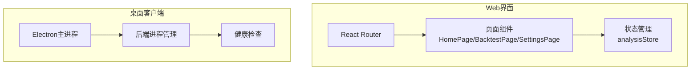
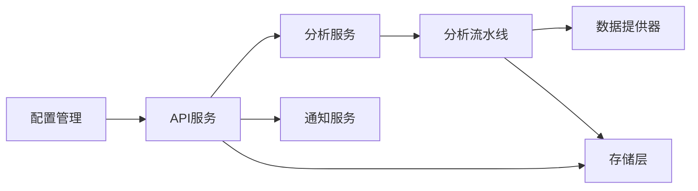

# 系统架构概览

<cite>
**本文档引用的文件**
- [main.py](file://main.py)
- [server.py](file://server.py)
- [api/app.py](file://api/app.py)
- [src/config.py](file://src/config.py)
- [apps/dsa-web/src/App.tsx](file://apps/dsa-web/src/App.tsx)
- [api/v1/router.py](file://api/v1/router.py)
- [src/services/analysis_service.py](file://src/services/analysis_service.py)
- [src/core/pipeline.py](file://src/core/pipeline.py)
- [data_provider/base.py](file://data_provider/base.py)
- [apps/dsa-desktop/main.js](file://apps/dsa-desktop/main.js)
- [api/v1/endpoints/analysis.py](file://api/v1/endpoints/analysis.py)
- [src/notification.py](file://src/notification.py)
- [src/storage.py](file://src/storage.py)
- [docker/docker-compose.yml](file://docker/docker-compose.yml)
</cite>

## 目录
1. [引言](#引言)
2. [项目结构](#项目结构)
3. [核心组件](#核心组件)
4. [架构概览](#架构概览)
5. [详细组件分析](#详细组件分析)
6. [依赖关系分析](#依赖关系分析)
7. [性能考量](#性能考量)
8. [故障排查指南](#故障排查指南)
9. [结论](#结论)

## 引言

本文件为A股自选股智能分析系统提供系统架构概览文档，面向开发者与运维人员，重点阐述高层架构视图、分层设计、微服务风格的应用架构、事件驱动设计模式（异步任务与SSE实时推送）、以及从数据获取到结果推送的完整数据流。文档旨在帮助读者快速理解系统设计理念与关键设计决策。

## 项目结构

系统采用模块化与分层架构组织，主要分为三层：表示层（Web界面、桌面应用）、业务层（分析引擎、服务层）、数据层（数据获取、存储）。同时，系统支持微服务风格的独立部署，API服务与Web界面、桌面客户端可以分别部署与运行。

**图表来源**
- [api/app.py:48-204](file://api/app.py#L48-L204)
- [src/services/analysis_service.py:29-171](file://src/services/analysis_service.py#L29-L171)
- [src/core/pipeline.py:48-127](file://src/core/pipeline.py#L48-L127)
- [data_provider/base.py:464-779](file://data_provider/base.py#L464-L779)
- [src/storage.py:623-746](file://src/storage.py#L623-L746)
- [src/notification.py:113-206](file://src/notification.py#L113-L206)

**章节来源**
- [main.py:510-723](file://main.py#L510-L723)
- [server.py:46-55](file://server.py#L46-L55)
- [api/app.py:48-204](file://api/app.py#L48-L204)

## 核心组件

- 配置管理（Config）：统一管理全局配置，支持从环境变量与.env文件加载，提供类型安全的配置访问与校验。
- API服务（FastAPI）：提供RESTful接口，注册路由、CORS配置、健康检查、静态文件托管，并通过中间件实现认证与异常处理。
- 分析服务（AnalysisService）：封装股票分析逻辑，协调分析流水线与结果保存。
- 分析流水线（StockAnalysisPipeline）：协调数据获取、趋势分析、新闻情报、AI分析、结果保存与通知。
- 数据提供器（DataFetcherManager）：策略模式管理多个数据源，实现自动故障切换与断点续传。
- 存储层（DatabaseManager + ORM模型）：SQLite数据库，ORM模型定义，提供数据存取与智能更新。
- 通知服务（NotificationService）：多渠道推送（企业微信、飞书、Telegram、邮件、Pushover等）。
- 表示层（Web界面与桌面客户端）：Web界面基于React，桌面客户端基于Electron；两者通过API服务交互。

**章节来源**
- [src/config.py:31-580](file://src/config.py#L31-L580)
- [api/app.py:48-204](file://api/app.py#L48-L204)
- [src/services/analysis_service.py:29-171](file://src/services/analysis_service.py#L29-L171)
- [src/core/pipeline.py:48-127](file://src/core/pipeline.py#L48-L127)
- [data_provider/base.py:464-779](file://data_provider/base.py#L464-L779)
- [src/storage.py:623-746](file://src/storage.py#L623-L746)
- [src/notification.py:113-206](file://src/notification.py#L113-L206)

## 架构概览

系统采用分层架构与微服务风格的独立部署：

- 分层架构
  - 表示层：Web界面与桌面客户端，负责用户交互与结果展示。
  - 业务层：API服务、分析服务、分析流水线，负责业务编排与处理。
  - 数据层：数据提供器与存储层，负责数据获取与持久化。
- 微服务风格
  - API服务可独立部署，Web界面与桌面客户端通过HTTP接口与其交互。
  - 支持定时任务模式与API服务模式的灵活切换。
- 事件驱动设计
  - 异步任务队列：分析任务异步执行，避免阻塞请求。
  - SSE实时推送：通过Server-Sent Events向客户端推送任务状态变化。

**图表来源**
- [api/v1/endpoints/analysis.py:384-439](file://api/v1/endpoints/analysis.py#L384-L439)
- [api/v1/endpoints/analysis.py:161-232](file://api/v1/endpoints/analysis.py#L161-L232)
- [src/core/pipeline.py:48-127](file://src/core/pipeline.py#L48-L127)
- [src/storage.py:623-746](file://src/storage.py#L623-L746)
- [src/notification.py:113-206](file://src/notification.py#L113-L206)

## 详细组件分析

### API服务与路由

- 应用工厂：创建FastAPI实例，配置CORS、认证中间件、路由注册与健康检查。
- 路由聚合：统一注册v1版本的分析、历史、股票、回测、系统配置等路由。
- SSE实时流：提供任务状态SSE事件流，支持心跳与连接确认。

**图表来源**
- [api/app.py:48-204](file://api/app.py#L48-L204)
- [api/v1/router.py:16-72](file://api/v1/router.py#L16-L72)

**章节来源**
- [api/app.py:48-204](file://api/app.py#L48-L204)
- [api/v1/router.py:16-72](file://api/v1/router.py#L16-L72)

### 分析服务与流水线

- 分析服务：封装单只股票分析，协调分析流水线与结果构建。
- 分析流水线：协调数据获取（行情、筹码、趋势）、新闻情报、AI分析、结果保存与通知。
- 数据提供器：策略模式管理多个数据源，自动故障切换与断点续传。
- 存储层：ORM模型定义与数据库管理，提供智能更新与查询接口。

**图表来源**
- [src/services/analysis_service.py:29-171](file://src/services/analysis_service.py#L29-L171)
- [src/core/pipeline.py:48-127](file://src/core/pipeline.py#L48-L127)
- [data_provider/base.py:464-779](file://data_provider/base.py#L464-L779)
- [src/storage.py:623-746](file://src/storage.py#L623-L746)

**章节来源**
- [src/services/analysis_service.py:29-171](file://src/services/analysis_service.py#L29-L171)
- [src/core/pipeline.py:128-430](file://src/core/pipeline.py#L128-L430)
- [data_provider/base.py:464-779](file://data_provider/base.py#L464-L779)
- [src/storage.py:623-746](file://src/storage.py#L623-L746)

### 配置管理

- 单例模式：全局配置实例，支持从环境变量与.env文件加载。
- 动态代理与数据源优先级：自动设置代理与NO_PROXY，根据配置注入Tushare优先级。
- 热读取股票列表：定时任务模式下可热读取.STOCK_LIST。

**图表来源**
- [src/config.py:20-580](file://src/config.py#L20-L580)

**章节来源**
- [src/config.py:20-580](file://src/config.py#L20-L580)

### 通知与推送

- 多渠道推送：企业微信、飞书、Telegram、邮件、Pushover、Discord、AstrBot等。
- 合并推送：支持个股与大盘复盘合并推送。
- SSE事件：任务状态变更通过SSE实时推送。

**图表来源**
- [src/notification.py:113-206](file://src/notification.py#L113-L206)
- [api/v1/endpoints/analysis.py:384-439](file://api/v1/endpoints/analysis.py#L384-L439)

**章节来源**
- [src/notification.py:113-206](file://src/notification.py#L113-L206)
- [api/v1/endpoints/analysis.py:384-439](file://api/v1/endpoints/analysis.py#L384-L439)

### 表示层（Web界面与桌面客户端）

- Web界面：基于React路由与状态管理，支持登录、聊天、组合投资、回测、设置等功能。
- 桌面客户端：基于Electron，内置后端进程管理与健康检查，自动选择可用端口并启动API服务。

**图表来源**
- [apps/dsa-web/src/App.tsx:16-87](file://apps/dsa-web/src/App.tsx#L16-L87)
- [apps/dsa-desktop/main.js:392-574](file://apps/dsa-desktop/main.js#L392-L574)

**章节来源**
- [apps/dsa-web/src/App.tsx:16-87](file://apps/dsa-web/src/App.tsx#L16-L87)
- [apps/dsa-desktop/main.js:392-574](file://apps/dsa-desktop/main.js#L392-L574)

## 依赖关系分析

系统采用清晰的依赖层次与解耦设计：

- API服务依赖分析服务与存储层，通过任务队列实现异步执行。
- 分析服务依赖分析流水线，流水线依赖数据提供器与存储层。
- 配置管理贯穿全局，影响数据源优先级、通知渠道与运行模式。
- 表示层通过API服务间接依赖存储层与通知服务。

**图表来源**
- [src/config.py:31-580](file://src/config.py#L31-L580)
- [api/app.py:48-204](file://api/app.py#L48-L204)
- [src/services/analysis_service.py:29-171](file://src/services/analysis_service.py#L29-L171)
- [src/core/pipeline.py:48-127](file://src/core/pipeline.py#L48-L127)
- [data_provider/base.py:464-779](file://data_provider/base.py#L464-L779)
- [src/storage.py:623-746](file://src/storage.py#L623-L746)
- [src/notification.py:113-206](file://src/notification.py#L113-L206)

**章节来源**
- [src/config.py:31-580](file://src/config.py#L31-L580)
- [api/app.py:48-204](file://api/app.py#L48-L204)
- [src/services/analysis_service.py:29-171](file://src/services/analysis_service.py#L29-L171)
- [src/core/pipeline.py:48-127](file://src/core/pipeline.py#L48-L127)
- [data_provider/base.py:464-779](file://data_provider/base.py#L464-L779)
- [src/storage.py:623-746](file://src/storage.py#L623-L746)
- [src/notification.py:113-206](file://src/notification.py#L113-L206)

## 性能考量

- 并发与防封禁：低并发线程池与随机休眠策略，避免API限流与封禁。
- 断点续传：基于日期的本地缓存判断，减少重复网络请求。
- 数据源优先级：根据配置与令牌自动调整优先级，提高成功率。
- SSE与异步任务：异步执行与事件流推送，降低前端等待时间。
- 资源限制：Docker部署中设置内存上限与保留，保障稳定性。

[本节为通用指导，不涉及具体文件分析]

## 故障排查指南

- 健康检查：通过 /api/health 确认API服务可用。
- 日志定位：配置日志目录与级别，结合异常堆栈定位问题。
- 数据源问题：检查代理设置与NO_PROXY配置，确认数据源优先级与令牌。
- 通知失败：核对通知渠道配置，检查消息长度限制与认证信息。
- Docker部署：确认卷挂载、端口映射与环境变量，查看容器日志。

**章节来源**
- [api/app.py:161-173](file://api/app.py#L161-L173)
- [src/config.py:20-580](file://src/config.py#L20-L580)
- [src/notification.py:113-206](file://src/notification.py#L113-L206)
- [docker/docker-compose.yml:55-69](file://docker/docker-compose.yml#L55-L69)

## 结论

本系统通过分层架构与微服务风格实现了高内聚、低耦合的设计，配合事件驱动的异步任务与SSE实时推送，提供了良好的用户体验与可维护性。配置管理与数据提供器策略模式增强了系统的灵活性与鲁棒性。建议在生产环境中结合Docker部署与健康检查，确保服务稳定运行。