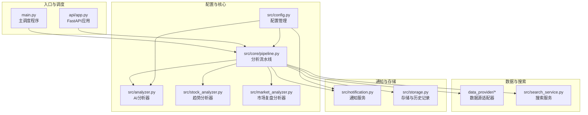
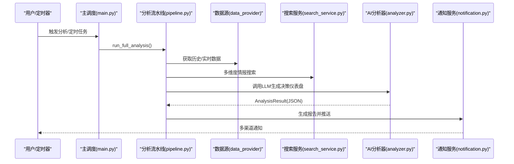
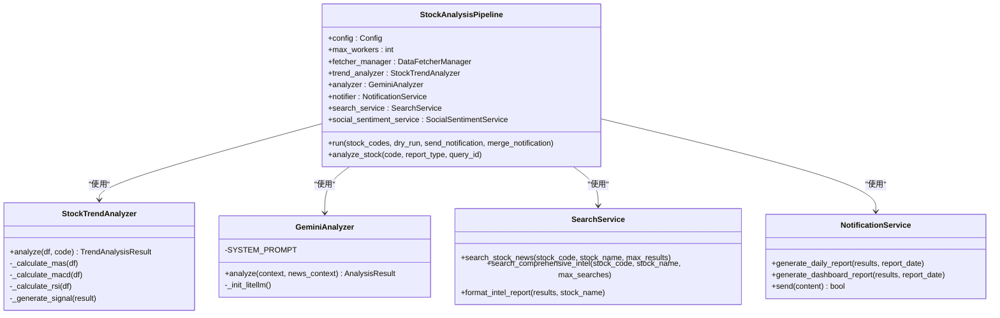
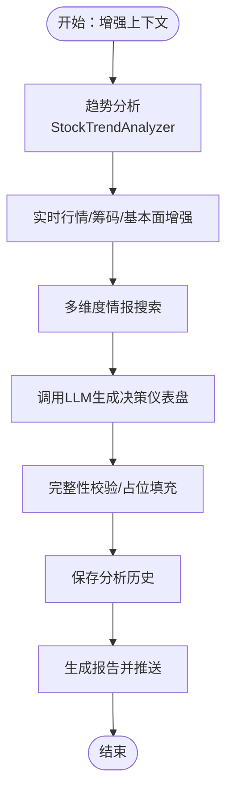
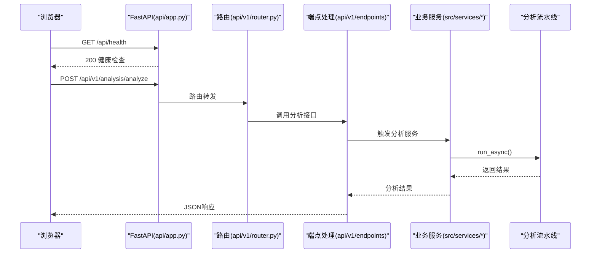
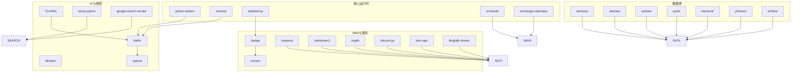

# 项目概述

<cite>
**本文档引用的文件**
- [README.md](file://README.md)
- [main.py](file://main.py)
- [src/config.py](file://src/config.py)
- [src/analyzer.py](file://src/analyzer.py)
- [src/market_analyzer.py](file://src/market_analyzer.py)
- [src/stock_analyzer.py](file://src/stock_analyzer.py)
- [src/core/pipeline.py](file://src/core/pipeline.py)
- [src/notification.py](file://src/notification.py)
- [src/search_service.py](file://src/search_service.py)
- [requirements.txt](file://requirements.txt)
- [api/app.py](file://api/app.py)
</cite>

## 目录
1. [项目简介](#项目简介)
2. [项目结构](#项目结构)
3. [核心组件](#核心组件)
4. [架构总览](#架构总览)
5. [详细组件分析](#详细组件分析)
6. [依赖关系分析](#依赖关系分析)
7. [性能考量](#性能考量)
8. [故障排查指南](#故障排查指南)
9. [结论](#结论)
10. [附录](#附录)

## 项目简介

A股自选股智能分析系统是一个基于AI大模型的自动化股票分析与推送平台，支持A股、港股、美股及美股指数的多市场覆盖。系统通过统一的AI分析引擎、多维度技术分析、新闻情报整合与多渠道通知推送，为用户提供每日「决策仪表盘」，帮助用户做出更明智的投资决策。

### 核心目标
- 自动化：每日定时执行分析，无需人工干预
- 智能化：AI驱动的决策仪表盘，提供一句话核心结论、精确买卖点位与操作检查清单
- 多维度：技术面、筹码分布、舆情情报、实时行情一体化分析
- 可视化：Web界面与多渠道推送，支持Markdown与图片渲染
- 可扩展：支持多种AI模型（Gemini、OpenAI、Claude、DeepSeek等）与数据源（AkShare、Tushare、YFinance等）

### 主要功能特性
- AI决策仪表盘：一句话核心结论 + 精确买卖点位 + 操作检查清单
- 多维度分析：技术面（均线、MACD、RSI等）+ 筹码分布 + 舆情情报 + 实时行情
- 市场复盘：每日市场概览、板块涨跌、北向资金（增强）
- 回测验证：自动评估历史分析准确率，方向胜率、止盈止损命中率
- T+0选股池：每周自动筛选适合T+0交易的股票池
- 多渠道通知：企业微信、飞书、Telegram、Discord、钉钉、邮件、Pushover等
- Web管理：配置管理、任务监控、手动分析、Agent策略对话

### 技术选型与架构优势
- AI统一接入：通过LiteLLM统一管理多模型（Gemini、OpenAI、Claude等），支持多Key负载均衡与降级
- 数据多源融合：AkShare、Tushare、Pytdx、Baostock、YFinance等多数据源自动故障切换
- 搜索引擎聚合：Tavily、SerpAPI、Bocha、Brave、MiniMax等多引擎负载均衡与故障转移
- Web后端：FastAPI + Uvicorn，提供REST API与Web界面
- 通知通道：多渠道并发推送，支持Markdown转图片、长度限制与SSL校验
- 定时任务：GitHub Actions或本地定时器，支持交易日检查与强制执行

### 应用场景与目标用户
- 场景：个人投资者、量化爱好者、机构研究助理、AI交易员
- 用户：希望获得每日智能分析与推送的A股/港股/美股用户；需要回测验证与策略对话的进阶用户

## 项目结构

系统采用模块化分层设计，前后端分离，核心分析流程通过流水线串联各模块：

**图表来源**
- [main.py:510-723](file://main.py#L510-L723)
- [api/app.py:48-209](file://api/app.py#L48-L209)
- [src/core/pipeline.py:48-128](file://src/core/pipeline.py#L48-L128)
- [src/config.py:418-750](file://src/config.py#L418-L750)

**章节来源**
- [main.py:1-723](file://main.py#L1-L723)
- [api/app.py:1-209](file://api/app.py#L1-L209)

## 核心组件

### 1. 主调度程序（main.py）
- 职责：解析命令行参数、加载配置、协调分析流程、定时任务调度、Web服务启动
- 关键能力：交易日过滤、合并推送、飞书云文档生成、自动回测
- 模式：单次运行、定时任务、仅市场复盘、Web服务模式

**章节来源**
- [main.py:57-214](file://main.py#L57-L214)
- [main.py:258-443](file://main.py#L258-L443)
- [main.py:510-723](file://main.py#L510-L723)

### 2. 配置管理（src/config.py）
- 职责：单例模式管理全局配置，从.env加载敏感配置，类型安全访问
- 关键域：AI模型（LiteLLM）、搜索引擎、通知渠道、数据源、回测、日志、WebUI、机器人等
- 特性：多渠道模型配置、温度参数、新闻窗口、交易日检查、实时行情增强

**章节来源**
- [src/config.py:418-750](file://src/config.py#L418-L750)
- [src/config.py:794-800](file://src/config.py#L794-L800)

### 3. 分析流水线（src/core/pipeline.py）
- 职责：协调数据获取、趋势分析、新闻情报、AI分析、历史记录与通知
- 关键流程：实时行情/筹码/趋势增强、多维度情报搜索、AI决策仪表盘、Agent模式
- 并发控制：ThreadPoolExecutor，异常隔离与断点续传

**章节来源**
- [src/core/pipeline.py:48-128](file://src/core/pipeline.py#L48-L128)
- [src/core/pipeline.py:183-430](file://src/core/pipeline.py#L183-L430)
- [src/core/pipeline.py:595-724](file://src/core/pipeline.py#L595-L724)

### 4. AI分析器（src/analyzer.py）
- 职责：封装LLM调用（LiteLLM）、解析结构化分析结果、完整性校验与占位填充
- 输出：AnalysisResult（决策仪表盘JSON结构化数据）
- 语言：支持中文/英文输出，多模型统一接口

**章节来源**
- [src/analyzer.py:502-742](file://src/analyzer.py#L502-L742)
- [src/analyzer.py:1-800](file://src/analyzer.py#L1-L800)

### 5. 趋势分析器（src/stock_analyzer.py）
- 职责：基于用户交易理念实现趋势判断、乖离率、量能、支撑压力、MACD、RSI
- 核心：MA5>MA10>MA20多头排列、不追高、缩量回调偏好、买点偏好回踩支撑

**章节来源**
- [src/stock_analyzer.py:171-800](file://src/stock_analyzer.py#L171-L800)

### 6. 市场复盘分析器（src/market_analyzer.py）
- 职责：获取主要指数、涨跌统计、板块涨跌榜、市场新闻、生成复盘报告
- 支持：A股/美股双市场区域，策略蓝图为Regime策略

**章节来源**
- [src/market_analyzer.py:80-139](file://src/market_analyzer.py#L80-L139)
- [src/market_analyzer.py:278-319](file://src/market_analyzer.py#L278-L319)

### 7. 搜索服务（src/search_service.py）
- 职责：统一新闻搜索接口，支持Bocha、Tavily、Brave、SerpAPI、MiniMax等
- 特性：多Key负载均衡、瞬时网络错误重试、结果缓存与格式化

**章节来源**
- [src/search_service.py:144-255](file://src/search_service.py#L144-L255)
- [src/search_service.py:257-344](file://src/search_service.py#L257-L344)

### 8. 通知服务（src/notification.py）
- 职责：生成Markdown日报/仪表盘、多渠道并发推送（企业微信、飞书、Telegram、Discord、邮件、Pushover等）
- 特性：Markdown转图片、长度限制、SSL校验、上下文渠道（钉钉/飞书会话）

**章节来源**
- [src/notification.py:113-206](file://src/notification.py#L113-L206)
- [src/notification.py:345-538](file://src/notification.py#L345-L538)
- [src/notification.py:607-800](file://src/notification.py#L607-L800)

### 9. Web后端（api/app.py）
- 职责：FastAPI应用工厂，CORS配置、路由注册、健康检查、静态文件托管
- 集成：认证中间件、错误处理、系统配置服务

**章节来源**
- [api/app.py:48-209](file://api/app.py#L48-L209)

## 架构总览

系统采用「统一调度 + 多源数据 + AI分析 + 多渠道通知」的架构，支持定时执行与Web服务两种运行模式：

**图表来源**
- [main.py:258-381](file://main.py#L258-L381)
- [src/core/pipeline.py:183-430](file://src/core/pipeline.py#L183-L430)
- [src/analyzer.py:502-742](file://src/analyzer.py#L502-L742)
- [src/notification.py:345-538](file://src/notification.py#L345-L538)

## 详细组件分析

### 分析流水线组件关系图

**图表来源**
- [src/core/pipeline.py:48-128](file://src/core/pipeline.py#L48-L128)
- [src/stock_analyzer.py:171-800](file://src/stock_analyzer.py#L171-L800)
- [src/analyzer.py:502-742](file://src/analyzer.py#L502-L742)
- [src/search_service.py:144-255](file://src/search_service.py#L144-L255)
- [src/notification.py:113-206](file://src/notification.py#L113-L206)

**章节来源**
- [src/core/pipeline.py:48-128](file://src/core/pipeline.py#L48-L128)
- [src/stock_analyzer.py:171-800](file://src/stock_analyzer.py#L171-L800)
- [src/analyzer.py:502-742](file://src/analyzer.py#L502-L742)
- [src/search_service.py:144-255](file://src/search_service.py#L144-L255)
- [src/notification.py:113-206](file://src/notification.py#L113-L206)

### AI分析流程（决策仪表盘）

**图表来源**
- [src/core/pipeline.py:280-430](file://src/core/pipeline.py#L280-L430)
- [src/analyzer.py:502-742](file://src/analyzer.py#L502-L742)

**章节来源**
- [src/core/pipeline.py:280-430](file://src/core/pipeline.py#L280-L430)
- [src/analyzer.py:502-742](file://src/analyzer.py#L502-L742)

### Web API与前端集成

**图表来源**
- [api/app.py:161-174](file://api/app.py#L161-L174)
- [api/app.py:186-203](file://api/app.py#L186-L203)

**章节来源**
- [api/app.py:48-209](file://api/app.py#L48-L209)

## 依赖关系分析

系统依赖分为核心运行时依赖、数据源依赖、AI与搜索依赖、Web与通知依赖等：

**图表来源**
- [requirements.txt:1-65](file://requirements.txt#L1-L65)

**章节来源**
- [requirements.txt:1-65](file://requirements.txt#L1-L65)

## 性能考量

- 并发与限流：线程池并发（默认3线程），实时行情/搜索API限流与重试，避免封禁
- 断点续传：按自然日断点续传，避免重复拉取
- 缓存与降级：搜索服务瞬时错误重试，基本面聚合fail-open降级
- 报告渲染：支持Jinja2模板渲染与完整性校验，避免缺失字段导致失败
- Markdown转图片：针对不支持Markdown的渠道自动转图片，控制最大长度避免超大图片

## 故障排查指南

- AI模型配置：检查LITELLM_MODEL、多Key负载均衡、代理设置（USE_PROXY）
- 数据源问题：AkShare/Tushare等接口限流与封禁，检查速率限制与错误重试
- 搜索引擎：多Key轮询与错误计数，配额用尽时自动降级
- 通知渠道：SSL校验、长度限制、Webhook认证（Bearer Token）
- Web服务：CORS配置、静态文件托管、健康检查接口

**章节来源**
- [src/config.py:418-750](file://src/config.py#L418-L750)
- [src/search_service.py:52-75](file://src/search_service.py#L52-L75)
- [src/notification.py:113-206](file://src/notification.py#L113-L206)
- [api/app.py:78-106](file://api/app.py#L78-L106)

## 结论

A股自选股智能分析系统通过统一的调度与流水线，实现了从数据获取、多维度分析、AI决策到多渠道推送的完整闭环。系统具备良好的扩展性与鲁棒性，支持多模型、多数据源与多搜索引擎的统一接入，适合个人与机构用户在不同场景下使用。通过Web界面与API，用户可以灵活配置与监控分析流程，获得每日「决策仪表盘」与市场复盘报告。

## 附录

- 快速开始：GitHub Actions一键部署、本地运行与Docker部署
- 配置说明：AI模型、搜索、通知、回测、日志等详细配置项
- API规范：REST API文档与端点说明
- 常见问题：部署、代理、限流、SSL校验等FAQ

**章节来源**
- [README.md:88-472](file://README.md#L88-L472)